# Edge Authentication and Token-Agnostic Identity Propagation

_by AIM Team Members _[_Karen Casella_](http://www.linkedin.com/in/kcasella), [_Travis Nelson_](https://www.linkedin.com/in/travisnelson/)_, _[_Sunny Singh_](https://www.linkedin.com/in/singhsunny/)_; with prior art and contributions by _[_Justin Ryan_](https://www.linkedin.com/in/justin-charles-ryan/)_, _[_Satyajit Thadeshwar_](https://www.linkedin.com/in/satyajit-thadeshwar/)

As most developers can attest, dealing with security protocols and identity tokens, as well as user and device authentication, can be challenging. Imagine having multiple protocols, multiple tokens, 200M+ users, and thousands of device types, and the problem can explode in scope. A few years ago, we decided to address this complexity by spinning up a new initiative, and eventually a new team, to move the complex handling of user and device authentication, and various security protocols and tokens, to the edge of the network, managed by a set of centralized services, and a single team. In the process, we changed end-to-end identity propagation within the network of services to use a cryptographically-verifiable token-agnostic identity object.

Read on to learn more about this journey and how we have been able to:

- Reduce complexity for service owners, who no longer need to have knowledge of and responsibility for terminating security protocols and dealing with myriad security tokens,
- Improve security by delegating token management to services and teams with expertise in this area, and
- Improve audit-ability and forensic analysis.

## How We Got Here

Netflix started as a website that allowed members to manage their DVD queue. This website was later enhanced with the capability to stream content. Streaming devices came a bit later, but these initial devices were limited in capability. Over time, devices increased in capability and functions that were once only accessible on the website became accessible through streaming devices. Scale of the Netflix service was growing rapidly, with over 2000 device types supported.

Services supporting these functions now had an increased burden of being able to understand multiple tokens and security protocols in order to identify the user and device and authorize access to those functions. The whole system was quite complex, and starting to become brittle. Plus, the architecture of the Edge tier was evolving to a PaaS (platform as a service) model, and we had some tough decisions to make about how, and where, to handle identity token handling.

### Complexity: Multiple Services Handling Auth Tokens

To demonstrate the complexity of the system, following is a description of how the user login flow worked prior to the changes described in this article:

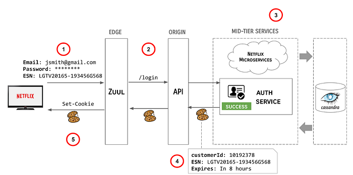

At the highest level, the steps involved in this (greatly simplified) flow are as follows:

1. User enters their credentials and the Netflix client transmits the credentials, along with the ESN of the device to the Edge gateway, AKA [Zuul](https://github.com/Netflix/zuul).
2. Zuul redirects the user call to the API /login endpoint.
3. The API server orchestrates backend systems to authenticate the user.
4. Upon successful authentication of the claims provided, the API server sends a cookie response back upstream, including the customerId (a Long), the ESN (a String) and an expiration directive.
5. Zuul sends the Cookies back to the Netflix client.

This model had some problems, e.g.:

- Externally valid tokens were being minted deep down in the stack and they needed to be propagated all the way upstream, opening possibilities for them to be logged inappropriately or potentially mismanaged.
- Upstream systems had to reopen the tokens to identify the user logging in and potentially manage multiple parallel identity data structures, which could easily get out of sync.

### Multiple Protocols & Tokens

The example above shows one flow, dealing with one protocol (HTTP/S) and one type of token (Cookies). There are several protocols and tokens in use across the Netflix streaming product, as summarized below:

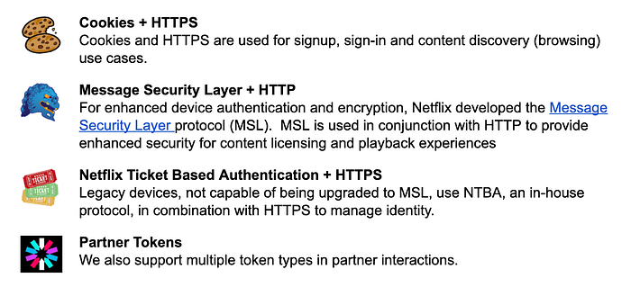

These tokens were consumed by, and potentially mutated by, several systems within the Netflix streaming ecosystem, for example:

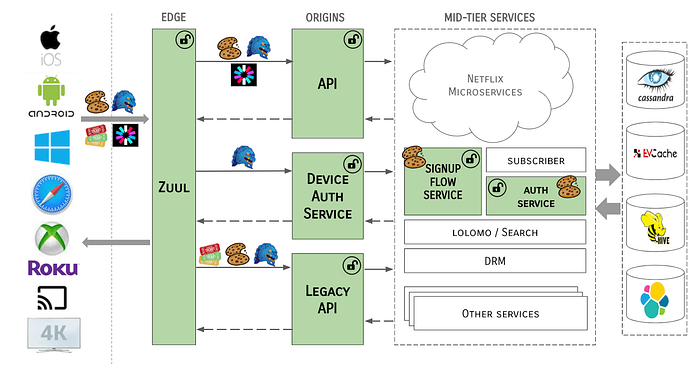

To complicate things further, there were multiple methods for transmitting these tokens, or the data contained therein, from system to system. In some cases, tokens were cracked open and identity data elements extracted as simple primitives or strings to be used in API calls, or passed from system to system via request context headers, or even as URL parameters. There were no checks in place to ensure the integrity of the tokens or the data contained therein.

### At Netflix Scale

Meanwhile, the scale at which Netflix operated grew exponentially. Nowadays, Netflix has 200M+ subscribers, with millions of monthly active devices. We are serving over 2.5 million requests per second, a large percentage of which require some form of authentication. In the old architecture, each of these requests resulted in an API call to authenticate the claims presented with the request, as shown:

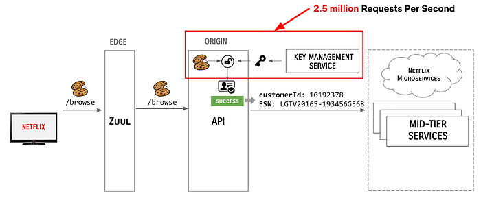

### EdgePaas Enters the Picture

To further complicate the situation, the Edge Engineering team was in the middle of migrating from an old API server architecture to a new PaaS-based approach. As we migrated to EdgePaaS, front-end services were moved from the Java-based API to a BFF (backend for frontend), aka NodeQuark, as shown:

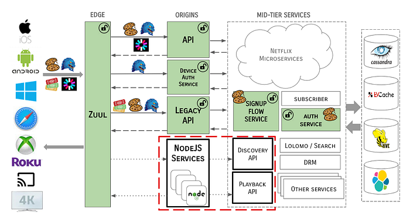

This model enables front-end engineers to own and operate their services outside of the core API framework. However, this introduced another layer of complexity — how would these NodeQuark services deal with identity tokens? NodeQuark services are written in JavaScript and terminating a protocol as complex as [MSL](https://www.infoq.com/news/2014/11/netflix-msl/) would have been difficult and wasteful, as would replicating all of the logic for token management.

### So, Where Were We Again?

To summarize, we found ourselves with a complex and inefficient solution for handling authentication and identity tokens at massive scale. We had multiple types and sources of identity tokens, each requiring special handling, the logic for which was replicated in various systems. Critical identity data was being propagated throughout the server ecosystem in an inconsistent fashion.

## Edge Authentication to the Rescue

We realized that in order to solve this problem, a unified identity model was needed. We would need to process authentication tokens (and protocols) further upstream. We did this by moving authentication and protocol termination to the edge of the network, and created a new integrity-protected token-agnostic identity object to propagate throughout the server ecosystem.

### Moving Authentication to the Edge

Keeping in mind our objectives to improve security and reduce complexity, and ultimately provide a better user experience, we strategized on how to centralize device authentication operations and user identification and authentication token management to the services edge.

At a high-level, [Zuul](https://github.com/Netflix/zuul) (cloud gateway) was to become the termination point for token inspection and payload encryption/decryption. In the case that Zuul would be unable to handle these operations (a small percentage), e.g., if tokens were not present, needed to be renewed, or were otherwise invalid, Zuul would delegate those operations to a new set of Edge Authentication Services to handle cryptographic key exchange and token creation or renewal.

### Edge Authentication Services

Edge Authentication Services (EAS) is both an architectural concept of moving authentication and identification of devices and users higher up on the stack to the cloud edge, as well as a suite of services that have been developed to handle each token type.

EAS is functionally a series of filters that run in Zuul, which may call out to external services to support their domain, e.g., to a service to handle MSL tokens or another for Cookies. EAS also covers the read-only processing of tokens to create Passports (more on that later).

The basic pattern for how EAS handles requests is as follows:

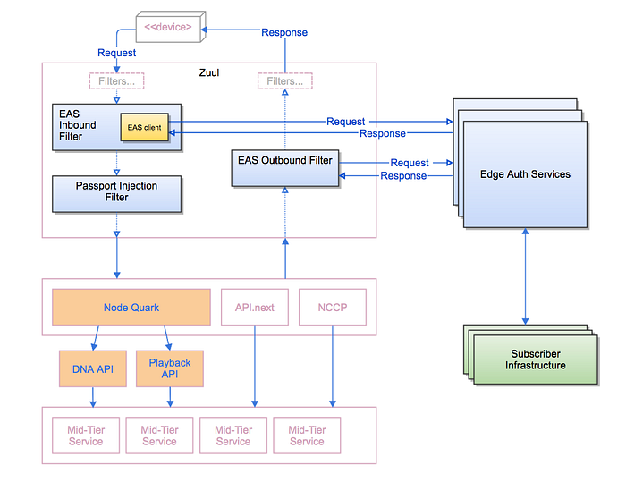

For each request coming into the Netflix service, the EAS Inbound Filter in Zuul inspects the tokens provided by the device client and either passes through the request to the Passport Injection Filter, or delegates to one of the Edge Authentication Services to process. The Passport Injection Filter generates a token-agnostic identity to propagate down through the rest of the server ecosystem. On the response path, the EAS Outbound Filter determines, with help from the Edge Authentication Services as needed, generates the tokens needed to send back to the client device.

The system architecture now takes the form of:

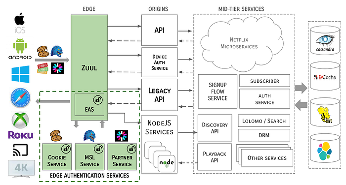

Notice that tokens never traverse past the Edge gateway / EAS boundary. The MSL security protocol is terminated at the Edge and all tokens are cracked open and identity data is propagated through the server ecosystem in a token-agnostic manner.

### A Note on Resilience

On the happy path, Zuul is able to process the large percentage of tokens that are valid and not expired, and the Edge Auth Services handle the remainder of the requests.

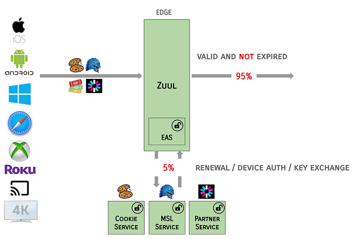

The EAS services are designed to be fault tolerant, e.g., in the case where Zuul identifies that Cookies are valid, but expired, and the renewal call to EAS fails or is latent:

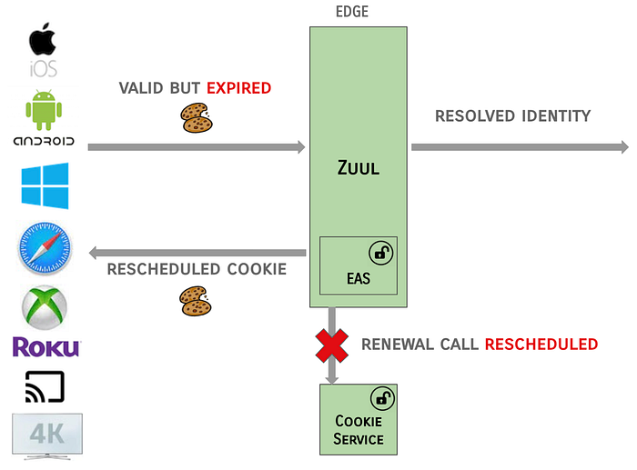

In this failure scenario, the EAS filter in Zuul will be lenient and allow the resolved identity to be propagated and will indicate that the renewal call should be rescheduled on the next request.

### Token-Agnostic Identity (Passport)

An easily mutable identity structure would not suffice because that would mean passing less trusted identities from service to service. A token-agnostic identity structure was needed.

We introduced an identity structure called “Passport” which allowed us to propagate the user and device identity information in a uniform way. The Passport is also a kind of token, but there are many benefits to using an internal structure that differs from external tokens. However, downstream systems still need access to the user and device identity.

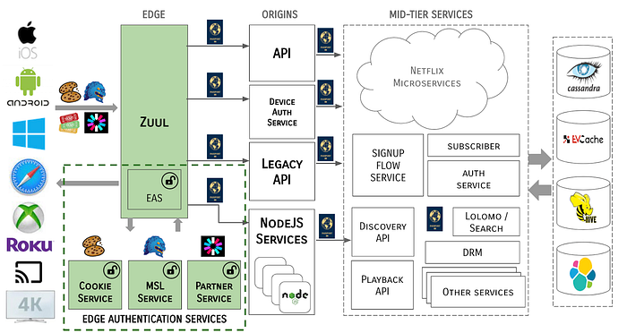

**A Passport is a short-lived identity structure created at the Edge for each request, i.e., it is scoped to the life of the request and it is completely internal to the Netflix ecosystem. These are generated in Zuul via a set of Identity Filters.**** A Passport contains both user & device identity, is in protobuf format, and is integrity protected by HMAC.**

### Passport Structure

As noted above, the Passport is modeled as a Protocol Buffer. At the highest level, the definition of the Passport is as follows:

```
message Passport {
   Header header = 1;
   UserInfo user_info = 2;
   DeviceInfo device_info = 3;
   Integrity user_integrity = 4;
   Integrity device_integrity = 5;
}
```

The Header element communicates the name of the service that created the Passport. What’s more interesting is what is propagated related to the user and device.

### User & Device Information

The UserInfo element contains all of the information required to identify the user on whose behalf requests are being made, with the DeviceInfo element containing all of the information required for the device on which the user is visiting Netflix:

```
message UserInfo {
    Source source = 1;
    int64 created = 2;
    int64 expires = 3;
    Int64Wrapper customer_id = 4;
        … (some internal stuff) …
    PassportAuthenticationLevel authentication_level = 11;
    repeated UserAction actions = 12;
}
message DeviceInfo {
    Source source = 1;
    int64 created = 2;
    int64 expires = 3;
    StringValue esn = 4;
    Int32Value device_type = 5;
    repeated DeviceAction actions = 7;
    PassportAuthenticationLevel authentication_level = 8;
        … (some more internal stuff) …
}
```

Both `UserInfo` and `DeviceInfo` carry the Source and `PassportAuthenticationLevel` for the request. The `Source` list is a classification of claims, with the protocol being used and the services used to validate the claims. The `PassportAuthenticationLevel` is the level of trust that we put into the authentication claims.

```
enum Source {
    NONE = 0;
    COOKIE = 1;
    COOKIE_INSECURE = 2;
    MSL = 3;
    PARTNER_TOKEN = 4;
        …
}
enum PassportAuthenticationLevel {
    LOW = 1; // untrusted transport
    HIGH = 2; // secure tokens over TLS
    HIGHEST = 3; // MSL or user credentials
}
```

Downstream applications can use these values to make Authorization and/or user experience decisions.

### Passport Integrity

The integrity of the Passport is protected via an HMAC (hash-based message authentication code), which is a specific type of MAC involving a crytographic hash function and a secret cryptographic key. It may be used to simultaneously verify both the data integrity and authenticity of a message.

User and device integrity are defined as:

```
message Integrity {
    int32 version = 1;
    string key_name = 2;
    bytes hmac = 3;
}
```

Version 1 of the Integrity element uses SHA-256 for the HMAC, which is encoded as a ByteArray. Future versions of Integrity may use a different hash function or encoding. In version 1, the HMAC field contains the 256 bits from MacSpec.SHA_256.

Integrity protection guarantees that Passport field are not mutated after the Passport is created. Client applications can use the Passport Introspector to check the integrity of the Passport before using any of the values contained therein.

### Passport Introspector

The Passport object itself is opaque; clients can use the Passport Introspector to extract the Passport from the headers and retrieve the contents inside it. The Passport Introspector is a wrapper over the Passport binary data. Clients create an Introspector via a factory and then have access to basic accessor methods:

```
public interface PassportIntrospector {
    Long getCustomerId();
    Long getAccountOwnerId();
    String getEsn();
    Integer getDeviceTypeId();
    String getPassportAsString();
    …
}
```

### Passport Actions

In the Passport protocol buffer definition shown above, there are Passport Actions defined:

```
message UserInfo {
    repeated UserAction actions = 12;
        …
}
message DeviceInfo {
    repeated DeviceAction actions = 7;
        …
}
```

Passport Actions are explicit signals sent by downstream services, when an update to user or device identity has been performed. The signal is used by EAS to either create or update the corresponding type of token.

### Login Flow, Revisited

Let’s wrap up with an example of all of these solutions working together.

With the movement of authentication and protocol termination to the Edge, and the introduction of Passports as identity, the Login Flow described earlier has morphed into the following:

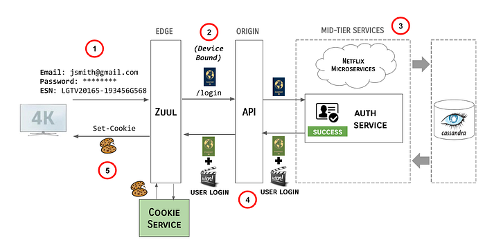

1. User enters their credentials and the Netflix client transmits the credentials, along with the ESN of the device to the Edge gateway, AKA Zuul.
2. Identity filters running in Zuul generate a device-bound Passport and pass it along to the API /login endpoint.
3. The API server propagates the Passport to the mid-tier services responsible for authentication the user.
4. Upon successful authentication of the claims provided, these services create a Passport Action and send it, along with the original Passport, back up stream to API and Zuul.
5. Zuul makes a call to the Cookie Service to resolve the Passport and Passport Actions and sends the Cookies back to the Netflix client.

## Key Benefits and Learnings

### Simplified Authorization

One of the reasons there were external tokens flowing into downstream systems was because authorization decisions often depend on authentication claims in tokens and the trust associated with each token type. In our Passport structure, we have assigned levels to this trust, meaning that systems requiring authorization decisions can write sensible rules around the Passport instead of replicating the trust rules in code across many services.

### An Explicit and Extensible Identity Model

Having a structure that is the canonical identity is very useful. Alternatives where identity primitives are passed around are brittle and hard to debug. If the customer identity changed from service A to service D in a call chain, who changed it? Once the identity structure is passed through all key systems, it is relatively easy to add new external token types, new trust levels, or new ways to represent identity.

### Operational Concerns and Visibility

Having a structure, like Passport, allows you to define the services that can write a Passport and other services can validate it. When the Passport is propagated and when we see it in logs, we can open it up, validate it, and know what the identity is. We also know the provenance of the Passport, and can trace it back to where it entered the system. This makes the debugging of any identity-related anomalies much easier.

### Reduced Downstream System Complexity & Load

Passing a uniform structure to downstream systems means that those systems can easily look up the device and user identity, using an introspection library. Instead of having separate handling for each type of external token, they can use the common structure.

By offloading token processing from these systems to the central Edge Authentication Services, downstream systems saw significant gains in CPU, request latency, and garbage collection metrics, all of which help reduce cluster footprint and cloud costs. The following examples of these gains are from the primary API service.

In the prior implementation, it was necessary to incur decryption/termination costs twice per request because we needed the ability to route at the edge but also needed rich termination in the downstream service. Some of the performance improvement is due to consolidation of this — MSL requests now only need to be processed once.

### CPU to RPS Ratio

Offloading token processing resulted in a 30% reduction in CPU cost per request and a 40% reduction in load average. The following graph shows the CPU to RPS ratio, where lower is better:

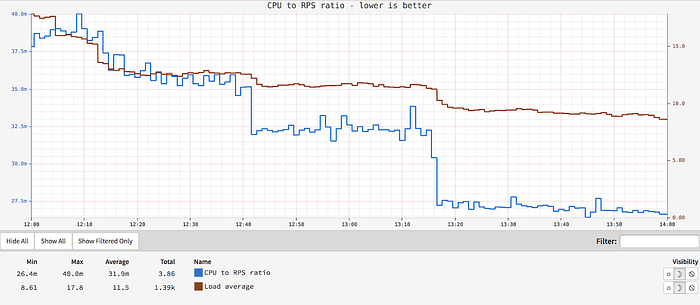

### API Response Time

Response times for all calls on the API service showed significant improvement, with a 30% reduction in average latency and a 20% drop in **99th **percentile latency:

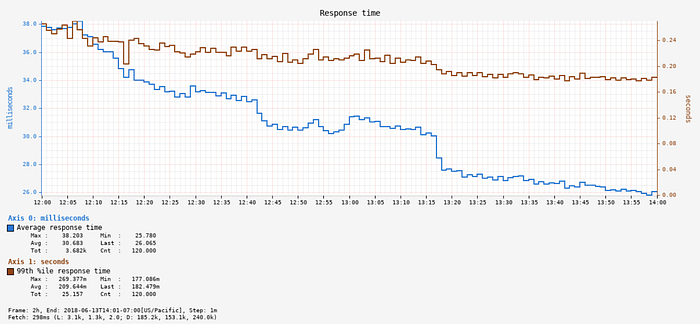

### Garbage Collection

The API service also saw a significant reduction in GC pressure and GC pause times, as shown in the Stop The World Garbage Collection metrics:

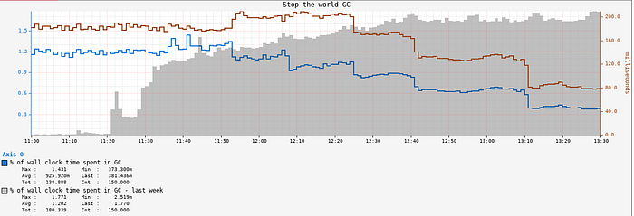

### Developer Velocity

Abstracting these authentication and identity-related concerns away from the developers of microservices means that they can focus on their core domain. Changes in this area are now done once, and in one set of specialized services, versus being distributed across multiple.

## What’s Next?

### Strong(er) Authentication

We are currently expanding the Edge Authentication Services to support Multi-Factor Authentication via a new service called “Resistor”. We selectively introduce the second factor for connections that are suspicious, based on machine learning models. As we onboard new flows, we are introducing new factors, e.g., one-time passwords (OTP) sent to email or phone, push notifications to mobile devices, and third-party authenticator applications. We may also explore opt-in Multi-Factor Authentication for users who desire the added security on their accounts.

### Flexible Authorization

Now that we have a verified identity flowing through the system, we can use that as a strong signal for authorization decisions. Last year, we started to explore a new Product Access Strategy (PACS) and are currently working on moving it into production for several new experiences in the Netflix streaming product. PACS recently powered the experience access control for the [Streamfest](https://about.netflix.com/en/news/streamfest-india), a weekend of free Netflix in India.

## Want More?

Team members presented this work at [QCon San Francisco](https://qconsf.com/) (and were two of the top three attended talks at the conference!):

_The authors are members of the Netflix _[_Access & Identity Management team_](https://tiny.cc/aim2021)_. We pride ourselves on being experts at distributed systems development, operations and identity management. And, we’re _[_hiring Senior Software Engineers_](https://tiny.cc/aim2021)_! Reach out on _[_LinkedIn_](http://www.linkedin.com/in/kcasella)_ if you are interested._

---
**Tags:** Microservice Architecture · Security · Identity Management · Authentication · Authorization
