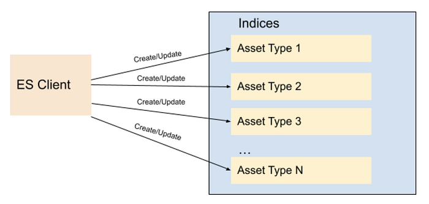
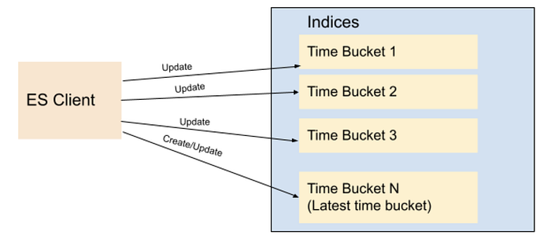
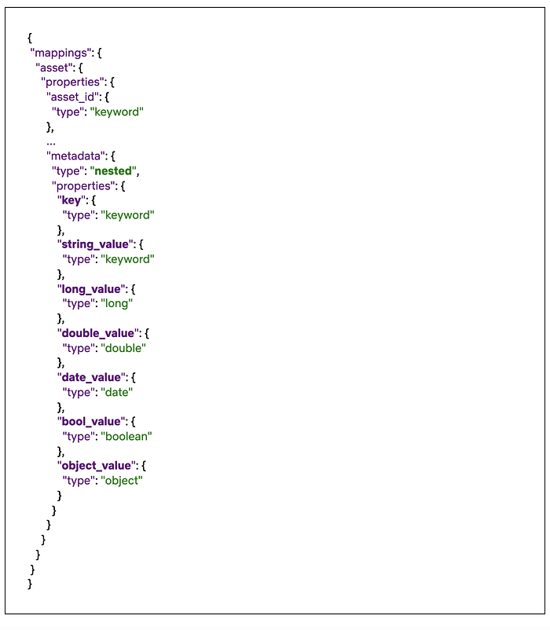
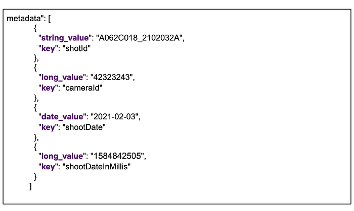
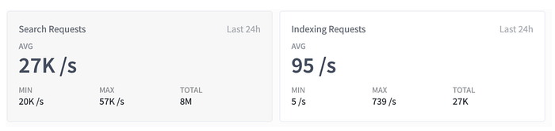
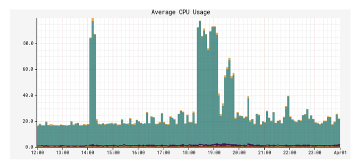
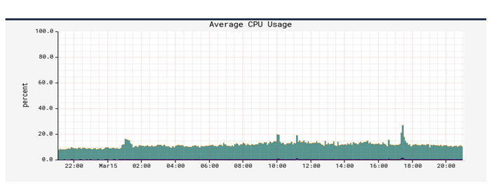

# Elasticsearch Indexing Strategy in Asset Management Platform (AMP)

By [Burak Bacioglu](https://www.linkedin.com/in/burakbacioglu/), [Meenakshi Jindal](https://www.linkedin.com/in/meenakshijindal/)

## Asset Management at Netflix

At Netflix, all of our digital media assets (images, videos, text, etc.) are stored in secure storage layers. We built an asset management platform (AMP), codenamed **Amsterdam**, in order to easily organize and manage the metadata, schema, relations and permissions of these assets. It is also responsible for asset discovery, validation, sharing, and for triggering workflows.

Amsterdam service utilizes various solutions such as [Cassandra](https://cassandra.apache.org/), [Kafka](https://kafka.apache.org/), [Zookeeper](https://zookeeper.apache.org/), [EvCache](https://netflixtechblog.com/ephemeral-volatile-caching-in-the-cloud-8eba7b124589) etc. In this blog, we will be focusing on how we utilize [Elasticsearch](https://www.elastic.co/) for indexing and search the assets.

Amsterdam is built on top of three storage layers.

The first layer, **Cassandra**, is the source of truth for us. It consists of close to a hundred tables (column families) , the majority of which are reverse indices to help query the assets in a more optimized way.

The second layer is **Elasticsearch**, which is used to discover assets based on user queries. This is the layer we’d like to focus on in this blog. And more specifically, how we index and query over 7TB of data in a read-heavy and continuously growing environment and keep our Elasticsearch cluster healthy.

And finally, we have an Apache **Iceberg** layer which stores assets in a denormalized fashion to help answer heavy queries for analytics use cases.

## Elasticsearch Integration

Elasticsearch is one of the best and widely adopted distributed, open source search and analytics engines for all types of data, including textual, numerical, geospatial, structured or unstructured data. It provides simple APIs for creating indices, indexing or searching documents, which makes it easy to integrate. No matter whether you use in-house deployments or hosted solutions, you can quickly stand up an Elasticsearch cluster, and start integrating it from your application using one of the clients provided based on your programming language (Elasticsearch has a rich set of languages it supports; Java, Python, .Net, Ruby, Perl etc.).

One of the first decisions when integrating with Elasticsearch is designing the indices, their settings and mappings. **Settings** include index specific properties like number of shards, analyzers, etc. **Mapping** is used to define how documents and their fields are supposed to be stored and indexed. You define the data types for each field, or use dynamic mapping for unknown fields. You can find more information on settings and mappings on Elasticsearch [website](https://www.elastic.co/guide/en/elasticsearch/reference/5.6/mapping.html).

Most applications in content and studio engineering at Netflix deal with assets; such as videos, images, text, etc. These applications are built on a microservices architecture, and the Asset Management Platform provides asset management to those dozens of services for various asset types. Each asset type is defined in a centralized schema registry service responsible for storing asset type taxonomies and relationships. Therefore, it initially seemed natural to create a different index for each asset type. When creating index mappings in Elasticsearch, one has to define the data type for each field. Since different asset types could potentially have fields with the same name but with different data types; having a separate index for each type would prevent such type collisions. Therefore we created around a dozen indices per asset type with fields mapping based on the asset type schema. As we onboarded new applications to our platform, we kept creating new indices for the new asset types. We have a schema management microservice which is used to store the taxonomy of each asset type; and this programmatically created new indices whenever new asset types were created in this service. All the assets of a specific type use the specific index defined for that asset type to create or update the asset document.

*Fig 1. Indices based on Asset Types*

As Netflix is now producing significantly more originals than it used to when we started this project a few years ago, not only did the number of assets grow dramatically but also the number of asset types grew from dozens to several thousands. Hence the number of Elasticsearch indices (per asset type) as well as asset document indexing or searching RPS (requests per second) grew over time. Although this indexing strategy worked smoothly for a while, interesting challenges started coming up and we started to notice performance issues over time. We started to observe CPU spikes, long running queries, instances going yellow/red in status.

Usually the first thing to try is to scale up the Elasticsearch cluster horizontally by increasing the number of nodes or vertically by upgrading instance types. We tried both, and in many cases it helps, but sometimes it is a short term fix and the performance problems come back after a while; and it did for us. You know it is time to dig deeper to understand the root cause of it.

It was time to take a step back and reevaluate our ES data indexing and sharding strategy. Each index was assigned a fixed number of 6 shards and 2 replicas (defined in the template of the index). With the increase in the number of asset types, we ended up having approximately 900 indices (thus 16200 shards). Some of these indices had millions of documents, whereas many of them were very small with only thousands of documents. **We found the root cause of the CPU spike was unbalanced shards size.** Elasticsearch nodes storing those large shards became hot spots and queries hitting those instances were timing out or very slow due to busy threads.

We changed our indexing strategy and decided to create indices based on time buckets, rather than asset types. What this means is, assets created between t1 and t2 would go to the T1 bucket, assets created between t2 and t3 would go to the T2 bucket, and so on. So instead of persisting assets based on their asset types, we would use their ids (thus its creation time; because the asset id is a time based uuid generated at the asset creation) to determine which time bucket the document should be persisted to. Elasticsearch [recommends](https://www.elastic.co/guide/en/elasticsearch/reference/current/size-your-shards.html#shard-size-recommendation) each shard to be under 65GB (AWS [recommends](https://docs.aws.amazon.com/elasticsearch-service/latest/developerguide/sizing-domains.html) them to be under 50GB), so we could create time based indices where each index holds somewhere between 16–20GB of data, giving some buffer for data growth. Existing assets can be redistributed appropriately to these precreated shards, and new assets would always go to the current index. Once the size of the current index exceeds a certain threshold (16GB), we would create a new index for the next bucket (minute/hour/day) and start indexing assets to the new index created. We created an [index template](https://www.elastic.co/guide/en/elasticsearch/reference/5.6/indices-templates.html) in Elasticsearch so that the new indices always use the same settings and mappings stored in the template.

We chose to index all versions of an asset in the the same bucket - the one that keeps the first version. Therefore, even though new assets can never be persisted to an old index (due to our time based id generation logic, they always go to the latest/current index); existing assets can be updated, causing additional documents for those new asset versions to be created in those older indices. Therefore we chose a lower threshold for the roll over so that older shards would still be well under 50GB even after those updates.

*Fig 2. Indices based on Time Buckets*

For searching purposes, we have a single read alias that points to all indices created. When performing a query, we always execute it on the alias. This ensures that no matter where documents are, all documents matching the query will be returned. For indexing/updating documents, though, we cannot use an alias, we use the exact index name to perform index operations.

To avoid the ES query for the list of indices for every indexing request, we keep the list of indices in a distributed cache. We refresh this cache whenever a new index is created for the next time bucket, so that new assets will be indexed appropriately. For every asset indexing request, we look at the cache to determine the corresponding time bucket index for the asset. The cache stores all time-based indices in a sorted order (for simplicity we named our indices based on their starting time in the format yyyyMMddHHmmss) so that we can easily determine exactly which index should be used for asset indexing based on the asset creation time. Without using the time bucket strategy, the same asset could have been indexed into multiple indices because Elasticsearch doc id is unique per index and not the cluster. Or we would have to perform two API calls, first to identify the specific index and then to perform the asset update/delete operation on that specific index.

It is still possible to exceed 50GB in those older indices if millions of updates occur within that time bucket index. To address this issue, we added an API that would split an old index into two programmatically. In order to split a given bucket T1 (which stores all assets between t1 and t2) into two, we choose a time t1.5 between t1 and t2, create a new bucket T1_5, and reindex all assets created between t1.5 and t2 from T1 into this new bucket. While the reindexing is happening, queries / reads are still answered by T1, so any new document created (via asset updates) would be dual-written into T1 and T1.5, provided that their timestamp falls between t1.5 and t2. Finally, once the reindexing is complete, we enable reads from T1_5, stop the dual write and delete reindexed documents from T1.

In fact, Elasticsearch provides an index rollover feature to handle the growing indicex problem [https://www.elastic.co/guide/en/elasticsearch/reference/6.0/indices-rollover-index.html](https://www.elastic.co/guide/en/elasticsearch/reference/6.0/indices-rollover-index.html). With this feature, a new index is created when the current index size hits a threshold, and through a write alias, the index calls will point to the new index created. That means, all future index calls would go to the new index created. However, this would create a problem for our update flow use case, because we would have to query multiple indices to determine which index contains a particular document so that we can update it appropriately. Because the calls to Elasticsearch may not be sequential, meaning, an asset a1 created at T1 can be indexed after another asset a2 created at T2 where T2>T1, the older asset a1 can end up in the newer index while the newer asset a2 is persisted in the old index. In our current implementation, however, by simply looking at the asset id (and asset creation time), we can easily find out which index to go to and it is always deterministic.

One thing to mention is, Elasticsearch has a default limit of 1000 fields per index. If we index all types to a single index, wouldn’t we easily exceed this number? And what about the data type collisions we mentioned above? Having a single index for all data types could potentially cause collisions when two asset types define different data types for the same field. We also changed our mapping strategy to overcome these issues. Instead of creating a separate Elasticsearch field for each metadata field defined in an asset type, we created a single [nested](https://www.elastic.co/guide/en/elasticsearch/reference/6.0/nested.html) type with a mandatory field called `key`, which represents the name of the field on the asset type, and a handful of data-type specific fields, such as: `string_value`, `long_value`, `date_value`, etc. We would populate the corresponding data-type specific field based on the actual data type of the value. Below you can see a part of the index mapping defined in our template, and an example from a document (asset) which has four metadata fields:

*Fig 3. Snippet of the index mapping*

*Fig 4. Snippet of nested metadata field on a stored document*

As you see above, all asset properties go under the same nested field `**metadata**` with a mandatory `**key**` field, and the corresponding data-type specific field. This ensures that no matter how many asset types or properties are indexed, we would always have a fixed number of fields defined in the mapping. When searching for these fields, instead of querying for a single value (cameraId == 42323243), we perform a nested query where we query for both key and the value (key == cameraId AND long_value == 42323243). For more information on nested queries, please refer to this [link](https://www.elastic.co/guide/en/elasticsearch/reference/5.6/query-dsl-nested-query.html).

*Fig 5. Search/Indexing RPS*

After these changes, the indices we created are now balanced in terms of data size. CPU utilization is down from an average of 70% to 10%. In addition, we are able to reduce the refresh interval time on these indices from our earlier setting 30 seconds to 1 sec in order to support use cases like read after write, which enables users to search and get a document after a second it was created

*Fig 6. CPU Spike with Old indexing strategy*

*Fig 7. CPU Usage with New indexing strategy*

We had to do a one time migration of the existing documents to the new indices. Thankfully we already have a framework in place that can query all assets from Cassandra and index them in Elasticsearch. Since doing full table scans in Cassandra is not generally recommended on large tables (due to potential timeouts), our cassandra schema contains several reverse indices that help us query all data efficiently. We also utilize Kafka to process these assets asynchronously without impacting our real time traffic. This infrastructure is used not only to index assets to Elasticsearch, but also to perform administrative operations on all or some assets, such as bulk updating assets, scanning / fixing problems on them, etc. Since we only focused on Elasticsearch indexing in this blog, we are planning to create another blog to talk about this infrastructure later.

---
**Tags:** Asset Management · Sharding · Netflix · Elasticsearch · Performance
