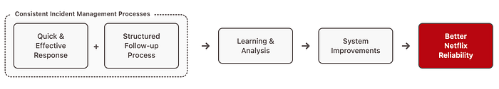

# Empowering Netflix Engineers with Incident Management

_By: _[_Molly Struve_](https://www.linkedin.com/in/mollystruve/)

Netflix’s mission to provide seamless entertainment to hundreds of millions of users globally demands exceptional reliability. At the heart of this reliability is how we handle incidents — those inevitable moments when something doesn’t go as expected.

Teams can respond quickly and more effectively when incidents are managed consistently across a company. A robust process for following up after incidents creates opportunities for learning and improving systems. This continuous improvement cycle is essential for maintaining the highly reliable systems on which our members depend.

Having a shared, consistent approach to incident management became critical as Netflix grew and expanded its business. This post delves into our journey to transform incident management from a centralized function into a widespread, accessible practice and the hard-won lessons we’ve learned along the way.

## The Past: Countless Missed Opportunities

For most of Netflix’s past, incident management was the domain of our central Site Reliability Engineering team, called [CORE](./keeping-customers-streaming-the-centralized-site-reliability-practice-at-netflix-205cc37aa9fb.md) (Critical Operations and Reliability Engineering). CORE was focused on streaming and was the sole initiator of incidents. They used Jira and a single Slack channel for incident response. This approach worked in the early days, but we knew it wouldn’t scale as Netflix grew and diversified.

With thousands of microservices supporting critical functions beyond streaming, we knew plenty of things were breaking that we were not capturing. We had an internal post-incident write-up template called “OOPS,” which teams could use to write about operational surprises. **The template saw limited adoption as many engineers didn’t know about it or understand its purpose or value**. **With countless smaller, everyday incidents going unnoticed, we were missing key opportunities to learn and improve**.

## The Aspiration: A Paved Road to Incident Management

Recognizing these limits, we embarked on a journey to democratize incident management. Our goal: open more incidents and engage more teams in the process. We envisioned a “paved road” for incident management — a process so intuitive and streamlined that anyone could easily declare and manage an incident, even at 3 AM. Creating a paved road required a shift: our central SRE team would no longer be the only ones declaring incidents. Instead, we’d empower teams across engineering to own their own incidents. Making this significant shift required both technological and cultural changes.

## Finding the Right Tool

Scaling technical processes within an organization as diverse and intricate as Netflix is challenging. To enable every engineering team to manage incidents effectively, we needed a comprehensive incident management tool that was far more sophisticated than Jira and a single Slack channel. We knew any solution, whether built or bought, would need to meet four key requirements:

- **Intuitive user experience** — Our number one priority was making sure the tool was so intuitive that anyone could use it with little to no training.
- **Internal data integration capabilities** — We needed the ability to hook in Netflix-specific data.
- **Balanced customization with consistency** — We wanted teams to have flexibility while maintaining shared standards.
- **Approachable** — A friendly and appealing tool that could help drive a cultural shift around incidents.

The “build vs. buy” question was a significant consideration. While Netflix boasts a world-class engineering team, building an in-house solution meeting these requirements was impractical due to our ambitious timeline, the substantial investment needed, and ongoing ownership costs. Following Netflix’s engineering principle of “build only when necessary,” we evaluated external solutions against these criteria.

This evaluation process led us to adopt [Incident.io](http://incident.io/). While the platform checked all our boxes during selection, the four above requirements proved even more impactful than anticipated during Netflix’s incident management transformation.

## Tackling the Transformation

Selecting the right tool was just the beginning. The real challenge was rolling it out across Netflix’s diverse engineering organization and achieving the cultural shift we envisioned. Here are four elements that helped make our goal a reality.

### Intuitive Design Drove Adoption and Cultural Transformation

Tool usability was crucial to encourage teams to open incidents. It had to be easily understandable, even for engineers who aren’t incident management experts and only use it a few times a year. When introducing [Incident.io](http://incident.io/), we saw rapid organic adoption because the tool was easy to pick up without much guidance. Its intuitive design allowed users to discover features as they used it. Thanks to prioritizing usability, within four months, 20% of engineering teams were using the tooling, and six months later, we had over 50% adoption.

Beyond rapid adoption, the tool helped shift how Netflix engineers think about incidents. Incidents went from “big scary outages” to simply “any blip or issue that degrades or disrupts a service that deserves attention and learning.” The tool’s friendly, welcoming interface made incident management less intimidating and more accessible. Some engineers described the platform as “jolly” and mentioned that it actually made them _want_ to open incidents. The approachable design lowered psychological barriers for engineers to declare incidents and made it feel like a natural, even positive, part of their workflow.

### Organizational Investment Supported Scalable Growth

While having an intuitive tool was important, successfully empowering engineers to open incidents required deliberate organizational investment. We invested heavily in standardization, developing an incident management process lightweight enough to avoid overwhelming users yet structured enough to support complex incidents. Finding the right balance took time and active engagement with users to understand what was working and what wasn’t. To this day, we still make adjustments to refine and improve the process.

On the education front, we created lightweight docs, quick-reference cheatsheets, and short demo videos to accelerate adoption across Netflix’s diverse engineering organization. We took these resources on roadshows across engineering teams and proved that the barrier to entry for managing incidents was practically nonexistent. While most engineers bought in easily, we had our skeptics. Over time, we worked with these folks to understand their needs better and help them fit incident management into their daily routines and processes.

### Internal Integrations Reduce Cognitive Load

Integrating our unique organizational context — like teams, software services, business domains, and even hardware devices — directly into the incident management platform was critical. Netflix-specific contextualization enables powerful automations, such as automatically looping in the right teams or pre-filling incident fields from alerts. These integrations significantly reduce cognitive load during an incident and empower engineers to focus on quick mitigation. Beyond individual incidents, integrations with internal data across multiple incidents enable us to identify and address systemic issues.

### Balanced Customization with Consistency Improved Response

A flexible platform allowed us to create a tailored incident response experience while enforcing a shared language and standard metadata across all engineering teams. This balance proved crucial for response effectiveness: different teams can adapt workflows to their specific needs, but core elements like “impacted areas and domains” stay consistent. Incident responders can quickly understand any incident organization-wide because the structure and language remain familiar, enabling faster, more effective incident response.

## The Result: A New Era of Incident Management

Our journey to democratize incident management has yielded massive wins across Netflix Engineering. We successfully transitioned from a centralized incident response model to empowering engineers to declare and manage incidents. The transformation has fostered a culture of renewed ownership and learning across engineering teams.

We’ve established new practices and are growing an incident management culture we’re genuinely proud of, but we’re not done yet. Our incident management processes continue to evolve and adapt to fit Netflix’s growing needs. Every day, we work to educate engineers and leaders on the tremendous value incidents provide. We’re excited to continue harnessing these incredible learning opportunities to improve our platform for our hundreds of millions of members.

---
**Tags:** Site Reliability Engineer · Incident Management · Incident Response · Reliability
