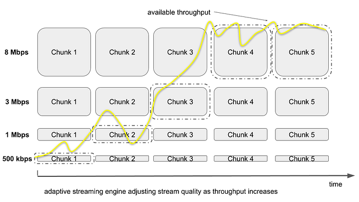
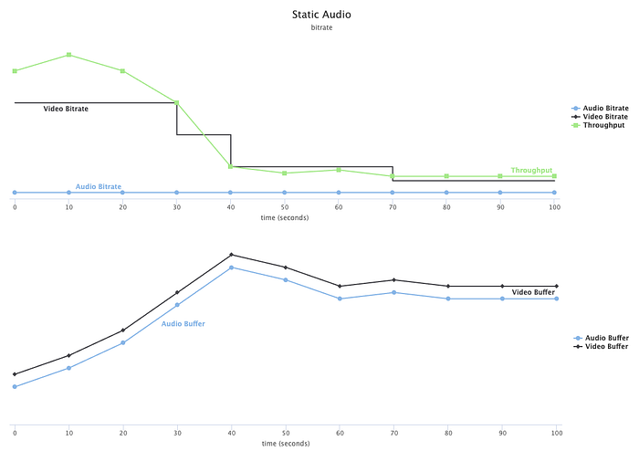
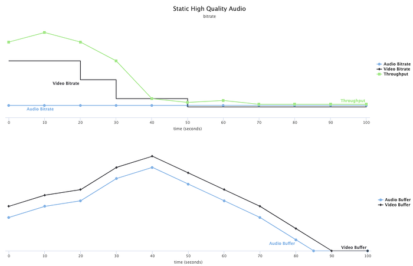
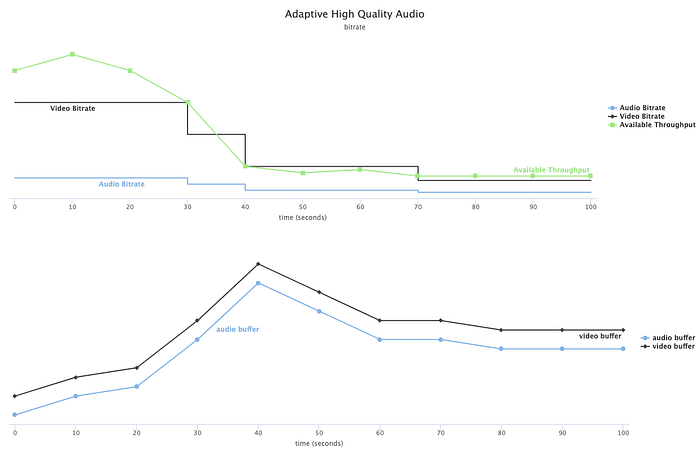

# Engineering a Studio Quality Experience With High-Quality Audio at Netflix

_by Guillaume du Pontavice, Phill Williams and Kylee Peña (on behalf of our Streaming Algorithms, Audio Algorithms, and Creative Technologies teams)_

Remember the epic opening sequence of _Stranger Things 2_? The thrill of that car chase through Pittsburgh not only introduced a whole new set of mysteries, but it returned us to a beloved and dangerous world alongside Dustin, Lucas, Mike, Will and Eleven. Maybe you were one of the millions of people who watched it in HDR, experiencing the brilliant imagery as it was meant to be seen by the creatives who dreamt it up.

Imagine this scene without the sound. Even taking away one part of the soundtrack — the brilliant synth-pop score or the perfectly mixed soundscape of a high speed chase — is the story nearly as thrilling and emotional?

Most conversations about streaming quality focus on _video_. In fact, Netflix has led the charge for most of the video technology that drives these conversations, from visual quality improvements like 4K and HDR, to behind-the-scenes technologies that make the streaming experience better for everyone, like adaptive streaming, complexity-based encoding, and AV1.

We’re really proud of the improvements we’ve brought to the video experience, but the focus on those makes it easy to overlook the importance of _sound_, and sound is every bit as important to entertainment as video. Variances in sound can be extremely subtle, but the impact on how the viewer perceives a scene differently is often measurable. For example, have you ever seen a TV show where the video and audio were a _little_ out of sync?

Among those who understand the vital nature of sound are the Duffer brothers. In late 2017, we received some critical feedback from the brothers on the _Stranger Things 2_ audio mix: in some scenes, there was a reduced sense of where sounds are located in the 5.1-channel stream, as well as **audible degradation of high frequencies**.

Our engineering team and Creative Technologies sound expert joined forces to quickly solve the issue, but a larger conversation about higher quality audio continued. Series mixes were getting bolder and more cinematic with tight levels between dialog, music and effects elements. Creative choices increasingly tested the limits of our encoding quality. We needed to support these choices better.

At Netflix, we work hard to bring great audio to our members. We began streaming 5.1 surround audio in 2010, and [began streaming Dolby Atmos in 2016](https://media.netflix.com/en/company-blog/dolby-atmos-coming-to-netflix), but wanted to bring _studio quality_ sound to our members around the world. We want your experience to be brilliant even if you aren’t listening with a state-of-the-art home theater system. Just as we support initiatives like HDR and [Netflix Calibrated Mode](https://media.netflix.com/en/company-blog/netflix-calibrated-mode-brings-studio-quality-picture-mastering-to-the-living-room) to maintain creative intent in streaming you _picture_, we wanted to do the same for the sound. That’s why we developed and launched high-quality audio.

To learn more about the people and inspiration behind this effort, [check out this video](https://www.youtube.com/watch?v=_eqdt_UOBAQ&feature=youtu.be). In this tech blog, we’ll dive deep into what high-quality audio is, how we deliver it to members worldwide, and why it’s so important to us.

## What do we mean by “studio quality” sound?

If you’ve ever been in a professional recording studio, you’ve probably noted the difference in how things sound. One reason for that is the files used in mastering sessions are 24-bit 48 kHz with a bitrate of around 1 Mbps per channel. Studio mixes are uncompressed, which is why we consider them to be the “master” version.

Our high-quality sound feature is not lossless, but it is **perceptually transparent**. That means that while the audio is compressed, it is indistinguishable from the original source. Based on internal listening tests, listening test results provided by Dolby, and scientific studies, we determined that for Dolby Digital Plus at and above 640 kbps, the audio coding quality is perceptually transparent. Beyond that, we would be sending you files that have a higher bitrate (and take up more bandwidth) without bringing any additional value to the listening experience.

In addition to deciding 640 kbps — a 10:1 compression ratio when compared to a 24-bit 5.1 channel studio master — was the perceptually transparent threshold for audio, we set up a bitrate ladder for 5.1-channel audio ranging from 192 up to 640 kbps. This ranges from “good” audio to “transparent” — there aren’t any bad audio experiences when you stream!

At the same time, we revisited our Dolby Atmos bitrates and increased the highest offering to 768 kbps. We expect these bitrates to evolve over time as we get more efficient with our encoding techniques.

Our high-quality sound is a great experience for our members even if they aren’t audiophiles. Sound helps to tell the story subconsciously, shaping our experience through subtle cues like the sharpness of a phone ring or the way a very dense flock of bird chirps can increase anxiety in a scene. Although variances in sound can be nuanced, the impact on the viewing and listening experience is often measurable.

And perhaps most of all, our “studio quality” sound is faithful to what the mixers are creating on the mix stage. For many years in the film and television industry, creatives would spend days on the stage perfecting the mix only to have it significantly degraded by the time it was broadcast to viewers. Sometimes critical sound cues might even be lost to the detriment of the story. By delivering studio quality sound, we’re preserving the creative intent from the mix stage.

## Adaptive Streaming for Audio

Since we began streaming, we’ve used static audio streaming at a constant bitrate. This approach selects the audio bitrate based on network conditions at the start of playback. However, we have spent years optimizing our adaptive streaming engine for video, so we know adaptive streaming has obvious benefits. Until now, we’ve only used adaptive streaming for video.

Adaptive streaming is a technology designed to deliver media to the user in the most optimal way for their network connection. Media is split into many small segments (chunks) and each chunk contains a few seconds of playback data. Media is provided in several qualities.

An adaptive streaming algorithm’s goal is to provide the best overall playback experience — even under a constrained environment. A great playback experience should provide the best overall quality, considering both audio and video, and avoid buffer starvation which leads to a rebuffering event — or playback interruption.

Constrained environments can be due to changing network conditions and device performance limitations. Adaptive streaming has to take all these into account. Delivering a great playback experience is difficult.

Let’s first look at how static audio streaming paired with adaptive video operates in a session with variable network conditions — in this case, a sudden throughput drop during the session.

The top graph shows both the audio and video bitrate, along with the available network throughput. The audio bitrate is fixed and has been selected at playback start whereas video bitrate varies and can adapt periodically.

The bottom graph shows audio and video buffer evolution: if we are able to fill the buffer faster than we play out, our buffer will grow. If not, our buffer will shrink.

In the first session above, the adaptive streaming algorithm for video has reacted to the throughput drop and was able to quickly stabilize both the audio and video buffer level by down-switching the video bitrate.

In the second scenario below, under the same network conditions we used a static **high-quality** audio bitrate at session start instead.

Our adaptive streaming for video logic is reacting but in this case, the available throughput is becoming less than the sum of audio and video bitrate, and our buffer starts draining. This ultimately leads to a rebuffer.

In this scenario, the video bitrate dropped below the audio bitrate, which might not provide the best playback experience.

This simple example highlights that static audio streaming can lead to suboptimal playback experiences with fluctuating network conditions. This motivated us to use **adaptive streaming for audio.**

By using adaptive streaming for audio, **we allow audio quality to adjust during playback to bandwidth capabilities, just like we do for video.**

Let’s consider a playback session with exactly the same network conditions (a sudden throughput drop) to illustrate the benefit of adaptive streaming for audio.

In this case we are able to select a higher audio bitrate when network conditions supported it and we are able to gracefully switch down the audio bitrate and avoid a rebuffer event by maintaining healthy audio and video buffer levels. Moreover, we were able to maintain a higher video bitrate when compared to the previous example.

The benefits are obvious in this simple case, but extending it to our broad streaming ecosystem was another challenge. There were many questions we had to answer in order to move forward with adaptive streaming for audio.

**What about device reach? **We have hundreds of millions of TV devices in the field, with different CPU, network and memory profiles, and adaptive audio has never been certified. Do these devices even support audio stream switching?

- We had to assess this by testing adaptive audio switching on all Netflix supported devices.
- We also added adaptive audio testing in our certification process so that every new certified device can benefit from it.

Once we knew that adaptive streaming for audio was achievable on most of our TV devices, we had to answer the following questions as we **designed the algorithm**:

- How could we guarantee that we can improve audio subjective quality without degrading video quality and vice-versa?
- How could we guarantee that we won’t introduce additional rebuffers or increase the startup delay with high-quality audio?
- How could we guarantee that this algorithm will gracefully handle devices with different performance characteristics?

We answered these questions via experimentation that led to fine-tuning the adaptive streaming for audio algorithm in order to increase audio quality without degrading the video experience. After a year of work, we were able to answer these questions and implement adaptive audio streaming on a majority of TV devices.

## Enjoying a Higher Quality Experience

By using our listening tests and scientific data to choose an optimal “transparent” bitrate, and designing an adaptive audio algorithm that could serve it based on network conditions, we’ve been able to enable this feature on a wide variety of devices with different CPU, network and memory profiles: the vast majority of our members using 5.1 should be able to enjoy new high-quality audio.

And it won’t have any negative impact on the streaming experience. The adaptive bitrate switching happens seamlessly during a streaming experience, with the available bitrates ranging from good to transparent, so you shouldn’t notice a difference other than better sound. If your network conditions are good, you’ll be served up the best possible audio, and it will now likely sound like it did on the mixing stage. If your network has an issue — your sister starts a huge download or your cat unplugs your router — our adaptive streaming will help you out.

After years perfecting our adaptive video switching, we’re thrilled that a similar approach can enable studio quality sound to make it to members’ households, ensuring that every detail of the mix is preserved. Uniquely combining creative technology with engineering teams at Netflix, we’ve been able to not only solve a problem, but use that problem to improve the quality of audio for millions of our members worldwide.

Preserving the original creative intent of the hard-working people who make shows like _Stranger Things_ is a top priority, and we know it enhances your viewing — and listening — experience for many more moments of joy. Whether you’ve fallen into the Upside Down or you’re being chased by the Demogorgon, get ready for a sound experience like never before.
