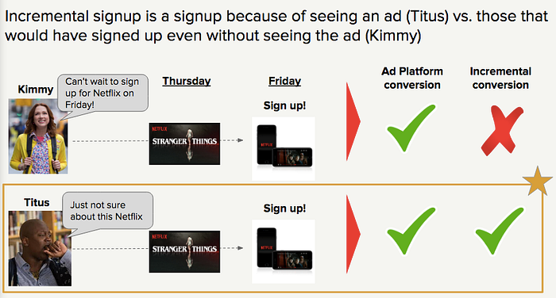
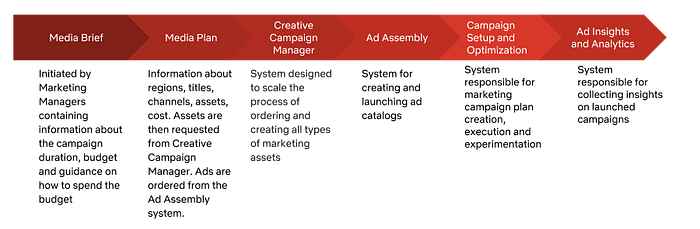
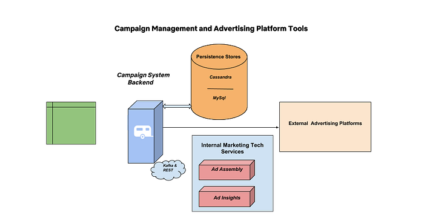
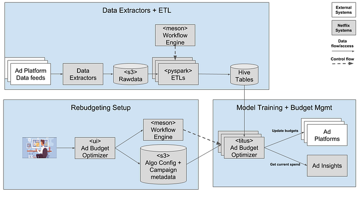

# Engineering to Improve Marketing Effectiveness (Part 3) — Scaling Paid Media campaigns

This is the third blog of the series on Marketing Technology at Netflix. This blog focuses on the marketing tech systems that are responsible for campaign setup and delivery of our paid media campaigns. The [first blog](https://medium.com/netflix-techblog/engineering-to-improve-marketing-effectiveness-part-1-a6dd5d02bab7) focused on solving for creative development and localization at scale. The [second blog](https://medium.com/netflix-techblog/https-medium-com-netflixtechblog-engineering-to-improve-marketing-effectiveness-part-2-7dd933974f5e) focused on scaling advertising at Netflix through easier ad assembly and trafficking.

Netflix’s Marketing team is interested in raising awareness about our content, our brand and get new consumers excited about signing up to our service. We use a combination of paid media, owned media (e.g. via Netflix twitter handle), and earned media (publicity) to reach people all over the world. We use a mix of art and science to decide which titles to promote in which market.

The Netflix Marketing Tech team focuses on automation and experimentation to help our marketing team save time and money. These marketing campaigns help raise brand awareness on services/channels outside of the Netflix product itself (e.g. social media channels).

## What are we solving for?

The marketing tech team’s goal is to build scalable systems which enable marketers at Netflix to efficiently manage, measure, experiment and learn about tactics that help unlock the effectiveness of our paid media efforts.

**Improving Incremental Marketing Effectiveness:** Netflix wants to use paid media to drive incremental value to the business. For instance, if we are interested in using a campaign to get people to sign up, we only want to measure the success of our campaign on users we _caused _to sign up, which is a subset of total signups. We measure this through ongoing experiments and control/holdout groups. This lets us understand the difference between all signups (correlational) and incremental signups (causal). For more detailed information on this topic, please refer to some of the work done in this space — [incrementality bidding and attribution](https://papers.ssrn.com/sol3/papers.cfm?abstract_id=3129350) and [measuring ad effectiveness](https://courses.cit.cornell.edu/jl2545/adpapers/Randall%20Lewis.pdf).

**Enabling Marketing At Scale: **Netflix is now available in over 190 countries and advertises globally outside of our service in dozens of languages, for hundreds of pieces of content, ultimately using millions of promotional assets created solely for the purposes of marketing. One trailer for a title can quickly turn into hundreds of individual ads with permutations by languages, aspect ratios, subtitles, testing variations, etc. Our Marketing Tech platforms need to support the assembly and delivery of a wide variety of campaigns and plan type combinations, on a variety of external advertising platforms at global scale.

**Enabling Easy Experimentation: **Similar to how we test on the Netflix Product, the Netflix Marketing team embraces experimentation to identify the best marketing tactics for spending paid media dollars. The Marketing Tech team seeks to create technology that will enable our partners in marketing to spend more of their time on strategic and creative decisions. Our teams use experimentation to guide their instincts on the best performing campaigns. **We enable experimentation through methodologies like A/B testing and ****[geo-based quasi testing.](https://medium.com/@NetflixTechBlog/quasi-experimentation-at-netflix-566b57d2e362)**

**Near Real-time Measurement:** As an advertiser running paid media across multiple global ad platforms, our systems need to provide accurate, near real-time answers about campaign performance. We then use this data to adapt and optimize our campaign spend in order to achieve our conversion goals.

## How are we solving them?

The tech systems which solve for these problems can be broken into the following types:

- Systems which are responsible for automating the workflows used for buying paid media and unlocking efficiencies in those flows (media planner)
- Systems which help with [creative development & localization](https://medium.com/netflix-techblog/engineering-to-improve-marketing-effectiveness-part-1-a6dd5d02bab7) and [assembly of ads](https://medium.com/netflix-techblog/https-medium-com-netflixtechblog-engineering-to-improve-marketing-effectiveness-part-2-7dd933974f5e) from the creative assets.
- Systems which are responsible for marketing campaign creation and execution (campaign management system)
- Systems which are responsible for collecting analytics and insights into how our campaigns are performing on ad platforms like Google (advertising insights)
- Systems that enable changing budget on live campaigns in order to optimize our marketing spend (ad budget optimization)

Here is a highly simplified life cycle of a paid media marketing campaign.

*Lifecycle of a paid media campaign*

This blog will focus mainly on the campaign management and ad budget optimization systems.

## Campaign Management System

First some terminology for those less familiar with this space. A campaign is a set of advertisements with a single idea or theme. An advertising campaign is typically broadcast through several media channels like programmatic, digital reserve, TV, print, Billboards, etc. A campaign consists of the following:

- **Objective**: A campaign has specific goals and objectives.
- **Target Audience**: It refers to the set of audience and languages within regions that are targeted by the campaign.
- **Catalog**: contains information about all ads that are part of the campaign. It consists of a list of titles, assets links and ad formats e.g videos ads, carousel, etc.
- **Budget**: is the spend that is associated with a campaign. You can apply this spend to each day the campaign runs (daily budget) or over the lifetime of the campaign (lifetime budget).

Programmatic bidding is the automated bidding on advertising inventory, for the opportunity to show an ad to a specific internet user, in a specific context.

The programmatic marketing team at Netflix is responsible for planning, setting up and executing marketing campaigns on the ad platforms. Each campaign requires a separate structure, and combinations of different geography, inventory sources, etc. We built our campaign management system in order to automate large parts of the campaign creation process. The system automates the process of campaign creation by abstracting out complexities in ad catalog setup, budget recommendation, experimentation, audience and campaign setup.

The complexity of the campaigns is further increased because the programmatic marketing team often runs experiments as part of a campaign. For example, we may use a campaign to test the relative effectiveness of a 30 second creative vs. a 6 second creative. Other experiments might try to determine optimal campaign parameters like budget allocation. Without tooling, all of the combinatorics would lead to dramatic increase in campaign setup time and complexity.

To solve this, our campaign management system has the notion of plan type (recipe) — pre-built combinations of various factors such as campaign type, objective, etc. With the help of this feature, we enable the selection of an appropriate recipe and add setup information for multiple cross-country and cross-platform tests in a single place. This dramatically reduces campaign setup time, removes error prone manual steps, and increases our confidence in test learnings.

## System architecture

The Campaign Management Service relies on a variety of technologies to achieve its goals. The majority of the service layer is written in Kotlin and Java. Cassandra is the primary store for most data. The UI is built on top of Node.js using React components which communicates with the backend service via REST. [Titus](https://medium.com/netflix-techblog/titus-the-netflix-container-management-platform-is-now-open-source-f868c9fb5436) provides container based jobs which can be used for heavy lifting, such as uploading videos to ad platforms.

## Ad Budget Optimization System

When we run a marketing campaign with an objective of increasing incremental new sign ups, we are faced with the challenge of spending marketing budgets across the globe. For example, should the next incremental dollar get allocated to marketing in the U.S. or Thailand if incremental sign up and revenue is our ultimate objective? Stated simply, this is a budget allocation problem with several hard to measure factors that are behind it — Netflix product/market fit, cost of media, etc.

We solve this problem by building a system to dynamically distribute budgets across campaigns and countries to maximize incremental revenue. The system retrieves live campaign performance data from ad platforms and calculates the budget allocation per country and platform based on the current spend and the number of days remaining in the campaign.

### System architecture

There are three main components in the budget optimization system. The front-end provides a CRUD interface for entering campaign metadata (campaign description, start and end dates, budget, etc). It also uses the Netflix workflow orchestration engine [Meson](https://medium.com/netflix-techblog/meson-workflow-orchestration-for-netflix-recommendations-fc932625c1d9) to enable the ability to view, select and execute specific budget runs. The next component is a data ETL pipeline which is responsible for calculating input metrics like spend, lift, etc and persisting those in Hive tables. The third component is the backend which reads campaign metadata from S3, spend/lift metrics from Hive and applies machine learning models to calculate the budget allocation per county and ad platform. The updated budget allocations are then pushed to the external platforms through API integrations.

## Future challenges

As our business is evolving, our systems need to scale to support for accelerated experimentation and expanded creative inventory. We will also continue to fine tune our systems to make our workflows as automated as possible. The less time and effort spent manually creating ad campaigns, the faster we will be able to move as a business. Our goal is to continue to build an efficient, robust and scalable marketing platform that is greater than the sum of its parts and which ultimately enables consumer delight.

## Conclusion

In summary, we’ve discussed the mechanics of creation, delivery and optimization of Netflix campaigns at global scale. Some of the details themselves are worth follow-up posts and we’ll be publishing them in the future. We need back-end engineers to build robust data pipelines and facilitate communication and integration between our many services. We’re also looking for front-end engineers to build beautiful, intuitive user interfaces that are a pleasure to use and provide a cohesive look and feel across our ecosystem. If you’re interested in joining us in working on some of these opportunities within Netflix’s Marketing Tech, [**we’re hiring**](https://sites.google.com/netflix.com/adtechjobs/ad-tech-engineering)**!**

_Authored By _[_Jayashree Biswas_](https://www.linkedin.com/in/jayashreebiswas/)_, _[_Gopal Krishnan_](https://www.linkedin.com/in/gopal-krishnan-9057a7/)

---
**Tags:** Advertising · Netflix · Campaign Management · Budget Optimization
