# Enhancing Netflix Reliability with Service-Level Prioritized Load Shedding

> Applying Quality of Service techniques at the application level

[Anirudh Mendiratta](https://www.linkedin.com/in/amendira/), [Kevin Wang](https://www.linkedin.com/in/kzwang), [Joey Lynch](https://jolynch.github.io/), [Javier Fernandez-Ivern](https://www.linkedin.com/in/ivern), [Benjamin Fedorka](https://www.linkedin.com/in/benjamin-fedorka)

## Introduction

In November 2020, we introduced the concept of prioritized load shedding at the API gateway level in our blog post, [Keeping Netflix Reliable Using Prioritized Load Shedding](./keeping-netflix-reliable-using-prioritized-load-shedding-6cc827b02f94.md). Today, we’re excited to dive deeper into how we’ve extended this strategy to the individual service level, focusing on the video streaming control plane and data plane, to further enhance user experience and system resilience.

## The Evolution of Load Shedding at Netflix

At Netflix, ensuring a seamless viewing experience for millions of users simultaneously is paramount. Our initial approach for prioritized load shedding was implemented at the **Zuul API** gateway layer. This system effectively manages different types of network traffic, ensuring that critical playback requests receive priority over less critical telemetry traffic.

Building on this foundation, we recognized the need to apply a similar prioritization logic deeper within our architecture, specifically at the service layer where different types of requests within the same service could be prioritized differently. The advantages of applying these techniques at the service level in addition to our edge API gateway are:

1. Service teams can own their prioritization logic and can apply finer grained prioritization.
2. This can be used for backend to backend communication, i.e. for services not sitting behind our edge API gateway.
3. Services can use cloud capacity more efficiently by combining different request types into one cluster and shedding low priority requests when necessary instead of maintaining separate clusters for failure isolation.

## Introducing Service-Level Prioritized Load Shedding

PlayAPI is a critical backend service on the video streaming control plane, responsible for handling device initiated manifest and license requests necessary to start playback. We categorize these requests into two types based on their criticality:

1. **User-Initiated Requests (critical):** These requests are made when a user hits play and directly impact the user’s ability to start watching a show or a movie.
2. **Pre-fetch Requests (non-critical):** These requests are made optimistically when a user browses content without the user hitting play, to reduce latency should the user decide to watch a particular title. A failure in only pre-fetch requests does not result in a playback failure, but slightly increases the latency between pressing play and video appearing on screen.


*Netflix on Chrome making pre-fetch requests to PlayAPI while the user is browsing content*

### The Problem

In order to handle large traffic spikes, high backend latency, or an under-scaled backend service, PlayAPI previously used a concurrency limiter to throttle requests that would reduce the availability of both user-initiated and prefetch requests equally. This was not ideal because:

1. **Spikes** in pre-fetch traffic reduced availability for user-initiated requests
2. Increased backend latency reduced availability for user-initiated requests and pre-fetch requests equally, when the system had enough capacity to serve all user-initiated requests.

Sharding the critical and non-critical requests into separate clusters was an option, which addressed problem 1 and added failure isolation between the two types of requests, however it came with a higher compute cost. Another disadvantage of sharding is that it adds some operational overhead — engineers need to make sure CI/CD, auto-scaling, metrics, and alerts are enabled for the new cluster.

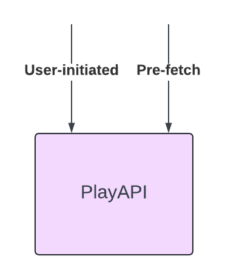
*Option 1 — No isolation*

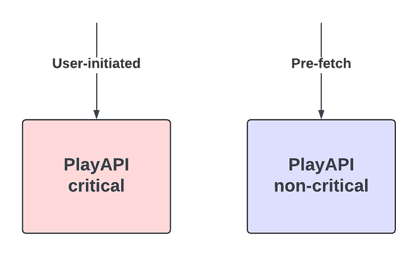
*Option 2 — Isolation but higher compute cost*

### Our Solution

We implemented a concurrency limiter within PlayAPI that prioritizes user-initiated requests over prefetch requests without physically sharding the two request handlers. This mechanism uses the partitioning functionality of the open source [Netflix/concurrency-limits](https://github.com/Netflix/concurrency-limits) Java library. We create two partitions in our limiter:

- **User-Initiated Partition:** Guaranteed 100% throughput.
- **Pre-fetch Partition:** Utilizes only excess capacity.


*Option 3 — Single cluster with prioritized load-shedding offers application-level isolation with lower compute cost. Each instance serves both types of requests and has a partition whose size adjusts dynamically to ensure that pre-fetch requests only get excess capacity. This allows user-initiated requests to “steal” pre-fetch capacity when necessary.*

The partitioned limiter is configured as a pre-processing [Servlet Filter](https://github.com/Netflix/concurrency-limits/blob/master/concurrency-limits-servlet/src/main/java/com/netflix/concurrency/limits/servlet/ConcurrencyLimitServletFilter.java) that uses HTTP headers sent by devices to determine a request’s criticality, thus avoiding the need to read and parse the request body for rejected requests. This ensures that the limiter is not itself a bottleneck and can effectively reject requests while using minimal CPU. As an example, the filter can be initialized as

```
Filter filter = new ConcurrencyLimitServletFilter(
        new ServletLimiterBuilder()
                .named("playapi")
                .partitionByHeader("X-Netflix.Request-Name")
                .partition("user-initiated", 1.0)
                .partition("pre-fetch", 0.0)
                .build());
```

Note that in steady state, there is no throttling and the prioritization has no effect on the handling of pre-fetch requests. The prioritization mechanism only kicks in when a server is at the concurrency limit and needs to reject requests.

### Testing

In order to validate that our load-shedding worked as intended, we used Failure Injection Testing to inject 2 second latency in pre-fetch calls, where the typical p99 latency for these calls is < 200 ms. The failure was injected on one baseline instance with regular load shedding and one canary instance with prioritized load shedding. Some internal services that PlayAPI calls use separate clusters for user-initiated and pre-fetch requests and run pre-fetch clusters hotter. This test case simulates a scenario where a pre-fetch cluster for a downstream service is experiencing high latency.

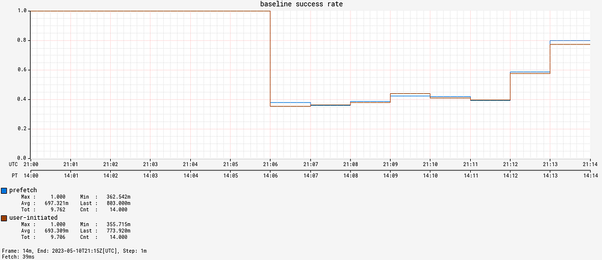
*Baseline — Without prioritized load-shedding. Both pre-fetch and user-initiated see an equal drop in availability*

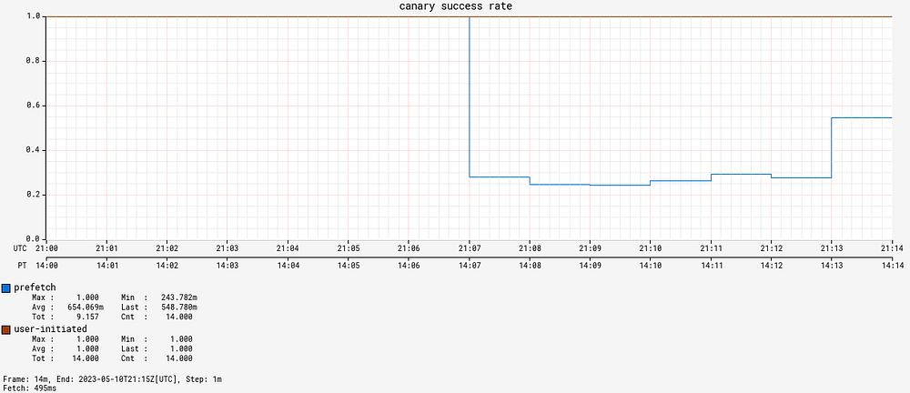
*Canary — With prioritized load-shedding. Only pre-fetch availability drops while user-initiated availability stays at 100%*

Without prioritized load-shedding, both user-initiated and prefetch availability drop when latency is injected. However, after adding prioritized load-shedding, user-initiated requests maintain a 100% availability and only prefetch requests are throttled.

We were ready to roll this out to production and see how it performed in the wild!

### Real-World Application and Results

Netflix engineers work hard to keep our systems available, and it was a while before we had a production incident that tested the efficacy of our solution. A few months after deploying prioritized load shedding, we had an infrastructure outage at Netflix that impacted streaming for many of our users. Once the outage was fixed, we got a 12x spike in pre-fetch requests per second from Android devices, presumably because there was a backlog of queued requests built up.

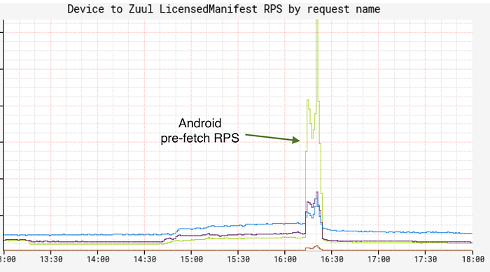
*Spike in Android pre-fetch RPS*

This could have resulted in a second outage as our systems weren’t scaled to handle this traffic spike. Did prioritized load-shedding in PlayAPI help us here?

Yes! While the availability for prefetch requests dropped as low as 20%, the availability for user-initiated requests was > 99.4% due to prioritized load-shedding.

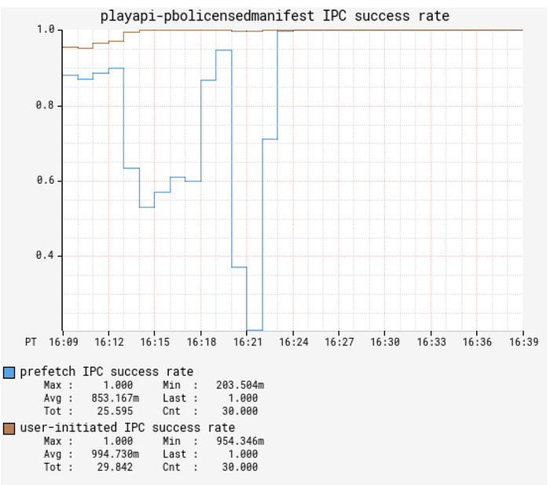
*Availability of pre-fetch and user-initiated requests*

At one point we were throttling more than 50% of all requests but the availability of user-initiated requests continued to be > 99.4%.

## Generic service work prioritization

Based on the success of this approach, we have created an internal library to enable services to perform prioritized load shedding based on pluggable utilization measures, with multiple priority levels.

Unlike API gateway, which needs to handle a large volume of requests with varying priorities, most microservices typically receive requests with only a few distinct priorities. To maintain consistency across different services, we have introduced four predefined priority buckets inspired by the [Linux tc-prio levels](https://linux.die.net/man/8/tc-prio):

- **CRITICAL**: Affect core functionality — These will never be shed if we are not in complete failure.
- **DEGRADED**: Affect user experience — These will be progressively shed as the load increases.
- **BEST_EFFORT**: Do not affect the user — These will be responded to in a best effort fashion and may be shed progressively in normal operation.
- **BULK**: Background work, expect these to be routinely shed.

Services can either choose the upstream client’s priority _or_ map incoming requests to one of these priority buckets by examining various request attributes, such as HTTP headers or the request body, for more precise control. Here is an example of how services can map requests to priority buckets:

```
ResourceLimiterRequestPriorityProvider requestPriorityProvider() {
    return contextProvider -> {
        if (contextProvider.getRequest().isCritical()) {
              return PriorityBucket.CRITICAL;
          } else if (contextProvider.getRequest().isHighPriority()) {
              return PriorityBucket.DEGRADED;
          } else if (contextProvider.getRequest().isMediumPriority()) {
              return PriorityBucket.BEST_EFFORT;
          } else {
              return PriorityBucket.BULK;
          }
        };
    }
```

### Generic CPU based load-shedding

Most services at Netflix autoscale on CPU utilization, so it is a natural measure of system load to tie into the prioritized load shedding framework. Once a request is mapped to a priority bucket, services can determine when to shed traffic from a particular bucket based on CPU utilization. In order to maintain the signal to autoscaling that scaling is needed, prioritized shedding only starts shedding load _after_ hitting the target CPU utilization, and as system load increases, more critical traffic is progressively shed in an attempt to maintain user experience.

For example, if a cluster targets a 60% CPU utilization for auto-scaling, it can be configured to start shedding requests when the CPU utilization exceeds this threshold. When a traffic spike causes the cluster’s CPU utilization to significantly surpass this threshold, it will gradually shed low-priority traffic to conserve resources for high-priority traffic. This approach also allows more time **for auto-scaling to add additional instances to the cluster**. Once more instances are added, CPU utilization will decrease, and low-priority traffic will resume being served normally.

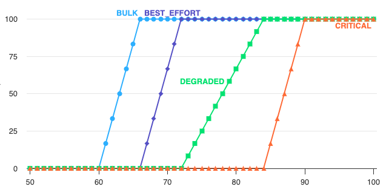
*Percentage of requests (Y-axis) being load-shed based on CPU utilization (X-axis) for different priority buckets*

### Experiments with CPU based load-shedding

We ran a series of experiments sending a large request volume at a service which normally targets 45% CPU for auto scaling but which was prevented from scaling up for the purpose of monitoring CPU load shedding under extreme load conditions. **The instances were configured to shed noncritical traffic after 60% CPU and critical traffic after 80%.**

As RPS was dialed up past 6x the autoscale volume, the service was able to shed first noncritical and then critical requests. Latency remained within reasonable limits throughout, and successful RPS throughput remained stable.

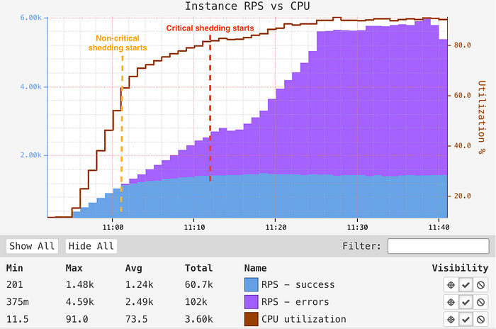
*Experimental behavior of CPU based load-shedding using synthetic traffic.*

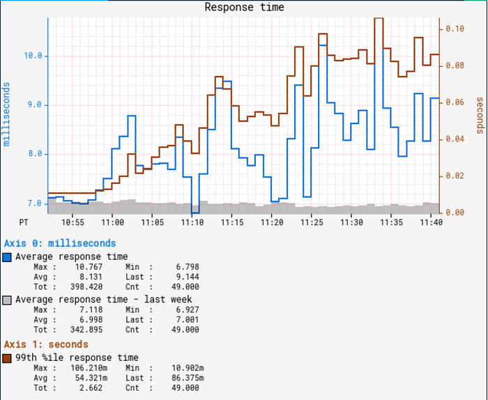
*P99 latency stayed within a reasonable range throughout the experiment, even as RPS surpassed 6x the autoscale target.*

### Anti-patterns with load-shedding

**Anti-pattern 1 — No shedding**

In the above graphs, the limiter does a good job keeping latency low for the successful requests. If there was no shedding here, we’d see latency increase for all requests, instead of a fast failure in some requests that can be retried. Further, this can result in a death spiral where one instance becomes unhealthy, resulting in more load on other instances, resulting in all instances becoming unhealthy before auto-scaling can kick in.

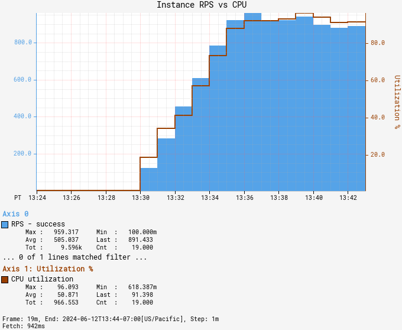

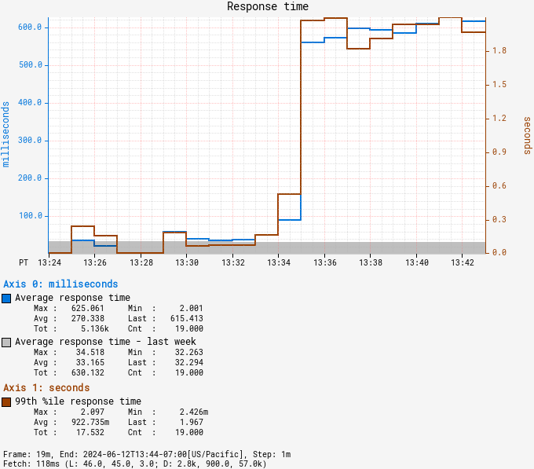
*No load-shedding: In the absence of load-shedding, increased latency can degrade all requests instead of rejecting some requests (that can be retried), and can make instances unhealthy*

**Anti-pattern 2 — Congestive failure**

Another anti-pattern to watch out for is congestive failure or shedding too aggressively. If the load-shedding is due to an increase in traffic, the successful RPS should not drop after load-shedding. Here is an example of what congestive failure looks like:


*Congestive failure: After 16:57, the service starts rejecting most requests and is not able to sustain a successful 240 RPS that it was before load-shedding kicked in. This can be seen in fixed concurrency limiters or when load-shedding consumes too much CPU preventing any other work from being done*

We can see in the **Experiments with CPU based load-shedding** section above that our load-shedding implementation avoids both these anti-patterns by keeping latency low and sustaining as much successful RPS during load-shedding as before.

## Generic IO based load-shedding

Some services are not CPU-bound but instead are IO-bound by backing services or datastores that can apply back pressure via increased latency when they are overloaded either in compute or in storage capacity. For these services we re-use the prioritized load shedding techniques, but we introduce new utilization measures to feed into the shedding logic. Our initial implementation supports two forms of latency based shedding in addition to standard adaptive concurrency limiters (themselves a measure of average latency):

1. The service can specify per-endpoint target and maximum latencies, which allow the service to shed when the service is abnormally slow regardless of backend.
2. The Netflix storage services running on the [Data Gateway](https://netflixtechblog.medium.com/data-gateway-a-platform-for-growing-and-protecting-the-data-tier-f1ed8db8f5c6) return observed storage target and max latency SLO utilization, allowing services to shed when they overload their allocated storage capacity.

These utilization measures provide early warning signs that a service is generating too much load to a backend, and allow it to shed low priority work before it overwhelms that backend. The main advantage of these techniques over concurrency limits alone is they require less tuning as our services already must maintain tight latency service-level-objectives (SLOs), for example a p50 < 10ms and p100 < 500ms. So, rephrasing these existing SLOs as utilizations allows us to shed low priority work early to prevent further latency impact to high priority work. At the same time, the system _will accept as much work as it can_ while maintaining SLO’s.

To create these utilization measures, we count how many requests are processed _slower_ than our target and maximum latency objectives, and emit the percentage of requests failing to meet those latency goals. For example, our KeyValue storage service offers a 10ms target with 500ms max latency for each namespace, and all clients receive utilization measures per data namespace to feed into their prioritized load shedding. These measures look like:

```
utilization(namespace) = {
  overall = 12
  latency = {
    slo_target = 12,
    slo_max = 0
  }
  system = {
    storage = 17,
    compute = 10,
  }
}
```

In this case, 12% of requests are slower than the 10ms target, 0% are slower than the 500ms max latency (timeout), and 17% of allocated storage is utilized. Different use cases consult different utilizations in their prioritized shedding, for example batches that write data daily may get shed when system storage utilization is approaching capacity as writing more data would create further instability.

An example where the latency utilization is useful is for one of our critical file origin services which accepts writes of new files in the AWS cloud and acts as an origin (serves reads) for those files to our Open Connect CDN infrastructure. Writes are the most critical and should never be shed by the service, but when the backing datastore is getting overloaded, it is reasonable to progressively shed reads to files which are less critical to the CDN as it can retry those reads and they do not affect the product experience.

To achieve this goal, the origin service configured a KeyValue latency based limiter that starts shedding reads to files which are less critical to the CDN when the datastore reports a target latency utilization exceeding 40%. We then stress tested the system by generating over 50Gbps of read traffic, some of it to high priority files and some of it to low priority files:

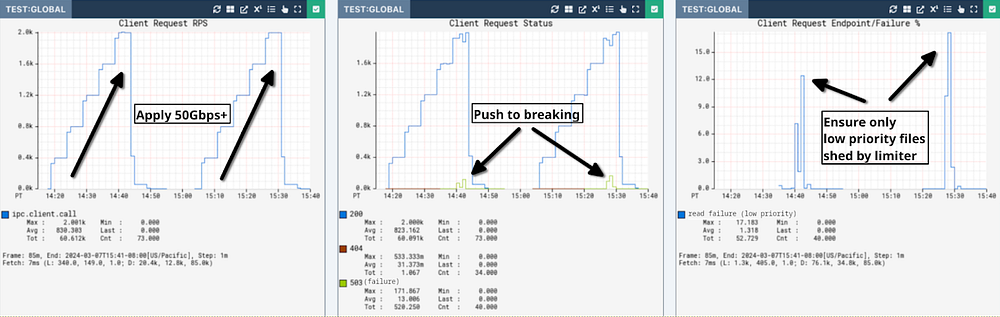

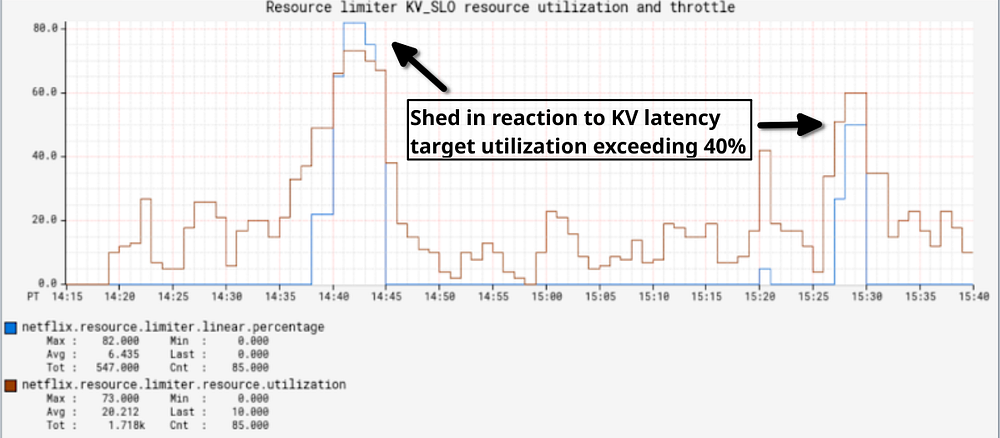

In this test, there are a nominal number of critical writes and a high number of reads to both low and high priority files. In the top-left graph we ramp to 2000 read/second of ~4MiB files until we can trigger overload of the backend store at over 50Gbps in the top-center graph. When that happens, the top-right graph shows that even under significant load, the origin _only_ sheds low priority read work to preserve high-priority writes and reads. Before this change when we hit breaking points, critical writes _and_ reads would fail along with low priority reads. During this test the CPU load of the file serving service was nominal (<10%), so in this case only IO based limiters are able to protect the system. It is also important to note that the origin will serve more traffic as long as the backing datastore continues accepting it with low latency, preventing the problems we had with concurrency limits in the past where they would either shed too early when nothing was actually wrong or too late when we had entered congestive failure.

## Conclusion and Future Directions

The implementation of service-level prioritized load shedding has proven to be a significant step forward in maintaining high availability and excellent user experience for Netflix customers, even during unexpected system stress.

Stay tuned for more updates as we innovate to keep your favorite shows streaming smoothly, no matter what SLO busters lie in wait.

## Acknowledgements

We would like to acknowledge the many members of the Netflix consumer product, platform, and open connect teams who have designed, implemented, and tested these prioritization techniques. In particular: [Xiaomei Liu](https://www.linkedin.com/in/xiaomei-liu-b475711), [Raj Ummadisetty](https://www.linkedin.com/in/rummadis), [Shyam Gala](https://www.linkedin.com/in/shyam-gala-5891224/), [Justin Guerra](https://www.linkedin.com/in/justin-guerra-3282262b), [William Schor](https://www.linkedin.com/in/william-schor), [Tony Ghita](https://www.linkedin.com/in/tonyghita) et al.

---
**Tags:** Distributed Systems · Reliability · Netflix · Load Shedding · Chaos Engineering
