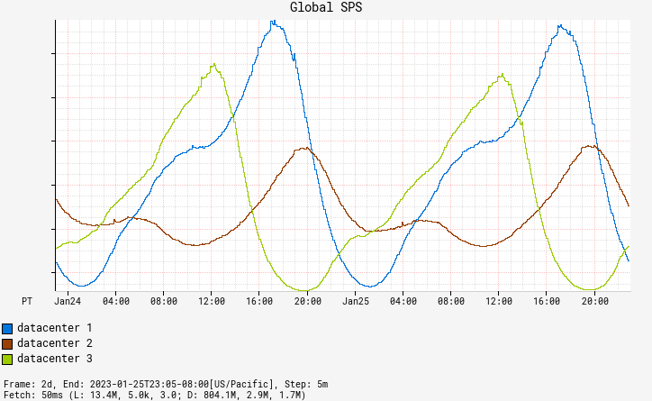
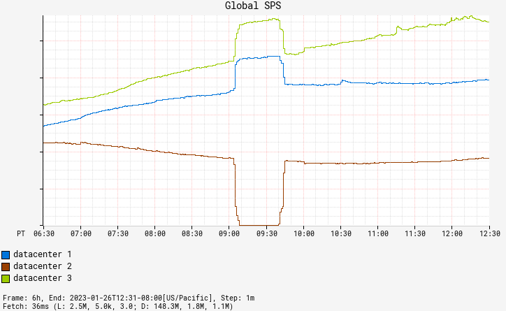
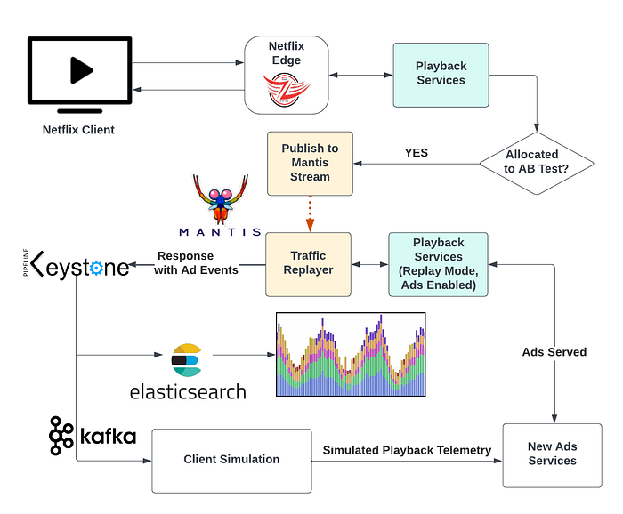

# Ensuring the Successful Launch of Ads on Netflix

By [Jose Fernandez](https://www.linkedin.com/in/josefernandezmn/), [Ed Barker](https://www.linkedin.com/in/edhbarker/), [Hank Jacobs](https://www.linkedin.com/in/hajacobs/)

## Introduction

In November 2022, we introduced a brand new tier — [_Basic with ads_](https://about.netflix.com/en/news/announcing-basic-with-ads-us). This tier extended existing infrastructure by adding new backend components and a new remote call to our ads partner on the playback path. As we were gearing up for launch, we wanted to ensure it would go as smoothly as possible. To do this, we devised a novel way to simulate the projected traffic weeks ahead of launch by building upon the traffic migration framework described [here](./migrating-critical-traffic-at-scale-with-no-downtime-part-1-ba1c7a1c7835.md). We used this simulation to help us surface problems of scale and validate our Ads algorithms.

_Basic with ads_ was launched worldwide on November 3rd. In this blog post, we’ll discuss the methods we used to ensure a successful launch, including:

- How we tested the system
- Netflix technologies involved
- Best practices we developed

## Realistic Test Traffic

Netflix traffic ebbs and flows throughout the day in a sinusoidal pattern. New content or national events may drive brief spikes, but, by and large, traffic is usually smoothly increasing or decreasing. An exception to this trend is when we redirect traffic between AWS data centers during regional evacuations, which leads to sudden spikes in traffic in multiple regions. Region evacuations can occur at any time, for a variety of reasons.

*Fig. 1: Traffic Patterns*

While evaluating options to test anticipated load and evaluate our ad selection algorithms at scale, we realized that mimicking member viewing behavior in combination with the seasonality of our organic traffic with abrupt regional shifts were important requirements. Replaying real traffic and making it appear as _Basic with ads_ traffic was a better solution than artificially simulating Netflix traffic. ****Replay traffic enabled us to test our new systems and algorithms at scale before launch, while also making the traffic as realistic as possible********.****

## The Setup

A key objective of this initiative was to ensure that our customers were not impacted. We used member viewing habits to drive the simulation, but customers did not see any ads as a result. Achieving this goal required extensive planning and implementation of measures to isolate the replay traffic environment from the production environment.

Netflix’s data science team provided projections of what the _Basic with ads_ subscriber count would look like a month after launch. We used this information to simulate a subscriber population through our [AB testing platform](https://netflixtechblog.com/its-all-a-bout-testing-the-netflix-experimentation-platform-4e1ca458c15). When traffic matching our AB test criteria arrived at our playback services, we stored copies of those requests in a [Mantis stream](https://netflixtechblog.com/stream-processing-with-mantis-78af913f51a6).

Next, we launched a Mantis job that processed all requests in the stream and replayed them in a duplicate production environment created for replay traffic. We set the services in this environment to “replay traffic” mode, which meant that they did not alter state and were programmed to treat the request as being on the ads plan, which activated the components of the ads system.

The replay traffic environment generated responses containing a standard playback manifest, a JSON document containing all the necessary information for a Netflix device to start playback. It also included metadata about ads, such as ad placement and impression-tracking events. We stored these responses in a [Keystone stream](https://netflixtechblog.com/keystone-real-time-stream-processing-platform-a3ee651812a) with outputs for Kafka and Elasticsearch. A Kafka consumer retrieved the playback manifests with ad metadata and simulated a device playing the content and triggering the impression-tracking events. We used Elasticsearch dashboards to analyze results.

**Ultimately, we accurately simulated the projected _Basic with ads_ traffic weeks ahead of the launch date.**

*Fig. 2: The Traffic Replay Setup*

## The Rollout

To fully replay the traffic, we first validated the idea with a small percentage of traffic. The [Mantis query language](https://netflix.github.io/mantis/develop/querying/mql/) allowed us to set the percentage of replay traffic to process. We informed our engineering and business partners, including customer support, about the experiment and ramped up traffic incrementally while monitoring the success and error metrics through [Lumen dashboards](./lumen-custom-self-service-dashboarding-for-netflix-8c56b541548c.md). We continued ramping up and eventually reached 100% replay. At this point we felt confident to run the replay traffic 24/7.

To validate handling traffic spikes caused by regional evacuations, we utilized Netflix’s region evacuation exercises which are scheduled regularly. By coordinating with the team in charge of region evacuations and aligning with their calendar, we validated our system and third-party touchpoints at 100% replay traffic during these exercises.

We also constructed and checked our ad monitoring and alerting system during this period. Having representative data allowed us to be more confident in our alerting thresholds. The ads team also made necessary modifications to the algorithms to achieve the desired business outcomes for launch.

Finally, we conducted chaos experiments using the [ChAP experimentation platform](https://netflixtechblog.com/chap-chaos-automation-platform-53e6d528371f). This allowed us to validate our fallback logic and our new systems under failure scenarios. By intentionally introducing failure into the simulation, we were able to identify points of weakness and make the necessary improvements to ensure that our ads systems were resilient and able to handle unexpected events.

**The availability of replay traffic 24/7 enabled us to refine our systems and boost our launch confidence, reducing stress levels for the team.**

## Takeaways

The above summarizes three months of hard work by a tiger team consisting of representatives from various backend teams and [Netflix’s centralized SRE team](./keeping-customers-streaming-the-centralized-site-reliability-practice-at-netflix-205cc37aa9fb.md). This work helped ensure **a successful launch of the _Basic with ads_** tier on November 3rd.

To briefly recap, here are a few of the things that we took away from this journey:

- Accurately simulating real traffic helps build confidence in new systems and algorithms more quickly.
- Large scale testing using representative traffic helps to uncover bugs and operational surprises.
- Replay traffic has other applications outside of load testing that can be leveraged to build new products and features at Netflix.

## What’s Next

Replay traffic at Netflix has numerous applications, one of which has proven to be a valuable tool for development and launch readiness. The Resilience team is streamlining this simulation strategy by integrating it into the [CHAP experimentation platform](https://netflixtechblog.com/chap-chaos-automation-platform-53e6d528371f), making it accessible for all development teams without the need for extensive infrastructure setup. Keep an eye out for updates on this.

---
**Tags:** Distributed Systems · Reliability · Netflix · Sre · Load Testing
