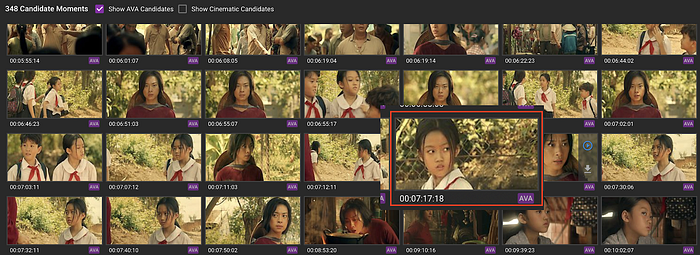
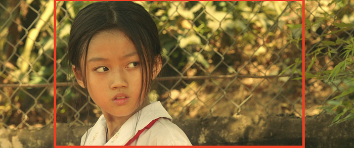
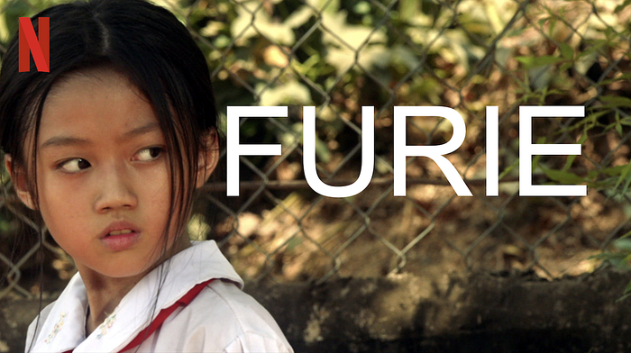
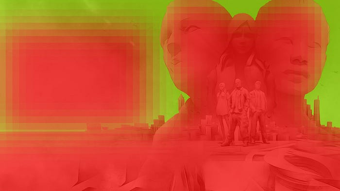
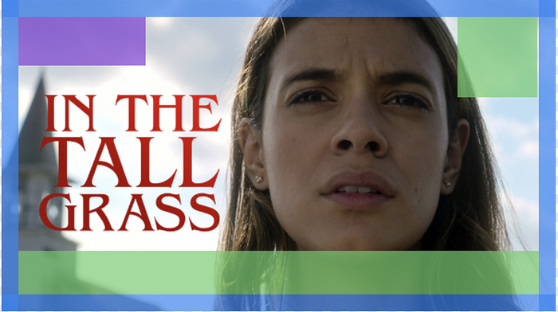
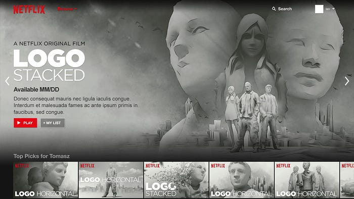
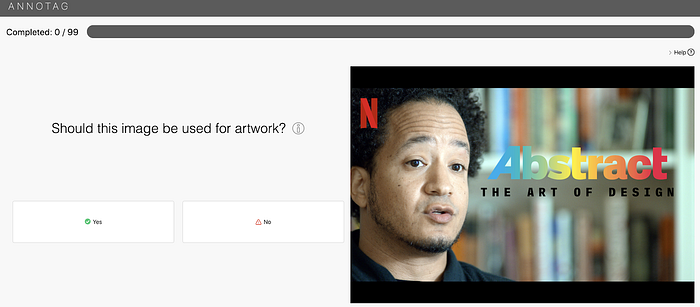
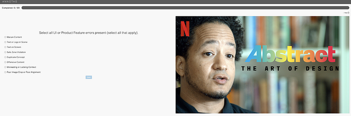
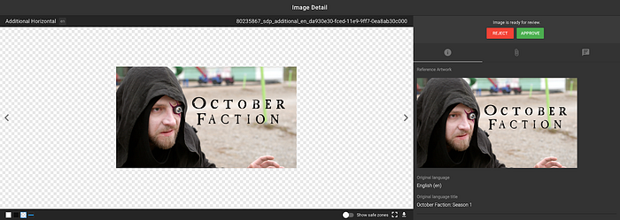
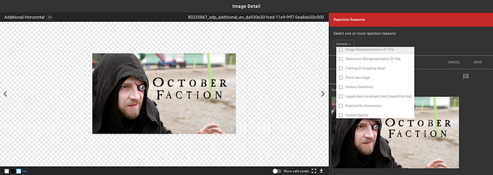

# Essential Suite — Artwork Producer Assistant

By: [Hamid Shahid](https://www.linkedin.com/in/hamidshahid/) & [Syed Haq](https://www.linkedin.com/in/syedfhaq/)

## Introduction

Netflix continues to invest in content for a global audience with a diverse range of unique tastes and interests. Correspondingly, the member experience must also evolve to connect this global audience to the content that most appeals to each of them. Images that represent titles on Netflix (what we at Netflix call “_artwork”_) have [proven](https://media.netflix.com/en/company-blog/the-power-of-a-picture) to be one of the most effective ways to help our members discover the content they love to watch. We thus need to have a rich and diverse set of artwork that is tailored for different parts of the Netflix experience (what we call _product canvases_). We also need to source multiple images for each title representing different themes so we can present an image that is [relevant](https://medium.com/netflix-techblog/artwork-personalization-c589f074ad76) to each member’s taste.

Manual curation and review of these high quality images from scratch for a growing catalog of titles can be particularly challenging for our _Product Creative Strategy Producers_ (referred to as _producers_ in the rest of the article). Below, we discuss how we’ve built upon our previous work of [harvesting static images directly from video source files](https://medium.com/netflix-techblog/ava-the-art-and-science-of-image-discovery-at-netflix-a442f163af6) and our computer vision algorithms to produce a set of artwork candidates that covers the major product canvases for the entire content catalog. The artwork generated by this pipeline is used to augment the artwork typically sourced from design agencies. We call this suite of assisted artwork “The Essential Suite”.

## Supplement, not replace

Producers from our Creative Production team are the ultimate decision makers when it comes to the selection of artwork that gets published for each title. Our usage of computer vision to generate artwork candidates from video sources thus is focussed on alleviating the workload for our Creative Production team. The team would rather spend its time on creative and strategic tasks rather than sifting through thousands of frames of a show looking for the most compelling ones. With the “Essential Suite”, we are providing an additional tool in the producers toolkit. Through testing we have learned that with proper checks and human curation in place, assisted artwork candidates can perform on par with agency designed artwork.

## Design Agencies

Netflix uses best-in-class design agencies to provide artwork that can be used to promote titles on and off the Netflix service. Netflix producers work closely with design agencies to request, review and approve artwork. All artwork is delivered through a web application made available to the design agencies.

The computer generated artwork can be considered as artwork provided by an “Internal agency”. The idea is to generate artwork candidates using video source files and “bubble it up” to the producers on the same artwork portal where they review all other artwork, ideally without knowing if it is an agency produced or internally curated artwork, thereby selecting what goes on product purely based on creative quality of the image.

## Assisted Artwork Generation Workflow

The artwork generation process involves several steps, starting with the arrival of the video source files and culminating in generated artwork being made available to producers. We use an open source workflow engine [Netflix Conductor](https://medium.com/netflix-techblog/netflix-conductor-a-microservices-orchestrator-2e8d4771bf40) to run the orchestration. The whole process can be divided into two parts

1. Generation
2. Review

## 1. Generation

This article on [AVA](https://medium.com/netflix-techblog/ava-the-art-and-science-of-image-discovery-at-netflix-a442f163af6) provides a good explanation on our technology to extract interesting images from video source files. The artwork generation workflow takes it a step further. For a given product canvas, it selects a handful of images from the hundreds of video stills most suitable for that particular product canvas. The workflow then crops and color-corrects the selected image, picks out the best spot to place the movie’s title based on negative space, selects and resizes the movie title and places it onto the image.

Here is an illustration of what it means if we had to do it manually

*a. Image selection*

*b. Identify areas of interest*

*c. Cropped, color-corrected & title placed in the negative space*

**Image Selection / Analyze Image**

Selection of the right still image is essential to generating good quality artwork. A lot of work has already been done in AVA to extract out a few hundreds of frames from hundreds of thousands of frames present in a typical video source. Broadly speaking, we use two methods to extract movie stills out of video source.

1. AVA — Ava is primarily a character based algorithm. It picks up frames with a clear facial shot taking into account actors, facial expression and shot detection.
2. Cinematics — Cinematics picks up aesthetically pleasing cinematic shots.

The combination of these two approaches produce a few hundred movie stills from a typical video source. For a season, this would be a few hundred shots for each episode. Our work here is to pick up the stills that best work for the desired canvas.

**Both of the above algorithms use a few heatmaps which define what kind of images have proven to be working best in different canvases.** The heatmaps are designed by internal artists who are experienced in designing promotional artwork/posters

*Heatmap for a Billboard*

We make use of meta-information such as the size of desired canvas, the “unsafe regions” and the “regions of interest” to identify what image would serve best. “Unsafe regions” are areas in the image where badges such as Netflix logo, new episodes, etc are placed. “Regions of interest” are areas that are always displayed in multi-purpose canvases. These details are stored as metadata for each canvas type and passed to the algorithm by the workflow. Some of our canvases are cropped dynamically for different user interfaces. For such images, the “Regions of interest” will be the area that is always displayed in each crop.

*Unsafe regions*

This data-driven approach allows for fast turnaround for additional canvases. While selecting images, the algorithms also returns back suggested coordinates within each image for cropping and title placement. Finally, it associates a “score” with the selected image. This score is the “confidence” that the algorithm has on the selection of candidate image on how well it could perform on service, based on previously collected stats.

**Image Creation**

The artwork generation workflow collates image selection results from each video source and picks up the top “n” images based on confidence score.

The selected image is then cropped and color-corrected based on coordinates passed by the algorithm. Some canvases also need the movie title to be placed on the image. The process makes use of the heatmap provided by our designers to perform cropping and title placement. As an example, the “Billboard” canvas shown on a movie’s landing page is right aligned, with the title and synopsis shown on the left.

*Billboard Canvas*

The workers to crop and color correct images are made available as separate [titus jobs](https://medium.com/netflix-techblog/titus-the-netflix-container-management-platform-is-now-open-source-f868c9fb5436). The workflow invokes the jobs, storing each output in the artwork asset management system and passes it on for review.

## 2. Review

For each artwork candidate generated by the workflow, we want to get as much feedback as possible from the Creative Production team because they have the most context about the title. However, getting producers to provide feedback on hundreds of generated images is not scalable. For this reason, we have split the review process in two rounds.

**Technical Quality Control (QC)**

This round of review enables filtering out images that look obviously wrong to a human eye. Images with features such as human actors with an open mouth, inappropriate facial expressions or an incorrect body position, etc are filtered out in this round.

For the purpose of reviewing these images, we use a video/image annotation application that provides a simple interface to add tags for a given list of videos or images. For our purposes, for each image, we ask the very basic question “Should this image be used for artwork?”

The team reviewing these assets treat each image individually and only look for technical aspects of the image, regardless of the theme or genre of the title, or the quantity of images presented for a given title.

When an image is rejected, a few follow up questions are asked to ascertain why the image is not suitable to be used as artwork.

All this review data is fed back to the image selection, cropping and color corrections algorithms to train and improve them.

**Editorial QC**

Unlike technical QC, which is title agnostic, editorial QC is done by producers who are deeply familiar with the themes, storylines and characters in the title, to select artwork that will represent the title best on the Netflix service.

The application used to review generated artwork is the same application that producers use to place and review artwork requests fulfilled by design agencies. A screenshot of how generated artwork is presented to producers is shown below

Similar to technical QC, the option here for each artwork is whether to approve or reject the artwork. The producers are encouraged to provide reasons why they are rejecting an artwork.

Approved artwork makes its way to the artwork’s asset management system, where it resides alongside other agency-fulfilled artwork. From here, producers have the ability to publish it to the Netflix service.

## Conclusion

We have learned a lot from our work on generating artwork. Artwork that looks good might not be the best depiction of the title’s story, a very clear character image might be a content spoiler. All of these decisions are best made by humans and we intend to keep it that way.

However, assisted artwork generation has a place in supporting our creative team by providing them with another avenue to pick up their assets from, and with careful supervision will help in their challenge of sourcing artwork at scale.

---
**Tags:** Artwork · Image Classification · Computer Vision · Machine Learning · Workflow
