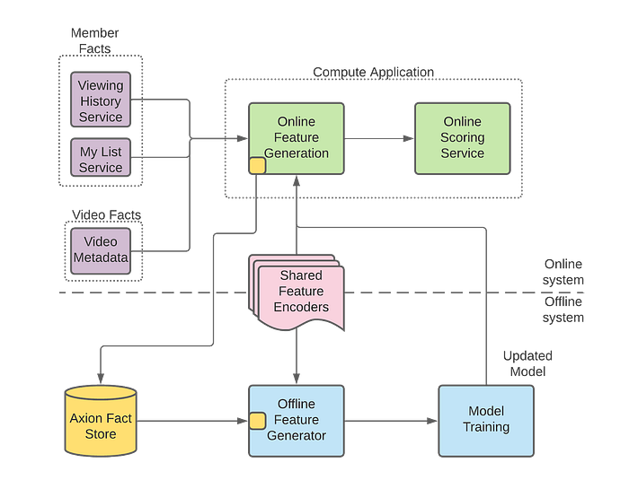
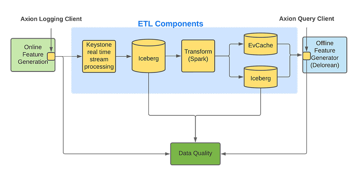

# Evolution of ML Fact Store

by [Vivek Kaushal](https://www.linkedin.com/in/vkaushal21/)

At Netflix, we aim to provide recommendations that match our members’ interests. To achieve this, we rely on Machine Learning (ML) algorithms. ML algorithms can be only as good as the data that we provide to it. This post will focus on the large volume of high-quality data stored in Axion — our fact store that is leveraged to compute ML features offline. We built Axion primarily to remove any training-serving skew and make offline experimentation faster. We will share how its design has evolved over the years and the lessons learned while building it.

## Terminology

Axion fact store is part of our Machine Learning Platform, the platform that serves machine learning needs across Netflix. Figure 1 below shows how Axion interacts with Netflix’s ML platform. The overall ML platform has tens of components, and the diagram below only shows the ones that are relevant to this post. To understand Axion’s design, we need to know the various components that interact with it.

*Figure 1: Netflix ML Architecture*

- **Fact: **A fact is data about our members or videos. An example of data about members is the video they had watched or added to their My List. An example of video data is video metadata, like the length of a video. Time is a critical component of Axion — When we talk about facts, we talk about facts at a moment in time. These facts are managed and made available by services like [viewing history](https://netflixtechblog.com/netflixs-viewing-data-how-we-know-where-you-are-in-house-of-cards-608dd61077da) or video metadata services outside of Axion.
- **Compute application: **These applications generate recommendations for our members. They fetch facts from respective data services, run feature encoders to generate features and score the ML models to eventually generate recommendations.
- **Offline feature generator: **We regenerate the values of the features that were generated for inferencing in the compute application. Offline Feature Generator is a spark application that enables on-demand generation of features using new, existing, or updated feature encoders.
- **Shared feature encoders: **Feature encoders are shared between compute applications and offline feature generators. We make sure there is no training/serving skew by using the same data and the code for online and offline feature generation.

## Motivation

Five years ago, we [posted](https://netflixtechblog.com/distributed-time-travel-for-feature-generation-389cccdd3907) and [talked](https://www.youtube.com/watch?v=DiwKg8KynVU) about the need for a ML fact store. The motivation has not changed since then; the design has. This post focuses on the new design, but here is a summary of why we built this fact store.

Our machine learning models train on several weeks of data. Thus, if we want to run an experiment with a new or modified feature encoder, we need to build several weeks of feature data with this new or modified feature encoder. We have two options to collect features using this updated feature encoder.

The first is to log features from the compute applications, popularly known as feature logging. We can deploy updated feature encoders in our compute applications and then wait for them to log the feature values. Since we train our models on several weeks of data, this method is slow for us as we will have to wait for several weeks for the data collection.

An alternative to feature logging is to regenerate the features with updated feature encoders. If we can access the historical facts, we can regenerate the features using updated feature encoders. Regeneration takes hours compared to weeks taken by the feature logging. Thus, we decided to go this route and started storing facts to reduce the time it takes to run an experiment with new or modified features.

## Design evolution

Axion fact store has four components — fact logging client, ETL, query client, and data quality infrastructure. We will describe how the design evolved in these components.

## Evolution of Fact Logging Client

Compute applications access facts (members’ viewing history, their likes and my list information, etc.) from various [grpc services](./practical-api-design-at-netflix-part-1-using-protobuf-fieldmask-35cfdc606518.md) that power the whole Netflix experience. These facts are used to generate features using shared feature encoders, which in turn are used by ML models to generate recommendations. After generating the recommendations, compute applications use Axion’s fact logging client to log these facts.

At a later stage in the offline pipelines, the offline feature generator uses these logged facts to regenerate temporally accurate features. Temporal accuracy, in this context, is the ability to regenerate the exact set of features that were generated for the recommendations. **This temporal accuracy of features is key to removing the training-serving skew.**

The first version of our logger library optimized for storage by deduplicating facts and optimized for network i/o using different compression methods for each fact. Then we started hitting roadblocks while optimizing the query performance. Since we were optimizing at the logging level for storage and performance, we had less data and metadata to play with to optimize the query performance.

Eventually, we decided to simplify the logger. Now we asynchronously collect all the facts and metadata into a protobuf, compress it, and send it to the [keystone messaging service](https://netflixtechblog.com/keystone-real-time-stream-processing-platform-a3ee651812a).

## Evolution of ETL and Query Client

ETL and Query Client are intertwined, as any ETL changes could directly impact the query performance. ETL is the component where we experiment for query performance, improving data quality, and storage optimization. Figure 2 shows components of Axion’s ETL and its interaction with the query client.

*Fig 2: Internal components of Axion*

Axion’s fact logging client logs facts to the [keystone real-time stream processing platform](https://netflixtechblog.com/keystone-real-time-stream-processing-platform-a3ee651812a), which outputs data to an [Iceberg](https://github.com/Netflix/iceberg) table. We use Keystone as it is easy to use, reliable, scalable, and provides aggregation of facts from different cloud regions into a single AWS region. Having all data in a single AWS region exposes us to a single point of failure but it significantly reduces the operational overhead of our ETL pipelines which we believe makes it a worthwhile trade-off. We currently send all the facts into a single Keystone stream which we have configured to write to a single Iceberg table. We plan to split these Keystone streams into multiple streams for horizontal scalability.

The Iceberg table created by Keystone contains large blobs of unstructured data. These large unstructured blogs are not efficient for querying, so we need to transform and store this data in a different format to allow efficient queries. One might think that normalizing it would make storage and querying more efficient, albeit at the cost of writing more complex queries. **Hence, our first approach was to normalize the incoming data and store it in multiple tables. We soon realized that, while space-optimized, it made querying very inefficient for the scale of data we needed to handle. We ran into various shuffle issues in Spark as we were joining several big tables at query time**.

We then decided to denormalize the data and store all facts and metadata in one Iceberg table using nested Parquet format. While storing in one Iceberg table was not as space-optimized, Parquet did provide us with significant savings in storage costs, and most importantly, it made our Spark queries succeed. However, Spark query execution remained slow. Further attempts to optimize query performance, like using bloom filters and predicate pushdown, were successful but still far away from where we wanted it to be.

## Why was querying the single Iceberg table slow?

What’s our end goal? We want to train our ML models to personalize the member experience. We have a plethora of ML models that drive personalization. Each of these models are trained with different datasets and features along with different stratification and objectives. Given that Axion is used as the defacto Fact store for assembling the training dataset for all these models, it is important for Axion to log and store enough facts that would be sufficient for all these models. However, for a given ML model, we only require a subset of the data stored in Axion for its training needs. We saw queries filtering down an input dataset of several hundred million rows to less than a million in extreme cases. Even with bloom filters, the query performance was slow because the query was downloading all of the data from s3 and then dropping it. As our label dataset was also random, presorting facts data also did not help.

We realized that our options with Iceberg were limited if we only needed data for a million rows — out of several hundred million — and we had no additional information to optimize our queries. So we decided not to further optimize joins with the Iceberg data and instead move to an alternate approach.

## Low-latency Queries

To avoid downloading all of the fact data from s3 in a spark executor and then dropping it, we analyzed our query patterns and figured out that there is a way to only access the data that we are interested in. This was achieved by introducing an [EVCache](https://github.com/Netflix/EVCache), a key-value store, which stores facts and indices optimized for these particular query patterns.

Let’s see how the solution works for one of these query patterns — querying by member id. We first query the index by member id to find the keys for the facts of that member and query those facts from EVCache in parallel. So, we make multiple calls to the key-value store for each row in our training set. Even when accounting for these multiple calls, the query performance is an order of magnitude faster than scanning several hundred times more data stored in the Iceberg table. Depending on the use case, EVCache queries can be 3x-50x faster than Iceberg.

The only problem with this approach is that EVCache is more expensive than Iceberg storage, so we need to limit the amount of data stored. So, for the queries that request data not available in EVCache, our only option is to query Iceberg. In the future, we want to store all facts in EVCache by optimizing how we store data in EVCache.

## How do we monitor the quality of data?

Over the years, we learned the importance of having comprehensive data quality checks for our datasets. Corruption in data can significantly impact production model performance and A/B test results. From the ML researchers’ perspective, it doesn’t matter if Axion or a component outside of Axion corrupted the data. When they read the data from Axion, if it is bad, it is a loss of trust in Axion. For Axion to become the defacto fact store for all Personalization ML models, the research teams needed to trust the quality of data stored. Hence, we designed a comprehensive system that monitors the quality of data flowing through Axion to detect corruptions, whether introduced by Axion or outside Axion.

We bucketed data corruptions observed when reading data from Axion on three dimensions:

- The impact on a value in data: Was the value missing? Did a new value appear (unintentionally)? Was the value replaced with a different value?
- The spread of data corruption: Did data corruption have a row or columnar impact? Did the corruption impact one pipeline or multiple ML pipelines?
- The source of data corruption: Was data corrupted by components outside of Axion? Did Axion components corrupt data? Was data corrupted at rest?

We came up with three different approaches to detect data corruption, wherein each approach can detect corruption along multiple dimensions described above.

## Aggregations

Data volume logged to Axion datastore is predictable. Compute applications follow daily trends. Some log consistently every hour, others log for a few hours every day. We aggregate the counts on dimensions like total records, compute application, fact counts etc. Then we use a rule-based approach to validate the counts are within a certain threshold of past trends. Alerts are triggered when counts vary outside these thresholds. These trend-based alerts are helpful with missing or new data; row-level impact, and pipelines impact. They help with column-level impact only on rare occasions.

## Consistent sampling

We sample a small percentage of the data based on a predictable member id hash and store it in separate tables. By consistent sampling across different data stores and pipelines, we can run canaries on this smaller subset and get output quickly. We also compare the output of these canaries against production to detect unintended changes in data during new code deployment. One downside of consistent sampling is that it may not catch rare issues, especially if the rate of data corruption is significantly lower than our sampling rate. Consistent sampling checks help detect attribute impact — new, missing, or replacement; columnar impact, and single pipeline issues.

## Random sampling

While the above two strategies combined can detect most data corruptions, they do occasionally miss. For those rare occasions, we rely on random sampling. We randomly query a subset of the data multiple times every hour. Both hot and cold data, i.e., recently logged data and data logged a while ago, are randomly sampled. We expect these queries to pass without issues. When they fail, it is either due to bad data or issues with the underlying infrastructure. While we think of it as an “I’m feeling lucky” strategy, it does work as long as we read significantly more data than the rate of corrupted data.

Another advantage to random sampling is maintaining the quality of unused facts. Axion users do not read a significant percentage of facts logged to Axion, and we need to make sure that these unused facts are of good quality as they can be used in the future. We have pipelines that randomly read these unused facts and alert when the query does not get the expected output. In terms of impact, these random checks are like winning a lottery — you win occasionally, and you never know how big it is.

## Results from monitoring data quality

We deployed the above three monitoring approaches more than two years ago, and since then, we have identified more than 95% of data issues early. We have also significantly improved the stability of our customer pipelines. If you want to know more about how we monitor data quality in Axion, you can check our [spark summit talk](https://databricks.com/session_na20/an-approach-to-data-quality-for-netflix-personalization-systems) and [this podcast](https://databand.ai/mad-data-podcast/where-should-data-quality-sit-it-depends/).

## Learnings from Axion’s evolution

We learned from designing this fact store to start with a simple design and avoid premature optimizations that add complexity. Pay the storage, network, and compute cost. As the product becomes available to the customers, new use cases will pop up that will be harder to support with a complex design. Once the customers have adopted the product, start looking into optimizations.

While “_keep the design simple_” is a frequently shared learning in software engineering, it is not always easy to achieve. For example, we learned that our fact logging client can be simple with minimal business logic, but our query client needs to be functionality-rich. Our learning is that if we need to add complexity, add it in the least number of components instead of spreading it out.

Another learning is that we should have invested early into a robust testing framework. Unit tests and integration tests only took us so far. We needed scalability testing and performance testing as well. This scalability and performance testing framework helped stabilize the system because, without it, we ran into issues that took us weeks to clean up.

Lastly, we learned that we should run data migrations and push the breaking API changes as soon as possible. As more customers adopt Axion, running data migrations and making breaking API changes are becoming harder and harder.

## Conclusion and future work

Axion is our primary data source that is used extensively by all our [Personalization ML models](https://research.netflix.com/research-area/recommendations) for offline feature generation. Given that it ensures that there is no training/serving skew and that it has significantly reduced offline feature generation latencies we are now starting to make it the defacto Fact store for other ML use cases within Netflix.

We do have use cases that are not served well with the current design, like bandits, because our current design limits storing a map per row creating a limitation when a compute application needs to log multiple values for the same key. Also, as described in the design, we want to optimize how we store data in EVCache to enable us to store more data.

If you are interested in working on similar challenges, [join us](https://jobs.netflix.com/search).
