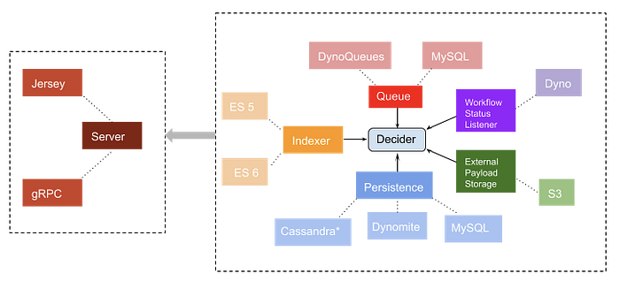
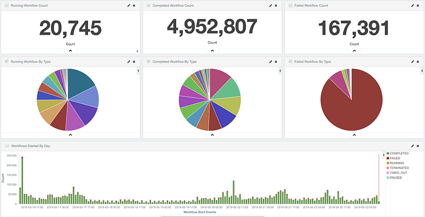

# Evolution of Netflix Conductor:

> v2.0 and beyond

By [Anoop Panicker](https://www.linkedin.com/in/anoop-panicker/) and [Kishore Banala](https://www.linkedin.com/in/kishore-banala/)

Conductor is a workflow orchestration engine developed and open-sourced by Netflix. If you’re new to Conductor, this [earlier blogpost](https://medium.com/netflix-techblog/netflix-conductor-a-microservices-orchestrator-2e8d4771bf40) and the [documentation](https://netflix.github.io/conductor/) should help you get started and acclimatized to Conductor.

In the last two years since inception, Conductor has seen wide adoption and is instrumental in running numerous core workflows at Netflix. Many of the Netflix Content and Studio Engineering services rely on Conductor for efficient processing of their business flows. The [Netflix Media Database (NMDB)](https://medium.com/netflix-techblog/implementing-the-netflix-media-database-53b5a840b42a) is one such example.

In this blog, we would like to present the latest updates to Conductor, address some of the frequently asked questions and thank the community for their contributions.

## How we’re using Conductor at Netflix

### Deployment

Conductor is one of the most heavily used services within Content Engineering at Netflix. Of the multitude of modules that can be plugged into Conductor as shown in the image below, we use the Jersey server module, Cassandra for persisting execution data, [Dynomite](https://github.com/Netflix/dynomite) for persisting metadata, [DynoQueues](https://github.com/Netflix/dyno-queues) as the queuing recipe built on top of Dynomite, Elasticsearch as the secondary datastore and indexer, and Netflix [Spectator](http://netflix.github.io/spectator/en/latest/) + [Atlas](https://github.com/Netflix/atlas) for Metrics. **Our cluster size ranges from 12–18 instances of AWS EC2 m4.4xlarge instances, typically running at ~30% capacity**.

** — Cassandra persistence module is a partial implementation.*

We do not maintain an internal fork of Conductor within Netflix. Instead, we use a wrapper that pulls in the latest version of Conductor and adds Netflix infrastructure components and libraries before deployment. This allows us to proactively push changes to the open source version while ensuring that the changes are fully functional and well-tested.

### Adoption

As of writing this blog, Conductor orchestrates 600+ workflow definitions owned by 50+ teams across Netflix. While we’re not (yet) actively measuring the nth percentiles, our production workloads speak for Conductor’s performance. Below is a snapshot of our Kibana dashboard which shows the workflow execution metrics over a typical 7-day period.

*Typical Conductor usage at Netflix over a 7 day period.*

### Use Cases

Some of the use cases served by Conductor at Netflix can be categorized under:

- Content Ingest and Delivery
- Content Quality Control
- Content Localization
- Encodes and Deployments
- IMF Deliveries
- Marketing Tech
- Studio Engineering

## What’s New

### gRPC Framework

One of the key features in v2.0 was the introduction of the gRPC framework as an alternative/auxiliary to REST. This was contributed by our counterparts at GitHub, thereby strengthening the value of community contributions to Conductor.

### Cassandra Persistence Layer

To enable horizontal scaling of the datastore for large volume of concurrent workflow executions (millions of workflows/day), Cassandra was chosen to provide elastic scaling and meet throughput demands.

### External Payload Storage

External payload storage was implemented to prevent the usage of Conductor as a data persistence system and to reduce the pressure on its backend datastore.

### Dynamic Workflow Executions

For use cases where the need arises to execute a large/arbitrary number of varying workflow definitions or to run a one-time ad hoc workflow for testing or analytical purposes, registering definitions first with the metadata store in order to then execute them only once, adds a lot of additional overhead. The ability to dynamically create and execute workflows removes this friction. This was another great addition that stemmed from our collaboration with GitHub.

### Workflow Status Listener

Conductor can be configured to publish notifications to external systems or queues upon completion/termination of workflows. The workflow status listener provides [hooks](https://netflix.github.io/conductor/extend/#workflow-status-listener) to connect to any notification system of your choice. The community has contributed an [implementation](https://github.com/Netflix/conductor/blob/master/contribs/src/main/java/com/netflix/conductor/contribs/listener/DynoQueueStatusPublisher.java) that publishes a message on a dyno queue based on the status of the workflow. An event handler can be configured on these queues to trigger workflows or tasks to perform specific actions upon the terminal state of the workflow.

### Bulk Workflow Management

There has always been a need for bulk operations at the workflow level from an operability standpoint. When running at scale, it becomes essential to perform workflow level operations in bulk due to bad downstream dependencies in the worker processes causing task failures or bad task executions. Bulk APIs enable the operators to have macro-level control on the workflows executing within the system.

### Decoupling Elasticsearch from Persistence

This inter-dependency was removed by moving the indexing layer into separate persistence modules, exposing a property (_workflow.elasticsearch.instanceType_) to choose the type of indexing engine. Further, the indexer and persistence layer have been decoupled by moving this orchestration from within the primary persistence layer to a service layer through the ExecutionDAOFacade.

### ES5/6 Support

Support for Elasticsearch versions 5 and 6 have been added as part of the major version upgrade to v2.x. This addition also provides the option to use the Elasticsearch RestClient instead of the Transport Client which was enforced in the previous version. This opens the route to using a managed Elasticsearch cluster (a la AWS) as part of the Conductor deployment.

### Task Rate Limiting & Concurrent Execution Limits

Task rate limiting helps achieve bounded scheduling of tasks. The task definition parameter _rateLimitFrequencyInSeconds_ sets the duration window, while _rateLimitPerFrequency_ defines the number of tasks that can be scheduled in a duration window. On the other hand, _concurrentExecLimit_ provides unbounded scheduling limits of tasks. I.e the total of current scheduled tasks at any given time will be under _concurrentExecLimit_. The above parameters can be used in tandem to achieve desired throttling and rate limiting.

### API Validations

Validation was one of the core features missing in Conductor 1.x. To improve usability and operability, we added validations, which in practice has greatly helped find bugs during creation of workflow and task definitions. Validations enforce the user to create and register their task definitions before registering the workflow definitions using these tasks. It also ensures that the workflow definition is well-formed with correct wiring of inputs and outputs in the various tasks within the workflow. Any anomalies found are reported to the user with a detailed error message describing the reason for failure.

### Developer Labs, Logging and Metrics

We have been continually improving logging and metrics, and revamped the documentation to reflect the latest state of Conductor. To provide a smooth on boarding experience, we have created developer labs, which guides the user through creating task and workflow definitions, managing a workflow lifecycle, configuring advanced workflows with eventing etc., and a brief introduction to Conductor API, UI and other modules.

### New Task Types

[System tasks](https://netflix.github.io/conductor/configuration/systask/) have proven to be very valuable in defining the Workflow structure and control flow. As such, Conductor 2.x has seen several new additions to System tasks, mostly contributed by the community:

_Lambda_

Lambda Task executes ad-hoc logic at Workflow run-time, using the Nashorn Javascript evaluator engine. Instead of creating workers for simple evaluations, Lambda task enables the user to do this inline using simple Javascript expressions.

_Terminate_

Terminate task is useful when workflow logic should terminate with a given output. For example, if a decision task evaluates to false, and we do not want to execute remaining tasks in the workflow, instead of having a _DECISION_ task with a list of tasks in one case and an empty list in the other, this can scope the decide and terminate workflow execution.

_ExclusiveJoin_

Exclusive Join task helps capture task output from a _DECISION_ task’s flow. This is useful to wire task inputs from the outputs of one of the cases within a decision flow. This data will only be available during workflow execution time and the _ExclusiveJoin_ task can be used to collect the output from one of the tasks in any of decision branches.

For in-depth implementation details of the new additions, please refer the [documentation](https://netflix.github.io/conductor/technicaldetails/).

## What’s next

There are a lot of features and enhancements we would like to add to Conductor. The below wish list could be considered as a long-term road map. It is by no means exhaustive, and we are very much welcome to ideas and contributions from the community. Some of these listed in no particular order are:

### Advanced Eventing with Event Aggregation and Distribution

At the moment, event generation and processing is a very simple implementation. An event task can create only one message, and a task can wait for only one event.

We envision an Event Aggregation and Distribution mechanism that would open up Conductor to a multitude of use-cases. A coarse idea is to allow a task to wait for multiple events, and to progress several tasks based on one event.

### UI Improvements

While the current UI provides a neat way to visualize and track workflow executions, we would like to enhance this with features like:

- Creating metadata objects from UI
- Support for starting workflows
- Visualize execution metrics
- Admin dashboard to show outliers

### New Task types like Goto, Loop etc.

Conductor has been using a Directed Acyclic Graph (DAG) structure to define a workflow. The Goto and Loop on tasks are valid use cases, which would deviate from the DAG structure. We would like to add support for these tasks without violating the existing workflow execution rules. This would help unlock several other use cases like streaming flow of data to tasks and others that require repeated execution of a set of tasks within a workflow.

### Support for reusable commonly used tasks like Email, DatabaseQuery etc.

Similarly, we’ve seen the value of shared reusable tasks that does a specific thing. At Netflix internal deployment of Conductor, we’ve added tasks specific to services that users can leverage over recreating the tasks from scratch. For example, we provide a _TitusTask_ which enables our users to launch a new [Titus](https://netflix.github.io/titus/) container as part of their workflow execution.

We would like to extend this idea such that Conductor can offer a repository of commonly used tasks.

### Push based task scheduling interface

Current Conductor architecture is based on polling from a worker to get tasks that it will execute. We need to enhance the grpc modules to leverage the bidirectional channel to push tasks to workers as and when they are scheduled, thus reducing network traffic, load on the server and redundant client calls.

### Validating Task inputKeys and outputKeys

This is to provide type safety for tasks and define a parameterized interface for task definitions such that tasks are completely re-usable within Conductor once registered. This provides a contract allowing the user to browse through available task definitions to use as part of their workflow where the tasks could have been implemented by another team/user. This feature would also involve enhancing the UI to display this contract.

### Implementing MetadataDAO in Cassandra

As mentioned [here](https://github.com/Netflix/conductor/tree/master/cassandra-persistence#note), Cassandra module provides a partial implementation for persisting only the workflow executions. Metadata persistence implementation is not available yet and is something we are looking to add soon.

### Pluggable Notifications on Task completion

Similar to the [Workflow status listener](https://netflix.github.io/conductor/configuration/workflowdef/#workflow-notifications), we would like to provide extensible interfaces for notifications on task execution.

### Python client in Pypi

We have seen wide adoption of Python client within the community. However, there is no official Python client in Pypi, and lacks some of the newer additions to the Java client. We would like to achieve feature parity and publish a client from Conductor Github repository, and automate the client release to Pypi.

### Removing Elasticsearch from critical path

While Elasticsearch is greatly useful in Conductor, we would like to make this optional for users who do not have Elasticsearch set-up. This means removing Elasticsearch from the critical execution path of a workflow and using it as an opt-in layer.

### Pluggable authentication and authorization

Conductor doesn’t support authentication and authorization for API or UI, and is something that we feel would add great value and is a frequent request in the community.

### Validations and Testing

**Dry runs, **i.e the ability to evaluate workflow definitions without actually running it through worker processes and all relevant set-up would make it much easier to test and debug execution paths.

---

If you would like to be a part of the Conductor community and contribute to one of the Wishlist items or something that you think would provide a great value add, please read through this [guide](https://github.com/Netflix/conductor/blob/master/CONTRIBUTING.md) for instructions or feel free to start a conversation on our [Gitter](https://gitter.im/netflix-conductor/community?utm_source=badge&utm_medium=badge&utm_campaign=pr-badge) channel, which is Conductor’s user forum.

We also highly encourage to polish, genericize and share any customizations that you may have built on top of Conductor with the community.

We really appreciate and are extremely proud of the community involvement, who have made several important contributions to Conductor. We would like to take this further and make Conductor widely adopted with a strong community backing.

Netflix Conductor is maintained by the Media Workflow Infrastructure team. If you like the challenges of building distributed systems and are interested in building the Netflix Content and Studio ecosystem at scale, connect with [Charles Zhao](https://www.linkedin.com/in/czhao/) to get the conversation started.

---

_Thanks to Alexandra Pau, Charles Zhao, Falguni Jhaveri, Konstantinos Christidis and Senthil Sayeebaba._

---
**Tags:** Netflix · Netflixoss · Workflow · Workflow Automation · Distributed Systems
