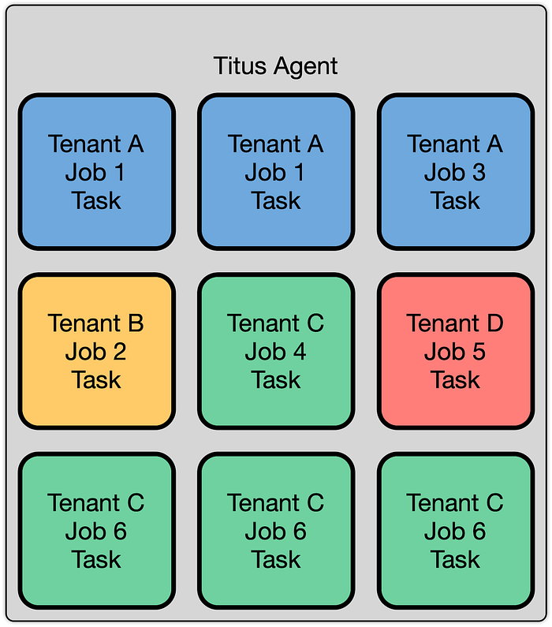
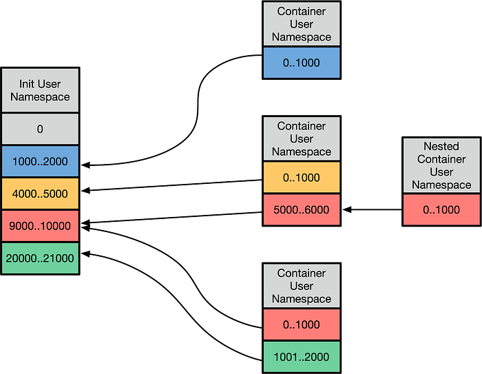
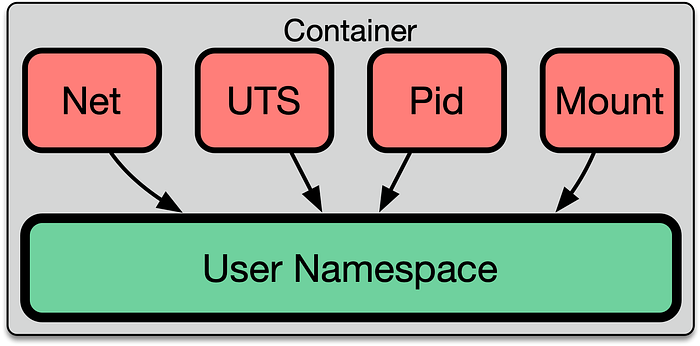
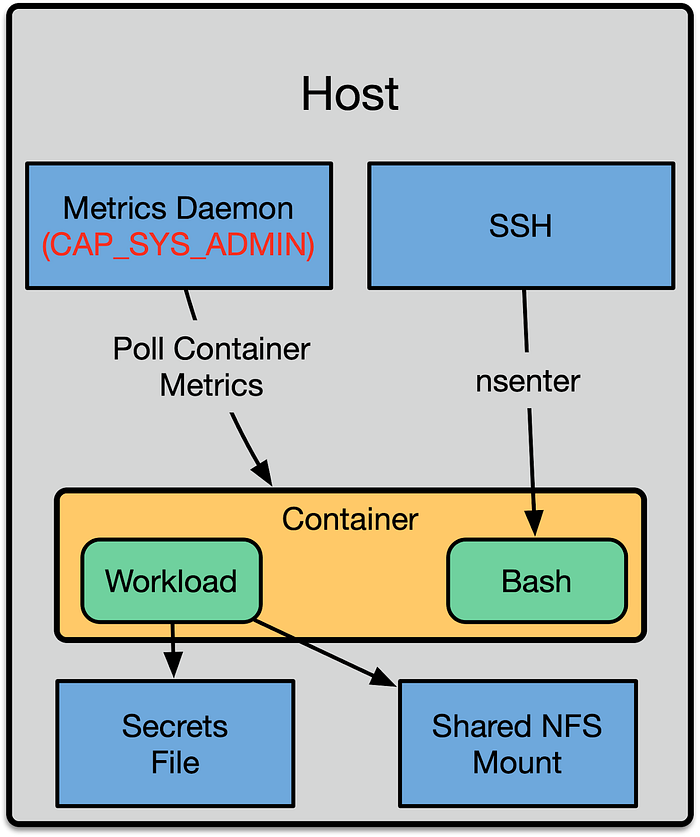
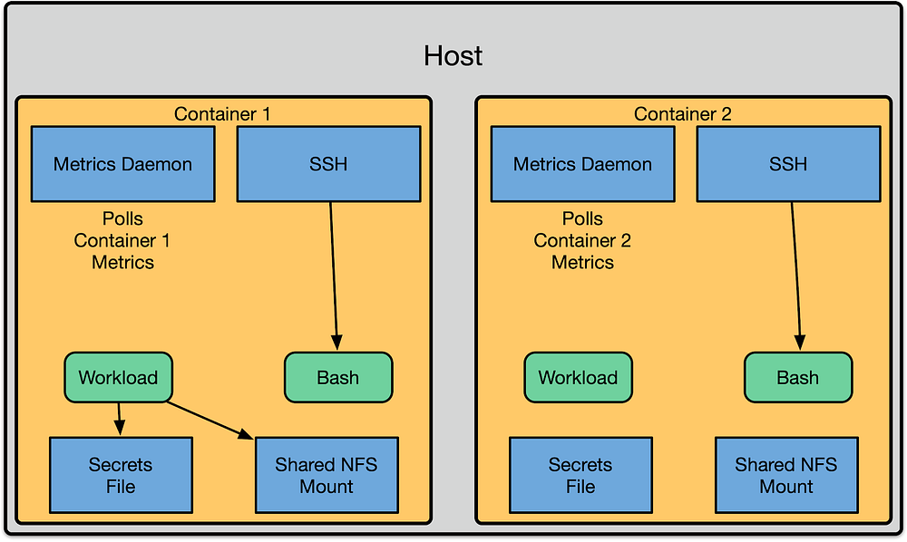

# Evolving Container Security With Linux User Namespaces

By [Fabio Kung](https://twitter.com/fabiokung), [Sargun Dhillon](https://twitter.com/sargun), [Andrew Spyker](https://twitter.com/aspyker), [Kyle Anderson](https://www.xkyle.com/), Rob Gulewich, [Nabil Schear](https://twitter.com/heliousc6), [Andrew Leung](https://twitter.com/anwleung), Daniel Muino, and Manas Alekar

As previously discussed on the Netflix Tech Blog, [Titus](https://netflixtechblog.com/titus-the-netflix-container-management-platform-is-now-open-source-f868c9fb5436) is the Netflix container orchestration system. It runs a wide variety of workloads from various parts of the company — everything from the frontend API for netflix.com, to machine learning training workloads, to video encoders. In Titus, the hosts that workloads run on are abstracted from our users. The Titus platform maintains large pools of homogenous node capacity to run user workloads, and the Titus scheduler places workloads. This abstraction allows the compute team to influence the reliability, efficiency, and operability of the fleet via the scheduler. The hosts that run workloads are called Titus “agents.” In this post, we describe how Titus agents leverage [user namespaces](https://www.man7.org/linux/man-pages/man7/user_namespaces.7.html) to improve the overall security of the Titus agent fleet.

### Titus’s Multi-Tenant Clusters

The Titus agent fleet appears to users as a homogenous pool of capacity. Titus internally employs a cellular [bulkhead architecture](https://docs.aws.amazon.com/wellarchitected/latest/reliability-pillar/use-fault-isolation-to-protect-your-workload.html) for scalability, so the fleet is composed of multiple cells. Many bulkhead architectures partition their cells on tenants, where a tenant is defined as a team and their collection of applications. We do not take this approach, and instead, we **partition our cells to balance ****_load_**. We do this for reliability, scalability, and efficiency reasons.

Titus is a multi-tenant system, allowing multiple teams and users to run workloads on the system, and ensuring they can all co-exist while still providing guarantees about security and performance. Much of this comes down to isolation, which comes in multiple forms. These forms include performance isolation (ensuring workloads do not degrade one another’s performance), capacity isolation (ensuring that a given tenant can acquire resources when they ask for them), fault isolation (ensuring that the failure of a part of the system doesn’t cause the whole system to fail), and security isolation (ensuring that the compromise of one tenant’s workload does not affect the security of other tenants). This post focuses on our approaches to security isolation.

### Secure Multi-tenancy

One of Titus’s biggest concerns with multi-tenancy is security isolation. We want to allow different kinds of containers from different tenants to run on the same instance. Security isolation in containers has been a [contentious](https://blog.jessfraz.com/post/containers-security-and-echo-chambers/) topic. Despite the risks, we’ve chosen to leverage containers as part of our security boundary. To offset the risks brought about by the container security boundary, we employ some additional protections.

The building blocks of multi-tenancy are [Linux namespaces](https://en.wikipedia.org/wiki/Linux_namespaces), the very technology that makes LXC, Docker, and other kinds of containers possible. For example, the PID namespace makes it so that a process can only see PIDs in its own namespace, and therefore cannot send kill signals to random processes on the host. In addition to the default Docker namespaces (mount, network, UTS, IPC, and PID), we employ user namespaces for added layers of isolation. Unfortunately, these default namespace boundaries are not sufficient to prevent container escape, as seen in CVEs like [CVE-2015–2925](https://www.openwall.com/lists/oss-security/2015/04/04/4). These vulnerabilities arise due to the complexity of interactions between namespaces, a large number of historical decisions during kernel development, and leaky abstractions like the proc filesystem in Linux. Composing these security isolation primitives correctly is difficult, so we’ve looked to other layers for additional protection.

Running many different workloads multi-tenant on a host necessitates the prevention lateral movement, a technique in which the attacker compromises a single piece of software running in a container on the system, and uses that to compromise other containers on the same system. To mitigate this, we run containers as unprivileged users — making it so that users cannot use “root.” This is important because, in Linux, UID 0 (or root’s privileges), do not come from the mere fact that the user is root, but from [capabilities](https://man7.org/linux/man-pages/man7/capabilities.7.html). These capabilities are tied to the current process’s credentials. Capabilities can be added via privilege escalation (e.g., sudo, file capabilities) or removed (e.g., setuid, or switching namespaces). Various capabilities control what the root user can do. For example, the CAP_SYS_BOOT capability controls the ability of a given user to reboot the machine. There are also more common capabilities that are granted to users like CAP_NET_RAW, which allows a process the ability to open raw sockets. A user can automatically have capabilities added when they execute specific files via file capabilities. For example, on a stock Ubuntu system, the ping command needs CAP_NET_RAW:

One of the most powerful capabilities in Linux is CAP_SYS_ADMIN, which is effectively equivalent to having superuser access. It gives the user the ability to do everything from mounting arbitrary filesystems, to accessing tracepoints that can expose vital information about the Linux kernel. Other powerful capabilities include CAP_CHOWN and CAP_DAC_OVERRIDE, which grant the capability to manipulate file permissions.

In the kernel, you’ll often see capability checks spread throughout the code, which looks something like this:

Notice this function doesn’t check if the user is root, but if the task has the CAP_SYS_ADMIN capability before allowing it to execute.

Docker takes the approach of using an allow-list to define which capabilities a container [receives](https://github.com/moby/moby/blob/master/oci/caps/defaults.go#L6-L19). These can be extended or attenuated by the user. Even the default capabilities that are defined in the Docker profile can be abused in certain situations. When we looked into running workloads as unprivileged users without many of these capabilities, we found that it was a non-starter. Various pieces of software used elevated capabilities for FUSE, low-level packet monitoring, and performance tracing amongst other use cases. Programs will usually start with capabilities, perform any activities that require those capabilities, and then “drop” them when the process no longer needs them.

## User Namespaces

Fortunately, Linux has a solution — User Namespaces. Let’s go back to that kernel code example earlier. The **pcrlock** function called the capable function to determine whether or not the task was **capable**. This function is defined as:

This checks if the task has this capability relative to the _init_user_ns_. The _init_user_ns_ is the namespace that processes are initialially spawned in, as it’s the only user namespace that exists at kernel startup time. User namespaces are a mechanism to split up the _init_user_ns_ UID space. The interface to set up the mappings is via a “uid_map” and “gid_map” that’s exposed via /proc. The mapping looks something like this:

This allows UIDs in user-namespaced containers to be mapped to host UIDs. A variety of translations occur, but from the container’s perspective, everything is from the perspective of the UID ranges (otherwise known as extents) that are mapped. This is powerful in a few ways:

1. It allows you to make certain UIDs off-limits to the container — if a UID is not mapped in the user namespace to a real UID, and you try to examine a file on disk with it, it will show up as [overflowuid / overflowgid](https://www.kernel.org/doc/html/latest/admin-guide/sysctl/fs.html#overflowgid-overflowuid), a UID and GID specified in /proc/sys to indicate that it cannot be mapped into the current working space. Also, the container cannot setuid to a UID that can access files owned by that “outside uid.”
2. From the user namespace’s perspective, the container’s root user appears to be UID 0, and the container can use the entire range of UIDs that are mapped into that namespace.
3. Kernel subsystems can then proceed to call ns_capable with the specific user namespace that is tied to the resource. Many capability checks are now done to a user namespace that is relative to the resource being manipulated. This, in turn, allows processes to exercise certain privileges without having any privileges in the init user namespace. Even if the mapping is the same across many different namespaces, capability checks are still done relative to a specific user namespace.

One critical aspect of understanding how permissions work is that every namespace belongs to a specific _user_ namespace. For example, let’s look at the UTS namespace, which is responsible for controlling the hostname:

The namespace has a relationship with a particular user namespace. The ability for a user to manipulate the hostname is based on whether or not the process has the appropriate capability in that user namespace.

### Let’s Get Into It

We can examine how the interaction of namespaces and users work ourselves. To set the hostname in the UTS namespace, you need to have CAP_SYS_ADMIN in its [user namespace](https://git.kernel.org/pub/scm/linux/kernel/git/torvalds/linux.git/tree/kernel/sys.c?id=4cb682964706deffb4861f0a91329ab3a705039f#n1321). We can see this in action here, where an unprivileged process doesn’t have permission to set the hostname:

The reason for this is that the process does not have CAP_SYS_ADMIN. According to /proc/self/status, the effective capability set of this process is empty:

Now, let’s try to set up a user namespace, and see what happens:

Immediately, you’ll notice the command prompt says the current user is root, and that the id command agrees. Can we set the hostname now?

We still cannot set the hostname. This is because the process is still in the initial UTS namespace. Let’s see if we can unshare the UTS namespace, and set the hostname:

This is now successful, and the process is in an isolated UTS namespace with the hostname “foo.” This is because the process now has all of the capabilities that a traditional root user would have, except they are relative to the new user namespace we created:

If we inspect this process from the outside, we can see that the process still runs as the unprivileged user, and the hostname in the original outside namespace hasn’t changed:

From here, we can do all sorts of things, like mount filesystems, create other new namespaces, and in fact, we can create an entire container environment. Notice how no privilege escalation mechanism was used to perform any of these actions. This approach is what some people refer to as “[rootless containers](https://github.com/rootless-containers).”

## Road to Implementation

We began work to enable user namespaces in early 2017. At the time we had a naive model that was simpler. This simplicity was possible because we were running without user namespaces:

This approach mirrored the process layout and boundaries of contemporary container orchestration systems. We had a shared metrics daemon on the machine that reached in and polled metrics from the container. User access was done by exposing an SSH daemon, and automatically doing nsenter on the user’s behalf to drop them into the container. To expose files to the container we would use bind mounts. The same mechanism was used to expose configuration, such as secrets.

This had the benefit that much of our software could be installed in the host namespace, and only manage files in the that namespace. The container runtime management system (Titus) was then responsible for configuring Docker to expose the right files to the container via bind mounts. In addition to that, we could use our standard metrics daemons on the host.

Although this model was easy to reason about and write software for, it had several shortcomings that we addressed by shifting everything to running inside of the container’s unprivileged user namespace. The first shortcoming was that all of the host daemons now needed to be aware of the UID translation, and perform the proper setuid or chown calls to transition across the container boundary. Second, each of these transitions represented a security risk. If the SSH daemon only partially transitioned into the container namespace by changing into the container’s pid namespace, it would leave its /proc accessible. This could then be used by a malicious attacker to escape.

With user namespaces, we can improve our security posture and reduce the complexity of the system by running those daemons _in_ the container’s unprivileged user namespace, which removes the need to cross the namespace boundaries. In turn, this removes the need to correctly implement a cross-namespace transition mechanism thus, reducing the risk of introducing container escapes.

We did this by moving aspects of the container runtime environment into the container. For example, we run an SSH daemon per container and a metrics daemon per container. These run inside of the namespaces of the container, and they have the same capabilities and lifecycle as the workloads in the container. We call this model “System Services” — one can think of it as a primordial version of pods. By the end of 2018, we had moved all of our containers to run in unprivileged user namespaces successfully.

## Why is this useful?

This may seem like another level of indirection that just introduces complexity, but instead, it allows us to leverage an extremely useful concept — “unprivileged containers.” In unprivileged containers, the root user starts from a baseline in which they don’t automatically have access to the entire system. This means that DAC, MAC, and seccomp policies are now an extra layer of defense against accessing privileged aspects of the system — not the only layer. As new privileges are added, we do not have to add them to an exclusion list. This allows our users to write software where they can control low-level system details in their own containers, rather than forcing all of the complexity up into the container runtime.

### Use Case: FUSE

Netflix internally uses a purpose built FUSE filesystem called [MezzFS](./mezzfs-mounting-object-storage-in-netflixs-media-processing-platform-cda01c446ba.md). The purpose of this filesystem is to provide access to our content for a variety of encoding tools. Most of these encoding tools are designed to interact with the POSIX filesystem API. Our Media Cloud Engineering team wanted to leverage containers for a new platform they were building, called [Archer](https://netflixtechblog.com/simplifying-media-innovation-at-netflix-with-archer-3f8cbb0e2bcb). Archer, in turn, uses MezzFS, which needs FUSE, and at the time, FUSE required that the user have CAP_SYS_ADMIN in the initial user namespace. To accommodate the use case from our internal partner, we had to run them in a dedicated cluster where they could run privileged containers.

In 2017, we worked with our partner, [Kinvolk](https://kinvolk.io/), to have patches added to the Linux kernel that allowed users to safely use FUSE from non-init user namespaces. They were able to successfully upstream these [patches](https://lore.kernel.org/lkml/cover.1512741134.git.dongsu@kinvolk.io/), and we’ve been using them in production. From our user’s perspective, we were able to seamlessly move them into an unprivileged environment that was more secure. This simplified operations, as this workload was no longer considered exceptional, and could run alongside every other workload in the general node pool. In turn, this allowed the media encoding team access to a massive amount of compute capacity from the shared clusters, and better reliability due to the homogeneous nature of the deployment.

### Use Case: Unintended Privileges

Many CVEs related to granting containers unintended privileges have been released in the past few years:

[CVE-2020–15257](https://nvd.nist.gov/vuln/detail/CVE-2020-15257): Privilege escalation in containerd

[CVE-2019–5736](https://nvd.nist.gov/vuln/detail/CVE-2019-5736): Privilege escalation via overwriting host runc binary

[CVE-2018–10892](https://nvd.nist.gov/vuln/detail/CVE-2018-10892): Access to /proc/acpi, allowing an attacker to modify hardware configuration

There will certainly be more vulnerabilities in the future, as is to be expected in any complex, quickly evolving system. We already use the default settings offered by Docker, such as AppArmor, and seccomp, but by adding user namespaces, we can achieve a superior defense-in-depth security model. These CVEs did not affect our infrastructure because we were using user namespaces for all of our containers. The attenuation of capabilities in the init user namespace performed as intended and stopped these attacks.

## The Future

There are still many bits of the Kernel that are receiving support for user namespaces or enhancements making user namespaces easier to use. Much of the work left to do is focused on filesystems and container orchestration systems themselves. Some of these changes are slated for upcoming kernel releases. Work is being done to add [unprivileged mounts to overlayfs](https://lore.kernel.org/linux-fsdevel/1725e01a-4d4d-aecb-bad6-54aa220b4cd2@i-love.sakura.ne.jp/T/#m26cc0e3c1816c8df2f136cba2dce855bef4dfb15) allowing for nested container builds in a user namespace with layers. [Future work](https://lore.kernel.org/containers/20201029003252.2128653-1-christian.brauner@ubuntu.com/#r) is going on to make the Linux kernel VFS layer natively understand ID translation. This will make user namespaces with different ID mappings able to access the same underlying filesystem by shifting UIDs through a bind mount. Our partners at Kinvolk are also working on bringing user namespaces to [Kubernetes](https://github.com/kubernetes/enhancements/pull/2101).

Today, a variety of container runtimes support user namespaces. Docker can set up machine-wide UID mappings with separate user namespaces per container, as outlined in their [docs](https://docs.docker.com/engine/security/userns-remap/). Any [OCI](https://github.com/opencontainers/runtime-spec/blob/master/config-linux.md#namespaces) compliant runtime such as Containerd / runc, Podman, and systemd-nspawn support user namespaces. Various container orchestration engines also support user namespaces via their underlying container runtimes, such as Nomad and Docker Swarm.

As part of our move to Kubernetes, Netflix has been working with Kinvolk on getting user namespaces to work under Kubernetes. You can follow this work via the KEP discussion [here](https://github.com/kubernetes/enhancements/pull/2101), and Kinvolk has more information about running user namespaces under Kubernetes [on their blog](https://kinvolk.io/blog/2020/12/improving-kubernetes-and-container-security-with-user-namespaces/). We look forward to evolving container security together with the Kubernetes community.

---
**Tags:** Containers · Security · Kubernetes · Docker
