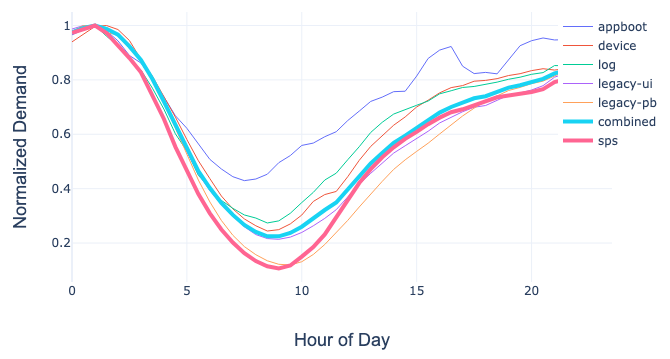
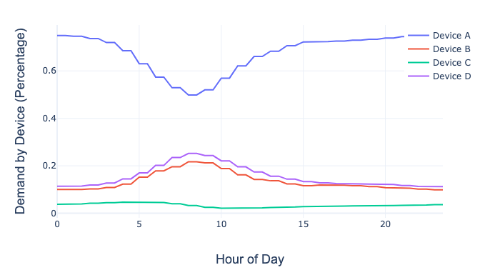
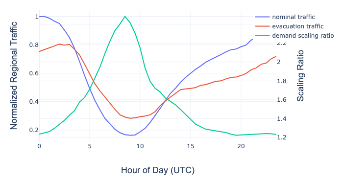
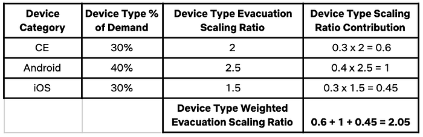
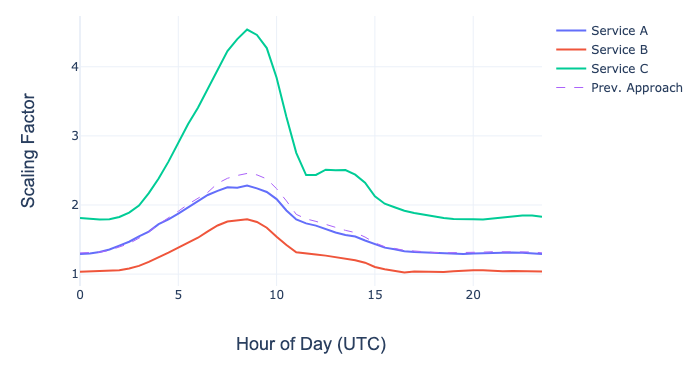

# Evolving Regional Evacuation

> Niosha Behnam | Demand Engineering @ Netflix

At Netflix we prioritize innovation and velocity in pursuit of the best experience for our 150+ million global customers. This means that our microservices constantly evolve and change, but what doesn’t change is our responsibility to provide a highly available service that delivers 100+ million hours of daily streaming to our subscribers.

In order to achieve this level of availability, we leverage an N+1 architecture where we treat Amazon Web Services (AWS) regions as fault domains, allowing us to withstand single region failures. In the event of an isolated failure we first pre-scale microservices in the healthy regions after which we can shift traffic away from the failing one. This pre-scaling is necessary due to our use of autoscaling, which generally means that services are right-sized to handle their current demand, not the surge they would experience once we shift traffic.

Though this evacuation capability exists today, this level of resiliency wasn’t always the standard for the Netflix API. In 2013 we first developed our [multi-regional availability strategy](https://medium.com/netflix-techblog/active-active-for-multi-regional-resiliency-c47719f6685b) in response to a [catalyst](https://medium.com/netflix-techblog/a-closer-look-at-the-christmas-eve-outage-d7b409a529ee) that led us to re-architect the way our service operates. Over the last 6 years Netflix has continued to grow and evolve along with our customer base, invalidating core assumptions built into the machinery that powers our ability to pre-scale microservices. Two such assumptions were that:

- **Regional demand for all microservices (i.e. requests, messages, connections, etc.) can be abstracted by our key performance indicator, ****[stream starts per second](https://medium.com/netflix-techblog/sps-the-pulse-of-netflix-streaming-ae4db0e05f8a)**** (SPS).**
- Microservices within healthy regions can be scaled uniformly during an evacuation.

These assumptions simplified pre-scaling, allowing us to treat microservices uniformly, ignoring the uniqueness and regionality of demand. This approach worked well in 2013 due to the existence of monolithic services and a fairly uniform customer base, but became less effective as Netflix evolved.

## Invalidated Assumptions

### Regional Microservice Demand

Most of our microservices are in some way related to serving a stream, so SPS seemed like a reasonable stand-in to simplify regional microservice demand. This was especially true for large monolithic services. For example, player logging, authorization, licensing, and bookmarks were initially handled by a single monolithic service whose demand correlated highly with SPS. However, in order to improve developer velocity, operability, and reliability, the monolith was decomposed into smaller, purpose-built services with dissimilar function-specific demand.

Our edge gateway ([zuul](https://medium.com/netflix-techblog/zuul-2-the-netflix-journey-to-asynchronous-non-blocking-systems-45947377fb5c)) also sharded by function to achieve similar wins. The graph below captures the demand for each shard, the combined demand, and SPS. Looking at the combined demand and SPS lines, SPS roughly approximates combined demand for a majority of the day. Looking at individual shards however, the amount of error introduced by using SPS as a demand proxy varies widely.

*Time of Day vs. Normalized Demand by Zuul Shard*

### Uniform Evacuation Scaling

Since we used SPS as a demand proxy, it also seemed reasonable to assume that we can uniformly pre-scale all microservices in the healthy regions. In order to illustrate the shortcomings of this approach, let’s look at playback licensing (DRM) & authorization.

DRM is closely aligned with device type, such that Consumer Electronics (CE), Android, & iOS use different DRM platforms. In addition, the ratio of CE to mobile streaming differs regionally; for example, mobile is more popular in South America. So, if we evacuate South American traffic to North America, demand for CE and Android DRM won’t grow uniformly.

On the other hand, playback authorization is a function used by all devices prior to requesting a license. While it does have some device specific behavior, demand during an evacuation is more a function of the overall change in regional demand.

## Closing The Gap

In order to address the issues with our previous approach, we needed to better characterize microservice-specific demand and how it changes when we evacuate. The former requires that we capture regional demand for microservices versus relying on SPS. The latter necessitates a better understanding of microservice demand by device type as well as how regional device demand changes during an evacuation.

### Microservice-Specific Regional Demand

Because of service decomposition, we understood that using a proxy demand metric like SPS wasn’t tenable and we needed to transition to microservice-specific demand. Unfortunately, due to the diversity of services, a mix of Java ([Governator](https://medium.com/netflix-techblog/governator-lifecycle-and-dependency-injection-ccb8011c7d5b)/Springboot with [Ribbon](https://medium.com/netflix-techblog/announcing-ribbon-tying-the-netflix-mid-tier-services-together-a89346910a62)/gRPC, etc.) and Node (NodeQuark), there wasn’t a single demand metric we could rely on to cover all use cases. To address this, we built a system that allows us to associate each microservice with metrics that represent their demand.

The microservice metrics are configuration-driven, self-service, and allows for scoping such that services can have different configurations across various shards and regions. Our system then queries [Atlas](https://medium.com/netflix-techblog/introducing-atlas-netflixs-primary-telemetry-platform-bd31f4d8ed9a), our time series telemetry platform, to gather the appropriate historical data.

### Microservice Demand By Device Type

Since demand is impacted by regional device preferences, we needed to deconstruct microservice demand to expose the device-specific components. The approach we took was to partition a microservice’s regional demand by aggregated device types (CE, Android, PS4, etc.). Unfortunately, the existing metrics didn’t uniformly expose demand by device type, so we leveraged distributed tracing to expose the required details. Using this sampled trace data we can explain how a microservice’s regional device type demand changes over time. The graph below highlights how relative device demand can vary throughout the day for a microservice.

*Regional Microservice Demand By Device Type*

### Device Type Demand

We can use historical device type traffic to understand how to scale the device-specific components of a service’s demand. For example, the graph below shows how CE traffic in us-east-1 changes when we evacuate us-west-2. The nominal and evacuation traffic lines are normalized such that 1 represents the **_max(nominal traffic)_** and the demand scaling ratio represents the relative change in demand during an evacuation **(i.e. _evacuation traffic/nominal traffic_)**.

*Nominal vs Evacuation CE Traffic in US-East-1*

### Microservice-Specific Demand Scaling Ratio

We can now combine microservice demand by device and device-specific evacuation scaling ratios to better represent the change in a microservice’s regional demand during an evacuation — i.e. the microservice’s device type weighted demand scaling ratio. To calculate this ratio (for a specific time of day) we take a service’s device type percentages, multiply by device type evacuation scaling ratios, producing each device type’s contribution to the service’s scaling ratio. Summing these components then yields a device type weighted evacuation scaling ratio for the microservice. To provide a concrete example, the table below shows the evacuation scaling ratio calculation for a fictional service.

*Service Evacuation Scaling Ratio Calculation*

The graph below highlights the impact of using a microservice-specific evacuation scaling ratio versus the simplified SPS-based approach used previously. In the case of Service A, the old approach would have done well in approximating the ratio, but in the case of Service B and Service C, it would have resulted in over and under predicting demand, respectively.

*Device Type Weighted vs. Previous Approach*

## What Now?

Understanding the uniqueness of demand across our microservices improved the quality of our predictions, leading to safer and more efficient evacuations at the cost of additional computational complexity. This new approach, however, is itself an approximation with its own set of assumptions. For example, it assumes all categories of traffic for a device type has similar shape, for example Android logging and playback traffic. As Netflix grows our assumptions will again be challenged and we will have to adapt to continue to provide our customers with the availability and reliability that they have come to expect.

**If this article has piqued your interest and you have a passion for solving cross-discipline distributed systems problems, our small but growing team is **[**hiring**](https://jobs.netflix.com/jobs/866321)**!**

---
**Tags:** Microservices · Failover · Netflix · Fault Tolerance · Software Engineering
