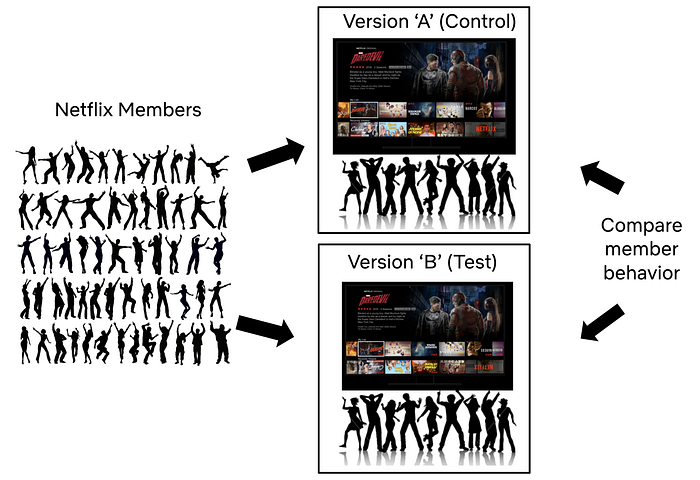
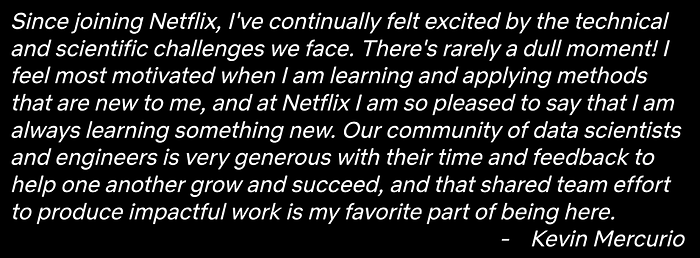
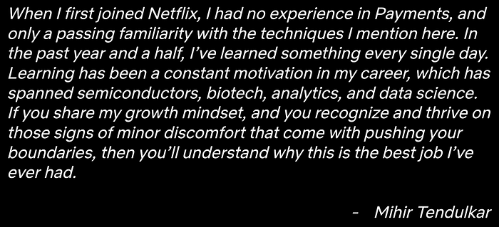
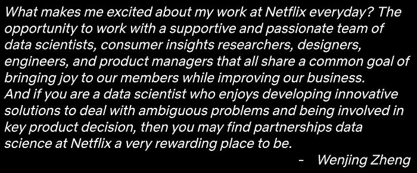
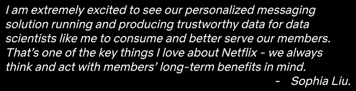
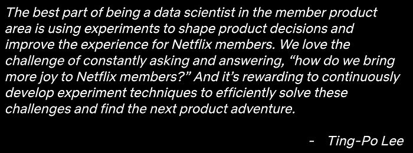
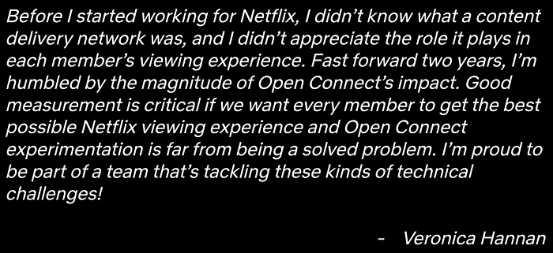
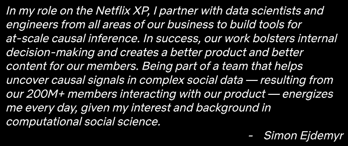

# Experimentation is a major focus of Data Science across Netflix

[_Martin Tingley_](https://www.linkedin.com/in/martintingley/)_ with _[_Wenjing Zheng_](https://www.linkedin.com/in/wenjing-zheng/)_, _[_Simon Ejdemyr_](https://www.linkedin.com/in/simon-ejdemyr-22b920123/)_, _[_Stephanie Lane_](https://www.linkedin.com/in/stephanielane1/)_, _[_Colin McFarland_](https://www.linkedin.com/in/mcfrl/), [_Andy Rhines_](https://www.linkedin.com/in/andy-rhines/)_, _[_Sophia Liu_](https://www.linkedin.com/in/sophia-liu-99722626/)_, _[_Mihir Tendulkar_](https://www.linkedin.com/in/tendulkar/)_, _[_Kevin Mercurio_](https://www.linkedin.com/in/mercurio1/)_, _[_Veronica Hannan_](https://www.linkedin.com/in/veronicahannan/)_, _[_Ting-Po Lee_](https://www.linkedin.com/in/ting-po-lee-6389b058/)

> Earlier posts in this series covered the basics of A/B tests ([Part 1](./decision-making-at-netflix-33065fa06481.md) and [Part 2](./what-is-an-a-b-test-b08cc1b57962.md) ), core statistical concepts ([Part 3](./interpreting-a-b-test-results-false-positives-and-statistical-significance-c1522d0db27a.md) and [Part 4](./interpreting-a-b-test-results-false-negatives-and-power-6943995cf3a8.md)), and how to build confidence in decisions based on A/B test results ([Part 5](./building-confidence-in-a-decision-8705834e6fd8.md)). Here we describe the role of Experimentation and A/B testing within the larger Data Science and Engineering organization at Netflix, including how our platform investments support running tests at scale while enabling innovation. The subsequent and final post in this series will discuss the importance of the culture of experimentation within Netflix.

Experimentation and causal inference is one of the primary focus areas within Netflix’s Data Science and Engineering organization. To directly support great decision-making throughout the company, there are a number of data science teams at Netflix that partner directly with Product Managers, engineering teams, and other business units to design, execute, and learn from experiments. To enable scale, we’ve built, and continue to invest in, an internal experimentation platform (XP for short). And we intentionally encourage collaboration between the centralized experimentation platform and the data science teams that partner directly with Netflix business units.

> Curious to learn more about other Data Science and Engineering functions at Netflix? To learn about Analytics and Viz Engineering, have a look at [Analytics at Netflix: Who We Are and What We Do](./analytics-at-netflix-who-we-are-and-what-we-do-7d9c08fe6965.md) by Molly Jackman & Meghana Reddy and [How Our Paths Brought Us to Data and Netflix](./how-our-paths-brought-us-to-data-and-netflix-4eced44a6872.md) by Julie Beckley & Chris Pham. Curious to learn about what it’s like to be a Data Engineer at Netflix? Hear directly from [Samuel Setegne](https://netflixtechblog.medium.com/data-engineers-of-netflix-interview-with-samuel-setegne-f3027f58c2e2), [Dhevi Rajendran](https://netflixtechblog.medium.com/data-engineers-of-netflix-interview-with-dhevi-rajendran-a9ab7c7b36e5), [Kevin Wylie](./data-engineers-of-netflix-interview-with-kevin-wylie-7fb9113a01ea.md), and [Pallavi Phadnis](./data-engineers-of-netflix-interview-with-pallavi-phadnis-a1fcc5f64906.md) in our “Data Engineers of Netflix” interview series.

Experimentation and causal inference data scientists who work directly with Netflix business units develop deep domain understanding and intuition about the business areas where they work. Data scientists in these roles apply the scientific method to improve the Netflix experience for current and future members, and are involved in the whole life cycle of experimentation: data exploration and ideation; designing and executing tests; analyzing results to help inform decisions on tests; synthesizing learnings from numerous tests (and other sources) to understand member behavior and identify opportunity areas for innovation. It’s a virtuous, scientifically rigorous cycle of testing specific hypotheses about member behaviors and preferences that are grounded in general principles (deduction), and generalizing learning from experiments to build up our conceptual understanding of our members (induction). In success, this cycle enables us to rapidly innovate on all aspects of the Netflix service, confident that we are delivering more joy to our members as our decisions are backed by empirical evidence.

> Curious to learn more? Have a look at “[A Day in the Life of an Experimentation and Causal Inference Scientist @ Netflix](./a-day-in-the-life-of-an-experimentation-and-causal-inference-scientist-netflix-388edfb77d21.md)” by [Stephanie Lane](https://www.linkedin.com/in/stephanielane1/), [Wenjing Zheng](https://www.linkedin.com/in/wenjing-zheng/), and [Mihir Tendulkar](https://www.linkedin.com/in/tendulkar/).

Success in these roles requires a broad technical skill set, a self-starter attitude, and a deep curiosity about the domain space. Netflix data scientists are relentless in their pursuit of knowledge from data, and constantly look to go the extra distance and ask one more question. “What more can we learn from this test, to inform the next one?” “What information can I synthesize from the last year of tests, to inform opportunity sizing for next year’s learning roadmap?” “What other data and intuition can I bring to the problem?” “Given my own experience with Netflix, where might there be opportunities to test and improve on the current experience?” We look to our data scientists to push the boundaries on both the design and analysis of experiments: what new approaches or methods may yield valuable insights, given the learning agenda in a particular part of the product? These data scientists are also sought after as trusted thought partners by their business partners, as they develop deep domain expertise about our members and the Netflix experience.

Here are quick summaries of a few of the experimentation areas at Netflix and some of the innovative work that’s come out of each. This is not an exhaustive list, and we’ve focused on areas where opportunities to learn and deliver a better member experience through experimentation may be less obvious.

*A/B tests are used throughout Netflix to deliver more joy to current and future members.*

### Growth Advertising

At Netflix, we want to [entertain the world](https://about.netflix.com/en)! Our growth team advertises on social media platforms and other websites to share news about upcoming titles and new product features, with the ultimate goal of growing the number of Netflix members worldwide. Data Scientists play a vital role in building automated systems that leverage causal inference to decide how we spend our advertising budget.

In advertising, the treatments (the ads that we purchase) have a direct monetary cost to Netflix. As a result, we are risk averse in decision making and actively mitigate the probability of purchasing ads that are not efficiently attracting new members. Abiding by this risk aversion is challenging in our domain because experiments generally have low power (see [Part 4](./interpreting-a-b-test-results-false-negatives-and-power-6943995cf3a8.md)). For example we rely on [difference-in-differences techniques](./key-challenges-with-quasi-experiments-at-netflix-89b4f234b852.md) for unbiased comparisons between the potentially different audiences experiencing each advertising treatment, and these approaches effectively reduce the sample size ([more details](https://www.msi.org/wp-content/uploads/2020/06/MSI_Report_15-122.pdf) for the very interested reader). One way to address these power reductions would be to simply run longer experiments — but that would slow down our overall pace of innovation.

Here we highlight two related problems for experimentation in this domain and briefly describe how we address them while maintaining a high cadence of experimentation.

Recall that [Part 3](./interpreting-a-b-test-results-false-positives-and-statistical-significance-c1522d0db27a.md) and [Part 4](./interpreting-a-b-test-results-false-negatives-and-power-6943995cf3a8.md) described two types of errors: false positives (or Type-I errors) and false negatives (Type-II errors). Particularly in regimes where experiments are low-powered, [two other error types](http://www.stat.columbia.edu/~gelman/research/published/retropower20.pdf) can occur with high probability, so are important to consider when acting upon a statistically significant test result:

- A **Type-S error **occurs when, given that we observe a statistically-significant result, the estimated metric movement has the opposite **sign** relative to the truth.
- **A ******Type-M error ******occurs when,****** ******given that we observe a statistically-significant result, the size of the estimated metric movement is ******magnified****** (or exaggerated) relative to the truth.**

If we simply declare statistically significant test results (with positive metric movements) to be winners, a Type-S error would imply that we actually selected the **wrong** treatment to promote to production, and all our future advertising spend would be producing suboptimal results. A Type-M error means that we are **over-estimating** the impact of the treatment. In the short term, a Type-M error means we would overstate our result, and in the long-term it could lead to overestimating our optimal budget level, or even misprioritizing future research tracks.

To reduce the impact of these errors, we take a [Bayesian approach](https://drive.google.com/file/d/11vKsMl_U8aUbaj3_TQ6Ewdc3iD0Ytpq_/view) to experimentation in growth advertising. We’ve run many tests in this area and use the distribution of metric movements from past tests as an additional input to the analysis. Intuitively (and mathematically) this approach results in estimated metric movements that are smaller in magnitude and that feature narrower confidence intervals ([Part 3](./interpreting-a-b-test-results-false-positives-and-statistical-significance-c1522d0db27a.md)). Combined, these two effects reduce the risk of Type-S and Type-M errors.

As the benefits from ending suboptimal treatments early can be substantial, we would also like to be able to make informed, statistically-valid decisions to end experiments as quickly as possible.This is an active research area for the team, and we’ve investigated [Group Sequential Testing](./improving-experimentation-efficiency-at-netflix-with-meta-analysis-and-optimal-stopping-d8ec290ae5be.md) and [Bayesian Inference](https://drive.google.com/file/d/11vKsMl_U8aUbaj3_TQ6Ewdc3iD0Ytpq_/view) as methods to allow for optimal stopping (see below for more on both of those). The latter, when combined with decision theoretic concepts like [expected loss](https://cdn2.hubspot.net/hubfs/310840/VWO_SmartStats_technical_whitepaper.pdf) (or risk) minimization, can be used to formally evaluate the impact of different decisions — including the decision to end the experiment early.

### Payments

The payments team believes that the methods of payment (credit card, direct debit, mobile carrier billing, etc) that a future or current member has access to should never be a barrier to signing up for Netflix, or the reason that a member leaves Netflix. There are numerous touchpoints between a member and the payments team: we establish relationships between Netflix and new members, maintain those relationships with renewals, and (sadly!) see the end of those relationships when members elect to cancel.

We innovate on methods of payment, authentication experiences, text copy and UI designs on the Netflix product, and any other place that we may smooth the payment experience for members. In all of these areas, we seek to improve the quality and velocity of our decision-making, guided by the testing principles laid out in this series.

Decision quality doesn’t just mean telling people, “Ship it!” when the p-value (see [Part 3](./interpreting-a-b-test-results-false-positives-and-statistical-significance-c1522d0db27a.md)) drops below 0.05. It starts with having a good hypothesis and a clear decision framework — especially one that judiciously balances between long-term objectives and getting a read in a pragmatic timeframe. We don’t have unlimited traffic or time, so sometimes we have to make hard choices. Are there metrics that can yield a signal faster? What’s the tradeoff of using those? What’s the expected loss of calling this test, versus the opportunity cost of running something else? These are fun problems to tackle, and we are always looking to improve.

We also actively invest in increasing decision velocity, often in close partnership with the Experimentation Platform team. Over the past year, we’ve piloted models and workflows for three approaches to faster experimentation: [Group Sequential Testing](./improving-experimentation-efficiency-at-netflix-with-meta-analysis-and-optimal-stopping-d8ec290ae5be.md) (GST), [Gaussian Bayesian Inference](https://drive.google.com/file/d/11vKsMl_U8aUbaj3_TQ6Ewdc3iD0Ytpq_/view), and [Adaptive Testing](https://papers.nips.cc/paper/2021/file/0ec04cb3912c4f08874dd03716f80df1-Paper.pdf). Any one of these techniques would enhance our experiment throughput on their own; together, they promise to alter the trajectory of payments experimentation velocity at Netflix.

### Partnerships

We want all of our members to enjoy a high quality experience whenever and however they access Netflix. Our partnerships teams work to ensure that the Netflix app and our latest technologies are integrated on a wide variety of consumer products, and that Netflix is easy to discover and use on all of these devices. We also partner with mobile and PayTV operators to create bundled offerings to bring the value of Netflix to more future members.

In the partnerships space, many experiences that we want to understand, such as partner-driven marketing campaigns, are not amenable to the A/B testing framework that has been the focus of this series. Sometimes, users self-select into the experience, or the new experience is rolled out to a large cluster of users all at once. This lack of randomization precludes the straightforward causal conclusions that follow from A/B tests. In these cases, we use quasi experimentation and observational causal inference techniques to infer the causal impact of the experience we are studying. A key aspect of a data scientist’s role in these analyses is to educate stakeholders on the caveats that come with these studies, while still providing rigorous evaluation and actionable insights, and providing structure to some otherwise ambiguous problems. Here are some of the challenges and opportunities in these analyses:

**Treatment selection confounding**. When users self-select into the treatment or control experience (versus the random assignment discussed in [Part 2](./what-is-an-a-b-test-b08cc1b57962.md)), the probability that a user ends up in each experience may depend on their usage habits with Netflix. These baseline metrics are also naturally correlated with outcome metrics, such as member satisfaction, and therefore confound the effect of the observed treatment on our outcome metrics. The problem is exacerbated when the treatment choice or treatment uptake varies with time, which can lead to time varying confounding. To deal with these cases, we use methods such as inverse propensity scores, doubly robust estimators, difference-in-difference, or instrumental variables to extract actionable causal insights, with longitudinal analyses to account for the time dependence.

**Synthetic controls and structural models**. Adjusting for confounding requires having pre-treatment covariates at the same level of aggregation as the response variable. However, sometimes we do not have access to that information at the level of individual Netflix members. In such cases, we analyze aggregate level data using synthetic controls and [structural models](./key-challenges-with-quasi-experiments-at-netflix-89b4f234b852.md).

**Sensitivity analysis.** In the absence of true A/B testing, our analyses rely on using the available data to adjust away spurious correlations between the treatment and the outcome metrics. But how well we can do so depends on whether the available data is sufficient to account for all such correlations. To understand the validity of our causal claims, we perform sensitivity analyses to evaluate the robustness of our findings.

### Messaging

At Netflix, we are always looking for ways to help our members choose content that’s great for them. We do this on the Netflix product through the [personalized](https://www.slideshare.net/justinbasilico/recent-trends-in-personalization-at-netflix) experience we provide to every member. But what about other ways we can help keep members informed about new or relevant content, so they’ve something great in mind when it’s time to relax at the end of a long day?

Messaging, including emails and push notifications, is one of the key ways we keep our members in the loop. The messaging team at Netflix strives to provide members with joy beyond the time when they are actively watching content. What’s new or coming soon on Netflix? What’s the perfect piece of content that we can tell you about so you can plan “date time movie night” on the go? As a messaging team, we are also mindful of all the digital distractions in our members’ lives, so we work tirelessly to send just the right information to the right members at the right time.

Data scientists in this space work closely with product managers and engineers to develop messaging solutions that maximize long term satisfaction for our members. For example, we are constantly working to deliver a better, more personalized messaging experience to our members. Each day, we predict how each candidate message would meet a members’ needs, given historical data, and the output informs what, if any, message they will receive. And to ensure that innovations on our personalized messaging approach result in a better experience for our members, we use A/B testing to learn and confirm our hypotheses.

An exciting aspect of working as a data scientist on messaging at Netflix is that we are actively building and using sophisticated learning models to help us better serve our members. These models, based on the idea of [bandits](https://en.wikipedia.org/wiki/Multi-armed_bandit), continuously balance learning more about member messaging preferences with applying those learnings to deliver more satisfaction to our members. It’s like a continuous A/B test with new treatments deployed all the time. This framework allows us to conduct many exciting and challenging analyses without having to deploy new A/B tests every time.

### Evidence Selection

When a member opens the Netflix application, our goal is to help them choose a title that is a great fit for them. One way we do this is through constantly improving the recommendation systems that produce a personalized home page experience for each of our members. And beyond title recommendations, we strive to select and present artwork, imagery and other visual “evidence” that is likewise personalized, and helps each member understand why a particular title is a great choice for them — particularly if the title is new to the service or unfamiliar to that member.

Creative excellence and continuous improvements to evidence selection systems are both crucial in achieving this goal. Data scientists working in the space of evidence selection use online experiments and offline analysis to provide robust causal insights to power product decisions in both the creation of evidence assets, such as the images that appear on the Netflix homepage, and the development of models that pair members with evidence.

Sitting at the intersection of content creation and product development, data scientists in this space face some unique challenges:

**Predicting evidence performance**. Say we are developing a new way to generate a piece of evidence, such as a trailer. Ideally, we’d like to have some sense of the positive outcomes of the new evidence type prior to making a potentially large investment that will take time to pay off. Data scientists help inform investment decisions like these by developing causally valid predictive models.

**Matching members with the best evidence**. High quality and properly selected evidence is key to a great Netflix experience for all of our members. While we test and learn about what types of evidence are most effective, and how to match members to the best evidence, we also work to minimize the potential downsides by investing in efficient approaches to A/B tests that allow us to rapidly stop suboptimal treatment experiences.

**Providing timely causal feedback on evidence development**. Insights from data, including from A/B tests, are used extensively to fuel the creation of better artwork, trailers, and other types of evidence. In addition to A/B tests, we work on developing experimental design and analysis frameworks that provide fine-grained causal inference and can keep up with the scale of our learning agenda. We use [contextual bandits](https://netflixtechblog.com/artwork-personalization-c589f074ad76) that minimize regret in matching members to evidence, and through a collaboration with our Algorithms Engineering team, we’ve built the ability to log counterfactuals: what would a different selection policy have recommended? These data provide us with a platform to run rich offline experiments and derive causal inferences that meet our challenges and answer questions that may be slow to answer with A/B tests.

### Streaming

Now that you’ve signed up for Netflix and found something exciting to watch, what happens when you press play? Behind the scenes, Netflix infrastructure has already kicked into gear, finding the fastest way to deliver your chosen content with great audio and video quality.

The numerous engineering teams involved in delivering high quality audio and video use A/B tests to improve the experience we deliver to our members around the world. Innovation areas include the Netflix app itself (across thousands of types of devices), [encoding algorithms](./bringing-av1-streaming-to-netflix-members-tvs-b7fc88e42320.md), and ways to [optimize](https://netflixtechblog.com/distributing-content-to-open-connect-3e3e391d4dc9) the placement of content on our global [Open Connect distribution network](https://openconnect.netflix.com/en/).

Data science roles in this business area emphasize experimentation at scale and support for autonomous experimentation for engineering teams: how do we enable these teams to efficiently and confidently execute, analyze, and make decisions based on A/B tests? We’ll touch upon four ways that partnerships between data science and engineering teams have benefited this space.

**Automation**. As streaming experiments are numerous (thousands per year) and tend to be short lived, we’ve invested in workflow automations. For example, we piggyback on Netflix’s amazing tools for [safe deployment of the Netflix client](./safe-updates-of-client-applications-at-netflix-1d01c71a930c.md) by integrating the experimentation platform’s API directly with [Spinnaker](https://netflixtechblog.com/netflix-at-the-spinnaker-summit-2018-ac694692d007) deployment pipelines. This allows engineers to set up, allocate, and analyze the effects of changes they’ve made using a single configuration file. Taking this model even further, users can even ‘automate the automation’ by running multiple rounds of an experiment to perform sequential optimizations.

**Beyond average treatment effects. **As many important streaming video and audio metrics are not well approximated by a normal distribution, we’ve found it critical to look beyond average treatment effects. To surmount these challenges, we partnered with the experimentation platform to develop and integrate [high-performance bootstrap methods for compressed data](./data-compression-for-large-scale-streaming-experimentation-c20bfab8b9ce.md), making it fast to estimate distributions and quantile treatment effects for even the most pathological metrics. [Visualizing quantiles](https://netflixtechblog.com/streaming-video-experimentation-at-netflix-visualizing-practical-and-statistical-significance-7117420f4e9a) leads to novel insights about treatment effects, and these plots, now produced as part of our automated reporting, are often used to directly support high-level product decisions.

**Alternatives to A/B testing**. The Open Connect engineering team faces numerous measurement challenges. [Congestion can cause interactions](https://arxiv.org/abs/2110.00118) between treatment and control groups; in other cases we are unable to randomize due to the nature of our traffic steering algorithms. To address these and other challenges, we are investing heavily in [quasi-experimentation methods](https://netflixtechblog.com/quasi-experimentation-at-netflix-566b57d2e362). We use [Metaflow](./open-sourcing-metaflow-a-human-centric-framework-for-data-science-fa72e04a5d9.md) to pair existing infrastructure for metric definitions and data collection from our Experimentation Platform with custom analysis methods that are based on a difference-in-difference approach. This workflow has allowed us to quickly deploy self-service tools to measure changes that cannot be measured with traditional A/B testing. Additionally, our modular approach has made it easy to scale quasi-experiments across Open Connect use cases, allowing us to swap out data sources or analysis methods depending on each team’s individual needs.

**Support for custom metrics and dimensions.** Last, we’ve developed a (relatively) frictionless path that allows all experimenters (not just data scientists) to create custom metrics and dimensions in a snap when they are needed. Anything that can be logged can be quickly passed to the experimentation platform, analyzed, and visualized alongside the long-lived quality of experience metrics that we consider for all tests in this domain. This allows our engineers to use paved paths to ask and answer more precise questions, so they can spend less time head-scratching and more time testing out exciting ideas.

### Scaling experimentation and investing in infrastructure

To support the scale and complexity of the experimentation program at Netflix, we’ve invested in building out our own experimentation platform (referred to as “XP” internally). Our XP provides robust and automated (or semi automated) solutions for the full lifecycle of experiments, from experience management through to analysis, and meets the data scale produced by a high throughput of large tests.

*Curious to learn more about XP, the Netflix Experimentation platform? Read about our Architecture and Allocation Strategy, how we’ve been Reimagining Experimentation, our Design Principles for Mathematical Engineering, and how we leverage Computational Causal Inference to support innovation and scale on our democratized platform.*

XP provides a framework that allows engineering teams to define sets of test treatment experiences in their code, and then use these to configure an experiment. The platform then randomly selects members (or other units we might experiment on, like playback sessions) to assign to experiments, before randomly assigning them to an experience within each experiment (control or one of the treatment experiences). Calls by Netflix services to XP then ensure that the correct experiences are delivered, based on which tests a member is part of, and which variants within those tests. Our data engineering systems collect these test metadata, and then join them with our core data sets: logs on how members and non members interact with the service, logs that track technical metrics on streaming video delivery, and so forth. These data then flow through automated analysis pipelines and are reported in [ABlaze](https://netflixtechblog.com/its-all-a-bout-testing-the-netflix-experimentation-platform-4e1ca458c15), the front end for reporting and configuring experiments at Netflix. Aligned with [Netflix culture](https://jobs.netflix.com/culture), results from tests are broadly accessible to everyone in the company, not limited to data scientists and decision makers.

The Netflix XP balances execution of the current experimentation program with a focus on future-looking innovation. It’s a virtuous flywheel, as XP aims to take whatever is pushing the boundaries of our experimentation program this year and turn it into next year’s one-click solution. That may involve developing new solutions for allocating members (or other units) to experiments, new ways of tracking conflicts between tests, or new ways of designing, analyzing, and making decisions based on experiments. For example, XP partners closely with engineering teams on feature flagging and experience delivery. In success, these efforts provide a seamless experience for Netflix developers that fully integrates experimentation into the software development lifecycle.

For analyzing experiments, we’ve built the Netflix XP to be both **democratized** and **modular**. By **democratized**, we mean that data scientists (and other users) can directly contribute metrics, causal inference methods for analyzing tests, and visualizations. Using these three **modules**, experimenters can compose flexible reports, tailored to their tests, that flow through to both our frontend UI and a notebook environment that supports ad hoc and exploratory analysis.

This model supports rapid prototyping and innovation as we abstract away engineering concerns so that data scientists can contribute code directly to our production experimentation platform — without having to become software engineers themselves. To ensure that platform capabilities are able to support the required scale (number and size of tests) as analysis methods become more complex and computationally intensive, we’ve invested in developing expertise in performant and robust [Computational Causal Inference](./computational-causal-inference-at-netflix-293591691c62.md) software for test analysis.

It takes a village to build an experimentation platform: software engineers to build and maintain the backend engineering infrastructure; UI engineers to build out the ABlaze front end that is used to manage and analyze experiments; data scientists with expertise in causal inference and numerical computing to develop, implement, scale, and socialize cutting edge methodologies; user experience designers who ensure our products are accessible to our stakeholders; and product managers who keep the platform itself innovating in the right direction. It’s an incredibly multidisciplinary endeavor, and positions on XP provide opportunities to develop broad skill sets that span disciplines. Because experimentation is so pervasive at Netflix, those working on XP are exposed to challenges, and get to collaborate with colleagues, from all corners of Netflix. It’s a great way to learn broadly about ‘how Netflix works’ from a variety of perspectives.

### Summary

At Netflix, we’ve invested in data science teams that use A/B tests, other experimentation paradigms, and the scientific method more broadly, to support continuous innovation on our product offerings for current and future members. In tandem, we’ve invested in building out an internal experimentation platform (XP) that supports the scale and complexity of our experimentation and learning program.

In practice, the dividing line between these two investments is blurred and we encourage collaboration between XP and business-oriented data scientists, including through internal events like A/B Experimentation Workshops and Causal Inference Summits. To ensure that experimentation capabilities at Netflix evolve to meet the on-the-ground needs of experimentation practitioners, we are intentional in ensuring that the development of new measurement and experiment management capabilities, and new software systems to both enable and scale research, is a collaborative partnership between XP and experimentation practitioners. In addition, our intentionally collaborative approach provides great opportunities for folks to lead and contribute to high-impact projects that deliver new capabilities, spanning engineering, measurement, and internal product development. And because of the strategic value Netflix places on experimentation, these collaborative efforts receive broad visibility, including from our executives.

So far, this series has covered the why, what and how of A/B testing, all of which are necessary to reap the benefits of an experimentation-based approach to product development. But without a little magic, these basics are still not enough. That magic will be the focus of the next and final post ([now available](./netflix-a-culture-of-learning-394bc7d0f94c.md)) in this series: the learning and experimentation culture that pervades Netflix. Follow the[ Netflix Tech Blog](http://netflixtechblog.com/) to stay up to date.

---
**Tags:** Ab Testing · Experimentation · Causal Inference · Decision Making
