# Exploring Data @ Netflix

_By Gim Mahasintunan on behalf of Data Platform Engineering._

Supporting a rapidly growing base of engineers of varied backgrounds using different data stores can be challenging in any organization. Netflix’s internal teams strive to provide leverage by investing in easy-to-use tooling that streamlines the user experience and incorporates best practices.

In this blog post, we are thrilled to share that we are open-sourcing one such tool: the Netflix Data Explorer. The Data Explorer gives our engineers fast, safe access to their data stored in Cassandra and Dynomite/Redis data stores.

[Netflix Data Explorer on GitHub](https://github.com/Netflix/nf-data-explorer)

## History

We began this project several years ago when we were onboarding many new [Dynomite](https://github.com/Netflix/dynomite) customers. Dynomite is a high-speed in-memory database, providing highly available cross datacenter replication while preserving Redis-like semantics. We wanted to lower the barrier for adoption so users didn’t need to know datastore-specific CLI commands, could avoid mistakenly running commands that might negatively impact performance, and allow them to access the clusters they frequented every day.

As the project took off, we saw a similar need for our other datastores. [Cassandra](http://cassandra.apache.org/), our most significant footprint in the fleet, seemed like a great candidate. Users frequently had questions on how they should set up replication, create tables using an appropriate compaction strategy, and craft CQL queries. We knew we could give our users an elevated experience, and at the same time, eliminate many of the common questions on our support channels.

We’ll explore some of the Data Explorer features, and along the way, we’ll highlight some of the ways we enabled the OSS community while still handling some of the unique Netflix-specific use cases.

## Multi-Cluster Access

By simply directing users to a single web portal for all of their data stores, we can gain a considerable increase in user productivity. Furthermore, in production environments with hundreds of clusters, we can reduce the available data stores to those authorized for access; this can be supported in OSS environments by implementing a Cluster Access Control Provider responsible for fetching ownership information.

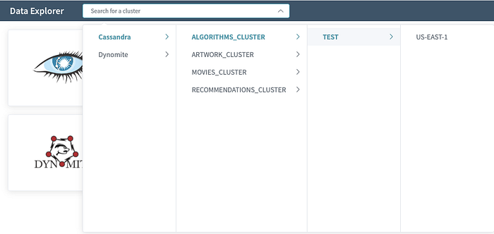
*Browsing your accessible clusters in different environments and regions*

## Schema Designer

Writing CREATE TABLE statements can be an intimidating experience for new Cassandra users. So to help lower the intimidation factor, we built a schema designer that lets users drag and drop their way to a new table.

The schema designer allows you to create a new table using any primitive or collection data type, then designate your partition key and clustering columns. It also provides tools to view the storage layout on disk; browse the supported sample queries (to help design efficient point queries); guide you through the process of choosing a compaction strategy, and many other advanced settings.

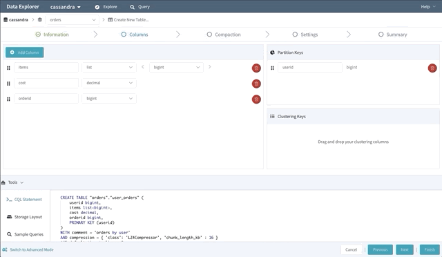
*Dragging and dropping your way to a new Cassandra table*

## Explore Your Data

You can quickly execute point queries against your cluster in Explore mode. The Explore mode supports full CRUD of records and allows you to export result sets to CSV or download them as CQL insert statements. The exported CQL can be a handy tool for quickly replicating data from a PROD environment to your TEST environment.

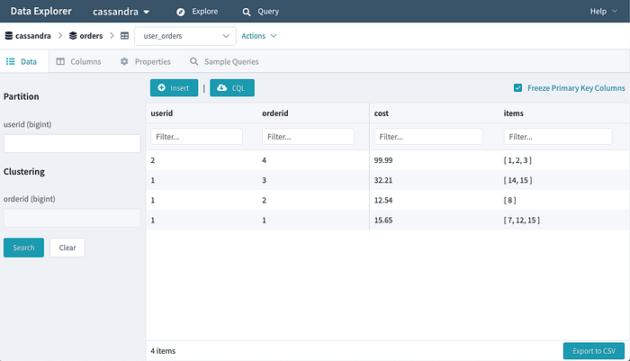
*Explore mode gives you quick access to table data*

## Support for Binary Data

Binary data is another popular feature used by many of our engineers. The Data Explorer won’t fetch binary value data by default (as the persisted data might be sizable). Users can opt-in to retrieve these fields with their choice of encoding.

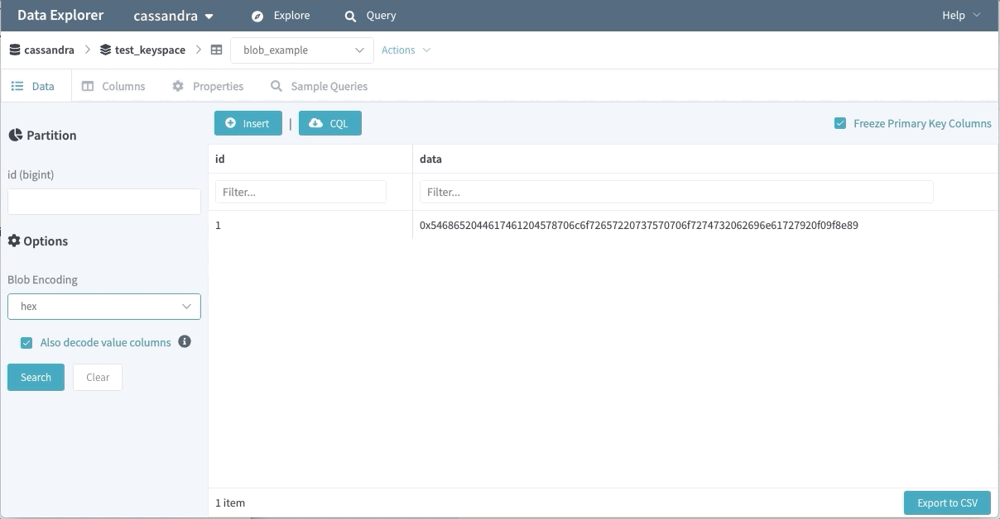
*Choosing how you want to decode blob data*

## Query IDE

Efficient point queries are available in the Explore mode, but you may have users that still require the flexibility of CQL. Enter the Query mode, which includes a powerful CQL IDE with features like autocomplete and helpful snippets.

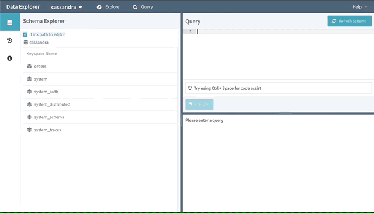
*Example of free-form Cassandra queries with autocomplete assistance*

There are also guardrails in place to help prevent users from making mistakes. For instance, we’ll redirect the user to a bespoke workflow for deleting a table if they try to perform a “DROP TABLE…” command ensuring the operation is done safely with additional validation. (See our integration with Metrics later in this article.)

As you submit queries, they will be saved in the Recent Queries view as well — handy when you are trying to remember that WHERE clause you had crafted before the long weekend.

## Dynomite and Redis Features

While C* is feature-rich and might have a more extensive install base, we have plenty of good stuff for Dynomite and Redis users too. Note, the terms _Dynomite_ and _Redis_ are used interchangeably unless explicitly distinguished.

## Key Scanning

Since Redis is an in-memory data store, we need to avoid operations that inadvertently load all the keys into memory. We perform [SCAN](https://redis.io/commands/scan) operations across all nodes in the cluster, ensuring we don’t strain the cluster.

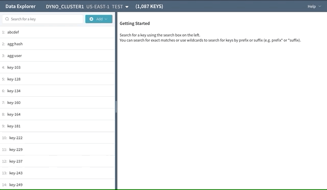
*Scanning for keys on a Dynomite cluster*

## Dynomite Collection Support

In addition to simple String keys, Dynomite supports a rich collection of data types, including Lists, Hashes, and sorted and unsorted Sets. The UI supports creating and manipulating these collection types as well.

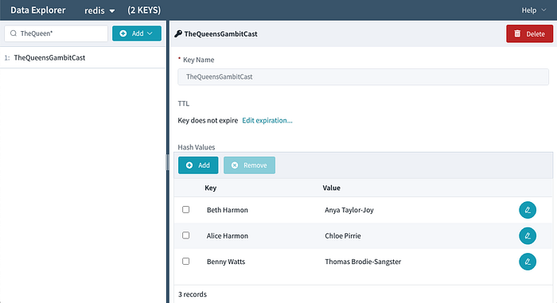
*Editing a Redis hash value*

## Supporting OSS

As we were building the Data Explorer, we started getting some strong signals that the ease-of-use and productivity gains that we’d seen internally would benefit folks outside of Netflix as well. We tried to balance codifying some hard-learned best practices that would be generally applicable while maintaining the flexibility to support various OSS environments. To that end, we’ve built several adapter layers into the product where you can provide custom implementations as needed.

The application was architected to enable OSS by introducing seams where users could provide their implementations for discovery, access control, and data store-specific connection settings. Users can choose one of the built-in service providers or supply a custom provider.

**The diagram below shows the server-side architecture. The server is a Node.js Express application written in TypeScript, and the client is a Single Page App written in ****[Vue.js](https://vuejs.org/)****.**

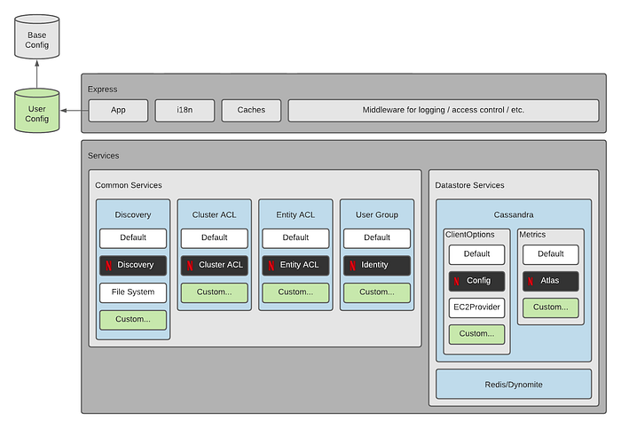
*Data Explorer architecture and service adapter layers*

## Demo Environment

Deploying a new tool in any real-world environment is a time commitment. We get it, and to help you with that initial setup, we have included a dockerized demo environment. It can build the app, pull down images for Cassandra and Redis, and run everything in Docker containers so you can dive right in. Note, the demo environment is not intended for production use.

## Overridable Configuration

The Data Explorer ships with many default behaviors, but since no two production environments are alike, we provide a mechanism to override the defaults and specify your custom values for various settings. These can range from which port numbers to use to which features should be disabled in a production environment. (For example, the ability to drop a Cassandra table.)

## CLI Setup Tool

To further improve the experience of creating your configuration file, we have built a CLI tool that provides a series of prompts for you to follow. The CLI tool is the recommended approach for building your configuration file, and you can re-run the tool at any point to create a new configuration.

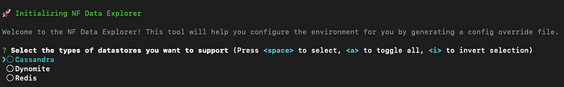
*The CLI allows you to create a custom configuration*

You can also generate multiple configuration files and easily switch between them when working with different environments. We have instructions on GitHub on working with more than one configuration file.

## Service Adapters

It’s no secret that Netflix is a big proponent of microservices: we have discovery services for identifying Cassandra and Dynomite clusters in the environment; access-control services that identify who owns a data store and who can access it; and LDAP services to find out information about the logged-in user. There’s a good chance you have similar services in your environment too.

To help enable such environments, we have several pre-canned configurations with overridable values and adapter layers in place.

### Discovery

The first example of this adapter layer in action is how the application finds **Discovery** information — these are the names and IP addresses of the clusters you want to access. The CLI allows you to choose from a few simple options. For instance, if you have a process that can update a JSON file on disk, you can select “file system.” If instead, you have a REST-based microservice that provides this information, then you can choose “custom” and write a few lines of code necessary to fetch it.

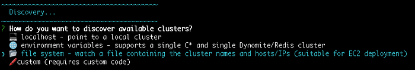
*Choosing to discover our data store clusters by reading a local file*

### Metrics

Another example of this service adapter layer is integration with an external metrics service. We progressively enhance the UI by displaying keyspace and table metrics by implementing a metrics service adapter. These metrics provide insight into which tables are being used at a glance and help our customers make an informed decision when dropping a table.

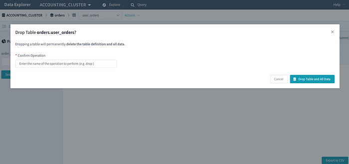
*Without metrics support*

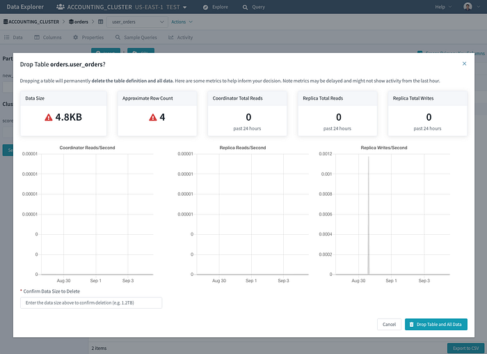
*With optional metrics support*

OSS users can enable the optional **Metrics** support via the CLI. You then just need to write the custom code to fetch the metrics.

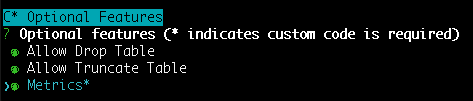
*CLI enabling customization of advanced features*

## i18n Support

While internationalization wasn’t an explicit goal, we discovered that providing Netflix-specific messages in some instances yielded additional value to our internal users. Fundamentally, this is similar to how resource bundles handle different locales.

We are making en-NFLX.ts available internally and en-US.ts available externally. Enterprise customers can enhance their user’s experience by creating custom resource bundles (en-ACME.ts) that link to other tools or enhance default messages. Only a small percentage of the UI and server-side exceptions use these message bundles currently — most commonly to augment messages somehow (e.g., provide links to internal slack channels).

## Final Thoughts

We invite you to check out the project and let us know how it works for you. By sharing the Netflix Data Explorer with the OSS community, we hope to help you explore your data and inspire some new ideas.

---
**Tags:** Cassandra · Redis · Dynomite · Vuejs · Nodejs
