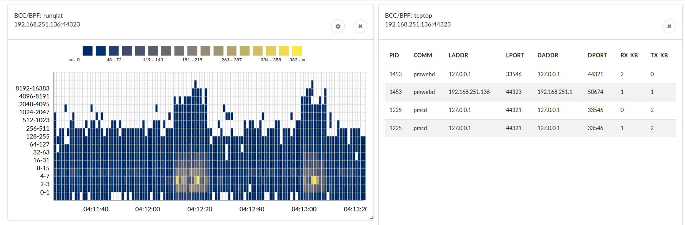
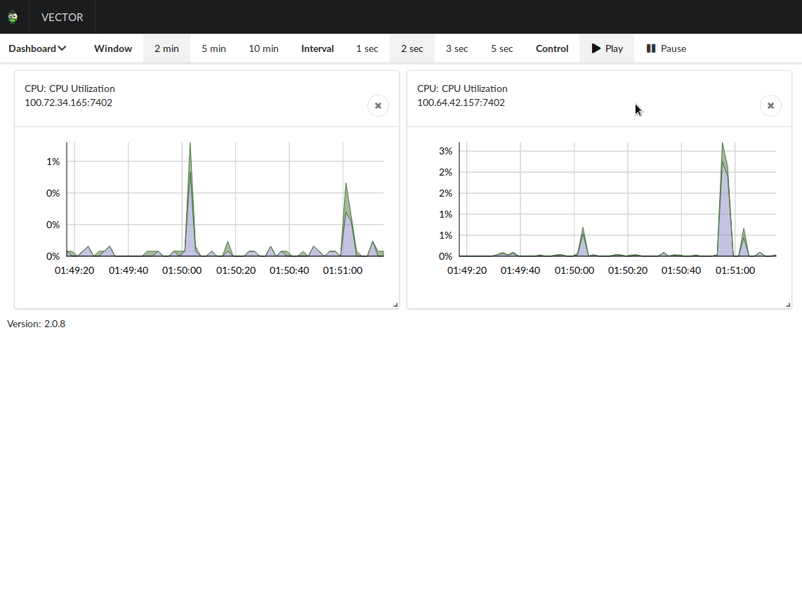
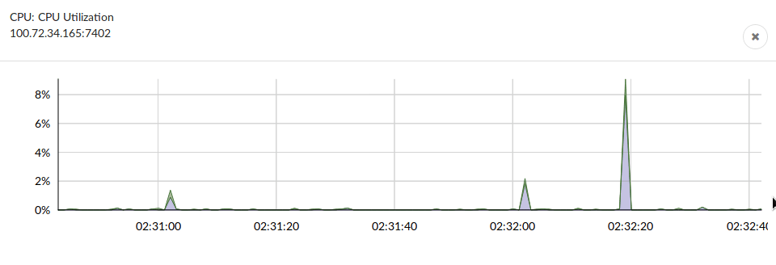
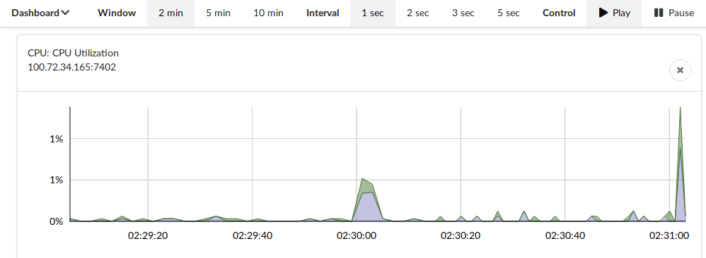

# Extending Vector with eBPF to inspect host and container performance

_by _[_Jason Koch_](https://www.linkedin.com/in/jason-koch-5692172/)_, with _[_Martin Spier_](https://www.linkedin.com/in/martinspier)_, _[_Brendan Gregg_](http://www.brendangregg.com/)_, _[_Ed Hunter_](https://www.linkedin.com/in/edwhunter/)

Improving the tools available to our engineers to help them diagnose, triage, and work through software performance challenges in the cloud is a key goal for the cloud performance engineering team at Netflix.

Today we are excited to announce latency heatmaps and improved container support for our on-host monitoring solution — Vector — to the broader community. Vector is open source and in use by multiple companies. These updates also bring other user experience improvements and a fresher technology stack.

*Remotely view real-time process scheduler latency and tcp throughput with Vector and eBPF*

**What is Vector?**

Vector is an open-source host-level performance monitoring framework which we have been using for some time. Having the right metrics available on demand and at a high resolution is key to understanding how a system behaves and helps to quickly troubleshoot performance issues. For more information on the background and architecture of Vector and PCP, you can see our earlier tech blog post “[Introducing Vector](https://medium.com/netflix-techblog/introducing-vector-netflixs-on-host-performance-monitoring-tool-c0d3058c3f6f)”.

**Why the changes**

There are two main triggers for the refresh:

- Firstly, at Netflix we are seeing significant growth in the use of our container environment (Titus). Historically the focus of our tooling and platform has been on AWS EC2, but with more users making the migration, we need to provide better support for container use cases.
- For example, being able to present both host and container level metrics on the same dashboard helps us provide a way to quickly answer questions: “am I being throttled by the container runtime?” or “are there noisy neighbors affecting my container task?”.
- Secondly, we have a collection of open requests and issues that were difficult to resolve with the current dashboard component. There was no way to pause graphs to take screenshots, and chart legends were sometimes laid out obscuring the actual chart data.

**Introducing BCC / eBPF visualisations**

The Netflix performance engineering team (especially my colleague Brendan) has been contributing to eBPF since its beginning in 2014, including developing many open source performance tools for BCC such as execsnoop, biosnoop, biotop, ext4slower, tcplife, runqlat, and more. These are command line tools, and for them to be really practical in the Netflix cloud environment of over 100k instances, they need to be runnable from our self service GUIs including Vector. For that to work, there needed to be a PCP interface for BPF.

[Andreas Gerstmayr](https://github.com/andihit) has done fantastic work with developing a PCP PMDA for BCC, allowing BCC tool output to be read from Vector, and adding visualizations to Vector to view this data. Vector can now show these from BCC/eBPF:

- Block and filesystem (ext4, xfs, zfs) latency heat maps
- Block IO top processes
- Active TCP session data such as top users, session life, retransmits ..
- Snoops: block IO, exec()
- Scheduler run queue latency

In the below diagram we can see a demo for a wget job. As soon as the wget job starts, the ‘runqlat’ chart shows increased scheduler activity (more yellow areas in the diagram) and longer queue latency for some processes (blue blocks appear higher in the vertical area of the chart). The ‘tcptop’ also shows a new process appearing, (wget) with a new TCP connection and a significant data in RX_KB — 10–20 MB/sec (it is, unsurprisingly, receiving lots of data).

*Real-time scheduler run queue latency and tcp throughput charts after starting a wget download*

Many thanks to the great work by Andreas during his 2018 Google Summer of Code project.

**New features**

To address these changes, we have introduced the following new features:

- We are now able to visualize any combination of host and container metrics from a single view. This allows us to create more complex single-pane dashboards. For example, charting host CPU alongside container CPU, or charting network IO for two communicating instances on the same visualization can be an easy way to get better insights.
- Charts are now resizable and movable.  
This makes it much easier for engineers to get the graphs they want arranged in a manner for comparisons and to focus in the required areas. In this example, CPU utilisation from two different hosts are arranged so that correlation of spikes — or not — is more clearly visible.

*Charts are now resizable and movable*

- Charts will keep collecting data even when the tab is not visible.  
Previously, switching to a different browser tab paused graph data collection and generation. Now, when the tab is not visible, data will still be collected even though rendering is paused.

**User experience improvements**

- Legends have been moved to tool tips.  
This frees up some of visual real estate and removes render issues with large legends consuming the chart area, as you can see here:

*Tooltips now show point in time metrics*

- Graphs can be paused and resumed.  
This is helpful for taking screenshots, when comparing data points across charts, or in discussion with other engineers. When Pause is clicked, data collection continues in the background and graph updates are held. Graphs are brought immediately up to date with live data when Play is clicked again.  
Here, you can see the Pause button pressed, and the graph pauses until the user hits the Play button.

*A pause button has been introduced to help compare, take screenshots, etc.*

- Styling and widgets  
Introduction of new styling and configuration approach. We have introduced the [Cividis color scheme](https://arxiv.org/ftp/arxiv/papers/1712/1712.01662.pdf) for heat maps.

**Internal technology refresh**

The earlier dashboard core components were running on a tech stack that was — for JavaScript — a relatively old Angular 1.x deployment, with a number of component dependencies. A key dashboard component is no longer maintained; new features we would need to resolve issues were not available without forking the component. Instead of forking and investing in a deprecated stack, we have decided on a stack refresh:

- Switch from Angular 1.x to React w/ Semantic UI.
- Refresh the build pipeline away from gulp to webpack.
- Introduction of [Semiotic](https://github.com/emeeks/semiotic/) which is a powerful graph render layer over React and pieces of d3. Along the way we made a bundle of performance improvements to Semiotic for our use case too.

**Current state**

This code is now available for public consumption and should be making its way to distro packages in their release cycle over time.

As always, your feedback and contributions are very much appreciated. The best way is to reach out to us on Github: [http://github.com/netflix/vector](http://github.com/netflix/vector), or on Slack: [https://vectoross.slack.com/](https://vectoross.slack.com/).

**Looking forward**

Vector continues to serve internal Netflix users. There are a number of user-experience improvements that can be made to the new tooling. In addition to this, the continued shift to containers, with a focus on container startup time and short-lived containers are likely to drive tighter integration with container scheduling tools. We are also excited to see the future of monitoring with more heterogeneous workloads — not only Intel x86, but also ARM, AMD x86, GPUs, FPGAs, etc.

If you’re interested in working on performance challenges and the idea of building quality tools, visualizations appeals to you — please get in touch with us, we’re hiring!

- [https://jobs.netflix.com](https://jobs.netflix.com/) — Netflix
- [https://jobs.netflix.com/jobs/865018](https://jobs.netflix.com/jobs/865018) — Senior Performance Engineer

---
**Tags:** JavaScript · Performance · Containers · Bpf · Linux
