# Fixing Performance Regressions Before they Happen

[_Angus Croll_](https://twitter.com/angustweets)

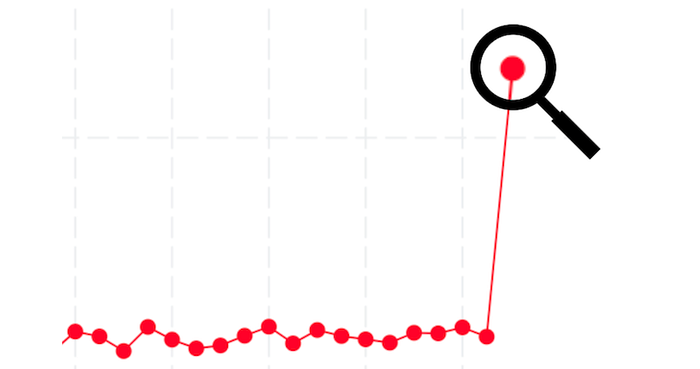

Netflix is used by 222 million members and runs on over 1700 device types ranging from state-of-the-art smart TVs to low-cost mobile devices.

At Netflix we’re [proud of our reliability](https://www.theverge.com/22787426/netflix-cdn-open-connect) and we want to keep it that way. To that end, it’s important that we prevent significant performance regressions from reaching the production app. Sluggish scrolling or late rendering is frustrating and triggers accidental navigations. Choppy playback makes watching a show less enjoyable. Any performance regression that makes it into a product release will degrade user experience, so the challenge is to detect and fix such regressions before they ship.

This post describes how the Netflix TVUI team implemented a robust strategy to quickly and easily detect performance anomalies before they are released — and often before they are even committed to the codebase.

## What do we mean by Performance?

Technically, “performance” metrics are those relating to the responsiveness or latency of the app, including start up time.

But TV devices also tend to be more memory constrained than other devices, and as such are more liable to crash during a memory spike — so for Netflix TV we actually care about memory at least as much as performance, maybe more so.

At Netflix the term “performance” usually encompasses both performance metrics (in the strict meaning) and memory metrics, and that’s how we’re using the term here.

## Why do we run Performance Tests on commits?

It’s harder to reason about the performance profile of pre-production code since we can’t gather real-time metrics for code that hasn’t yet shipped. We do cut a canary release in advance of shipment which is dogfooded by Netflix employees and subject to the same metrics collection as the production release. While the canary release is a useful dry-run for pending shipments, it sometimes misses regressions because the canary user base is a fraction of the production release. And in the event that regressions are detected in the canary, it still necessitates an often messy and time consuming revert or patch.

By running performance tests against every commit (pre- and post-merge), we can detect potentially regressive commits earlier. The sooner we detect such commits the fewer subsequent builds are affected and the easier it is to revert. Ideally we catch regressions before they even reach the main branch.

## What are the Performance Tests?

The goal of our TVUI Performance Tests is to gather memory and responsiveness metrics while simulating the full range of member interactions with Netflix TV.

There are roughly 50 performance tests, each one designed to reproduce an aspect of member engagement. The goal is to keep each test brief and focused on a specific, isolated piece of functionality (startup, profile switching, scrolling through titles, selecting an episode, playback etc.), while the test suite as a whole should cover the entire member experience with minimal duplication. In this way we can run multiple tests in parallel and the absence of long pole tests keeps the overall test time manageable and allows for repeat test runs. Every test runs on a combination of devices (physical and virtual) and platform versions (_SDKs_). We’ll refer to each unique test/device/SDK combination as a _test variation_.

We run the full performance suite twice per Pull Request (PR):

- **when the PR is first submitted**
- when the PR is merged to the destination branch

### Measurement

Each performance test tracks either memory or responsiveness. Both of these metrics will fluctuate over the course of a test, so we post metric values at regular intervals throughout the test. To compare test runs we need a method to consolidate this range of observed values into a single value.

We made the following decisions:

****Memory Tests:****** use the maximum memory value observed during the test run (because that’s the value that determines whether a device could crash).**

**Responsiveness Tests :** use the median value observed during the test run (based on the assumption that perceived slowness is influenced by all responses, not just the worst response).

## What are the Challenges?

When Netflix is running in production, we capture real-time performance data which makes it relatively easy to make assertions about the app’s performance. It’s much harder to assess the performance of pre-production code (changes merged to the main branch but not yet released) and harder still to get a performance signal for unmerged code in a PR. Performance test metrics are inferior to real-time usage metrics for several reasons:

- **Data volume:** In the Netflix app, the same steps are repeated billions of times, but developer velocity and resource constraints dictate that performance tests can only run a handful of times per build.
- **Simulation: **No matter how rigorous or creative our testing process is, we can only ever approximate the experience of real life users, never replicate it. Real users regularly use Netflix for hours at a time, and every user has different preferences and habits.
- **Noise: **Ideally a given codebase running any given test variation will always return identical results. In reality that just never happens: no two device CPUs are identical, garbage collection is not entirely predictable, API request volume and backend activity is variable — so are power levels and network bandwidth. For every test there will be background noise that we need to somehow filter from our analysis.

## Initial Approach: Static Thresholds

For our first attempt at performance validation we assigned maximum acceptable threshold values for memory metrics. There was a sound rationale behind this approach — when a TV runs Netflix there is a hard limit for memory footprint beyond which Netflix has the potential to crash.

There were several issues with the static thresholds approach:

- **Custom preparation work per test:** Since each test variation has a unique memory profile, the appropriate static threshold had to be researched and assigned on a case-by-case basis. This was difficult and time consuming, so we only assigned thresholds to about 30% of test variations.
- **Lack of context:** As a validation technique, static thresholds proved to be somewhat arbitrary. Imagine a commit that increases memory usage by 10% but to a level which is just below the threshold. The next commit might be a README change (zero memory impact) but due to normal variations in device background noise, the metric could increase by just enough to breach the threshold.
- **Background variance is not filtered:** Once the codebase is bumping against the memory threshold, background device noise becomes the principal factor determining which side of the threshold line the test result falls.

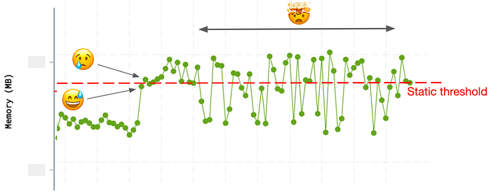
*Unreliable regression signals with static Threshold technique*

- **Post-alert adjustments:** We found ourselves repeatedly increasing the thresholds to move them clear of background noise

## The Pivot: Anomaly and Changepoint Detection

It became apparent we needed a technique for performance validation that:

- **Removes failure bias** by giving equal weight to all test runs, regardless of results
- **Doesn’t treat performance data points in isolation**, but instead assesses the performance impact of a build in relation to previous builds.
- **Can be automatically applied to every test** without the need for pre-hoc research, data entry or ongoing manual intervention
- **Could be equally applied to test data of any type**: memory, responsiveness, or any other non-boolean test data
- **Minimizes the impact of background noise** by prioritizing variance over absolute values
- **Improves insight** by examining data points both at the time of creation and retroactively

We settled on a two-pronged approach:

- **Anomaly Detection** immediately calls out potential performance regressions by comparing with recent past data

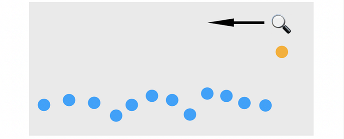

- **Changepoint Detection** identifies more subtle performance inflections by examining past and future data clusters

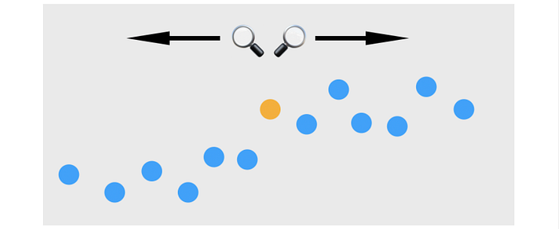

### Anomaly Detection

We define an anomaly as any metric data point that is more than _n_ standard deviations above the recent mean, where recent mean and standard deviation are derived from the previous _m_ test runs. For Netflix TV performance tests we currently set _n_ to 4 and _m_ to 40 but these values can be tweaked to maximize signal to noise ratio. When an anomaly is detected the test status is set to _failed_ and an alert is generated.

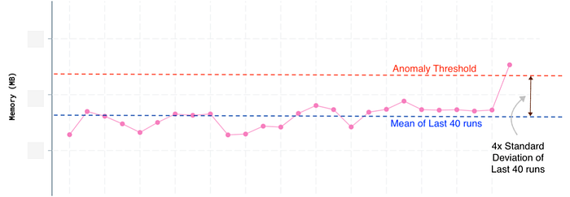

Anomaly detection works because thresholds are dynamic and derived from existing data. If the data exhibits a lot of background variance then the anomaly threshold will increase to account for the extra noise.

### Changepoints

Changepoints are data points at the boundary of two distinct data distribution patterns. We use a technique called [e-divisive](https://arxiv.org/pdf/1306.4933.pdf) to analyze the 100 most recent test runs, using a Python implementation based on [this implementation](https://github.com/mongodb/signal-processing-algorithms/blob/master/src/signal_processing_algorithms/energy_statistics/energy_statistics.py#L222).

Since we’re only interested in performance regressions, we ignore changepoints that trend lower. When a changepoint is detected for a test, we don’t fail the test or generate an alert (we consider changepoints to be warnings of unusual patterns, not full blown error assertions).

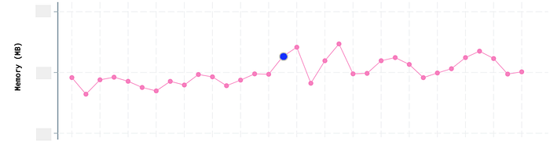

As you can see, changepoints are a more subtle signal. They don’t necessarily indicate a regression but they suggest builds that had an impact on subsequent data distribution.

Builds that generate changepoints across multiple tests, warrant further investigation before they can be included in the release candidate.

Changepoints give us more confidence in regression detection because they disregard false positives such as one time data spikes. Because changepoint detection requires after-the-fact data, they are best suited to identifying potentially regressive code that is already in the main branch but has not yet been shipped.

## Additional Adjustments

### Runs per Test

To address failure bias, we decided to run all tests 3 times, regardless of the result. We chose 3 iterations to provide enough data to eliminate most device noise (tests are allocated to devices randomly) without creating a productivity bottleneck.

### Summarizing across Test Runs

Next we needed to decide on a methodology to compress the results of each batch of 3 runs into a single value. The goal was to ignore outlier results caused by erratic device behavior.

Initially we took the average of those three runs, but that led to an excess of false positives because the most irregular test runs exerted too much influence on the result. Switching to the median eliminated some of these false positives but we were still getting an unacceptable number of excess alerts (because during periods of high device noise we would occasionally see outlier results two times out of three). Finally, since we noticed that outlier results tended to be higher than normal — rarely lower — we settled on using the minimum value across the 3 runs and this proved to be the most effective at eliminating external noise.

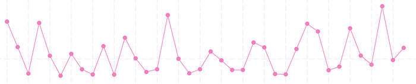
*All data points (3 runs per build)*

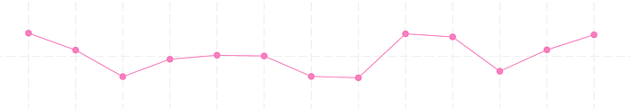
*Selecting median value per build*

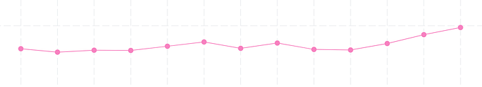
*Selecting minimum value per build*

## What were the Results?

After switching our performance validation to use anomaly and changepoint detection we noticed several improvements.

a) We are alerted for potential performance regressions far less often, and when we do get alerted it’s much more likely to indicate a genuine regression. Our workload is further reduced by no longer having to manually increment static performance thresholds after each false positive.

The following table represents the alert summary for two distinct months last year. In March 2021 we still used static thresholds for regression alerts. By October 2021 we had switched using anomaly detection for regression alerts. _Alerts which were true regressions_ is the number of alerted commits for which the suspected regression turned out to be both significant and persistent.

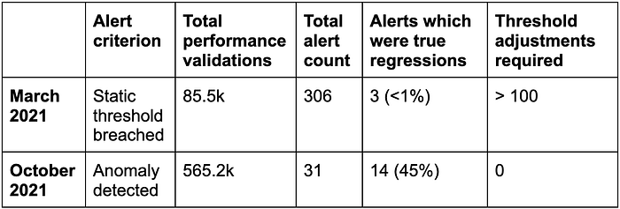

Note that since the March tests only validated when a threshold was manually set, the total number of validating test runs in October was much greater, and yet we still got only 10% of the alerts.

b) We are not alerted for subsequent innocuous builds that inherit regressive commits from preceding builds. (Using the static threshold technique, all subsequent builds were alerted until the regressive build was reverted.) This is because regressive builds increase both mean and standard deviation and thus put subsequent non-regressing builds comfortably below the alert threshold.

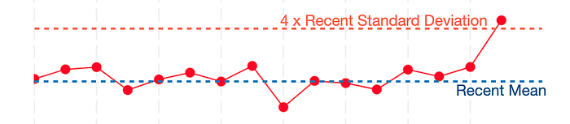
*Regressive build is above alert threshold*

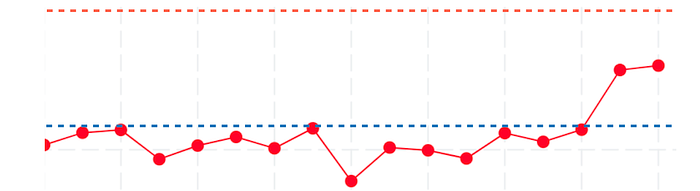
*Subsequent build is easily below alert threshold*

c) Performance tests against PRs, which had been almost constantly red (because the probability of at least one static threshold being breached was always high), are now mostly green. When the performance tests _are_ red we have a much higher confidence that there is a genuine performance regression.

d) Displaying the anomaly and changepoint count per build provides a visual snapshot that quickly highlights potentially problematic builds.

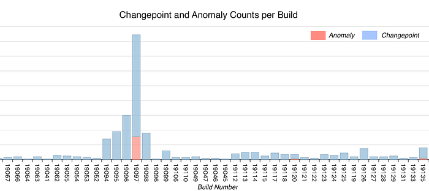

## What’s Next?

### Further Work

There are still several things we’d like to improve

- **Make it easier to determine if regressions were due to external agents:** Often it turns out the detected regression, though real, was not a result of the committed code but due to an external factor such as an upgrade to one of our platform dependencies, or a feature flag that got switched on. It would be helpful to summarize external changes in our alert summaries.
- **Factor out resolved regressions when determining baselines for validation:**   
When generating recent mean and standard deviation values, we could improve regression detection by filtering out data from erstwhile regressions that have since been fixed.
- **Improve Developer Velocity:** We can further reduce total test time by removing unnecessary iterations within tests, adding more devices to ensure availability, and de-emphasizing testing for those parts of the app where performance is less likely to be critical. We can also pre-build app bundles (at least partially) so that the test suite is not delayed by waiting for fresh builds.
- **More closely mirror metrics gathered by the production app:** In the deployed Netflix TV app we collect additional metrics such as TTR (time to render) and empty box rate (how frequently titles in the viewport are missing images). While test metrics and metrics collected during real use do not lend themselves to direct comparison, measuring the relative change in metrics in pre-production builds can help us to anticipate regressions in production.

### Wider Adoption and New Use Cases

At this point Anomaly and Changepoint detection is applied to every commit in the TVUI repo, and is in the process of being deployed for commits to the TV Player repo (the layer that manages playback operations). Other Netflix teams (outside of the TV platform) have also expressed interest in these techniques and the ultimate goal is to standardize regression detection across Netflix.

Anomaly and changepoint detection are entirely framework independent — the only required inputs are a current value and an array of recent values to compare it to. As such, their utility extends far beyond performance tests. For example, we are considering using these techniques to monitor the reliability of non-performance-based test suites — in this case the metric of interest is the percent of tests that ran to completion.

In the future we plan to decouple anomaly and changepoint logic from our test infrastructure and offer it as a standalone open-source library.

## Wrap Up

By using techniques that assess the performance impact of a build in relation to the performance characteristics (magnitude, variance, trend) of adjacent builds, we can more confidently distinguish genuine regressions from metrics that are elevated for other reasons (e.g. inherited code, regressions in previous builds or one-off data spikes due to test irregularities). We also spend less time chasing false negatives and no longer need to manually assign a threshold to each result — the data itself now sets the thresholds dynamically.

This improved efficiency and higher confidence level helps us to quickly identify and fix regressions before they reach our members.

The anomaly and changepoint techniques discussed here can be used to identify regressions (or progressions), unexpected values or inflection points in any chronologically sequenced, quantitative data. Their utility extends well beyond performance analysis. For example they could be used to identify inflection points in system reliability, customer satisfaction, product usage, download volume or revenue.

We encourage you to try these techniques on your own data. We’d love to learn more about their success (or otherwise) in other contexts!

---
**Tags:** Performance · Testing · Regression · Anomaly · Changepoint
