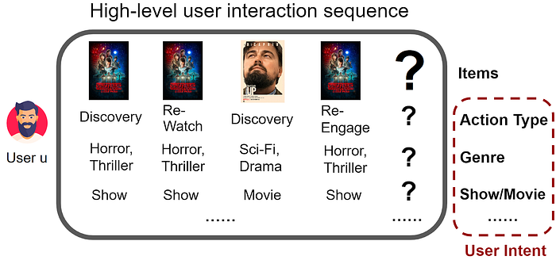
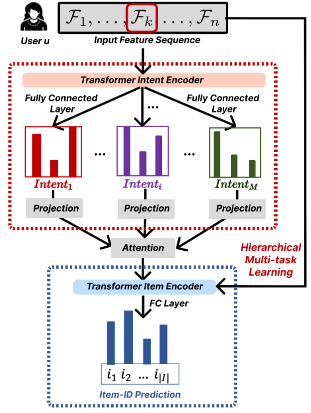
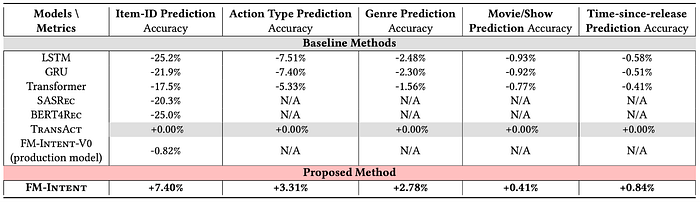
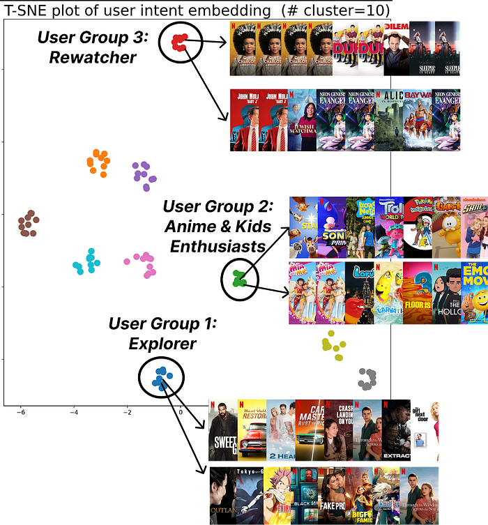

# FM-Intent: Predicting User Session Intent with Hierarchical Multi-Task Learning

Authors: [Sejoon Oh](https://www.linkedin.com/in/sejoon-oh/), [Moumita Bhattacharya](https://www.linkedin.com/in/moumitab/), [Yesu Feng](https://www.linkedin.com/in/yesufeng/), [Sudarshan Lamkhede](https://www.linkedin.com/in/sudarshanlamkhede/), [Ko-Jen Hsiao](https://www.linkedin.com/in/markhsiao/), and [Justin Basilico](https://www.linkedin.com/in/jbasilico/)

## Motivation

Recommender systems have become essential components of digital services across e-commerce, streaming media, and social networks [1, 2]. At Netflix, these systems drive significant product and business impact by connecting members with relevant content at the right time [3, 4]. While our recommendation **foundation model (FM)** has made substantial progress in understanding user preferences through large-scale learning from interaction histories (please refer to this [**_article_**](https://netflixtechblog.medium.com/foundation-model-for-personalized-recommendation-1a0bd8e02d39) about FM @ Netflix), there is an opportunity to further enhance its capabilities. By extending FM to incorporate the prediction of underlying user intents, we aim to enrich its understanding of user sessions beyond next-item prediction, thereby offering a more comprehensive and nuanced recommendation experience.

Recent research has highlighted the importance of understanding user intent in online platforms [5, 6, 7, 8]. As Xia et al. [8] demonstrated at Pinterest, predicting a user’s future intent can lead to more accurate and personalized recommendations. However, existing intent prediction approaches typically employ simple multi-task learning that adds intent prediction heads to next-item prediction models without establishing a hierarchical relationship between these tasks.

To address these limitations, we introduce **_FM-Intent_**, a novel recommendation model that enhances our foundation model through hierarchical multi-task learning. FM-Intent captures a user’s latent session intent using both short-term and long-term implicit signals as proxies, then leverages this intent prediction to improve next-item recommendations. Unlike conventional approaches, FM-Intent establishes a clear hierarchy where intent predictions directly inform item recommendations, creating a more coherent and effective recommendation pipeline.

FM-Intent makes three key contributions:

1. A novel recommendation model that captures user intent on the Netflix platform and enhances next-item prediction using this intent information.
2. A hierarchical multi-task learning approach that effectively models both short-term and long-term user interests.
3. Comprehensive experimental validation showing significant performance improvements over state-of-the-art models, including our foundation model.

## Understanding User Intent in Netflix

In the Netflix ecosystem, user intent manifests through various interaction metadata, as illustrated in Figure 1. FM-Intent leverages these implicit signals to predict both user intent and next-item recommendations.

_Figure 1: Overview of user engagement data in Netflix. User intent can be associated with several interaction metadata. We leverage various implicit signals to predict user intent and next-item._

In Netflix, there can be multiple types of user intents. For instance,

> **_Action Type_**: Categories reflecting what users intend to do on Netflix, such as discovering new content versus continuing previously started content. For example, when a member plays a follow-up episode of something they were already watching, this can be categorized as “continue watching” intent.**_Genre Preference_**: The pre-defined genre labels (e.g., Action, Thriller, Comedy) that indicate a user’s content preferences during a session. These preferences can shift significantly between sessions, even for the same user.**_Movie/Show Type_**: Whether a user is looking for a movie (typically a single, longer viewing experience) or a TV show (potentially multiple episodes of shorter duration).**_Time-since-release_**: Whether the user prefers newly released content, recent content (e.g., between a week and a month), or evergreen catalog titles.

**These dimensions serve as proxies for the latent user intent, which is often not directly observable but crucial for providing relevant recommendations.**

## FM-Intent Model Architecture

FM-Intent employs a hierarchical multi-task learning approach with three major components, as illustrated in Figure 2.

_Figure 2: An architectural illustration of our hierarchical multi-task learning model FM-Intent for user intent and item predictions. We use ground-truth intent and item-ID labels to optimize predictions._

### 1. Input Feature Sequence Formation

The first component constructs rich input features by combining interaction metadata. The input feature for each interaction combines categorical embeddings and numerical features, creating a comprehensive representation of user behavior.

### 2. User Intent Prediction

The intent prediction component processes the input feature sequence through a Transformer encoder and generates predictions for multiple intent signals.

The Transformer encoder effectively models the long-term interest of users through multi-head attention mechanisms. For each prediction task, the intent encoding is transformed into prediction scores via fully-connected layers.

A key innovation in FM-Intent is the attention-based aggregation of individual intent predictions. This approach generates a comprehensive intent embedding that captures the relative importance of different intent signals for each user, providing valuable insights for personalization and explanation.

### 3. Next-Item Prediction with Hierarchical Multi-Task Learning

The final component combines the input features with the user intent embedding to make more accurate next-item recommendations.

FM-Intent employs hierarchical multi-task learning where intent predictions are conducted first, and their results are used as input features for the next-item prediction task. This hierarchical relationship ensures that the next-item recommendations are informed by the predicted user intent, creating a more coherent and effective recommendation model.

## Offline Results

We conducted comprehensive offline experiments on sampled Netflix user engagement data to evaluate FM-Intent’s performance. Note that FM-Intent uses a much smaller dataset for training compared to the FM production model due to its complex hierarchical prediction architecture.

### Next-Item and Next-Intent Prediction Accuracy

Table 1 compares FM-Intent with several state-of-the-art sequential recommendation models, including our production model (FM-Intent-V0).

_Table 1: Next-item and next-intent prediction results of baselines and our proposed method FM-Intent on the Netflix user engagement dataset._

All metrics are represented as relative % improvements compared to the SOTA baseline: TransAct. N/A indicates that a model is not capable of predicting a certain intent. Note that we added additional fully-connected layers to LSTM, GRU, and Transformer baselines in order to predict user intent, while we used original implementations for other baselines. FM-Intent demonstrates statistically significant improvement of 7.4% in next-item prediction accuracy compared to the best baseline (TransAct).

Most baseline models show limited performance as they either cannot predict user intent or cannot incorporate intent predictions into next-item recommendations. Our production model (FM-Intent-V0) performs well but lacks the ability to predict and leverage user intent. Note that FM-Intent-V0 is trained with a smaller dataset for a fair comparison with other models; the actual production model is trained with a much larger dataset.

## Qualitative Analysis: User Clustering

_Figure 3: K-means++ (K=10) clustering of user intent embeddings found by FM-Intent; FM-Intent finds unique clusters of users that share the similar intent._

FM-Intent generates meaningful user intent embeddings that can be used for clustering users with similar intents. Figure 3 visualizes 10 distinct clusters identified through K-means++ clustering._ _These clusters reveal meaningful user segments with distinct viewing patterns:

- Users who primarily discover new content versus those who continue watching recent/favorite content.
- Genre enthusiasts (e.g., _anime/kids content viewers_).
- Users with specific viewing patterns (e.g., _Rewatchers_ versus _casual viewers_).

## Potential Applications of FM-Intent

FM-Intent has been successfully integrated into Netflix’s recommendation ecosystem, can be leveraged for several downstream applications:

> **Personalized UI Optimization**: The predicted user intent could inform the layout and content selection on the Netflix homepage, emphasizing different rows based on whether users are in discovery mode, continue-watching mode, or exploring specific genres.**Analytics and User Understanding**: Intent embeddings and clusters provide valuable insights into viewing patterns and preferences, informing content acquisition and production decisions.**Enhanced Recommendation Signals**: Intent predictions serve as features for other recommendation models, improving their accuracy and relevance.**Search Optimization**: Real-time intent predictions help prioritize search results based on the user’s current session intent.

## Conclusion

FM-Intent represents an advancement in Netflix’s recommendation capabilities by enhancing them with hierarchical multi-task learning for user intent prediction. Our comprehensive experiments demonstrate that FM-Intent significantly outperforms state-of-the-art models, including our prior foundation model that focused solely on next-item prediction. By understanding not just what users might watch next but what underlying intents users have, we can provide more personalized, relevant, and satisfying recommendations.

## Acknowledgements

We thank our stunning colleagues in the Foundation Model team & AIMS org. for their valuable feedback and discussions. We also thank our partner teams for getting this up and running in production.

## References

[1] Amatriain, X., & Basilico, J. (2015). Recommender systems in industry: A netflix case study. In Recommender systems handbook (pp. 385–419). Springer.

[2] Gomez-Uribe, C. A., & Hunt, N. (2015). The netflix recommender system: Algorithms, business value, and innovation. ACM Transactions on Management Information Systems (TMIS), 6(4), 1–19.

[3] Jannach, D., & Jugovac, M. (2019). Measuring the business value of recommender systems. ACM Transactions on Management Information Systems (TMIS), 10(4), 1–23.

[4] Bhattacharya, M., & Lamkhede, S. (2022). Augmenting Netflix Search with In-Session Adapted Recommendations. In Proceedings of the 16th ACM Conference on Recommender Systems (pp. 542–545).

[5] Chen, Y., Liu, Z., Li, J., McAuley, J., & Xiong, C. (2022). Intent contrastive learning for sequential recommendation. In Proceedings of the ACM Web Conference 2022 (pp. 2172–2182).

[6] Ding, Y., Ma, Y., Wong, W. K., & Chua, T. S. (2021). Modeling instant user intent and content-level transition for sequential fashion recommendation. IEEE Transactions on Multimedia, 24, 2687–2700.

[7] Liu, Z., Chen, H., Sun, F., Xie, X., Gao, J., Ding, B., & Shen, Y. (2021). Intent preference decoupling for user representation on online recommender system. In Proceedings of the Twenty-Ninth International Conference on International Joint Conferences on Artificial Intelligence (pp. 2575–2582).

[8] Xia, X., Eksombatchai, P., Pancha, N., Badani, D. D., Wang, P. W., Gu, N., Joshi, S. V., Farahpour, N., Zhang, Z., & Zhai, A. (2023). TransAct: Transformer-based Realtime User Action Model for Recommendation at Pinterest. In Proceedings of the 29th ACM SIGKDD Conference on Knowledge Discovery and Data Mining (pp. 5249–5259).

---
**Tags:** Foundation Models · AI · Machine Learning · Deep Learning · Personalization
