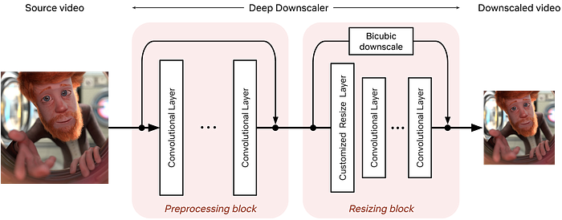
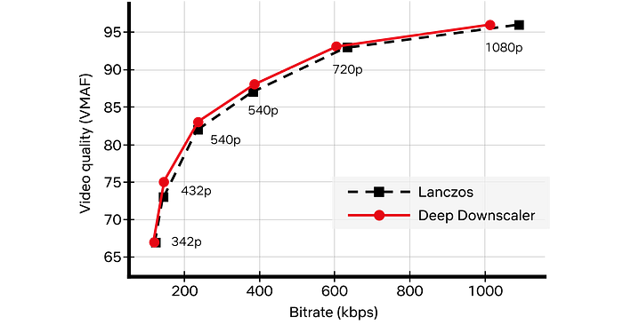
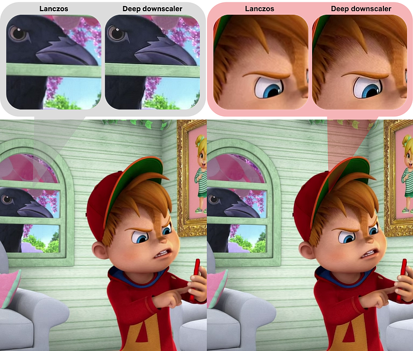
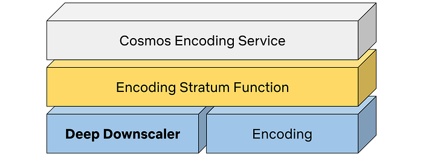

# For your eyes only: improving Netflix video quality with neural networks

_by _[_Christos G. Bampis_](https://www.linkedin.com/in/christosbampis/)_, _[_Li-Heng Chen_](https://www.linkedin.com/in/li-heng-chen-a75458a2/)_ and _[_Zhi Li_](https://www.linkedin.com/in/henryzhili/)

When you are **binge-watching** the latest season of Stranger Things or Ozark, we strive to deliver the best possible video quality to your eyes. To do so, we continuously push the boundaries of streaming video quality and leverage the best video technologies. For example, we invest in [next-generation, royalty-free codecs](./bringing-av1-streaming-to-netflix-members-tvs-b7fc88e42320.md) and sophisticated [video encoding optimizations](https://netflixtechblog.com/dynamic-optimizer-a-perceptual-video-encoding-optimization-framework-e19f1e3a277f). Recently, we added another powerful tool to our arsenal: neural networks for video downscaling. In this tech blog, we describe how we improved Netflix video quality with neural networks, the challenges we faced and what lies ahead.

## How can neural networks fit into Netflix video encoding?

There are, roughly speaking, two steps to encode a video in our pipeline:

1. Video preprocessing, which encompasses any transformation applied to the high-quality source video prior to encoding. Video downscaling is the most pertinent example herein, which tailors our encoding to screen resolutions of different devices and optimizes picture quality under varying network conditions. With video downscaling, multiple resolutions of a source video are produced. For example, a 4K source video will be downscaled to 1080p, 720p, 540p and so on. This is typically done by a conventional resampling filter, like Lanczos.
2. Video encoding using a conventional video codec, like [AV1](./bringing-av1-streaming-to-netflix-members-tvs-b7fc88e42320.md). Encoding drastically reduces the amount of video data that needs to be streamed to your device, by leveraging spatial and temporal redundancies that exist in a video.

We identified that we can leverage neural networks (NN) to improve Netflix video quality, by replacing conventional video downscaling with a neural network-based one. This approach, which we dub “deep downscaler,” has a few key advantages:

- A learned approach for downscaling can improve video quality and be tailored to Netflix content.
- It can be integrated as a drop-in solution, i.e., we do not need any other changes on the Netflix encoding side or the client device side. Millions of devices that support Netflix streaming automatically benefit from this solution.
- A distinct, NN-based, video processing block can evolve independently, be used beyond video downscaling and be combined with different codecs.

Of course, we believe in the transformative potential of NN throughout video applications, beyond video downscaling. While conventional video codecs remain prevalent, NN-based video encoding tools are flourishing and closing the performance gap in terms of compression efficiency. The deep downscaler is our pragmatic approach to improving video quality with neural networks.

## Our approach to NN-based video downscaling

The deep downscaler is a neural network architecture designed to improve the end-to-end video quality by learning a higher-quality video downscaler. It **consists of two building blocks, a preprocessing block and a resizing block. The preprocessing block aims to prefilter the video signal prior to the subsequent resizing operation. The resizing block yields the lower-resolution video signal that serves as input to an encoder.** We employed an adaptive network design that is applicable to the wide variety of resolutions we use for encoding.

*Architecture of the deep downscaler model, consisting of a preprocessing block followed by a resizing block.*

During training, our goal is to generate the best downsampled representation such that, after upscaling, the mean squared error is minimized. Since we cannot directly optimize for a conventional video codec, which is non-differentiable, we exclude the effect of lossy compression in the loop. We focus on a robust downscaler that is trained given a conventional upscaler, like bicubic. Our training approach is intuitive and results in a downscaler that is not tied to a specific encoder or encoding implementation. Nevertheless, it requires a thorough evaluation to demonstrate its potential for broad use for Netflix encoding.

## Improving Netflix video quality with neural networks

The goal of the deep downscaler is to improve the end-to-end video quality for the Netflix member. Through our experimentation, involving objective measurements and subjective visual tests, we found that the deep downscaler improves quality across various conventional video codecs and encoding configurations.

For example, for VP9 encoding and assuming a bicubic upscaler, we measured an average VMAF [Bjøntegaard-Delta (BD) rate](https://www.itu.int/wftp3/av-arch/video-site/0104_Aus/VCEG-M33.doc) gain of ~5.4% over the traditional Lanczos downscaling. We have also measured a ~4.4% BD rate gain for [VMAF-NEG](https://docs.google.com/document/d/1dJczEhXO0MZjBSNyKmd3ARiCTdFVMNPBykH4_HMPoyY/edit). We showcase an example result from one of our Netflix titles below. The deep downscaler (red points) delivered higher VMAF at similar bitrate or yielded comparable VMAF scores at a lower bitrate.

Besides objective measurements, we also conducted human subject studies to validate the visual improvements of the deep downscaler. In our preference-based visual tests, we found that the deep downscaler was preferred by ~77% of test subjects, across a wide range of encoding recipes and upscaling algorithms. Subjects reported a better detail preservation and sharper visual look. A visual example is shown below.

*Left: Lanczos downscaling; right: deep downscaler. Both videos are encoded with VP9 at the same bitrate and were upscaled to FHD resolution (1920x1080). You may need to zoom in to see the visual difference.*

We also performed A/B testing to understand the overall streaming impact of the deep downscaler, and detect any device playback issues. Our A/B tests showed QoE improvements without any adverse streaming impact. This shows the benefit of deploying the deep downscaler for all devices streaming Netflix, without playback risks or quality degradation for our members.

## How do we apply neural networks at scale efficiently?

Given our scale, applying neural networks can lead to a significant increase in encoding costs. In order to have a viable solution, we took several steps to improve efficiency.

- The neural network architecture was designed to be computationally efficient and also avoid any negative visual quality impact. For example, we found that just a few neural network layers were sufficient for our needs. To reduce the input channels even further, we only apply NN-based scaling on luma and scale chroma with a standard Lanczos filter.
- We implemented the deep downscaler as an [FFmpeg](https://ffmpeg.org/)-based filter that runs together with other video transformations, like pixel format conversions. Our filter can run on both CPU and GPU. On a CPU, we leveraged [oneDnn](https://www.intel.com/content/www/us/en/developer/tools/oneapi/onednn.html#gs.ftr5vd) to further reduce latency.

## Integrating neural networks into our next-generation encoding platform

The Encoding Technologies and Media Cloud Engineering teams at Netflix have jointly innovated to bring [Cosmos](./the-netflix-cosmos-platform-35c14d9351ad.md), our next-generation encoding platform, to life. Our deep downscaler effort was an excellent opportunity to showcase how Cosmos can drive future media innovation at Netflix. The following diagram shows a top-down view of how the deep downscaler was integrated within a Cosmos encoding microservice.

*A top-down view of integrating the deep downscaler into Cosmos.*

A Cosmos encoding microservice can serve multiple encoding workflows. For example, a service can be called to perform complexity analysis for a high-quality input video, or generate encodes meant for the actual Netflix streaming. Within a service, a Stratum function is a serverless layer dedicated to running stateless and computationally-intensive functions. Within a Stratum function invocation, our deep downscaler is applied prior to encoding. Fueled by Cosmos, we can leverage the underlying [Titus infrastructure](https://netflixtechblog.com/titus-the-netflix-container-management-platform-is-now-open-source-f868c9fb5436) and run the deep downscaler on all our multi-CPU/GPU environments at scale.

## What lies ahead

The deep downscaler paves the path for more NN applications for video encoding at Netflix. But our journey is not finished yet and we strive to improve and innovate. For example, we are studying a few other use cases, such as video denoising. We are also looking at more efficient solutions to applying neural networks at scale. We are interested in how NN-based tools can shine as part of next-generation codecs. At the end of the day, we are passionate about using new technologies to improve Netflix video quality. For your eyes only!

## Acknowledgments

We would like to acknowledge the following individuals for their help with the deep downscaler project:

Lishan Zhu, Liwei Guo, Aditya Mavlankar, Kyle Swanson and Anush Moorthy (Video Image and Encoding team), Mariana Afonso and Lukas Krasula (Video Codecs and Quality team), Ameya Vasani (Media Cloud Engineering team), Prudhvi Kumar Chaganti (Streaming Encoding Pipeline team), Chris Pham and Andy Rhines (Data Science and Engineering team), Amer Ather (Netflix performance team), the Netflix Metaflow team and Prof. Alan Bovik (University of Texas at Austin).

---
**Tags:** Neural Networks · Improve Video Quality · Video Quality · Netflix
