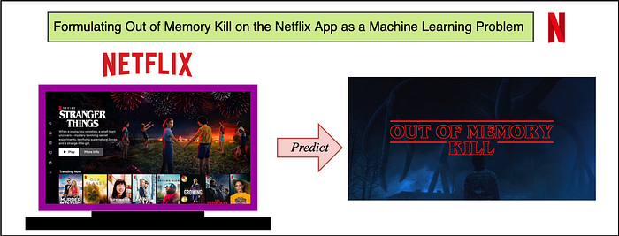
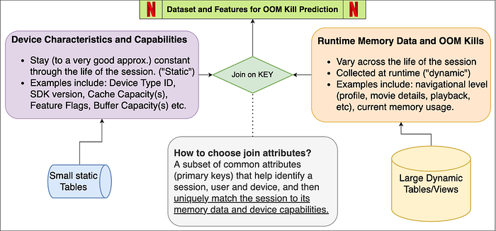
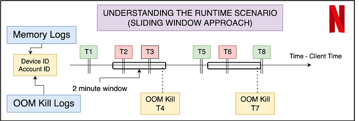
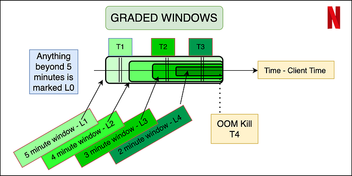
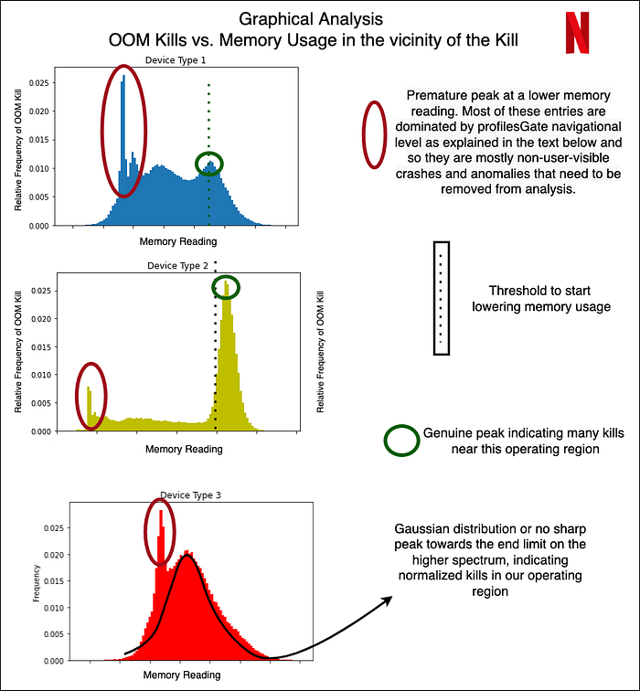

# Formulating ‘Out of Memory Kill’ Prediction on the Netflix App as a Machine Learning Problem

_by _[_Aryan Mehra_](https://in.linkedin.com/in/aryanmehra1999)_  
with _[_Farnaz Karimdady Sharifabad_](https://www.linkedin.com/in/farnaz-karimdady)_, _[_Prasanna Vijayanathan_](https://www.linkedin.com/in/pvijayanathan)_, _[_Chaïna Wade_](https://www.linkedin.com/in/chainawade)_, _[_Vishal Sharma_](https://www.linkedin.com/in/vshl)_ and _[_Mike Schassberger_](https://www.linkedin.com/in/schassberger)

## Aim and Purpose — Problem Statement

The purpose of this article is to give insights into analyzing and predicting “out of memory” or OOM kills on the Netflix App. Unlike strong compute devices, TVs and set top boxes usually have stronger memory constraints. More importantly, the low resource availability or “out of memory” scenario is one of the common reasons for crashes/kills. We at Netflix, as a streaming service running on millions of devices, have a tremendous amount of data about device capabilities/characteristics and runtime data in our big data platform. With large data, comes the opportunity to leverage the data for predictive and classification based analysis. Specifically, if we are able to predict or analyze the Out of Memory kills, we can take device specific actions to pre-emptively lower the performance in favor of not crashing — aiming to give the user the ultimate Netflix Experience within the “performance vs pre-emptive action” tradeoff limitations. A major advantage of prediction and taking pre-emptive action, is the fact that we can take actions to better the user experience.

This is done by first elaborating on the dataset curation stage — specially focussing on device capabilities and OOM kill related memory readings. We also highlight steps and guidelines for exploratory analysis and prediction to understand Out of Memory kills on a sample set of devices. Since memory management is not something one usually associates with classification problems, this blog focuses on formulating the problem as an ML problem and the data engineering that goes along with it. We also explore graphical analysis of the labeled dataset and suggest some feature engineering and accuracy measures for future exploration.

## Challenges of Dataset Curation and Labeling

Unlike other Machine Learning tasks, OOM kill prediction is tricky because the dataset will be polled from different sources — device characteristics come from our infield knowledge and runtime memory data comes from real-time user data pushed to our servers.

Secondly, and more importantly, the sheer volume of the runtime data is a lot. Several devices running Netflix will log memory usage at fixed intervals. Since the Netflix App does not get killed very often (fortunately!), this means most of these entries represent normal/ideal/as expected runtime states. The dataset will thus be very biased/skewed. We will soon see how we actually label which entries are erroneous and which are not.

## Dataset Features and Components

The schema figure above describes the two components of the dataset — device capabilities/characteristics and runtime memory data. When joined together based on attributes that can uniquely match the memory entry with its device’s capabilities. These attributes may be different for different streaming services — for us at Netflix, this is a combination of the device type, app session ID and software development kit version (SDK version). We now explore each of these components individually, while highlighting the nuances of the data pipeline and pre-processing.

### Device Capabilities

All the device capabilities may not reside in one source table — requiring multiple if not several joins to gather the data. While creating the device capability table, we decided to primary index it through a composite key of (device type ID, SDK version). So given these two attributes, Netflix can uniquely identify several of the device capabilities. Some nuances while creating this dataset come from the infield domain knowledge of our engineers. Some features (as an example) include Device Type ID, SDK Version, Buffer Sizes, Cache Capacities, UI resolution, Chipset Manufacturer and Brand.

### Major Milestones in Data Engineering for Device Characteristics

**Structuring the data in an ML-consumable format**: The device capability data needed for the prediction was distributed in over three different schemas across the [Big Data Platform.](https://netflixtechblog.com/search?q=big+data+platform) Joining them together and building a single indexable schema that can directly become a part of a bigger data pipeline is a big milestone.

**Dealing with ambiguities and missing data**: Sometimes the entries in BDP are contaminated with testing entries and NULL values, along with ambiguous values that have no meaning or just simply contradictory values due to unreal test environments. We deal with all of this by a simple majority voting (statistical mode) on the view that is indexed by the device type ID and SDK version from the user query. We thus verify the hypothesis that actual device characteristics are always in majority in the data lake.

**Incorporating On-site and field knowledge of devices and engineers**: This is probably the single most important achievement of the task because some of the features mentioned above (and some of the ones redacted) involved engineering the features manually. Example: Missing values or NULL values might mean the absence of a flag or feature in some attribute, while it might require extra tasks in others. So if we have a missing value for a feature flag, that might mean “False”, whereas a missing value in some buffer size feature might mean that we need subqueries to fetch and fill the missing data.

### Runtime Memory, OOM Kill Data and ground truth labeling

Runtime data is always increasing and constantly evolving. The tables and views we use are refreshed every 24 hours and joining between any two such tables will lead to tremendous compute and time resources. In order to curate this part of the dataset, we suggest some tips given below (written from the point of view of SparkSQL-like distributed query processors):

- Filtering the entries (conditions) before JOIN, and for this purpose using WHERE and LEFT JOIN clauses carefully. Conditions that eliminate entries after the join operation are much more expensive than when elimination happens before the join. It also prevents the system running out of memory during execution of the query.
- Restricting Testing and Analysis to one day and device at a time. It is always good to pick a single high frequency day like New Years, or Memorial day, etc. to increase frequency counts and get normalized distributions across various features.
- Striking a balance between driver and executor memory configurations in SparkSQL-like systems. Too high allocations may fail and restrict system processes. Too low memory allocations may fail at the time of a local collect or when the driver tries to accumulate the results.

### Labeling the data — Ground Truth

An important aspect of the dataset is to understand what features will be available to us at inference time. Thus memory data (that contains the navigational level and memory reading) can be labeled using the OOM kill data, but the latter cannot be reflected in the input features. The best way to do this is to use a sliding window approach where we label the memory readings of the sessions in a fixed window before the OOM kill as erroneous, and the rest of the entries as non-erroneous. In order to make the labeling more granular, and bring more variation in a binary classification model, we propose a graded window approach as explained by the image below. Basically, it assigns higher levels to memory readings closer to the OOM kill, making it a multi-class classification problem. Level 4 is the most near to the OOM kill (range of 2 minutes), whereas Level 0 is beyond 5 minutes of any OOM kill ahead of it. We note here that the device and session of the OOM kill instance and the memory reading needs to match for the sanity of the labeling. Later the confusion matrix and model’s results can later be reduced to binary if need be.

## Summary of OOM Prediction — Problem Formulation

The dataset now consists of several entries — each of which has certain runtime features (navigational level and memory reading in our case) and device characteristics (a mix of over 15 features that may be numerical, boolean or categorical). **The output variable is the graded or ungraded classification variable which is labeled in accordance with the section above — primarily based on the nearness of the memory reading stamp to the OOM kill.** Now we can use any multi-class classification algorithm — ANNs, XGBoost, AdaBoost, ElasticNet with softmax etc. Thus we have successfully formulated the problem of OOM kill prediction for a device streaming Netflix.

## Data Analysis and Observations

Without diving very deep into the actual devices and results of the classification, we now show some examples of how we could use the structured data for some preliminary analysis and make observations. We do so by just looking at the peak of OOM kills in a distribution over the memory readings within 5 minutes prior to the kill.

*Different device types*

From the graph above, we show how even without doing any modeling, the structured data can give us immense knowledge about the memory domain. For example, the early peaks (marked in red) are mostly crashes not visible to users, but were marked erroneously as user-facing crashes. The peaks marked in green are real user-facing crashes. Device 2 is an example of a sharp peak towards the higher memory range, with a decline that is sharp and almost no entries after the peak ends. Hence, for Device 1 and 2, the task of OOM prediction is relatively easier, after which we can start taking pre-emptive action to lower our memory usage. In case of Device 3, we have a normalized gaussian like distribution — indicating that the OOM kills occur all over, with the decline not being very sharp, and the crashes happen all over in an approximately normalized fashion.

## Feature Engineering, Accuracy Measures and Future Work Directions

We leave the reader with some ideas to engineer more features and accuracy measures specific to the memory usage context in a streaming environment for a device.

- We could manually engineer features on memory to utilize the time-series nature of the memory value when aggregated over a user’s session. Suggestions include a running mean of the last 3 values, or a difference of the current entry and running exponential average. The analysis of the growth of memory by the user could give insights into whether the kill was caused by in-app streaming demand, or due to external factors.
- Another feature could be the time spent in different navigational levels. Internally, the app caches several pre-fetched data, images, descriptions etc, and the time spent in the level could indicate whether or not those caches are cleared.
- When deciding on accuracy measures for the problem, it is important to analyze the distinction between false positives and false negatives. The dataset (fortunately for Netflix!) will be highly biased — as an example, over 99.1% entries are non-kill related. In general, false negatives (not predicting the kill when actually the app is killed) are more detrimental than false positives (predicting a kill even though the app could have survived). This is because since the kill happens rarely (0.9% in this example), even if we end up lowering memory and performance 2% of the time and catch almost all the 0.9% OOM kills, we will have eliminated approximately. all OOM kills with the tradeoff of lowering the performance/clearing the cache an extra 1.1% of the time (False Positives).

_Note: The actual results and confusion matrices have been redacted for confidentiality purposes, and proprietary knowledge about our partner devices._

## Summary

This post has focussed on throwing light on dataset curation and engineering when dealing with memory and low resource crashes for streaming services on device. We also cover the distinction between non-changing attributes and runtime attributes and strategies to join them to make one cohesive dataset for OOM kill prediction. We covered labeling strategies that involved graded window based approaches and explored some graphical analysis on the structured dataset. Finally, we ended with some future directions and possibilities for feature engineering and accuracy measurements in the memory context.

_Stay tuned for further posts on memory management and the use of ML modeling to deal with systemic and low latency data collected at the device level. We will try to soon post results of our models on the dataset that we have created._

**Acknowledgements  
**I would like to thank the members of various teams — Partner Engineering ([Mihir Daftari](https://www.linkedin.com/in/mihir-daftari-473ab31b), [Akshay Garg](https://www.linkedin.com/in/akshaygarg05)), TVUI team ([Andrew Eichacker](https://www.linkedin.com/in/andreweichacker), [Jason Munning](https://www.linkedin.com/in/jason-munning-8869386)), Streaming Data Team, Big Data Platform Team, Device Ecosystem Team and Data Science Engineering Team ([Chris Pham](https://www.linkedin.com/in/phamchristopher)), for all their support.

---
**Tags:** Machine Learning · Big Data Platform · Memory Management · Netflix · Distributed Systems
