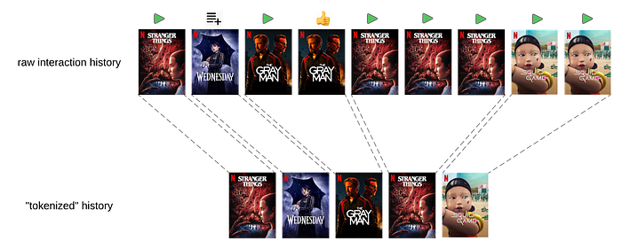

# Foundation Model for Personalized Recommendation

By [Ko-Jen Hsiao](https://www.linkedin.com/in/markhsiao/), [Yesu Feng](https://www.linkedin.com/in/yesufeng/) and [Sudarshan Lamkhede](https://www.linkedin.com/in/sudarshanlamkhede/)

## Motivation

Netflix’s personalized recommender system is a complex system, boasting a variety of specialized machine learned models each catering to distinct needs including “Continue Watching” and “Today’s Top Picks for You.” (Refer to our recent [overview](https://videorecsys.com/slides/mark_talk3.pdf) for more details). However, as we expanded our set of personalization algorithms to meet increasing business needs, maintenance of the recommender system became quite costly. Furthermore, it was difficult to transfer innovations from one model to another, given that most are independently trained despite using common data sources. This scenario underscored the need for a new recommender system architecture where member preference learning is centralized, enhancing accessibility and utility across different models.

Particularly, these models predominantly extract features from members’ recent interaction histories on the platform. Yet, many are confined to a brief temporal window due to constraints in serving latency or training costs. This limitation has inspired us to develop a foundation model for recommendation. This model aims to assimilate information both from members’ comprehensive interaction histories and our content at a very large scale. It facilitates the distribution of these learnings to other models, either through shared model weights for fine tuning or directly through embeddings.

The impetus for constructing a foundational recommendation model is based on the paradigm shift in natural language processing (NLP) to large language models (LLMs). In NLP, the trend is moving away from numerous small, specialized models towards a single, large language model that can perform a variety of tasks either directly or with minimal fine-tuning. Key insights from this shift include:

1. **A Data-Centric Approach**: Shifting focus from model-centric strategies, which heavily rely on feature engineering, to a data-centric one. This approach prioritizes the accumulation of large-scale, high-quality data and, where feasible, aims for end-to-end learning.
2. **Leveraging Semi-Supervised Learning**: The next-token prediction objective in LLMs has proven remarkably effective. It enables large-scale semi-supervised learning using unlabeled data while also equipping the model with a surprisingly deep understanding of world knowledge.

These insights have shaped the design of our foundation model, enabling a transition from maintaining numerous small, specialized models to building a scalable, efficient system. By scaling up semi-supervised training data and model parameters, we aim to develop a model that not only meets current needs but also adapts dynamically to evolving demands, ensuring sustainable innovation and resource efficiency.

## Data

At Netflix, user engagement spans a wide spectrum, from casual browsing to committed movie watching. With over 300 million users at the end of 2024, this translates into hundreds of billions of interactions — an immense dataset comparable in scale to the token volume of large language models (LLMs). However, as in LLMs, the quality of data often outweighs its sheer volume. **To harness this data effectively, we employ a process of interaction tokenization, ensuring meaningful events are identified and redundancies are minimized.**

**Tokenizing User Interactions**: Not all raw user actions contribute equally to understanding preferences. Tokenization helps define what constitutes a meaningful “token” in a sequence. Drawing an analogy to Byte Pair Encoding (BPE) in NLP, we can think of tokenization as merging adjacent actions to form new, higher-level tokens. However, unlike language tokenization, creating these new tokens requires careful consideration of what information to retain. For instance, the total watch duration might need to be summed or engagement types aggregated to preserve critical details.

*Figure 1.Tokenization of user interaction history by merging actions on the same title, preserving important information.*

This tradeoff between granular data and sequence compression is akin to the balance in LLMs between vocabulary size and context window. In our case, the goal is to balance the length of interaction history against the level of detail retained in individual tokens. Overly lossy tokenization risks losing valuable signals, while too granular a sequence can exceed practical limits on processing time and memory.

Even with such strategies, interaction histories from active users can span thousands of events, exceeding the capacity of transformer models with standard self attention layers. In recommendation systems, context windows during inference are often limited to hundreds of events — **not due to model capability but because these services typically require millisecond-level latency**. This constraint is more stringent than what is typical in LLM applications, where longer inference times (seconds) are more tolerable.

To address this during training, we implement two key solutions:

1. **Sparse Attention Mechanisms**: By leveraging sparse attention techniques such as low-rank compression, the model can extend its context window to several hundred events while maintaining computational efficiency. This enables it to process more extensive interaction histories and derive richer insights into long-term preferences.
2. [**Sliding Window Sampling**](https://arxiv.org/abs/2409.14517): During training, we sample overlapping windows of interactions from the full sequence. This ensures the model is exposed to different segments of the user’s history over multiple epochs, allowing it to learn from the entire sequence without requiring an impractically large context window.

At inference time, when multi-step decoding is needed, we can deploy KV caching to efficiently reuse past computations and maintain low latency.

These approaches collectively allow us to balance the need for detailed, long-term interaction modeling with the practical constraints of model training and inference, enhancing both the precision and scalability of our recommendation system.

**Information in Each ‘Token’**: While the first part of our tokenization process focuses on structuring sequences of interactions, the next critical step is defining the rich information contained within each token. Unlike LLMs, which typically rely on a single embedding space to represent input tokens, our interaction events are packed with heterogeneous details. These include attributes of the action itself (such as locale, time, duration, and device type) as well as information about the content (such as item ID and metadata like genre and release country). Most of these features, especially categorical ones, are directly embedded within the model, embracing an end-to-end learning approach. However, certain features require special attention. For example, timestamps need additional processing to capture both absolute and relative notions of time, with absolute time being particularly important for understanding time-sensitive behaviors.

To enhance prediction accuracy in sequential recommendation systems, we organize token features into two categories:

1. **Request-Time Features**: These are features available at the moment of prediction, such as log-in time, device, or location.
2. **Post-Action Features**: These are details available after an interaction has occurred, such as the specific show interacted with or the duration of the interaction.

To predict the next interaction, we combine request-time features from the current step with post-action features from the [previous step](https://ojs.aaai.org/aimagazine/index.php/aimagazine/article/view/18140). This blending of contextual and historical information ensures each token in the sequence carries a comprehensive representation, capturing both the immediate context and user behavior patterns over time.

## Considerations for Model Objective and Architecture

As previously mentioned, our default approach employs the autoregressive next-token prediction objective, similar to GPT. This strategy effectively leverages the vast scale of unlabeled user interaction data. The adoption of this objective in recommendation systems has shown multiple successes [1–3]. However, given the distinct differences between language tasks and recommendation tasks, we have made several critical modifications to the objective.

Firstly, during the pretraining phase of typical LLMs, such as GPT, every target token is generally treated with equal weight. In contrast, in our model, not all user interactions are of equal importance. For instance, a 5-minute trailer play should not carry the same weight as a 2-hour full movie watch. A greater challenge arises when trying to align long-term user satisfaction with specific interactions and recommendations. To address this, we can adopt a multi-token prediction objective during training, where the model predicts the next _n_ tokens at each step instead of a single token[4]. This approach encourages the model to capture longer-term dependencies and avoid myopic predictions focused solely on immediate next events.

Secondly, we can use multiple fields in our input data as auxiliary prediction objectives in addition to predicting the next item ID, which remains the primary target. For example, we can derive genres from the items in the original sequence and use this genre sequence as an auxiliary target. This approach serves several purposes: it acts as a regularizer to reduce overfitting on noisy item ID predictions, provides additional insights into user intentions or long-term genre preferences, and, when structured hierarchically, can improve the accuracy of predicting the target item ID. By first predicting auxiliary targets, such as genre or original language, the model effectively narrows down the candidate list, simplifying subsequent item ID prediction.

## Unique Challenges for Recommendation FM

In addition to the infrastructure challenges posed by training bigger models with substantial amounts of user interaction data that are common when trying to build foundation models, there are several unique hurdles specific to recommendations to make them viable. One of unique challenges is entity cold-starting.

At Netflix, our mission is to entertain the world. New titles are added to the catalog frequently. Therefore the recommendation foundation models require a cold start capability, which means the models need to estimate members’ preferences for newly launched titles before anyone has engaged with them. To enable this, our foundation model training framework is built with the following two capabilities: Incremental training and being able to do inference with unseen entities.

1. **Incremental training **: Foundation models are trained on extensive datasets, including every member’s history of plays and actions, making frequent retraining impractical. However, our catalog and member preferences continually evolve. Unlike large language models, which can be incrementally trained with stable token vocabularies, our recommendation models require new embeddings for new titles, necessitating expanded embedding layers and output components. To address this, we warm-start new models by reusing parameters from previous models and initializing new parameters for new titles. For example, new title embeddings can be initialized by adding slight random noise to existing average embeddings or by using a weighted combination of similar titles’ embeddings based on metadata. This approach allows new titles to start with relevant embeddings, facilitating faster fine-tuning. In practice, the initialization method becomes less critical when more member interaction data is used for fine-tuning.
2. **Dealing with unseen entities **: Even with incremental training, it’s not always guaranteed to learn efficiently on new entities (ex: newly launched titles). It’s also possible that there will be some new entities that are not included/seen in the training data even if we fine-tune foundation models on a frequent basis. Therefore, it’s also important to let foundation models use metadata information of entities and inputs, not just member interaction data. Thus, our foundation model combines both learnable item id embeddings and learnable embeddings from metadata. The following diagram demonstrates this idea.

*Figure 2. Titles are associated with various metadata, such as genres, storylines, and tones. Each type of metadata could be represented by averaging its respective embeddings, which are then concatenated to form the overall metadata-based embedding for the title.*

To create the final title embedding, we combine this metadata-based embedding with a fully-learnable ID-based embedding using a mixing layer. Instead of simply summing these embeddings, we use an attention mechanism based on the “age” of the entity. This approach allows new titles with limited interaction data to rely more on metadata, while established titles can depend more on ID-based embeddings. Since titles with similar metadata can have different user engagement, their embeddings should reflect these differences. Introducing some randomness during training encourages the model to learn from metadata rather than relying solely on ID embeddings. This method ensures that newly-launched or pre-launch titles have reasonable embeddings even with no user interaction data.

## Downstream Applications and Challenges

Our recommendation foundation model is designed to understand long-term member preferences and can be utilized in various ways by downstream applications:

1. **Direct Use as a Predictive Model **The model is primarily trained to predict the next entity a user will interact with. It includes multiple predictor heads for different tasks, such as forecasting member preferences for various genres. These can be directly applied to meet diverse business needs..
2. **Utilizing embeddings **The model generates valuable embeddings for members and entities like videos, games, and genres. These embeddings are calculated in batch jobs and stored for use in both offline and online applications. They can serve as features in other models or be used for candidate generation, such as retrieving appealing titles for a user. High-quality title embeddings also support title-to-title recommendations. However, one important consideration is that the embedding space has arbitrary, uninterpretable dimensions and is incompatible across different model training runs. This poses challenges for downstream consumers, who must adapt to each retraining and redeployment, risking bugs due to invalidated assumptions about the embedding structure. To address this, we apply an orthogonal low-rank transformation to stabilize the user/item embedding space, ensuring consistent meaning of embedding dimensions, even as the base foundation model is retrained and redeployed.
3. **Fine-Tuning with Specific Data **The model’s adaptability allows for fine-tuning with application-specific data. Users can integrate the full model or subgraphs into their own models, fine-tuning them with less data and computational power. This approach achieves performance comparable to previous models, despite the initial foundation model requiring significant resources.

## Scaling Foundation Models for Netflix Recommendations

In scaling up our foundation model for Netflix recommendations, we draw inspiration from the success of large language models (LLMs). Just as LLMs have demonstrated the power of scaling in improving performance, we find that scaling is crucial for enhancing generative recommendation tasks. Successful scaling demands robust evaluation, efficient training algorithms, and substantial computing resources. Evaluation must effectively differentiate model performance and identify areas for improvement. Scaling involves data, model, and context scaling, incorporating user engagement, external reviews, multimedia assets, and high-quality embeddings. Our experiments confirm that the scaling law also applies to our foundation model, with consistent improvements observed as we increase data and model size.

*Figure 3. The relationship between model parameter size and relative performance improvement. The plot demonstrates the scaling law in recommendation modeling, showing a trend of increased performance with larger model sizes. The x-axis is logarithmically scaled to highlight growth across different magnitudes.*

## Conclusion

In conclusion, our Foundation Model for Personalized Recommendation represents a significant step towards creating a unified, data-centric system that leverages large-scale data to increase the quality of recommendations for our members. This approach borrows insights from Large Language Models (LLMs), particularly the principles of semi-supervised learning and end-to-end training, aiming to harness the vast scale of unlabeled user interaction data. Addressing unique challenges, like cold start and presentation bias, the model also acknowledges the distinct differences between language tasks and recommendation. The Foundation Model allows various downstream applications, from direct use as a predictive model to generate user and entity embeddings for other applications, and can be fine-tuned for specific canvases. We see promising results from downstream integrations. This move from multiple specialized models to a more comprehensive system marks an exciting development in the field of personalized recommendation systems.

## Acknowledgements

Contributors to this work (name in alphabetical order): [Ai-Lei Sun](https://www.linkedin.com/in/aileisun/) [Aish Fenton](https://www.linkedin.com/in/aishafenton/) [Anne Cocos](https://www.linkedin.com/in/annecocos/) [Anuj Shah](https://www.linkedin.com/in/foranuj/) [Arash Aghevli](https://www.linkedin.com/in/arashaghevli/) [Baolin Li](https://www.linkedin.com/in/baolin-li-659426115/) [Bowei Yan](https://www.linkedin.com/in/bowei-yan-0080a326/) [Dan Zheng](https://www.linkedin.com/in/danielzheng256/) [Dawen Liang](https://www.linkedin.com/in/dwliang/) [Ding Tong](https://www.linkedin.com/in/ding-tong-2812785a/) [Divya Gadde](https://www.linkedin.com/in/divya-gadde-3ba01551/) [Emma Kong](https://www.linkedin.com/in/emma-yanyang-kong-6904b457/) [Gary Yeh](https://www.linkedin.com/in/gary-y-62175170/) [Inbar Naor](https://www.linkedin.com/in/inbar-naor-6b973a50/) [Jin Wang](https://www.linkedin.com/in/jinwangw/) [Justin Basilico](https://www.linkedin.com/in/jbasilico/) [Kabir Nagrecha](https://www.linkedin.com/in/kabir-nagrecha/overlay/about-this-profile/) [Kevin Zielnicki](https://www.linkedin.com/in/kzielnicki/) [Linas Baltrunas](https://www.linkedin.com/in/linasbaltrunas/) [Lingyi Liu](https://www.linkedin.com/in/lingyi-liu-4b866016/) [Luke Wang](https://www.linkedin.com/in/lequn-luke-wang-9226b2129/) [Matan Appelbaum](https://www.linkedin.com/in/matan-appelbaum-39472b96/) [Michael Tu](https://www.linkedin.com/in/tuzhucheng/) [Moumita Bhattacharya](https://www.linkedin.com/in/moumitab/) [Pablo Delgado](https://www.linkedin.com/in/pabloadelgado/) [Qiuling Xu](https://www.linkedin.com/in/qiuling-xu-a445b815a/) [Rakesh Komuravelli](https://www.linkedin.com/in/rakeshkomuravelli/) [Raveesh Bhalla](https://www.linkedin.com/in/raveeshbhalla/) [Rob Story](https://www.linkedin.com/in/rob-story-b21a4912/) [Roger Menezes](https://www.linkedin.com/in/rogermenezes/) [Sejoon Oh](https://www.linkedin.com/in/sejoon-oh/) [Shahrzad Naseri](https://www.linkedin.com/in/shahrzad-naseri-1b988760/) [Swanand Joshi](https://www.linkedin.com/in/swanandjoshi7/) [Trung Nguyen](https://www.linkedin.com/in/trungnguyen324/) [Vito Ostuni ](https://www.linkedin.com/in/vito-ostuni-0b576027/)[Wei Wang](https://www.linkedin.com/in/thomasweiwang/) [Zhe Zhang](https://www.linkedin.com/in/zhezhangncsu/)

## Reference

1. C. K. Kang and J. McAuley, “Self-Attentive Sequential Recommendation,” _2018 IEEE International Conference on Data Mining (ICDM)_, Singapore, 2018, pp. 197–206, doi: 10.1109/ICDM.2018.00035.
2. F. Sun et al., “BERT4Rec: Sequential Recommendation with Bidirectional Encoder Representations from Transformer,” _Proceedings of the 28th ACM International Conference on Information and Knowledge Management (CIKM ‘19)_, Beijing, China, 2019, pp. 1441–1450, doi: 10.1145/3357384.3357895.
3. J. Zhai et al., “Actions Speak Louder than Words: Trillion-Parameter Sequential Transducers for Generative Recommendations,” _arXiv preprint arXiv:2402.17152_, 2024.
4. F. Gloeckle, B. Youbi Idrissi, B. Rozière, D. Lopez-Paz, and G. Synnaeve, “Better & Faster Large Language Models via Multi-token Prediction,” arXiv preprint arXiv:2404.19737, Apr. 2024.

---
**Tags:** Machine Learning · Foundation Models · Personalization · Deep Learning · AI
