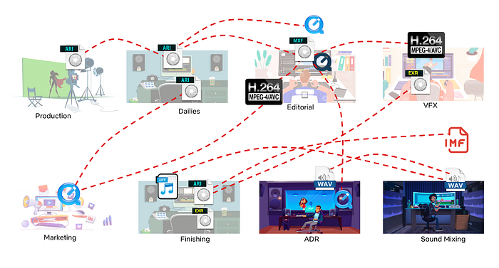
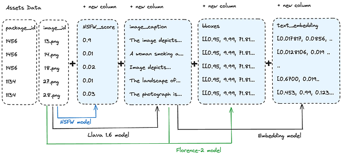
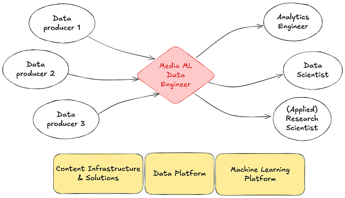

# From Facts & Metrics to Media Machine Learning: Evolving the Data Engineering Function at Netflix

By_ _[Dao Mi](https://www.linkedin.com/in/daomi/), [Pablo Delgado](https://www.linkedin.com/in/pabloadelgado/), [Ryan Berti](https://www.linkedin.com/in/ryan-berti-4942aa83/), [Amanuel Kahsay](https://www.linkedin.com/in/amanuel-kahsay-81ab29153/), [Obi-Ike Nwoke](https://www.linkedin.com/in/onwoke/), [Christopher Thrailkill](https://www.linkedin.com/in/chris-thrailkill-a268914/), and [Patricio Garza](https://www.linkedin.com/in/patriciogarza/)

At Netflix, data engineering has always been a critical function to enable the business’s ability to understand content, power recommendations, and drive business decisions. Traditionally, the function centered on building robust tables and pipelines to capture facts, derive metrics, and provide well modeled data products to their partners in analytics & data science functions. But as Netflix’s studio and content production scaled, so too have the challenges — and opportunities — of working with complex media data.

Today, we’re excited to share how our team is formalizing a new specialization of data engineering at Netflix: **Media Data Engineering**. This evolution is embodied in our latest collaboration with our platform teams, the **Media Data Lake**, which is designed to harness the full potential of media assets (video, audio, subtitles, scripts, and more) and enable the latest advances in machine learning, including latest transformer model architecture. As part of this initiative, we’re intentionally applying data engineering best practices — ensuring that our approach is both innovative and grounded in proven methodologies.

## The Evolution: From Traditional Tables to Media Tables

**Traditional data engineering** at Netflix focused on building structured tables for metrics, dashboards, and data science models. These tables were primarily structured text or numerical fields, ideal for business intelligence, analytics and statistical modeling.

However, the nature of media data is fundamentally different:

- It’s **multi-modal** (video, audio, text, images).
- It contains **derived** fields from media (embeddings, captions, transcriptions…etc)
- It’s **unstructured** and massive in scale when parsed out.
- It’s deeply **intertwined** with creative workflows and business asset lineage.

As our studio operations (see below) expanded, we saw the need for a new approach — one that could provide centralized, standardized, and scalable access to all types of media assets and their metadata for both analytical and machine learning workflows.

## The Rise of Media Data Engineering

Enter **Media Data Engineering** — a new specialization at Netflix that bridges the gap between traditional data engineering and the unique demands of media-centric machine learning. This role sits at the intersection of data engineering, ML infrastructure, and media production. Our mission is to provide seamless access to media assets and derived data (including outputs from machine learning models) for researchers, data scientists, and other downstream data consumers.

## Key Responsibilities

- **Centralized Media Data Access:** Building, cataloging and maintaining the data and pipelines that populates the Media Data Lake, a data platform for storing and serving media assets and their metadata.
- **Asset Standardization:** Standardizing media assets across modalities (video, images, audio, text) to ensure consistency and quality for ML applications in partnership with domain engineering teams.
- **Metadata Management:** Unifying and enriching asset metadata, making it easier to track asset lineage, quality, and coverage.
- **ML-Ready Data:** Exposing large corpora of assets for early-stage algorithm exploration, benchmarking, and productionization.
- **Collaboration:** Partnering closely with domain experts, algorithm researchers, upstream content engineering teams and (machine learning & data) platform colleagues to ensure our data meets real-world needs.

This new role is essential for bridging the gap between creative media workflows and the technical demands of cutting-edge ML.

## Introducing the Media Data Lake

To enable the next generation of media analytics and machine learning, we are building the **Media Data Lake **at Netflix — a data lake designed specifically for media assets at Netflix using state of the art vector storage solutions. We have partnered with our data platform team to pilot integrating [LanceDB](https://lancedb.com/) into our **[Big Data Platform](https://netflixtechblog.com/all?topic=big-data)**.

## Architecture and Key Components

- **Media Table:** The core of the Media Data Lake, this structured dataset captures essential metadata and references to all media assets. It’s designed to be extensible, supporting both traditional metadata and outputs from ML models (including transformer-based embeddings, media understanding research and more).
- **Data Model:** We are developing a robust data model to standardize how media assets and their attributes are represented, making it easier to query and join across schemas.
- **Data API:** An pythonic interface that will provide programmatic access to the Media Table, supporting both interactive exploration and automated workflows.
- **UI Components:** Off-the-shelf UI interfaces enable teams to visually explore assets in the media data lake, accelerating discovery and iteration for ICs.
- **Online and Offline System Architecture:** **Real-time access for lightweight queries** and exploration of raw media assets; scalable large batch processing for ML training, benchmarking, and research.
- **Compute**: distributed batch inference layer capable of processing using GPUs and media data processing at scale using CPUs.

## Starting Small with New Technology

Our initial focus this past year has been on delivering a “data pond” — a mini-version of the Media Data Lake targeted at video/audio datasets for early stage model training, evaluation and research. All data for this phase comes from AMP, our internal [asset management system](./elasticsearch-indexing-strategy-in-asset-management-platform-amp-99332231e541.md) and [annotation store](./scalable-annotation-service-marken-f5ba9266d428.md), and the scope is intentionally small to ensure a solid, extensible foundation could be built while introducing a new technology into the company. We are able to perform data exploration of the raw media assets to build up an intuitive understanding of the media via lightweight queries to AMP.

## Media Tables: The New Foundation for ML and Innovation

One of the most exciting developments is the rise of **media tables** — structured datasets that not only capture traditional metadata, but also include the outputs of advanced ML models.

These media tables power a range of innovative applications, such as:

- **Translation & Audio Quality Measures:** Managing audio clips and model features for engineering localization quality metrics.
- ****Story Understanding and Content Embedding:****** Structuring narrative elements extracted from textual evidence and video of a title to increase operational efficiency in title launch preparation and ratings, e.g. detection of smoking, gore, NSFW scenes in our titles.**
- **Media Search:** Leverage multi-modal vector search to find similar keyframes, shots, dialogue to facilitate research and experimentation.

These tables are designed to scale, support complex queries, and serve both research and other data science & analytical needs.

## The Human Side: New Roles and Collaboration

Media Data Engineering is a team sport. Our data engineers partner with domain experts, data scientists, ML researchers, upstream business ops and content engineering teams to ensure our data solutions are fit for purpose. We also work closely with our friendly platform teams to ensure technological breakthroughs that are beneficial beyond our small corner of the universe could become horizontal abstractions that benefit the rest of Netflix. This collaborative model enables rapid iteration, high data quality, innovative use cases and technology re-use.

## Looking Ahead

The evolution from traditional data engineering to media data engineering — anchored by our media data lake — is unlocking new frontiers for Netflix:

- **Richer, more accurate ML models** trained on high-quality, standardized media data.
- **Supercharge ML Model evaluations **via quick iteration cycles on the data.
- **Faster experimentation and productization** of new AI-powered features.
- **Deeper insights into our content and creative workflows** via metrics constructed from Media ML algorithms inferred features.

As we continue to grow the media data lake, be on the lookout for subsequent blog posts sharing our learnings and tools with the broader media ml & data engineering community.

_This article was updated on August 25, 2025._

---
**Tags:** Technology · Machine Learning · Data
