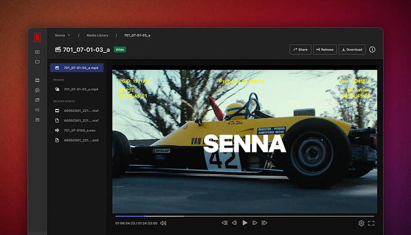
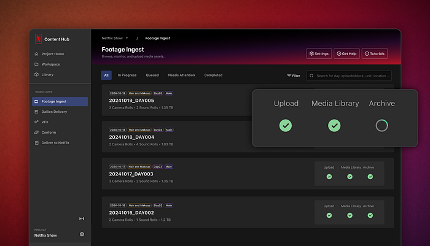
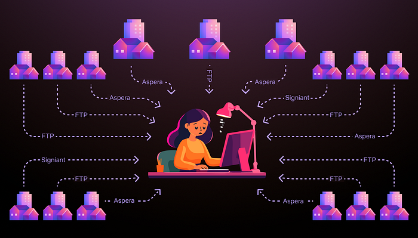
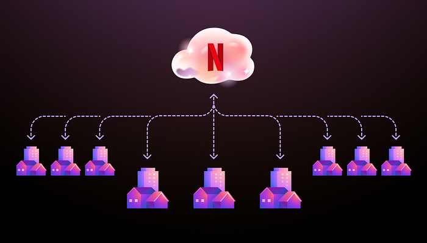

# Globalizing Productions with Netflix’s Media Production Suite

[**Jesse Korosi**](https://www.linkedin.com/in/jesse-korosi-44790985/),** **[**Thijs van de Kamp**](https://www.linkedin.com/in/thijsvdkamp/)**, **[**Mayra Vega**](https://www.linkedin.com/in/mayralvega/),** **[**Laura Futuro**](https://www.linkedin.com/in/laurafuturo/),** **[**Anton Margoline**](https://www.linkedin.com/in/margoline/)

**The journey from script to screen is full of challenges in the ever-evolving world of film and television. The industry has always innovated, and over the last decade, it started moving towards cloud-based workflows. However, unlocking cloud innovation and all its benefits on a global scale has proven to be difficult. The opportunity is clear: streamline complex media management logistics, eliminate tedious, non-creative task-based work and enable productions to focus on what matters most–creative storytelling. With these challenges in mind, Netflix has developed a suite of tools by filmmakers for filmmakers: the Media Production Suite (MPS).**

## What are we solving for?

Significant time and resources are devoted to managing media logistics throughout the production lifecycle. An average Netflix title produces around ~200 Terabytes of Original Camera Files (OCF), with outliers up to 700 Terabytes, not including any work-in-progress files, VFX assets, 3D assets, etc. The data produced on set is traditionally copied to physical tape stock like LTO. This workflow has been considered the industry norm for a long time and may be cost-effective, but comes with trade-offs. Aside from needing to physically ship and track all movement of the tape stock, storing media on a physical tape makes it harder to search, play and share media assets; slowing down accessibility to production media when needed, especially when titles need to collaborate with talent and vendors all over the world.

Even when workflows are fully digital, the distribution of media between multiple departments and vendors can still be challenging. A lack of automation and standardization often results in a labour-intensive process across post-production and VFX with a lot of dependencies that introduce potential human errors and security risks. Many productions utilize a large variety of vendors, making this collaboration a large technical puzzle. As file sizes grow and workflows become more complex, these issues are magnified, leading to inefficiencies that slow down post-production and reduce the available time spent on creative work.

**Moving media into the cloud introduces new challenges for production and post ramping up to meet the operational and technological hurdles this poses.** For some post-production facilities, it’s not uncommon to see a wall of portable hard drives at their facility, with media being hand-carried between vendors because alternatives are not available. The need for a centralized, cloud-based solution that transcends these barriers is more pressing than ever. This results in a willingness to embrace new and innovative ideas, even if exploratory, and introduce drastic workflow changes to productions in pursuit of creative evolution.

At Netflix, we believe that great stories can come from anywhere, but we have seen that technical limitations in traditional workflows reduce access to media and restrict filmmakers’ access to talent. Besides the need for robust cloud storage for their media, artists need access to powerful workstations and real-time playback. Depending on the market, or production budget, cutting-edge technology might not be available or affordable.

What if we started charting a course to break free from many of these technical limitations and found ways to enhance creativity? Industry trade shows like the International Broadcast Convention (IBC) and the National Association of Broadcasters Show (NAB) highlight a strong global trend: instead of bringing media to the artist/applications (traditional workflow) we see the shift towards bringing people and applications to the media (cloud workflows and remote workstations). The concept of cloud-based workflows is not new, as many technology leaders in our industry have been experimenting in this space for more than a decade. However, executing this vision at a Netflix scale with hundreds of titles a year has not been done before…

## The challenge of building a global technology to solve this

Building solutions at a global scale poses significant challenges. The art of making movies and series lacks equal access to technology, best practices, and global standardization. Different countries worldwide are at different phases of innovation based on local needs and nuances. While some regions boast over a century of cinematic history and have a strong industry, others are just beginning to carve their niche. This vast gap presents a unique challenge: developing global technology that caters to both established and emerging markets, each with distinct languages and workflows.

The large diversity of needs by talent and vendors globally creates a standardization challenge and can be seen when productions use a global talent pool. Many mature post-production and VFX facilities have built scripts and automation that flow between various artists and personnel within their facility; allowing a more streamlined workflow, even though the customization is time-consuming. E.g., Transcoding, or transcriptions that automatically run when files are dropped in a hot folder, with the expectation that certain sidecar metadata files will accompany them with a specific organizational structure. Embracing and integrating new workflows introduces the fear of disrupting a well-established process, increasing additional pressure on the profit margins of vendors. Small workflow changes that may seem arbitrary may actually have a large impact on vendors. Therefore, innovation should provide meaningful benefits to a title in order to get adopted at scale. Reliability, a proven track record, strong support, and an incredibly low tolerance for bugs, or issues are top of mind in well-established markets.

In developing this suite, we recognized the necessity of addressing the vast array of titles that flow through Netflix without the luxury of expanding into a massive operational entity. Consequently, automation became imperative. The intricacies of color and framing management, along with deliverables, must be seamlessly controlled and effortlessly managed by the user, without the need for manual intervention. Therefore, we cannot lean into humans configuring JSON files behind the scenes to map camera formats into deliverables. By embracing open standards, we not only streamline these processes but also facilitate smoother collaboration across diverse markets and countries, ensuring that our global productions can operate with unparalleled efficiency and cohesion. To ensure this, we’ve decided to lean heavily into standards like [ACES](https://www.oscars.org/science-technology/sci-tech-projects/aces), [AMF](https://acescentral.com/knowledge-base-2/when-is-amf-used/), [ASC MHL](https://theasc.com/society/ascmitc/asc-media-hash-list), [ASC FDL](https://theasc.com/society/ascmitc/asc-framing-decision-list), and [OTIO](https://github.com/OpenTimelineIO). ACES and AMF for color pipeline management. ASC MHL for any file management/verifications. ASC FDL will serve as our framing interoperability and OTIO for any timeline interchange. Leaning into standards like this means that many things can be automated at scale and more importantly, high-complexity workflows can be offered to markets or shows that don’t normally have access to them. As an example, if a show is shot on various camera formats all framed and recorded at different resolutions, with different lenses and different safeties on each frame. The task of normalizing all of these for a VFX vendor into one common container with a normalized center extracted frame is often only offered to very high-end titles, considering it takes a human behind the curtain to create all of these mappings. But by leaning into a standard like the FDL, it means this can now easily be automated, and the control for these mappings, put directly in the hands of users.

## Our Answer — Content Hub’s Media Production Suite (MPS)

Building a global scalable solution that could be utilized in a diversity of markets has been an exciting challenge. We set out to provide customizable and feature-rich tooling for advanced users while remaining intuitive and streamlined enough for less experienced filmmakers. With collaboration from Netflix teams, vendors, and talent across the globe, we’ve taken a bold step forward in enabling a suite of tools inside Netflix Content Hub that democratizes technology: the Media Production Suite. While leveraging our scale economies and access to resources, we can now unlock global talent pools for our productions, drastically reduce non-creative task-based work, streamline workflows, and level the playing field between our markets, ultimately maximizing the time available for what matters most; creative work!

## So what is it?

1. **Netflix Hybrid Infrastructure**: Netflix has invested in a hybrid infrastructure, a mix of cloud-based and physically distributed capabilities operating in multiple locations across the world and close to our productions to optimize user performance. This infrastructure is available for Netflix shows and is foundational under Content Hub’s Media Production Suite tooling. Local storage and compute services are connected through the Netflix Open Connect network (Netflix Content Delivery Network) to the infrastructure of Amazon Web Services (AWS). The system facilitates large volumes of camera and sound media and is built for speed. In order to ensure that productions have sufficient upload speeds to get their media into the cloud, Netflix has started to roll out Content Hub Ingest Centers globally to provide high-speed internet connectivity where required. With all media centralized, MPS eliminates the need for physical media transport and reduces the risk of human error. This approach not only streamlines operations but also enhances security and accessibility.

2. **Automation and Tooling**: In addition to the Netflix Hybrid infrastructure layer, MPS consists of a suite of tools that tap into the media in the Netflix ecosystem.

**Footage Ingest** — An application that allows users to upload media/files into Content Hub.

**Media Library** — A central library that allows users to search, preview, share and download media.

**Dailies** — A workflow, backed by an operational team, offering automated Quality Control of your footage, sound sync, application of color, rendering, and delivering dailies directly to editorial.

**Remote Workstations** — Offering access to remote editorial workstations and storage for post-production needs.

**VFX Pulls** — An automated method for converting and delivering visual effects plates, associated color, and framing files to VFX vendors.

**Conform Pulls** — An automated method for consolidating, trimming, and delivering all OCF to picture-finishing vendors.

**Media Downloader** — An automated download tool that initiates a download once media has been made available in the Netflix cloud.

While each of the individual tools within MPS is at different states of maturity, over 350 titles have made use of at least one of the tools noted above. Input has been taken from all over the world while developing, with users ranging from UCAN (United States/Canada), EMEA (Europe, Middle East, and Africa), SEA (South East Asia), LATAM (Latin America), and APAC (Asia Pacific).

## Senna: Early Adoption and Insightful Feedback Driving MPS Evolution

*Media from the Brazilian-produced series ‘Senna’ being reviewed in MPS*

The Brazilian-produced series _Senna_, which follows the life of legendary Formula 1 driver Ayrton Senna, utilized MPS to reshape their content creation workflow, overcome geographical barriers, and unlock innovation to support world-class storytelling for a global audience. _Senna_ is a groundbreaking series, not just for its storytelling but for its production journey across Argentina, Uruguay, Brazil, and the United Kingdom. With editorial teams spread across Porto Alegre and Spain, and VFX studios collaborating across locations in Brazil, Canada, the United States, and India, all orchestrated by our subsidiary Scanline VFX. The series exemplifies the global nature of modern filmmaking and was the perfect fit for Netflix’s new Content Hub Media Production Suite (MPS).

At the heart of _Senna’s_ workflow orchestration is MPS. While each of the tools within MPS is based on an opt-in model, in order to use many of the downstream services, the first step is ensuring that the original camera files (OCF) and original sound files (OSF) are uploaded. “_We knew we were going to shoot in different places,_” said Post Supervisor Gabriel Queiroz,_“to have all this material cloud-based, it’s definitely one of the most important things for us. It would be hard to bring all this media physically from Argentina or wherever to Brazil. It will take us a lot of time.”_ With _Senna_ shooting across locations, allowing production the capability of uploading their OCF and OSF resulted in no longer requiring shuttling hard drives on airplanes, creating LTO tapes, & managing physical shipments for their negative. And yes, you read that correctly; when utilizing MPS, we don’t require LTO tapes to be written unless there are title-specific needs.

With _Senna_ beginning production back in June of 2023, our investment in MPS was still very early stages, and the tooling was considered beta. However, with the help, feedback, and partnership from this production, it was quickly realized that the investment was worth doubling down on. Since the early version used on _Senna_, Netflix has been spinning up ingest centers around the world, where drives can be dropped off, and within a matter of hours, all original camera files are uploaded into the Netflix ecosystem. While creating the ability to upload is not a novel concept, behind the scenes, it’s far from simple. Once a drive has been plugged in and our Netflix Footage Ingest application is opened, a validation is run, ensuring all expected media from set is on the drive. After media has been uploaded and checksums are run validating media integrity, all media is inspected, metadata is extracted, and assets are created for viewing/sharing/downloading with playable proxies. All media is then automatically backed up to a second tier of cloud-based storage for the final archive.

Traditionally, if you wanted to check in with your post vendor on how things are going for each of these media management steps noted above, or whether or not you can clear on set camera cards if you haven’t gotten a completion notification, you would have to pick up the phone and call your vendor. For _Senna_, anyone who wanted visibility on progress, simply logged in to Content Hub and could see any activity in the Footage Ingest dashboard, as well as look up any information needed on past uploads.

*Remote monitoring media being uploaded and archived using the MPS Footage Ingest workflow*

While many services in MPS are available once media has been uploaded, _Senna’s_ use of MPS focused on VFX. With _Senna_ shooting a high volume of footage and the show having a high volume of VFX shots, according to Post Supervisor Gabriel Queiroz _“Using MPS was basically a no-brainer, _[having]_ used the tool before, I knew what it could bring to the project. And to be honest, with the amount of footage that we have, it was just so much material and with the amount of vendors we have, knowing that we would have to deliver all this footage to all these kinds of vendors, including outside of Brazil and to different parts of the world.”_

With a traditional workflow, utilizing available resources in Latin America, VFX Pulls would have been done manually. This process is prone to human error and more importantly, for a show like _Senna_, too slow and would have resulted in different I/O methods for every vendor.

*Illustrating a traditional VFX Editor having to manage various I/O methods*

By utilizing MPS, the Assistant Editor was able to log into Content Hub, upload an EDL, and have their VFX Pulls automatically transcoded, color files consolidated and all media placed into a Google Drive style folder built directly in Content Hub (called Workspaces). The VFX Editor was able to make any additional tweaks they wanted to the directory before farming out each of the shots to whichever vendor they were meant for. When it came time for the VFX vendors to then send shots back to editorial or DI, this was also done through MPS. Having one standard method for I/O for all VFX file sharing meant that Editorial and DI did not have to manage a different file transfer/workflow for every single vendor that was onboarded.

*Illustrating a more streamlined workflow for VFX vendors when using MPS*

After picture was locked and it was time for _Senna_ to do their Online, the DI facility Quanta was able to utilize the Conform Pull service within MPS. The Conform Pull service allowed their team to upload an EDL, which ran a QC on all of the media from within their edit to ensure a smooth conform and then consolidated, trimmed, and packaged up all of the media they needed for the online. Since this early beta and thanks to learnings from many shows like Senna, advancements have been made in the system’s ability to match back to source media for both Conform and VFX Pulls. Rather than requiring an exact match between EDL and source OCF, there are several variations of fuzzy matching that can take place, as well as a current investigation in using one of our perceptual matching algorithms, allowing for a perceptual conform using computer vision, instead of solely relying on metadata.

## Conclusion

The Media Production Suite (MPS) represents a transformative leap in how we approach media production at Netflix. By embracing open standards, we have crafted a scalable solution that not only makes economic sense but also democratizes access to advanced production tools across the globe. This approach allows us to eliminate tedious tasks, enabling our teams to focus on what truly matters: creative storytelling. By fostering global collaboration and leveraging the power of cloud-based workflows, we’re not just enhancing efficiency but also elevating the quality of our productions. As we continue to innovate and refine our processes, we remain committed to breaking down barriers and unlocking the full potential of creative talent worldwide. The future of filmmaking is here, and with MPS, we are leading the charge toward a more connected and creatively empowered industry.
