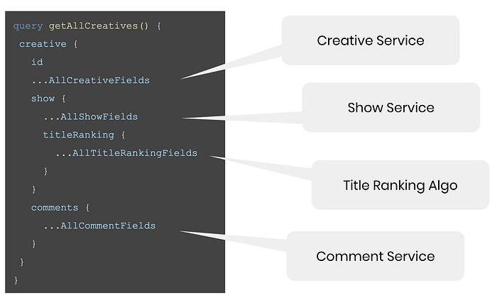
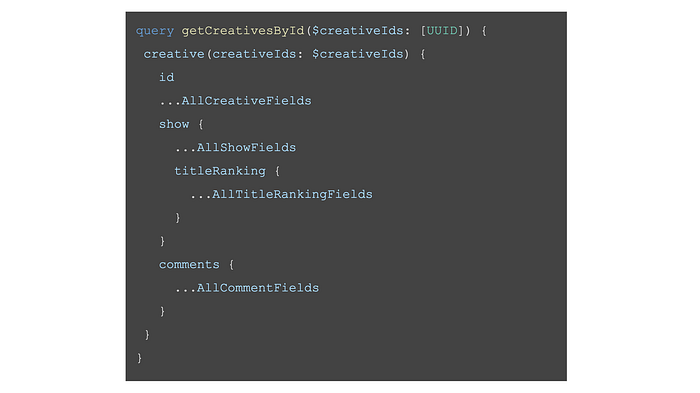
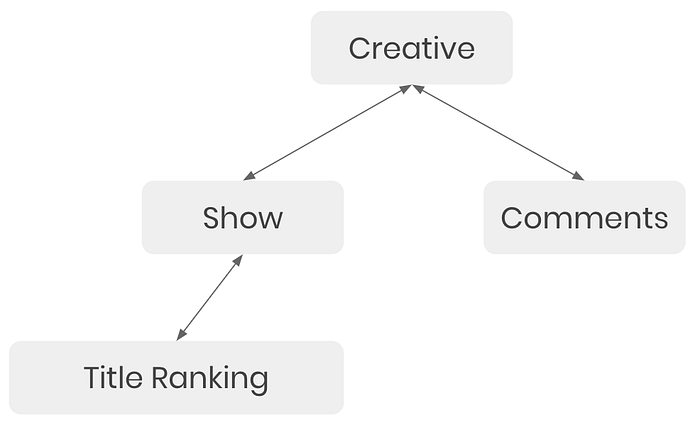
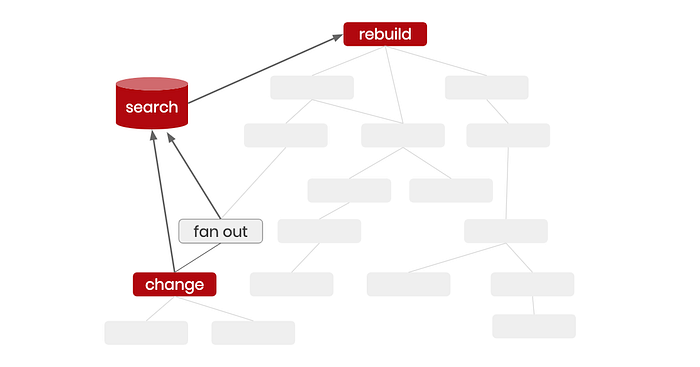
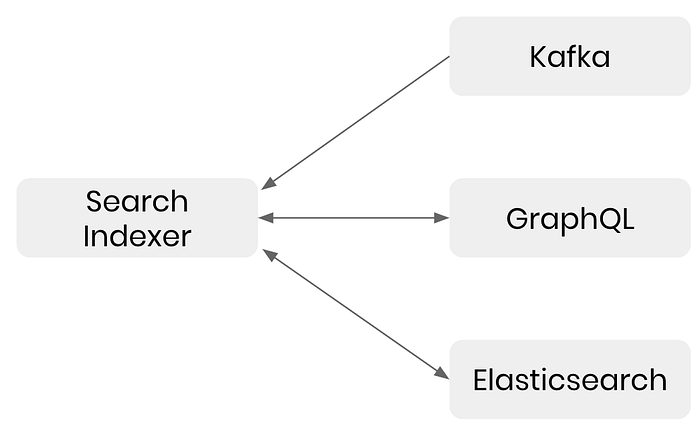
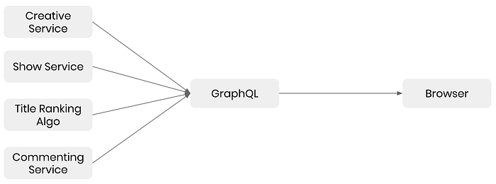
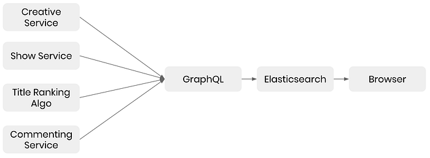
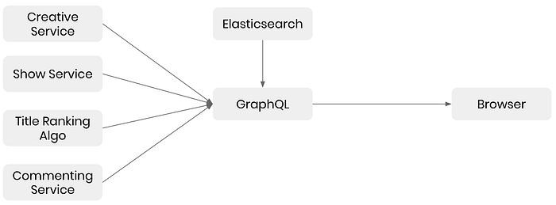

# GraphQL Search Indexing

by [Artem Shtatnov](https://twitter.com/reversetri) and [Ravi Srinivas Ranganathan](https://twitter.com/ducktyped)

Almost a year ago we described [our learnings from adopting GraphQL](https://medium.com/netflix-techblog/our-learnings-from-adopting-graphql-f099de39ae5f) on the Netflix Marketing Tech team. We have a lot more to share since then! There are plenty of existing resources describing how to express a search query in GraphQL and paginate the results. This post looks at the other side of search: how to index data and make it searchable. Specifically, how our team uses the relationships and schemas defined within GraphQL to automatically build and maintain a search database.

## Marketing Tech at Netflix

Our goal is to promote Netflix’s content across the globe. Netflix has thousands of shows on the service, operates in over 190 countries, and supports around 30 languages. For each of these shows, countries, and languages we need to find the right creative that resonates with each potential viewer. Our team builds the tools to produce and distribute these marketing creatives at a global scale, powering 10s of billions of impressions every month!

*Various creatives Marketing Tech supports*

To enable our marketing stakeholders to manage these creatives, we need to pull together data that is spread across many services — GraphQL makes this aggregation easy.

As an example, our data is centered around a creative service to keep track of the creatives we build. Each creative is enhanced with more information on the show it promotes, and the show is further enhanced with its ranking across the world. Also, our marketing team can comment on the creative when adjustments are needed. There are many more relationships that we maintain, but we will focus on these few for the post.

*GraphQL query before indexing*

## Challenges of Searching Decentralized Data

Displaying the data for one creative is helpful, but we have a lot of creatives to search across. If we produced only a few variations for each of the shows, languages, and countries Netflix supports, that would result in **_over_** **_50 million_** total creatives. We needed a proper search solution.

The problem stems from the fact that we are trying to search data across multiple independent services that are loosely coupled. No single service has complete context into how the system works. Each service could potentially implement its own search database, but then we would still need an aggregator. This aggregator would need to perform more complex operations, such as searching for creatives by ranking even though the ranking data is stored two hops away in another service.

If we had a single database with all of the information in it, the search would be easy. We can write a couple join statements and where clauses: problem solved. Nevertheless, a single database has its own drawbacks, mainly, around limited flexibility in allowing teams to work independently and performance limitations at scale.

Another option would be to use a custom aggregation service that builds its own index of the data. This service would understand where each piece of data comes from, know how all of the data is connected, and be able to combine the data in a variety of ways. Apart from the indexing part, these characteristics perfectly describe the entity relationships in GraphQL.

## Indexing the Data

Since we already use GraphQL, how can we leverage it to index our data? We can update our GraphQL query slightly to retrieve a single creative and all of its related data, then call that query once for each of the creatives in our database, indexing the results into Elasticsearch. By batching and parallelizing the requests to retrieve many creatives via a single query to the GraphQL server, we can optimize the index building process.

*GraphQL query for indexing*

Elasticsearch has a lot of customization options when indexing data, but in many cases the default settings give pretty good results. At a minimum, we extract all of the type definitions from the GraphQL query and map them to a schema for Elasticsearch to use.

The nice part about using a GraphQL query to generate the schema is that any existing clients relying on this data will get the same shape of data regardless of whether it comes from the GraphQL server or the search index directly.

Once our data is indexed, we can sort, group, and filter on arbitrary fields; provide typeahead suggestions to our users; display facets for quick filtering; and progressively load data to provide an infinite scroll experience. Best of all, our page can load much faster since everything is cached in Elasticsearch.

## Keeping Everything Up To Date

Indexing the data once isn’t enough. We need to make sure that the index is always up to date. Our data changes constantly — marketing users make edits to creatives, our recommendation algorithm refreshes to give the latest title popularity rankings and so on. Luckily, we have Kafka events that are emitted each time a piece of data changes. The first step is to listen to those events and act accordingly.

When our indexer hears a change event it needs to find all the creatives that are affected and reindex them. For example, if a title ranking changes, we need to find the related show, then its corresponding creative, and reindex it. We could hardcode all of these rules, but we would need to keep these rules up to date as our data evolves and for each new index we build.

Fortunately, we can rely on GraphQL’s entity relationships to find exactly what needs to be reindexed. Our search indexer understands these relationships by accessing a shared GraphQL schema or using an introspection query to retrieve the schema.

*Our GraphQL query represented as a tree*

In our earlier example, the indexer can fan out one level from title ranking to show by automatically generating a query to GraphQL to find shows that are related to the changed title ranking. After that, it queries Elasticsearch using the show and title ranking data to find creatives that reference these values. It can reindex those creatives using the same pipeline used to index them in the first place. **_What makes this method so great is that after defining GraphQL schemas and resolvers once, there is no additional work to do._** The graph has enough data to keep the search index up to date.

## Inverted Graph Index

Let’s look a bit deeper into the three steps the search indexer conducts: fan out, search, and index. As an example, if the algorithm starts recommending show 80186799 in Finland, the indexer would generate a GraphQL query to find the immediate parent: the show that the algorithm data is referring to. Once it finds that this recommendation is for _Stranger Things_, it would use Elasticsearch’s inverted index to find all creatives with show _Stranger Things_ or with the algorithm recommendation data. The creatives are updated via another call to GraphQL and reindexed back to Elasticsearch.

The fan out step is needed in cases where the vertex update causes new edges to be created. If our algorithm previously didn’t have enough data to rank _Stranger Things_ in Finland, the search step alone would never find this data in our index. Also, the fan out step does not need to perform a full graph search. Since GraphQL resolvers are written to only rely on data from the immediate parent, any vertex change can only impact its own edges. The combination of the single graph traversal and searching via an inverted index allows us to greatly increase performance for more complex graphs.

*The fanout + search pattern works with more complex graphs*

The indexer currently reruns the same GraphQL query that we used to first build our index, but we can optimize this step by only retrieving changes from the parent of the changed vertex and below. We can also optimize by putting a queue in front of both the change listener and the reindexing step. These queues debounce, dedupe, and throttle tasks to better handle spikes in workload.

The overall performance of the search indexer is fairly good as well. Listening to Kafka events adds little latency, our fan out operations are really quick since we store foreign keys to identify the edges, and looking up data in an inverted index is fast as well. Even with minimal performance optimizations, we have seen median delays under 500ms. The great thing is that the search indexer runs in close to constant time after a change, and won’t slow down as the amount of data grows.

## Periodic Indexing

We run a full indexing job when we define a new index or make breaking schema changes to an existing index.

**In the latter case, we don’t want to entirely wipe out the old index until after verifying that the newly indexed data is correct. For this reason, we use aliases. Whenever we start an indexing job, the indexer always writes the data to a new index that is properly versioned. Additionally, the change events need to be dual written to the new index as it is being built, otherwise, some data will be lost. Once all documents have been indexed with no errors, we swap the alias from the currently active index to the newly built index.**

In cases where we can’t fully rely on the change events or some of our data does not have a change event associated with it, we run a periodic job to fully reindex the data. As part of this regular reindexing job, we compare the new data being indexed with the data currently in our index. Keeping track of which fields changed can help alert us of bugs such as a change events not being emitted or hidden edges not modeled within GraphQL.

## Initial Setup

We built all of this logic for indexing, communicating with GraphQL, and handling changes into a search indexer service. In order to set up the search indexer there are a few requirements:

1. **Kafka**. The indexer needs to know when changes happen. We use Kafka to handle change events, but any system that can notify the indexer of a change in the data would be sufficient.
2. **GraphQL**. To act on the change, we need a GraphQL server that supports introspection. The graph has two requirements. First, each vertex must have a unique ID to make it easily identifiable by the search step. Second, for fan out to work, edges in the graph must be bidirectional.
3. **Elasticsearch**. The data needs to be stored in a search database for quick retrieval. We use Elasticsearch, but there are many other options as well.
4. **Search Indexer**. Our indexer combines the three items above. It is configured with an endpoint to our GraphQL server, a connection to our search database, and mappings from our Kafka events to the vertices in the graph.

*How our search indexer is wired up*

## Building a New Index

After the initial setup, defining a new index and keeping it up to date is easy:

1. **GraphQL Query**. We need to define the GraphQL query that retrieves the data we want to index.
2. That’s it.

Once the initial setup is complete, defining a GraphQL query is the only requirement for building a new index. We can define as many indices as needed, each having its own query. Optionally, since we want to reindex from scratch, we need to give the indexer a way to paginate through all of the data, or tell it to rely on the existing index to bootstrap itself. Also, if we need custom mappings for Elasticsearch, we would need to define the mappings to mirror the GraphQL query.

The GraphQL query defines the fields we want to index and allows the indexer to retrieve data for those fields. The relationships in GraphQL allow keeping the index up to date automatically.

## Where the Index Fits

The output of the search indexer feeds into an Elasticsearch database, so we needed a way to utilize it. Before we indexed our data, our browser application would call our GraphQL server, asking it to aggregate all of the data, then we filtered it down on the client side.

*Data flow before indexing*

After indexing, the browser can now call Elasticsearch directly (or via a thin wrapper to add security and abstract away database complexities). This setup allows the browser to fully utilize the search functionality of Elasticsearch instead of performing searches on the client. Since the data is the same shape as the original GraphQL query, we can rely on the same auto-generated Typescript types and don’t need major code changes.

*Data flow after indexing*

One additional layer of abstraction we are considering, but haven’t implemented yet, is accessing Elasticsearch via GraphQL. The browser would continue to call the GraphQL server in the same way as before. The resolvers in GraphQL would call Elasticsearch directly if any search criteria are passed in. We can even implement the search indexer as middleware within our GraphQL server. It would enhance the schema for data that is indexed and intercept calls when searches need to be performed. This approach would turn search into a plugin that can be enable on any GraphQL server with minimal configuration.

*Using GraphQL to abstract away Elasticsearch*

## Caveats

Automatically indexing key queries on our graph has yielded tremendously positive results, but there are a few caveats to consider.

Just like with any graph, supernodes may cause problems. A supernode is a vertex in the graph that has a disproportionately large number of edges. Any changes that affect a supernode will force the indexer to reindex many documents, blocking other changes from being reindexed. The indexer needs to throttle any changes that affect too many documents to keep the queue open for smaller changes that only affect a single document.

The relationships defined in GraphQL are key to determining what to reindex if a change occurred. A hidden edge, an edge not defined fully by one of the two vertices it connects, can prevent some changes from being detected. For example, if we model the relationship between creatives and shows via a third table containing tuples of creative IDs and show IDs, that table would either need to be represented in the graph or its changes attributed to one of the vertices it connects.

By indexing data into a single store, we lose the ability to differentiate user specific aspects of the data. For example, Elasticsearch cannot store unread comment count per user for each of the creatives. As a workaround, we store the total comment count per creative in Elasticsearch, then on page load make an additional call to retrieve the unread counts for the creatives with comments.

Many UI applications practice a pattern of read after write, asking the server to provide the latest version of a document after changes are made. Since the indexing process is asynchronous to avoid bottlenecks, clients would no longer be able to retrieve the latest data from the index immediately after making a modification. On the other hand, since our indexer is constantly aware of all changes, we can expose a websocket connection to the client that notifies it when certain documents change.

The performance savings from indexing come primarily from the fact that this approach shifts the workload of aggregating and searching data from read time to write time. If the application exhibits substantially more writes than reads, indexing the data might create more of a performance hit.

The underlying assumption of indexing data is that you need robust search functionality, such as sorting, grouping, and filtering. If your application doesn’t need to search across data, but merely wants the performance benefits of caching, there are many other options available that can effectively cache GraphQL queries.

Finally, if you don’t already use GraphQL or your data is not distributed across multiple databases, there are plenty of ways to quickly perform searches. A few table joins in a relational database provide pretty good results. For larger scale, we’re building a similar graph-based solution that multiple teams across Netflix can leverage which also keeps the search index up to date in real time.

There are many other ways to search across data, each with its own pros and cons. The best thing about using GraphQL to build and maintain our search index is its flexibility, ease of implementation, and low maintenance. The graphical representation of data in GraphQL makes it extremely powerful, even for use cases we hadn’t originally imagined.

If you’ve made it this far and you’re also interested in joining the Netflix Marketing Technology team to help conquer our unique challenges, check out the [open positions](https://sites.google.com/netflix.com/adtechjobs/ad-tech-engineering) listed on our page. _We’re hiring!_

---
**Tags:** GraphQL · Elasticsearch · Software Development · Front End Development
