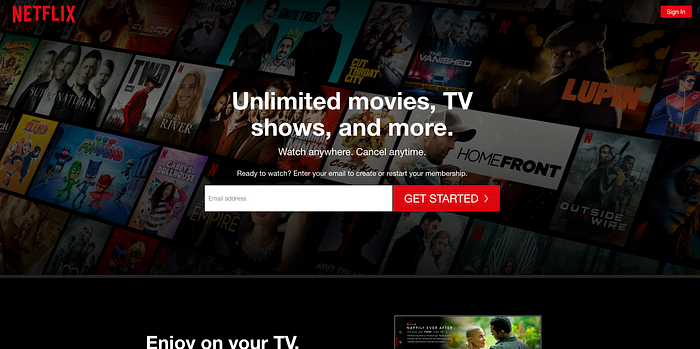
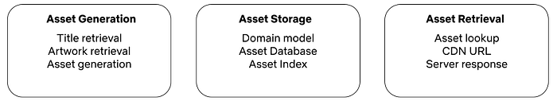
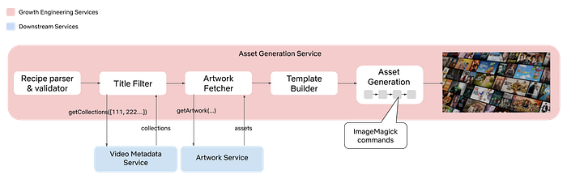
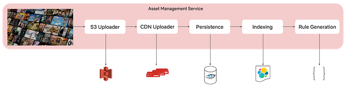
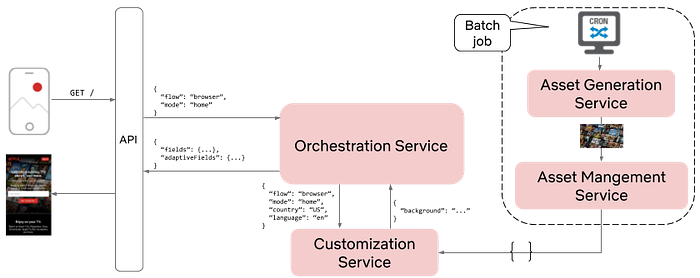
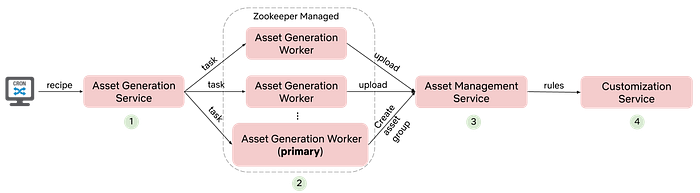

# Growth Engineering at Netflix — Automated Imagery Generation

by [Eric Eiswerth](https://www.linkedin.com/in/ericeiswerth/)

## Background

There’s a good chance you’ve probably visited the Netflix homepage. In the Growth Engineering team, we refer to this as the top of the signup funnel. For more background on the signup funnel and Growth Engineering’s role in the signup funnel, please read our initial post on the topic: [Growth Engineering at Netflix — Accelerating Innovation](https://netflixtechblog.com/growth-engineering-at-netflix-accelerating-innovation-90eb8e70ce59). The primary focus of this post will be the top of the signup funnel. In particular, the Netflix homepage:



As discussed in our previous post, Growth Engineering owns the business logic and protocols that allow our UI partners to build lightweight and flexible applications for almost any platform. In some cases, like the homepage, this even involves providing appropriate imagery (e.g., the background image shown above). In this post, we’ll take a deep dive into the journey of content-based imagery on the Netflix homepage.

## Motivation

At Netflix we do one thing — entertainment — and we aim to do it really well. We live and breathe TV shows and films, and we want everyone to be able to enjoy them too. That’s why we aspire to have best in class stories, across genres and believe people should have access to new voices, cultures and perspectives. The member-focused teams at Netflix are responsible for making sure the member experience is relevant and personalized, ensuring that this content is shown to the right people at the right time. But what about non-members; those who are simply interested in signing up for Netflix, how should we highlight our content and convey our value propositions to them?

## The Solution

The main mechanism for highlighting our content in the signup flow is through content-based imagery. Before designing a solution it’s important to understand the main product requirements for such a feature:

- The content needs to be new, relevant, and regional (not all countries have the same catalogue).
- The artwork needs to appeal to a broader audience. The non-member homepage serves a very broad audience and is not personalized to the extent of the member experience.
- The imagery needs to be localized.
- **We need to be able to easily determine what imagery is present for a given platform, region, and language.**
- The homepage needs to load in a reasonable amount of time, even in poor network conditions.

## Unpacking Product Requirements

Given the scale we require and the product requirements listed above, there are a number of technical requirements:

- A list of titles for the asset, in some order.
- Ensure the titles are appropriate for a broad audience, which means all titles need to be tagged with metadata.
- Localized images for each of the titles.
- Different assets for different device types and screen sizes.
- Server-generated assets, since client-side generation would require the retrieval of many individual images, which would increase latency and time-to-render.
- To reduce latency, assets should be generated in an offline fashion and not in real time.
- The assets need to be compressed, without reducing quality significantly.
- The assets will need to be stored somewhere and we’ll need to generate URLs for each of them.
- We’ll need to figure out how to provide the correct asset URL for a given request.
- We’ll need to build a search index so that the assets can be searchable.

Given this set of requirements, we can effectively break this work down into 3 functional buckets:



## The Design

For our design, we decided to build 3 separate microservices, mapping to the aforementioned functional buckets. Let’s take a look at each of these services in turn.

### Asset Generation

The Asset Generation Service is responsible for generating groups of assets. We call these groups of assets, asset groups. Each request will generate a single asset group that will contain one or more assets. To support the demands of our stakeholders we designed a Domain Specific Language (DSL) that we call an asset generation recipe. An asset generation request contains a recipe. Below is an example of a simple recipe:

```
{
  "titleIds": [12345, 23456, 34567, …],
  "countries": [“US”],
  "type": “perspective”, // this is the design of the asset
  "rows": 10, // the number of rows and columns can control density
  "cols": 15,
  "padding": 10, // padding between individual images
  "columnOffsets": [0, 0, 0, 0…], // the y-offset for each column
  "rowOffsets": [0, -100, 0, -100, …], // the x-offset for each row
  "size": [1920, 1080] // size in pixels
}
```

This recipe can then be issued via an HTTP POST request to the Asset Generation Service. The recipe can then be translated into ImageMagick commands that can do the heavy lifting. At a high level, the following diagram captures the necessary steps required to build an asset.



Generating a single localized asset is a big achievement, but we still need to store the asset somewhere and have the ability to search for it. This requires an asset storage solution.

### Asset Storage

We refer to asset storage and management simply as asset management. We felt it would be beneficial to create a separate microservice for asset management for 2 reasons. First, asset generation is CPU intensive and bursty. We can leverage high performance VMs in AWS to generate the assets. We can scale up when generation is occurring and scale down when there is no batch in the queue. However, **it would be cost-inefficient to leverage this same hardware for lightweight and more consistent traffic patterns that an asset management service requires**.

Let’s take a look at the internals of the Asset Management Service.



At this point we’ve laid out all the details in order to generate a content-based asset and have it stored as part of an asset group, which is persisted and indexed. The next thing to consider is, how do we retrieve an asset in real time and surface it on the Netflix homepage?

If you recall in our [previous blog post](https://netflixtechblog.com/growth-engineering-at-netflix-accelerating-innovation-90eb8e70ce59), Growth Engineering owns a service called the Orchestration Service. It is a mid-tier service that emits a custom JSON data structure that contains fields that are consumed by the UI. The UI can then use these fields to control the presentation in the UI layer. There are two approaches for adding fields to the Orchestration Service’s response. First, the fields can be coded by hand. Second, fields can be added via configuration via a service we call the Customization Service. Since assets will need to be periodically refreshed and we want this process to be entirely automated, it makes sense to pursue the configuration-based approach. To accomplish this, the Asset Management Service needs to translate an asset group into a rule definition for the Customization Service.

### Customization Service

Let’s review the Orchestration Service and introduce the Customization Service. The Orchestration Service emits fields in response to upstream requests. For the homepage, there are typically only a small number of fields provided by the Orchestration Service. The following fields are supplied by application code. For example:

```
{
  “fields”: {
    “email” : {
      “type”: “StringField”,
      “value”: “”
    },
    “nextAction”: {
      “type”: “Action”,
      “withFields” [“email”]
    }
  }
}
```

The Orchestration Service also supports fields supplied by configuration. We call these adaptive fields. Adaptive fields are provided by the Customization Service. The Customization Service is a rules engine that emits the adaptive fields. For example, a rule to provide the background image for the homepage in the en-US locale would look as follows:

```
{
  “country”: “US”,
  “language”: “en”,
  “platform”: “browser”,
  “resolution”: “high”
}
```

The corresponding payload for such a rule might look as follows:

```
{
  “backgroundImage”: “https://cdn.netflix.com/bgimageurl.jpg”
}
```

Bringing this all together, the response from the Orchestration Service would now look as follows:

```
{
  “fields”: {
    “email” : {
      “type”: “StringField”,
      “value”: “”
    },
    “nextAction”: {
      “type”: “Action”,
      “withFields” [“email”]
    }
  },
  “adaptiveFields”: {
    “backgroundImage”: “https://cdn.netflix.com/bgimageurl.jpg”
  }
}
```

At this point, we are now able to generate an asset, persist it, search it, and generate customization rules for it. The generated rules then enable us to return a particular asset for a particular request. Let’s put it all together and review the system interaction diagram.



We now have all the pieces in place to automatically generate artwork and have that artwork appear on the Netflix homepage for a given request. At least one open question remains, how can we scale asset generation?

## Scaling Asset Generation

Arguably, there are a number of approaches that could be used to scale asset generation. We decided to opt for an all-or-nothing approach. Meaning, all assets for a given recipe need to be generated as a single asset group. This enables smooth rollback in case of any errors. Additionally, asset generation is CPU intensive and each recipe can produce 1000s of assets as a result of the number of platform, region, and language permutations. Even with high performance VMs, generating 1000s of assets can take a long time. As a result, we needed to find a way to distribute asset generation across multiple VMs. Here’s what the final architecture looked like.



Briefly, let’s review the steps:

1. The batch process is initiated by a cron job. The job executes a script that contains an asset generation recipe.
2. The Asset Generation Service receives the request and creates asset generation tasks that can be distributed across any number of Asset Generation Worker nodes. One of the nodes is elected as the leader via Zookeeper. Its job is to coordinate asset generation across the other workers and ensure all assets get generated.
3. Once the primary worker node has all the assets, it creates an asset group in the Asset Management Service. The Asset Management Service persists, indexes, and uploads the assets to the CDN.
4. Finally, the Asset Management Service creates rules from the asset group and pushes the rules to the Customization Service. Once the data is published in the Customization Service, the Orchestration Service can supply the correct URLs in its JSON response by invoking the Customization Service with a request context that matches a given set of rules.

## Conclusion

Automated asset generation has proven to be an extremely valuable investment. It is low-maintenance, high-leverage, and has allowed us to experiment with a variety of different types of assets on different platforms and on different parts of the product. This project was technically challenging and highly rewarding, both to the engineers involved in the project, and to the business. The Netflix homepage has come a long way over the last several years.


We’re hiring! Join [Growth Engineering](https://sites.google.com/netflix.com/revenue-growth-eng/home) and help us build the future of Netflix.

---
**Tags:** Software Development · Growth · Software Engineering · Automation · Netflix
