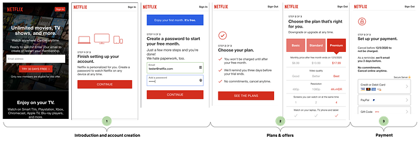
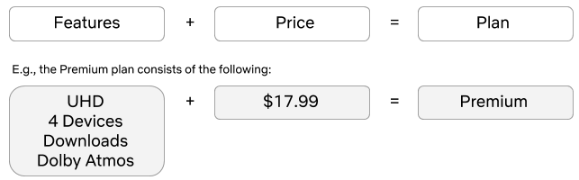
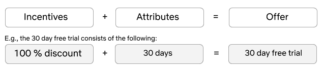
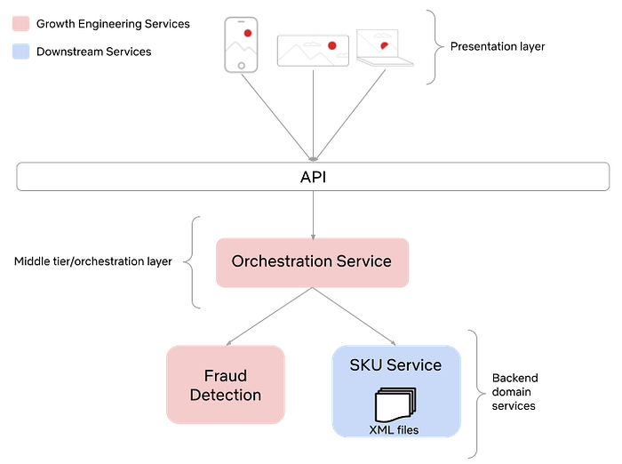
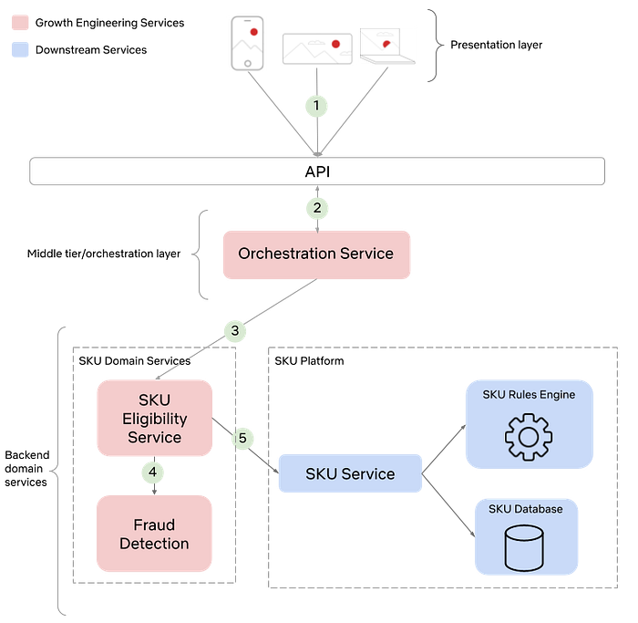
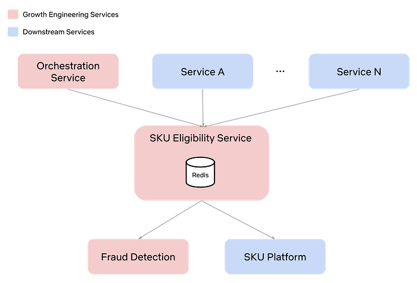
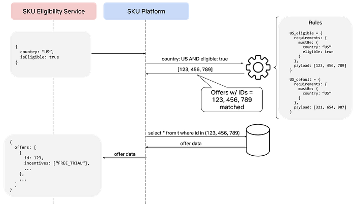

# Growth Engineering at Netflix- Creating a Scalable Offers Platform

by [Eric Eiswerth](https://www.linkedin.com/in/ericeiswerth/)

## Background

Netflix has been offering streaming video-on-demand (SVOD) for over 10 years. Throughout that time we’ve primarily relied on 3 plans (Basic, Standard, & Premium), combined with the 30-day free trial to drive global customer acquisition. The world has changed a lot in this time. Competition for people’s leisure time has increased, the device ecosystem has grown phenomenally, and consumers want to watch premium content whenever they want, wherever they are, and on whatever device they prefer. We need to be constantly adapting and innovating as a result of this change.

The Growth Engineering team is responsible for executing growth initiatives that help us anticipate and adapt to this change. In particular, it’s our job to design and build the systems and protocols that enable customers from all over the world to sign up for Netflix with the plan features and incentives that best suit their needs. For more background on Growth Engineering and the signup funnel, please have a look at our [previous blog post](https://netflixtechblog.com/growth-engineering-at-netflix-accelerating-innovation-90eb8e70ce59) that covers the basics. Alternatively, here’s a quick review of what the typical user journey for a signup looks like:



## Signup Funnel Dynamics

There are 3 steps in a basic Netflix signup. We refer to these steps that comprise a user journey as a signup flow. Each step of the flow serves a distinct purpose.

1. **Introduction and account creation**  
Highlight our value propositions and begin the account creation process.
2. **Plans & offers  
**Highlight the various types of Netflix plans, along with any potential offers.
3. **Payment**  
Highlight the various payment options we have so customers can choose what suits their needs best.

The primary focus for the remainder of this post will be step 2: plans & offers. In particular, we’ll define plans and offers, review the legacy architecture and some of its shortcomings, and dig into our new architecture and some of its advantages.

## Plans & Offers

### Definitions

Let’s define what a plan and an offer is at Netflix. A plan is essentially a set of features with a price.



An offer is an incentive that typically involves a monetary discount or superior product features for a limited amount of time. Broadly speaking, an offer consists of one or more incentives and a set of attributes.



When we merge these two concepts together and present them to the customer, we have the plan selection page (shown above). Here, you can see that we have 3 plans and a 30-day free trial offer, regardless of which plan you choose. Let’s take a deeper look at the architecture, protocols, and systems involved.

### Legacy Architecture

As previously mentioned, Netflix has had a relatively static set of plans and offers since the inception of streaming. As a result of this simple product offering, the architecture was also quite straightforward. It consisted of a small set of XML files that were loaded at runtime and stored in local memory. This was a perfectly sufficient design for many years. However, there are some downsides as the company continues to grow and the product continues to evolve. To name a few:

- Updating XML files is error-prone and manual in nature.
- A full deployment of the service is required whenever the XML files are updated.
- Updating the XML files requires engaging domain experts from the backend engineering team that owns these files. This pulls them away from other business-critical work and can be a distraction.
- A flat domain object structure that resulted in client-side logic in order to extract relevant plan and offer information in order to render the UI. For example, consider the data structure for a 30 day free trial on the Basic plan.

```
{
 "offerId": 123,
 "planId": 111,
 "price": "$8.99",
 "hasSD": true,
 "hasHD": false,
 "hasFreeTrial": true,
 etc…
}
```

- As the company matures and our product offering adapts to our global audience, all of the above issues are exacerbated further.

Below is a visual representation of the various systems involved in retrieving plan and offer data. Moving forward, we’ll refer to the combination of plan and offer data simply as SKU (Stock Keeping Unit) data.



### New Architecture

If you recall from our [previous blog post](https://netflixtechblog.com/growth-engineering-at-netflix-accelerating-innovation-90eb8e70ce59), Growth Engineering owns the business logic and protocols that allow our UI partners to build lightweight and flexible applications for almost any platform. This implies that the presentation layer should be void of any business logic and should simply be responsible for rendering data that is passed to it. In order to accomplish this we have designed a microservice architecture that emphasizes the **Separation of Concerns design principle**. Consider the updated system interaction diagram below:



There are 2 noteworthy changes that are worth discussing further. First, notice the presence of a dedicated SKU Eligibility Service. This service contains specialized business logic that used to be part of the Orchestration Service. By migrating this logic to a new microservice we simplify the Orchestration Service, clarify ownership over the domain, and unlock new use cases since it is now possible for other services not shown in this diagram to also consume eligible SKU data.

Second, notice that the SKU Service has been extended to a platform, which now leverages a rules engine and SKU catalog DB. This platform unlocks tremendous business value since product-oriented teams are now free to use the platform to experiment with different product offerings for our global audience, with little to no code changes required. This means that engineers can spend less time doing tedious work and more time designing creative solutions to better prepare us for future needs. Let’s take a deeper look at the role of each service involved in retrieving SKU data, starting from the visitor’s device and working our way down the stack.

**Step 1 — Device sends a request for the plan selection page  
**As discussed in our previous Growth Engineering blog post, we use a custom JSON protocol between our client UIs and our middle-tier Orchestration Service. An example of what this protocol might look like for a browser request to retrieve the plan selection page shown above might look as follows:

```
GET /plans
{
  “flow”: “browser”,
  “mode”: “planSelection”
}
```

As you can see, there are 2 critical pieces of information in this request:

- Flow — The flow is a way to identify the platform. This allows the Orchestration Service to route the request to the appropriate platform-specific request handling logic.
- Mode — This is essentially the name of the page being requested.

Given the flow and mode, the Orchestration Service can then process the request.

**Step 2 — Request is routed to the Orchestration Service for processing  
**The Orchestration Service is responsible for validating upstream requests, orchestrating calls to downstream services, and composing JSON responses during a signup flow. For this particular request the Orchestration Service needs to retrieve the SKU data from the SKU Eligibility Service and build the JSON response that can be consumed by the UI layer.

The JSON response for this request might look something like below. Notice the difference in data structures from the legacy implementation. This new contextual representation facilitates greater reuse, as well as potentially supporting offers other than a 30 day free trial:

```
{
  “flow”: “browser”,
  “mode”: “planSelection”,
  “fields”: {
    “skus”: [
      {
        “id”: 123,
        “incentives”: [“FREE_TRIAL”],
        “plan”: {
          “name”: “Basic”,
          “quality”: “SD”,
          “price” : “$8.99”,
          ...
        }
        ...
      },
      {
        “id”: 456,
        “incentives”: [“FREE_TRIAL”],
        “plan”: {
          “name”: “Standard”,
          “quality”: “HD”,
          “price” : “$13.99”,
          ...
        }
        ...
      },
      {
        “id”: 789,
        “incentives”: [“FREE_TRIAL”],
        “plan”: {
          “name”: “Premium”,
          “quality”: “UHD”,
          “price” : “$17.99”,
          ...
        }
        ...
      }
    ],
    “selectedSku”: {
      “type”: “Numeric”,
      “value”: 789
    }
    "nextAction": {
      "type": "Action"
      "withFields": [
        "selectedSku"
      ]
    }
  }
}
```

As you can see, the response contains a list of SKUs, the selected SKU, and an action. The action corresponds to the button on the page and the `withFields` specify which fields the server expects to have sent back when the button is clicked.

**Step 3 & 4 — Determine eligibility and retrieve eligible SKUs from SKU Eligibility Service  
**Netflix is a global company and we often have different SKUs in different regions. This means we need to distinguish between availability of SKUs and eligibility for SKUs. You can think of eligibility as something that is applied at the user level, while availability is at the country level. The SKU Platform contains the global set of SKUs and as a result, is said to control the availability of SKUs. Eligibility for SKUs is determined by the SKU Eligibility Service. This distinction creates clear ownership boundaries and enables the Growth Engineering team to focus on surfacing the correct SKUs for our visitors.

This centralization of eligibility logic in the SKU Eligibility Service also enables innovation in different parts of the product that have traditionally been ignored. Different services can now interface directly with the SKU Eligibility Service in order to retrieve SKU data.



**Step 5 — Retrieve eligible SKUs from SKU Platform  
**The SKU Platform consists of a rules engine, a database, and application logic. The database contains the plans, prices and offers. The rules engine provides a means to extract available plans and offers when certain conditions within a rule match. Let’s consider a simple example where we attempt to retrieve offers in the US.



Keeping the Separation of Concerns in mind, notice that the SKU Platform has only one core responsibility. It is responsible for managing all Netflix SKUs. It provides access to these SKUs via a simple API that takes customer context and attempts to match it against the set of SKU rules. SKU eligibility is computed upstream and is treated just as any other condition would be in the SKU ruleset. By not coupling the concepts of eligibility and availability into a single service, we enable increased developer productivity since each team is able to focus on their core competencies and any change in eligibility does not affect the SKU Platform. One of the core tenets of a platform is the ability to support self-service. This negates the need to engage the backend domain experts for every desired change. The SKU Platform supports this via lightweight configuration changes to rules that do not require a full deployment. The next step is to invest further into self-service and support rule changes via a SKU UI. Stay tuned for more details on this, as well as more details on the internals of the new SKU Platform in one of our upcoming blog posts.

## Conclusion

This work was a large cross-functional effort. We rebuilt our offers and plans from the ground up. It resulted in systems changes, as well as interaction changes between teams. Where there was once ambiguity, we now have clearly defined ownership over SKU availability and eligibility. We are now capable of introducing new plans and offers in various markets around the globe in order to meet our customer’s needs, with minimal engineering effort.

Let’s review some of the advantages the new architecture has over the legacy implementation. To name a few:

- Domain objects that have a more reusable and extensible “shape”. This shape facilitates code reuse at the UI layer as well as the service layers.
- A SKU Platform that enables product innovation with minimal engineering involvement. This means engineers can focus on more challenging and creative solutions for other problems. It also means fewer engineering teams are required to support initiatives in this space.
- Configuration instead of code for updating SKU data, which improves innovation velocity.
- Lower latency as a result of fewer service calls, which means fewer errors for our visitors.

The world is constantly changing. Device capabilities continue to improve. How, when, and where people want to be entertained continues to evolve. With these types of continued investments in infrastructure, the Growth Engineering team is able to build a solid foundation for future innovations that will allow us to continue to deliver the best possible experience for our members.

Join [Growth Engineering](https://sites.google.com/netflix.com/revenue-growth-eng/home) and help us build the next generation of services that will allow the next 200 million subscribers to experience the joy of Netflix.

---
**Tags:** Growth · Software Development · Netflix · Software Engineering · Technology
