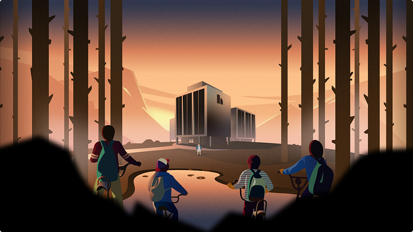
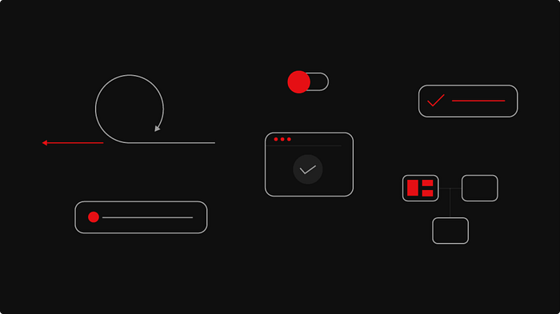
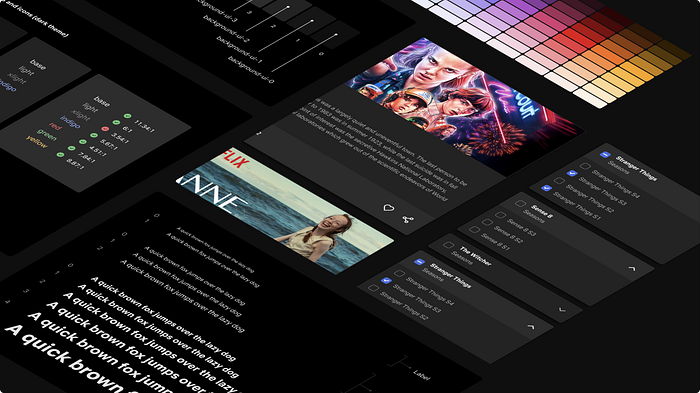
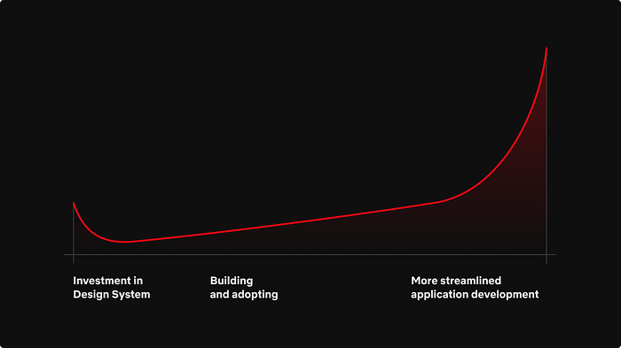
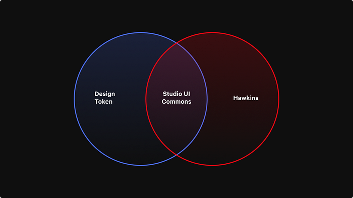
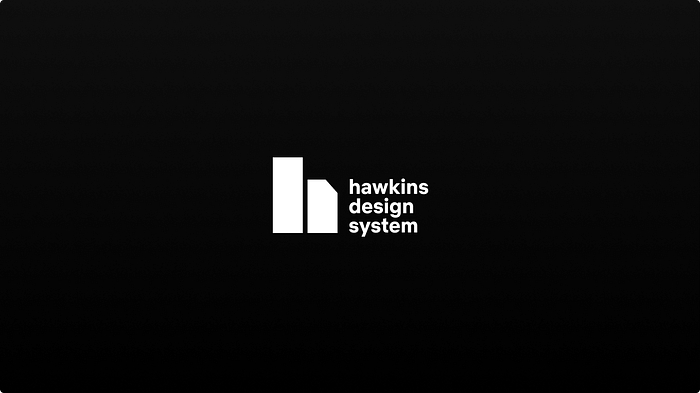

# Hawkins: Diving into the Reasoning Behind our Design System

*Stranger Things imagery showcasing the inspiration for the Hawkins Design System*

_by Hawkins team member _[_Joshua Godi_](https://www.linkedin.com/in/jgodi/)_; with cover art from _[_Martin Bekerman_](https://www.linkedin.com/in/martinbekerman/)_ and additional imagery from _[_Wiki Chaves_](https://www.linkedin.com/in/wikichaves/)

Hawkins may be the name of a fictional town in Indiana, most widely known as the backdrop for one of Netflix’s most popular TV series “Stranger Things,” but the name is so much more. Hawkins is the namesake that established the basis for a design system used across the Netflix Studio ecosystem.

Have you ever used a suite of applications that had an inconsistent user experience? It can be a nightmare to work efficiently. The learning curve can be immense for each and every application in the suite, as the user is essentially learning a new tool with each interaction. Aside from the burden on these users, the engineers responsible for building and maintaining these applications must keep reinventing the wheel, starting from scratch with toolsets, component libraries and design patterns. This investment is repetitive and costly. A design system, such as the one we developed for the Netflix Studio, can help alleviate most of these headaches.

We have been working on our own design system that is widely used across the Netflix Studio’s growing application catalogue, which consists of 80+ applications. These applications power the production of Netflix’s content, from pitch evaluation to financial forecasting and completed asset delivery. A typical day for a production employee could require using a handful of these applications to entertain our members across the world. We wanted a way to ensure that we can have a **consistent user experience** while also **sharing as much code as possible**.

In this blog post, we will highlight why we built Hawkins, as well as how we got buy-in across the engineering organization and our plans moving forward. We recently presented a [talk](https://www.youtube.com/watch?v=LtrXwX81CPE) on how we built Hawkins; so if you are interested in more details, check out the video.

## What is a design system?

Before we can dive into the importance of having a design system, we have to define what a design system means. It can mean different things to different people. For Hawkins, our design system is composed of two main aspects.

*General design system component mocks*

First, we have the design elements that form the foundational layer of Hawkins. These consist of [Figma](https://www.figma.com/) components that are used throughout the design team. These components are used to build out mocks for the engineering team. Being the foundational layer, it is important that these assets are consistent and intuitive.

Second, we have our React component library, which is a JavaScript library for building user interfaces. The engineering team uses this component library to ensure that each and every component is reusable, conforms to the design assets and can be highly configurable for different situations. We also make sure that each component is composable and can be used in many different combinations. We made the decision to keep our components very atomic; this keeps them small, lightweight and easy to combine into larger components.

At Netflix, we have two teams composed of six people who work together to make Hawkins a success, but that doesn’t always need to be the case. A successful design system can be created with just a small team. The key aspects are that it is reusable, configurable and composable.

## Why is a design system important?

Having a solid design system can help to alleviate many issues that come from maintaining so many different applications. A design system can bring cohesion across your suite of applications and drastically reduce the engineering burden for each application.

*Examples of Figma components for the Hawkins Design System*

Quality user experience can be hard to come by as your suite of applications grow. A design system should be there to help ease that burden, acting as the blueprint on how you build applications. Having a consistent user experience also reduces the training required. If users know how to fill out forms, access data in a table or receive notifications in one application, they will intuitively know how to in the next application.

**The design system acts as a language that both designers and engineers can speak to align on how applications are built out.** It also helps with onboarding new team members due to the documentation and examples outlined in your design system.

The last and arguably biggest win for design systems is the reduction of burden on engineering. There will only be one implementation of buttons, tables, forms, etc. This greatly reduces the number of bugs and improves the overall health and performance of every application that uses the design system. The entire engineering organization is working to improve one set of components vs. each using their own individual components. When a component is improved, whether through additional functionality or a bug fix, the benefit is shared across the entire organization.

Taking a wide view of the Netflix Studio landscape, we saw many opportunities where Hawkins could bring value to the engineering organization.

## Build vs. buy

The first question we asked ourselves is whether we wanted to build out an entire design system from scratch or leverage an existing solution. There are pros and cons to each approach.

**_Building it yourself_**_ _**— **The benefits of DIY means that you are in control every step of the way. You get to decide what will be included in the design system and what is better left out. The downside is that because you are responsible for it all, it will likely take longer to complete.

**_Leveraging an existing solution_** — When you leverage an existing solution, you can still customize certain elements of that solution, but ultimately you are getting a lot out of the box for free. Depending on which solution you choose, you could be inheriting a ton of issues or something that is battle tested. Do your research and don’t be afraid to ask around!

For Hawkins, we decided to take both approaches. On the design side, we decided to build it ourselves. This gave us complete creative control over how our user experience is throughout the design language. On the engineering side, we decided to build on top of an existing solution by utilizing [Material-UI](https://material-ui.com/). Leveraging Material-UI, gave us a ton of components out of the box that we can configure and style to meet the needs of Hawkins. We also chose to obfuscate a number of the customizations that come from the library to ensure upgrading or replacing components will be smoother.

## Generating users and getting buy-in

The single biggest question that we had when building out Hawkins is how to obtain buy-in across the engineering organization. We decided to track the number of uses of each component, the number of installs of the packages themselves, and how many applications were using Hawkins in production as metrics to determine success.

There is a definitive cost that comes with building out a design system no matter the route you take. The initial cost is very high, with research, building out the design tokens and the component library. Then, developers have to begin consuming the libraries inside of applications, either with full re-writes or feature by feature.

*Graph depicting the cost of building a design system*

A good representation of this is the graph above. While an organization may spend a lot of time initially making the design system, it will benefit greatly once it is fully implemented and trusted across the organization. With Hawkins, our initial build phase took about two quarters. The two quarters were split between Q1 consisting of creating the design language and Q2 being the implementation phase. Engineering and Design worked closely during the entire build phase. The end result was a significant number of components in [Figma](https://www.figma.com/) and a large component library leveraging [Material-UI](https://material-ui.com/). Only then could we start to look for engineering teams to start using Hawkins.

When building out the component library, we set out to accomplish four key aspects that we felt would help drive support for Hawkins:

**_Document components _— **First, we ensured that each component was fully documented and had examples using [Storybook](https://storybook.js.org/).

**_On-call rotation for support_ — **Next, we set up an on-call rotation in [Slack](https://slack.com/), where engineers could not only seek guidance, but report any issues they may have encountered. It was extremely important to be responsive in our communication channels. The more support engineers feel they have, the more receptive they will be to using the design library.

**_Demonstrate Hawkins usefulness_ — **Next, we started to do “road shows,” where we would join team meetings to demonstrate the value that Hawkins could bring to each and every team. This also provided an opportunity for the engineers to ask questions in person and for us to gather feedback to ensure our plans for Hawkins would meet their needs.

**_Bootstrap features for proof of concept_** **— **Finally, we helped bootstrap out features or applications for teams as a proof of concept. All of these together helped to foster a relationship between the Hawkins team and engineering teams.

Even today, as the Hawkins team, we run through all of the above exercises and more to ensure that the design system is robust and has the level of support the engineering organization can trust.

## Handling the outliers

The Hawkins libraries all consist of basic components that are the building blocks to the applications across the Netflix Studio. When engineers increased their usage of Hawkins, it became clear that many folks were using the atomic components to build more complex experiences that were common across multiple applications, like in-app chat, data grids, and file uploaders, to name a few. We did not want to put these components straight into Hawkins because of the complexity and because they weren’t used across the entire Studio. So, we were tasked with identifying a way to share these complex components while still being able to benefit from all the work we accomplished on Hawkins.

To meet this challenge, developers decided to spin up a parallel library that sits right next to Hawkins. This library builds on top of the existing design system to provide a home for all the complex components that didn’t fit into the original design system.

*Venn diagram showing the relationship between the libraries*

This library was set up as a [Lerna](https://github.com/lerna/lerna) monorepo with tooling to quickly jumpstart a new package. We followed the same steps as Hawkins with [Storybook](https://storybook.js.org/) and communication channels. The benefit of using a monorepo was that it gave engineering a single place to discover what components are available when building out applications. We also decided to version each package independently, which helped avoid issues with updating Hawkins or in downstream applications.

With so many components that will go into this parallel library, we decided on taking an “open source” approach to share the burden of responsibility for each component. Every engineer is welcome to contribute new components and help fix bugs or release new features in existing components. This model helps spread the ownership out from just a single engineer to a team of developers and engineers working in tandem.

It is the goal that eventually these components could be migrated into the Hawkins library. That is why we took the time to ensure that each repository has the same rules when it came to development, testing and building. This would allow for an easy migration.

## Wrapping up

We still have a long way to go on Hawkins. There are still a plethora of improvements that we can do to enhance performance and developer ergonomics, and make it easier to work with Hawkins in general, especially as we start to use Hawkins outside of just the Netflix Studio!

*Logo for the Hawkins Design System*

We are very excited to share our work on Hawkins and dive into some of the nuances that we came across.

---
**Tags:** Design Systems · React · Build Vs Buy · Component Libraries
