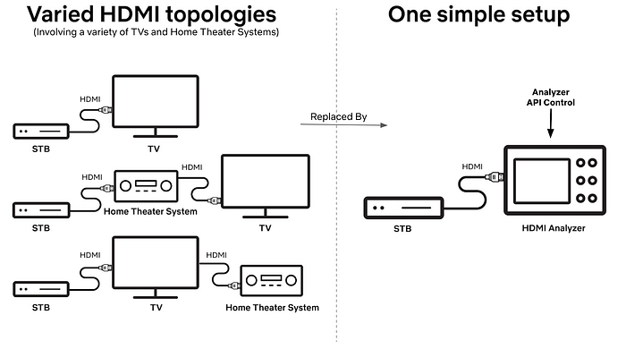
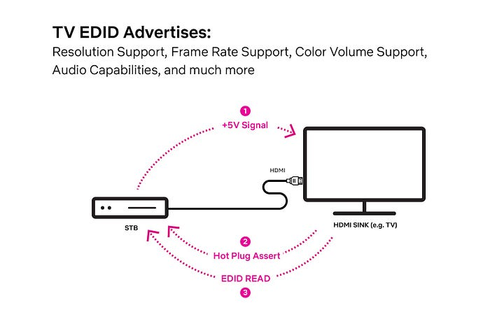
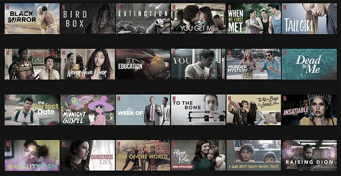
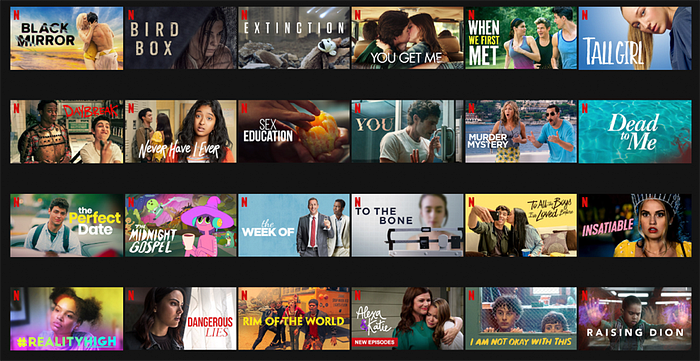
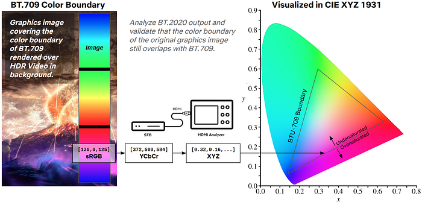
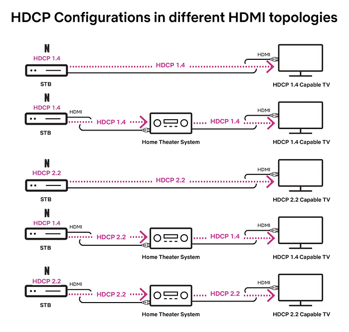
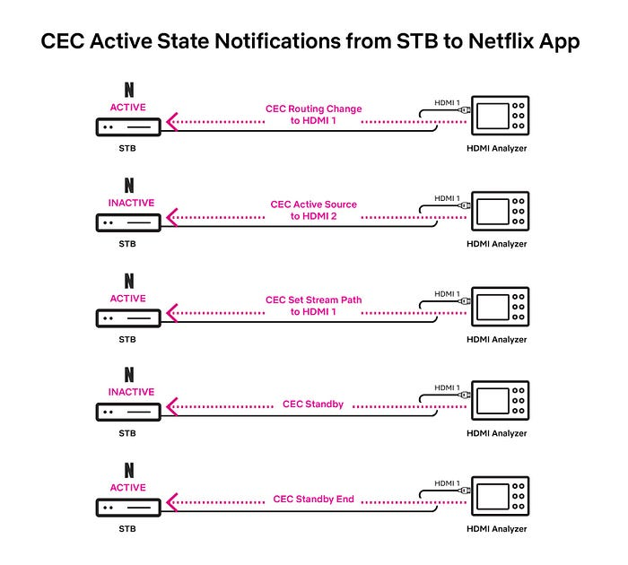

# HDMI — Scaling Netflix Certification

[_Scott Bolter_](https://www.linkedin.com/in/scott-bolter-7b249b26/)_, _[_Matthew Lehman_](https://www.linkedin.com/in/lehmanm/)_, _[_Akshay Garg_](http://www.linkedin.com/in/akshaygarg05) ¹

At Netflix, we take the task of **preserving **the creative vision of our content all the way to a subscriber TV screen very seriously. This significantly increases the scope of our application integration and certification processes for streaming devices like set-top-boxes (STBs) and TVs. However, given a diverse device ecosystem, scaling this deeper level of validation for each device presents a significant challenge for our certification teams.

Our first step towards addressing this challenge is to actively engineer the removal of manual and subjective testing approaches across different functional touch points of the Netflix application on a streaming device. In this article we talk about one such functional area, High Definition Multimedia Interface ([HDMI](https://www.hdmi.org/)), the challenges it brings in relation to Netflix certification on STBs, and our in-house developed automated and objective testing workflows that help us simplify this process.

## Why test High Definition Multimedia Interface (HDMI) ?

The HDMI spec includes several protocols and capabilities that are key to successfully transmitting audio, video, and other digital messages from source (STB) to sink (display) devices. Some of these capabilities include:

- Extended Display Identification Data (EDID)
- Audio and Video metadata (Info Frames) to help communicate media formats like multi-channel audio and High Dynamic Range (HDR) video
- High-Bandwidth Digital Content Protection (HDCP)
- Consumer Electronics Control (CEC)

A high quality Netflix experience on the STB device depends on the correct implementation of each of these capabilities, so we have a vested interest in thoroughly testing them.

## Scaling HDMI Testing

Here are some of the challenges associated with HDMI testing on STBs:

- The need to physically obtain and replicate different home entertainment setups of TVs and Home Theater Systems (HDMI topologies).
- Time spent in manually changing these topologies between and during different tests.
- Inconsistent test results due to different device models used in the HDMI topology.
- Subjectivity in test results to accommodate differences in HDMI sink behaviors.

To deal with these scaling challenges, we have opted to integrate API-enabled **HDMI Signal Analyzers** into our test infrastructure. This provides the ability to simulate different HDMI topologies within a test case by leveraging the analyzer’s API.

*Simulating multiple HDMI Topologies²*

Next, we will cover basics of the HDMI protocols highlighted in the previous section and walk through the automation workflows that we have developed to address the related challenges.

## EDID

### Background

Every HDMI-capable TV transmits its Extended Display Identification Data, or [EDID](https://en.wikipedia.org/wiki/Extended_Display_Identification_Data), to the connected HDMI source device (STB). The EDID is the means by which a sink device advertises its supported audio and video capabilities such as the spatial resolution (number of pixels), the temporal resolution (number of frames per second), and the color formats in which these frames of pixels are rendered.

*EDID exchange between HDMI Sink and HDMI Source*

### Testing Approach

Using an HDMI Analyzer we can advertise the EDID of any HDMI capable sink to a STB device. This allows us to simulate an environment under which the device under test (DUT) i.e. the STB behaves just as it would if it were physically connected to an HDMI sink represented by that EDID. This ability to emulate different HDMI sinks has proven very useful for us, yielding increased automation, objective evaluation and scalability of a number of our test cases. In comparison, previously a tester was tasked to gather many physical HDMI sink devices, plug them into the DUT, validate, and move to the next scenario.

### Test Area: Requested Media Profile Validation

A Netflix capable STB should request accurate media streams from our cloud service for optimal user experience. The media stream format and fidelity to be requested is decided by a combination of the inherent HDMI output capabilities of the STB and that of the connected HDMI topology. For example, an HD-only STB should not request 4K video streams. Likewise, a STB connected to a TV with stereo-only speakers should not request multi-channel Dolby Digital Plus Atmos audio streams. In order to comprehensively test the accuracy of the media streams being requested by the DUT under different HDMI setups, we emulate a variety of HDMI sinks with distinct resolution and media format capabilities by looping through a collection of EDID files on an HDMI analyzer connected to the DUT. For each EDID version we then validate the media profiles being requested by the DUT in an automated manner by comparing them against a reference expected set. This ensures that the media streams requested by DUT accurately reflect its HDMI capabilities and the active HDMI topology.

## HDR

### Background

HDR enables a wider range of colors, deeper blacks, and brighter specular highlights. However, when graphics in the [sRGB color space](https://en.wikipedia.org/wiki/SRGB), such as subtitles and media player controls, are composited on a video layer in the HDR format they need to be correctly converted into a wider [BT.2020 color space](https://en.wikipedia.org/wiki/Rec._2020) and a larger range of luminance. Netflix gives guidance to preserve the original creative intent of the non-HDR graphics, so they appear the same when rendered in HDR output mode. This concept is known as perceptual mapping ([BT.2087.0](https://www.itu.int/dms_pubrec/itu-r/rec/bt/R-REC-BT.2087-0-201510-I!!PDF-E.pdf)).

An increasing number of STB devices are capable of producing HDR output within the entire user experience rather than only during video playback, making accurate graphics color space and luminance mapping a more important part of a good user experience. Incorrectly mapped, these graphics can appear dim or colors can look oversaturated as you can see in the images below.

*Undersaturated Netflix UI*

*Expected Netflix UI after SDR to HDR graphics conversion*

*Oversaturated Netflix UI*

### Testing Approach

Even if a STB follows the Netflix recommended sRGB to HDR color volume mapping for graphics, the end result on a screen is rather subjective. Different display panels add their own characteristics to the final output. Some testers might even prefer oversaturated graphics. Thankfully we can use an HDMI analyzer in an automated manner to remove this subjectivity from our testing.

### Test Area: sRGB Graphics to HDR Color Volume mapping

Using an HDMI Analyzer we can objectively measure the pixel values for characteristics such as chromaticity and luminance. In our HDR-specific tests we use graphics that cover both the boundary of the sRGB color space as well as its entire luminance range. When these images are then applied to the graphics plane of a STB sending HDMI output in HDR mode, the STB has to convert its graphics plane into HDR color volume so that it can output both the graphics and video elements in a unified format. By capturing this STB output on an HDMI analyzer we measure and verify that after this graphics color volume conversion on the STB, the output pixel values of the graphics section follow the expected boundaries of it’s original [non-HDR](https://en.wikipedia.org/wiki/Rec._709) color space and luminance range as per our perceptual mapping requirement. The figure below highlights this testing process.

*Validation of SDR to HDR color volume conversion for graphics*

## HDCP

### Background

With the goal of preventing content piracy, it is of utmost importance that a STB device running the Netflix application is able to protect our content from being compromised on that device. One of the many important steps toward ensuring this is to validate STB devices’ adherence to High-bandwidth Digital Content Protection ([HDCP](https://en.wikipedia.org/wiki/High-bandwidth_Digital_Content_Protection)) policies as specified in the Digital Rights Management (DRM) licenses associated with our streams.

A Netflix DRM license typically provides a mapping of the minimum required HDCP version (v1.4 or v2.2) for each content resolution i.e. the minimum HDCP version that must be established on the link between HDMI source (STB) and sink device (display) for the source to be able to send the associated decrypted video signal at a specific resolution over the HDMI cable. In order to effectively apply these HDCP policies, we must be able to trust the HDMI source device’s reporting of the effective HDCP state negotiated with the HDMI sink as well as its enforcement of the minimum required HDCP version for each output content resolution.

### Testing Approach

As the task of procuring various audio/video repeaters (e.g. Home Theater Systems), HDMI switches and connected displays is very time-consuming and does not scale, once again we lean in on using an HDMI analyzer for our test automation purposes.

### Test Area: Accurate HDCP Version Reporting

Leveraging the analyzer, we can simulate the following HDMI topologies:

1. STB connected to a TV
2. STB connected to a repeater which in turn is connected to a TV

In each topology, we can also tweak the level of HDCP support i.e. HDCP v1.4 or HDCP v2.2 on the repeater and the TV individually in an automated manner using the relevant HDMI Analyzer API’s. These abilities allow us to create multiple test setups as shown in the figure below and in each such setup, the DUT is required to report the effective HDCP version (the lowest version in the topology) to the Netflix application so that our service can serve the appropriate content to the client in that configuration.

*Multiple possible HDCP version configurations*

### Test Area: Adherence to HDCP Policies

While testing of the reported HDCP version would ensure that the DUT sends correct data to Netflix services to obtain the appropriate content streams and DRM licenses, we also need to test that the DUT adheres to the video output restrictions stipulated in that license e.g. blocking content requiring HDCP v2.2 when HDCP v1.4 is negotiated on the HDMI link. To ensure this we use an HDMI analyzer to emulate different HDMI topologies virtually and initiate playback using a variety of DRM licenses that stipulate distinct types of content protection rules for video output. Finally, we switch across different HDCP versions on the HDMI Analyzer, ensuring that in each configuration, DUT is able to follow the DRM license stipulated video output protection rules by taking one of the following required actions:

1. Allow HDMI output of the video stream as-is
2. Downscale the video output resolution if resolution is the content protection criteria
3. Block the HDMI video output completely
4. Stop playback by throwing an insufficient HDCP protection error to Netflix application

each of which can be validated in an automated manner leveraging the HDMI analyzer and the relevant Netflix application events.

## CEC

### Background

Consumer Electronics Control (CEC) protocol implementations on HDMI devices typically provide a convenience of an indirect device control e.g. using a TV remote to control the volume of the connected home theater system. However, aside from this benefit, CEC messages can also indicate which HDMI input of a downstream device (HDMI sink) is actively being used or if the downstream device itself is in a standby state. This is something of interest to a streaming application like Netflix running on an HDMI source. Whether or not the STB running Netflix is connected to an active HDMI input on the sink device has implications for what the Netflix application should or should not be doing, so we want the STB to correctly signal this active or inactive CEC state to the Netflix application.

### Testing Approach

In order to remove the issues of variability in how CEC is branded on a sink device, how it is enabled in a device menu system, and under what conditions relevant CEC messages are transmitted, we use an HDMI analyzer to send carefully crafted CEC operational codes to the STB.

### Test Area: Accurate CEC Active State Notifications

After sending custom CEC messages targeted to the DUT on the HDMI bus, we can ensure that it behaves correctly in response to these messages, in terms of its CEC active state notification to the Netflix application. Some of these test scenarios are highlighted in the figure below.

*CEC Active State notification in different scenarios*

As an example we could send a CEC message to the STB to notify it that the active HDMI input on the HDMI sink has changed to some other source. Likewise we can also simulate the occurrence of an HDMI sink standby transition by broadcasting a CEC Standby message. In both scenarios we expect the source device to become CEC inactive and notify this updated CEC state to its local Netflix application.

## Summary

At Netflix we deeply care about the quality of experience for our subscribers. It motivates us to invest in test automation to scale our approach to ensure the best possible device integration from our partners. The ideas discussed here represent a tip of the iceberg with many more challenges still left to be identified and addressed. If you are passionate about device test automation and want to help us solve these kinds of problems, please check out our [jobs site](https://jobs.netflix.com/search?team=Partnership&subteam=Ecosystem+Engineering) for exciting opportunities.

---

[1] Equal contribution from all authors.

[2] Diagrams courtesy of [Sunny Kong](https://www.linkedin.com/in/seonmeekong/).

---
**Tags:** Hdmi · Automation Testing · Hdr · Set Top Box · Automation
