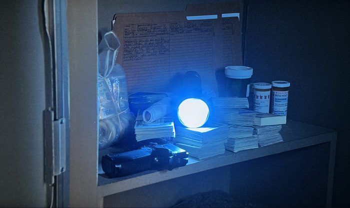
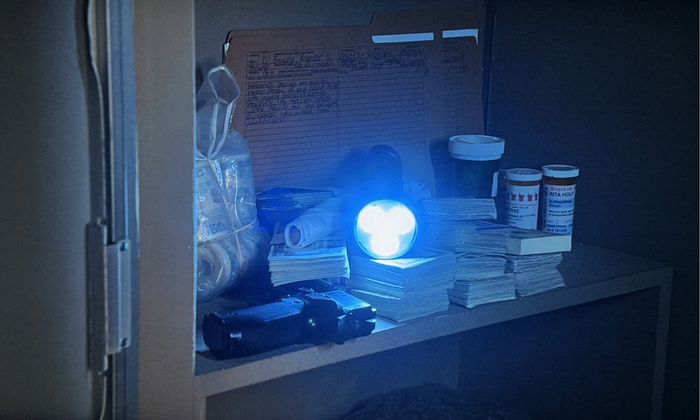

# HDR10+ Now Streaming on Netflix

[Roger Quero](https://www.linkedin.com/in/rquero), [Liwei Guo](https://www.linkedin.com/in/liwei-guo), [Jeff Watts](https://www.linkedin.com/in/jeffrwatts/), [Joseph McCormick](https://www.linkedin.com/in/joseph-mccormick-7b386026), [Agata Opalach](https://www.linkedin.com/in/agataopalach/), [Anush Moorthy](https://www.linkedin.com/in/anush-moorthy-b8451142/)

We are excited to announce that we are now streaming HDR10+ content on our service for AV1-enabled devices, enhancing the viewing experience for certified HDR10+ devices, which previously only received HDR10 content. The dynamic metadata included in our HDR10+ content improves the quality and accuracy of the picture when viewed on these devices.

## Delighting Members with Even Better Picture Quality

Nearly a decade ago, we made a bold move to be a pioneering adopter of High Dynamic Range (HDR) technology. HDR enables images to have more details, vivid colors, and improved realism. We began producing our shows and movies in HDR, encoding them in HDR, and streaming them in HDR for our members. We were confident that it would greatly enhance our members’ viewing experience, and unlock new creative visions — and we were right! In the last five years, HDR streaming has increased by more than 300%, while the number of HDR-configured devices watching Netflix has more than doubled. Since launching HDR with season one of _Marco Polo_, Netflix now has over 11,000 hours of HDR titles for members to immerse themselves in.

We continue to enhance member joy while maintaining creative vision by adding support for HDR10+. This will further augment Netflix’s growing HDR ecosystem, preserve creative intent on even more devices, and provide a more immersive viewing experience.

We enabled HDR10+ on Netflix using the [AV1 video codec](https://aomedia.org/specifications/av1/) that was standardized by the Alliance for Open Media (AOM) in 2018. AV1 is one of the most efficient codecs available today. We [previously enabled](./bringing-av1-streaming-to-netflix-members-tvs-b7fc88e42320.md) AV1 encoding for SDR content, and saw tremendous value for our members, including higher and more consistent visual quality, lower play delay and increased streaming at the highest resolution. AV1-SDR is already the second most streamed codec at Netflix, behind H.264/AVC, which has been around for over 20 years! With the addition of HDR10+ streams to AV1, we expect the day is not far when AV1 will be the most streamed codec at Netflix.

To enhance our offering, we have been adding HDR10+ streams to both new releases and existing popular HDR titles. AV1-HDR10+ now accounts for 50% of all eligible viewing hours. We will continue expanding our HDR10+ offerings with the goal of providing an HDR10+ experience for all HDR titles by the end of this year¹.

## Industry Adopted Formats

Today, the industry recognizes three prevalent HDR formats: Dolby Vision, HDR10, and HDR10+. For all three HDR Formats, metadata is embedded in the content, serving as instructions to guide the playback device — whether it’s a TV, mobile device, or computer — on how to display the image.

HDR10 is the most widely adopted HDR format, supported by all HDR devices. HDR10 uses static metadata that is defined once for the entire content detailing aspects such as the maximum content light level (MaxCLL), maximum frame average light level (MaxFALL), as well as characteristics of the mastering display used for color grading. This metadata only allows for a one-size-fits-all tone mapping of the content for display devices. It cannot account for dynamic contrast across scenes, which most content contains.

**HDR10+ and Dolby Vision improve on this with dynamic metadata that provides content image statistics on a per-frame basis, enabling optimized tone mapping adjustments for each scene. This achieves greater perceptual fidelity to the original, preserving creative intent.**

## HDR10 vs. HDR10+

The figure below shows screen grabs of two AV1-encoded frames of the same content displayed using HDR10 (top) and HDR10+ (bottom).

_Photographs of devices displaying the same frame with HDR10 metadata (top) and HDR10+ metadata (bottom). Notice the preservation of the flashlight detail in the HDR10+ capture, and the over-exposure of the region under the flashlight in the HDR10 one²._

As seen in the flashlight on the table, the highlight details are clipped in the HDR10 content, but are recovered in HDR10+. Further, the region under the flashlight is overexposed in the HDR10 content, while HDR10+ renders that region with greater fidelity to the source. The reason HDR10+, with its dynamic metadata, shines in this example is that the scenes preceding and following the scene with this frame have markedly different luminance statistics. The static HDR10 metadata is unable to account for the change in the content. While this is a simple example, the dynamic metadata in HDR10+ demonstrates such value across any set of scenes. This consistency allows our members to stay immersed in the content, and better preserves creative intent.

## Receiving HDR10+

At the time of launch, these requirements must be satisfied to receive HDR10+:

1.Member must have a Netflix Premium plan subscription

2. Title must be available in HDR10+ format

3. Member device must support AV1 & HDR10+. Here are some examples of compatible devices:

- SmartTVs, mobile phones, and tablets that meet Netflix certification for HDR10+
- Source device (such as set-top boxes, streaming devices, MVPDs, etc.) that meets Netflix certification for HDR10+, connected to an HDR10+ compliant display via HDMI

4. For TV or streaming devices, ensure that the HDR toggle is enabled in our Netflix application settings: [https://help.netflix.com/en/node/100220](https://help.netflix.com/en/node/100220)

Additional guidance: [https://help.netflix.com/en/node/13444](https://help.netflix.com/en/node/13444)

## Summary

More HDR content is watched every day on Netflix. Expanding the Netflix HDR ecosystem to include HDR10+ increases the accessibility of HDR content with dynamic metadata to more members, improves the viewing experience, and preserves the creative intent of our content creators. The commitment to innovation and quality underscores our dedication to delivering an immersive and authentic viewing experience for all our members.

## Acknowledgements

Launching HDR10+ was a collaborative effort involving multiple teams at Netflix, and we are grateful to everyone who contributed to making this idea a reality. We would like to extend our thanks to the following teams for their crucial roles in this launch:

- The various Client and Partner Engineering teams at Netflix that manage the Netflix experience across different device platforms.  
Special acknowledgments: [Akshay Garg](https://www.linkedin.com/in/akshaygarg05/), [Dasha Polyakova](https://www.linkedin.com/in/dashap/), [Vivian Li](https://www.linkedin.com/in/wei-vivian-li/), [Ben Toofer](https://www.linkedin.com/in/benjamintoofer/), [Allan Zhou](https://www.linkedin.com/in/allanzp/), [Artem Danylenko](https://www.linkedin.com/in/artemdanylenko/)
- The Encoding Technologies team that is responsible for producing optimized encodings to enable high-quality experiences for our members. Special acknowledgments: [Adithya Prakash](https://www.linkedin.com/in/adithyaprakash/), [Vinicius Carvalho](https://www.linkedin.com/in/carvalhovinicius/)
- The Content Operations & Innovation teams responsible for producing and delivering HDR content to Netflix, maintaining the intent of creative vision from production to streaming. Special acknowledgements: [Michael Keegan](https://www.linkedin.com/in/michael-keegan-072a4950/)
- The Product Discover team that enables seamless UI discovery journey for our members. Special acknowledgments: [Chad McKee](https://www.linkedin.com/in/chad-mckee/) [Ramya Somaskandan](https://www.linkedin.com/in/ramyasomaskandan/)
- The Playback Experience team that delivers the best possible experience to our members. Special acknowledgments: [Nate Santti](https://www.linkedin.com/in/nate-santti/)

### Footnotes

1. While we have enabled HDR10+ for distribution i.e., for what our members consume on their devices, we continue to accept only Dolby Vision masters on the ingest side, i.e., for all content delivery to Netflix as per our [delivery specification](https://partnerhelp.netflixstudios.com/hc/en-us/sections/360012197873-Branded-Delivery-Specifications). In addition to HDR10+, we continue to serve HDR10 and DolbyVision. Our encoding pipeline is designed with flexibility and extensibility where all these HDR formats could be derived from a single DolbyVision deliverable efficiently at scale.
2. We recognize that it is hard to convey visual improvements in HDR video using still photographs converted to SDR. We encourage the reader to stream Netflix content in HDR10+ and check for yourself!

---
**Tags:** Streaming · Hdr · Av1 · Netflix · Innovation
