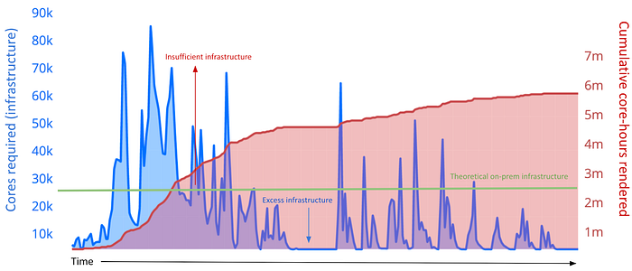

# Helping VFX studios pave a path to the cloud

By: Peter Cioni (Netflix), Alex Schworer (Netflix), Mac Moore (Conductor Tech.), Rachel Kelley (AWS), Ranjit Raju (AWS)

## Rendering is core to the VFX process

VFX studios around the world create amazing imagery for Netflix productions. Nearly every show that is produced today includes digital visual effects, from the creatures in _Stranger Things_, to recreating historic London in _Bridgerton_.

Netflix production teams work with a global roster of VFX studios (both large and small) and their artists to create this amazing imagery. But it’s not easy: to pull this off, VFX studios need to build and operate serious technical infrastructure (compute, storage, networking, and software licensing), otherwise known as a “**render farm**.”

Rendering is the final step in the VFX creation process, and processing on a render farm often can take **several hours **to complete just a _single_ frame of a show, even when this process runs on the latest high-end hardware. Many shows have needs that exceed 100,000 frames, so aggregate rendering time can impact the timely delivery of a show on Netflix.

We’ve found that when VFX teams dedicate more compute capacity to rendering, they are able to handle more projects, iterations, and schedule crunches while maintaining on-time deliveries. This ultimately results in more compelling entertainment for Netflix members.

> “Without cloud-based rendering, this ambitious project would not have met its targeted delivery date! Over the last four months, cloud-based rendering has accounted for over 50% of all frames rendered for the show, and has given the VFX vendor the ability to consistently deliver 4K UHD EXRs.” — Glenn Kelly, VFX Producer, Dance Monsters

## The infrastructure challenge

For small and mid-sized VFX studios, scaling up and managing infrastructure is a perennial challenge: it takes considerable capital, technical talent, and scale to get the most out of a render farm, especially when building out infrastructure on-premises or in a local datacenter. At the same time, with VFX complexity and scale demands by studios like Netflix reaching new levels, it’s really hard for VFX teams to accurately estimate how much infrastructure is too much (or too little!).

*Example rendering workload over a project’s lifespan vs the capability of on-premises infrastructure (in cores required)*

Cloud infrastructure providers like AWS offer an attractive option for VFX rendering with pay as you go pricing, especially when combined with cost effective interruptible instances, like Amazon Elastic Compute Cloud (EC2) Spot instances.

But there’s a problem: while the cloud has potential to enable more creativity with enhanced flexibility, VFX studios often have trouble finding the technical resources they need in order to tap into the cloud. Every VFX studio has a slightly different architecture and workflow, and a one-size-fits-all solution often isn’t enough to bridge the gap.

## Forging relationships to assist VFX studios

Netflix is proud to announce that we have teamed-up with key partners [AWS](https://aws.amazon.com/media/) and [Conductor Technologies](https://www.conductortech.com/) to provide our diverse roster of VFX studios around the globe with special access to essential resources that simplify the migration path to cloud infrastructure. As a result of these collaborations with AWS and Conductor Technologies, VFX studios working on Netflix projects receive dedicated technical support, hands-on solutions architecture engagement, and streamlined rate cards for both compute pricing and licensing costs. VFX studios of varying sizes and locations can leverage these solutions to meet the unique rendering needs of their productions.

**AWS**

AWS provides a suite of services that a VFX studio, regardless of size, can use to leverage the cloud, including[ AWS Thinkbox Deadline](https://www.awsthinkbox.com/deadline), [Amazon File Cache](https://aws.amazon.com/filecache/), and [Render Farm Deployment Kit on AWS (RFDK)](https://docs.aws.amazon.com/rfdk/index.html). Rendering on AWS provides the flexibility to control how quickly a project is completed. Once a rendering pipeline is integrated with AWS, studios can scale rendering workloads to thousands, or even tens of thousands, of cores in minutes. They can also scale down just as quickly as they scale up, providing incredible compute elasticity and cost control. Netflix is collaborating with AWS to help VFX studios by connecting them to the best AWS resources to help get their render workloads up and running on the cloud.

> “Cloud technology has introduced new ways for studios and artists across the globe to create incredible content,” said Antony Passemard, general manager of Creative Tools at AWS. “We look forward to working alongside Netflix to enable access for more creators to streamlined infrastructure and high-performance compute power on the world’s leading cloud. This partnership will be compelling for any company that wants to bring the breadth and depth of the AWS portfolio into their workflows, built with the highest standards for security, speed, and resilience.”

**Conductor Technologies**

Netflix also has a collaboration with [Conductor Technologies](https://www.conductortech.com/), a SaaS platform that enables VFX studios to leverage cloud rendering infrastructure by streamlining the transition to cloud-based workflows. Conductor works on three simple principles: ease of use, collaboration, and optimizing turnaround time. It supports the industry’s most widely used software applications — via direct plug-ins, and is available on multi-cloud platform services. Additionally, Conductor supports render management systems — including AWS Thinkbox Deadline and Pixar’s Tractor.

The collaboration is designed to help studios of all sizes within Netflix’s ecosystem tap into near-infinite compute in a matter of minutes, offload their render workloads, and reduce the overhead of compute and licensing costs with the Netflix and Conductor pricing agreement.

> “Netflix has repeatedly proven itself a pioneer in the entertainment industry, and embracing the cloud for rendering at scale furthers this pattern. We’re thrilled to help Netflix reduce barriers to digital content production and look forward to seeing what incredible worlds are brought to life as a result,” said Mac Moore, Conductor CEO.

## Just the beginning

This announcement is just the start, and we hope to expand the scope of technical solutions that our VFX studios around the globe can access as part of our relationship with these vendor partners and others.

Ultimately, Netflix is committed to supporting a healthy VFX ecosystem. In establishing this initiative, our goal is to ensure that the studios that work on Netflix productions have access to the technical resources they need to create amazing stories for our members to enjoy. This program is just one example of the many ways Netflix strives to entertain the world.

---
**Tags:** Vfx · Cloud Rendering
