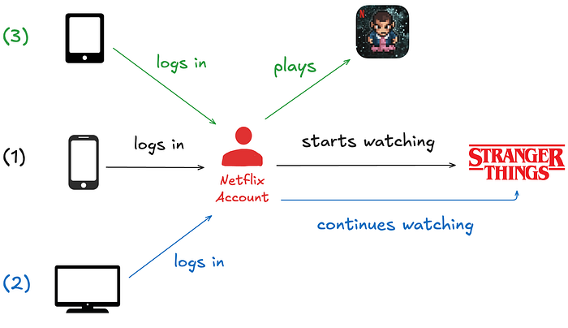
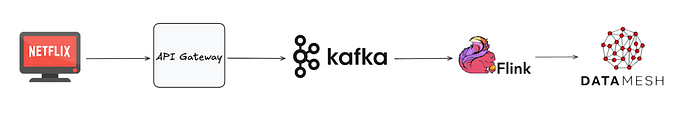
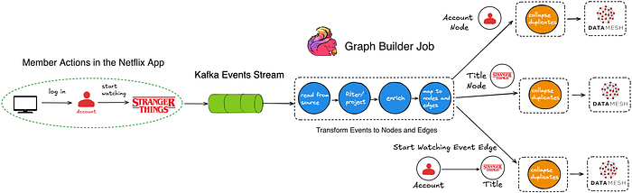

# How and Why Netflix Built a Real-Time Distributed Graph: Part 1 — Ingesting and Processing Data Streams at Internet Scale

Authors: [Adrian Taruc](https://www.linkedin.com/in/ataruc/) and [James Dalton](https://www.linkedin.com/in/jamesdalydalton/)

_This is the first entry of a multi-part blog series describing how we built a Real-Time Distributed Graph (RDG). In Part 1, we will discuss the motivation for creating the RDG and the architecture of the data processing pipeline that populates it._

## Introduction

The Netflix product experience historically consisted of a single core offering: streaming video on demand. Our members logged into the app, browsed, and watched titles such as Stranger Things, Squid Game, and Bridgerton. Although this is still the core of our product, our business has changed significantly over the last few years. For example, we introduced ad-supported plans, live programming events (e.g., [Jake Paul vs. Mike Tyson](https://www.netflix.com/tudum/articles/jake-paul-vs-mike-tyson-live-release-date-news) and [NFL Christmas Day Games](https://www.netflix.com/tudum/articles/nfl-games-on-netflix)), and [mobile games](https://about.netflix.com/en/news/let-the-games-begin-a-new-way-to-experience-entertainment-on-mobile) as part of a Netflix subscription. This evolution of our business has created a new class of problems where we have to analyze member interactions with the app across different business verticals. Let’s walk through a simple example scenario:

1. Imagine a Netflix member logging into the app on their smartphone and beginning to watch an episode of Stranger Things.
2. Eventually, they decide to watch on a bigger screen, so they log into the app on a smart TV in their home and continue watching the same episode.
3. Finally, after completing the episode, they log into the app on their tablet and play the game “Stranger Things: 1984”.

**We want to know that these three activities belong to the same member, despite occurring at different times and across various devices.** In a traditional data warehouse, these events would land in at least two different tables and may be processed at different cadences. But in a graph system, they become connected almost instantly. Ultimately, analyzing member interactions in the app across domains empowers Netflix to create more personalized and engaging experiences.

In the early days of our business expansion, discovering these relationships and contextual insights was extremely difficult. Netflix is famous for adopting a microservices architecture — hundreds of microservices developed and maintained by hundreds of individual teams. Some notable benefits of microservices are:

1. **Service Decomposition**: The overall platform is separated into smaller services, each responsible for a specific business capability. This modularity allows for independent service development, deployment, and scaling.
2. **Data Isolation**: Each service manages its own data, reducing interdependencies. This allows teams to choose the most suitable data schemas and storage technologies for their services.

**However, these benefits also led to drawbacks for our data science and engineering partners.** In practice, the separation of business concerns and service development ultimately resulted in a separation of data. Manually stitching data together from our data warehouse and siloed databases was an onerous task for our partners. Our data engineering team recognized we needed a solution to process and store our enormous swath of interconnected data while enabling fast querying to discover insights. **Although we could have structured the data in various ways**, we ultimately settled on a graph representation. We believe a graph offers key advantages, specifically:

- **Relationship-Centric Queries:** Graphs enable fast “hops” across multiple nodes and edges without expensive joins or manual denormalization that would be required in table-based data models.
- **Flexibility as Relationships Grow:** As new connections and entities emerge, graphs can quickly adapt without significant schema changes or re-architecture.
- **Pattern and Anomaly Detection:** Our stakeholders’ use cases often require identifying hidden relationships, cycles, or groupings in the data — capabilities much more naturally expressed and efficiently executed using graph traversals than siloed point lookups.

This is why we set out to build a Real-Time Distributed Graph, or “RDG” for short.

## Ingestion and Processing

Three main layers in the system power the RDG:

1. **Ingestion and Processing** — receive events from disparate upstream data sources and use them to generate graph nodes and edges.
2. **Storage** — write nodes and edges to persistent data stores.
3. **Serving** — expose ways for internal clients to query graph nodes and edges.

**The rest of this post will focus on the first layer, while subsequent posts in this blog series will cover the other layers.** The diagram below depicts a high-level overview of the ingestion and processing pipeline:

Building and updating the RDG in real-time requires continuously processing vast volumes of incoming data. Batch processing systems and traditional data warehouses cannot offer the low latency needed to maintain an up-to-date graph that supports real-time applications. We opted for a stream processing architecture, enabling us to update the graph’s data as events happen, thus minimizing delay and ensuring the system reflects the latest member actions with the Netflix app.

## Kafka as the Ingestion Backbone

Member actions in the Netflix app are published to our API Gateway, which then writes them as records to [Apache Kafka](https://kafka.apache.org/) topics. Kafka is the mechanism through which internal data applications can consume these events. It provides durable, replayable streams that downstream processors, such as [Apache Flink](https://flink.apache.org/) jobs, can consume in real-time.

Our team’s applications consume several different Kafka topics, each generating up to roughly **1 million messages per second**. Topic records are encoded in the [Apache Avro](https://avro.apache.org/) format, and Avro schemas are persisted in an internal centralized schema registry. In order to strike a balance between maintaining data availability and managing the financial expenses of storage infrastructure, we tailor retention policies for each topic according to its throughput and record size. We also persist topic records to [Apache Iceberg](https://iceberg.apache.org/) data warehouse tables, which allows us to backfill data in scenarios where older data is no longer available in the Kafka topics.

## Processing Data with Apache Flink

The event records in the Kafka streams are ingested by Flink jobs. We chose Flink because of its strong capabilities around near-real-time event processing. There is also robust internal platform support for Flink within Netflix, which allows jobs to integrate with Kafka and various storage backends seamlessly. At a high level, the anatomy of an RDG Flink job looks like this:

For the sake of simplicity, the diagram above depicts a basic flow in which a member logs into their Netflix account and begins watching an episode of Stranger Things. Reading the diagram from left to right:

- The actions of logging into the app and watching the Stranger Things episode are ultimately written as events to Kafka topics.
- The Flink job consumes event records from the upstream Kafka topics.
- Next, we have a series of Flink processor functions that:

1. Apply filtering and projections to remove noise based on the individual fields that are present — or in some cases, not present — in the events.
2. Enrich events with additional metadata, which are stored and accessed by the processor functions via side inputs.
3. Transform events into graph primitives — nodes representing entities (e.g., member accounts and show/movie titles), and edges representing relationships or interactions between them. In this example, the diagram only shows a few nodes and an edge to keep things simple. However, in reality, **we create and update up to a few dozen different nodes and edges,** depending on the member actions that occurred within the Netflix app.
4. Buffer, detect, and deduplicate overlapping updates that occur to the same nodes and edges within a small, configurable time window. This step reduces the data throughput we publish downstream. It is implemented using stateful process functions and timers.
5. Publish nodes and edges records to [Data Mesh](./data-mesh-a-data-movement-and-processing-platform-netflix-1288bcab2873.md), an abstraction layer that connects data applications and storage systems. We write a total (nodes + edges) of **more than 5 million records per second** to Data Mesh, which handles persisting the records to various data stores that other internal services can query.

## From One Job to Many: Scaling Flink the Hard Way

Initially, we tried having just one Flink job that consumed all the Kafka source topics. However, this quickly became a big operational headache since different topics can have different data volumes and throughputs at different times during the day. Consequently, tuning the monolithic Flink job became extremely difficult — we struggled to find CPU, memory, job parallelism, and checkpointing interval configurations that ensured job stability.

Instead, we pivoted to having a 1:1 mapping from the Kafka source topic to the consuming Flink job. Although this led to additional operational overhead due to more jobs to develop and deploy, each job has been much simpler to maintain, analyze, and tune.

Similarly, each node and edge type is written to a separate Kafka topic. This means we have significantly more Kafka topics to manage. However, we decided the tradeoff of having bespoke tuning and scaling per topic was worth it. We also designed the graph data model to be as generic and flexible as possible, so adding new types of nodes and edges would be an infrequent operation.

## Acknowledgements

We would be remiss if we didn’t give a special shout-out to our stunning colleagues who work on the internal Netflix data platform. Building the RDG was a multi-year effort that required us to design novel solutions, and the investments and foundations from our platform teams were critical to its successful creation. You make the lives of Netflix data engineers much easier, and the RDG would not exist without your diligent collaboration!

—

Thanks for reading the first season of the RDG blog series. Check out [Part 2](https://netflixtechblog.medium.com/how-and-why-netflix-built-a-real-time-distributed-graph-part-2-building-a-scalable-storage-layer-ff4a8dbd3d1f), where we go over the storage layer containing the graph’s various nodes and edges.

---
**Tags:** Data Engineering · Software Architecture · Big Data
