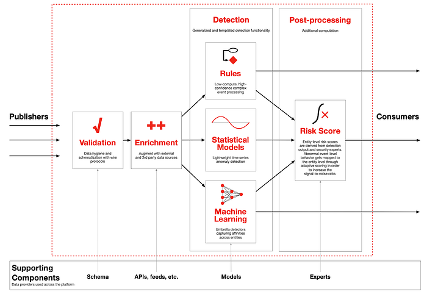

# How Data Inspires Building a Scalable, Resilient and Secure Cloud Infrastructure At Netflix

**By: **[**Jitender Aswani**](https://www.linkedin.com/in/jitenderaswani/)** (Data Engineering and Infrastructure), **[**Sebastien de Larquier**](https://www.linkedin.com/in/sebastiendelarquier/)** (Science & Analytics)**

Netflix’s [engineering culture](https://jobs.netflix.com/culture) is **predicated** on Freedom & Responsibility, the idea that everyone (and every team) at Netflix is entrusted with a core responsibility and they are free to operate with freedom to satisfy their mission. This freedom allows teams and individuals to move fast to deliver on innovation and feel responsible for quality and robustness of their delivery. Central engineering teams enable this operational model by reducing the cognitive burden on innovation teams through solutions related to securing, scaling and strengthening (resilience) the infrastructure.

A majority of the Netflix product features are either partially or completely dependent on one of our many [micro-services](https://en.wikipedia.org/wiki/Microservices) (e.g., [the order of the rows](https://medium.com/netflix-techblog/learning-a-personalized-homepage-aa8ec670359a) on your Netflix home page, issuing content licenses when you click play, finding the [Open Connect](https://openconnect.netflix.com/en/) cache closest to you with the content you requested, and many more). All these micro-services are currently operated in AWS cloud infrastructure.

As a micro-service owner, a Netflix engineer is responsible for its innovation as well as its operation, which includes making sure the service is reliable, secure, efficient and performant. This operational component places some cognitive load on our engineers, requiring them to develop deep understanding of telemetry and alerting systems, capacity provisioning process, security and reliability best practices, and a vast amount of informal knowledge about the cloud infrastructure.

While our engineering teams have and continue to build solutions to lighten this cognitive load (better guardrails, improved tooling, …), data and its derived products are critical elements to understanding, optimizing and abstracting our infrastructure. This is where our data (engineering and science) teams come in: we leverage vast amounts of data produced by our platforms and micro-services to inform and automate decisions related to operating the many components of our cloud infrastructure reliably, securely and efficiently.

In the next section, we will highlight some high level areas of focus in each dimension of our infrastructure. In the last section, we will attempt to feed your curiosity by presenting a set of opportunities that will drive our next wave of impact for Netflix.

In the **Security **space, our data teams focus almost all our efforts on detecting suspicious or malicious activity using a collection of machine learning and statistical models. Historically, this has been focussed on potentially compromised employee accounts, but efforts are in place to build a more agnostic detection framework that would consider any agent (human or machine). Our data teams also invest in building more transparency around our security and privacy to support progress in reducing threats and hazards faced by our micro-services or internal stakeholders.

In the** Reliability **space, our data teams focus on two main approaches. The first is on prevention: data teams help with making changes to our environment and its many tenants as safe as possible through contained experiments (e.g., [Canaries](https://medium.com/netflix-techblog/automated-canary-analysis-at-netflix-with-kayenta-3260bc7acc69)), detection and improved KPIs. The second approach is on the diagnosis side: data teams measure the impact of outages and expose patterns across their occurrence, as well as provide a connected view of micro-service-level availability.

In the **Efficiency** space, our data teams focus on transparency and optimization. In Netflix’s Freedom and Responsibility culture, we believe the best approach to efficiency is to give every micro-service owner the right information to help them improve or maintain their own efficiency. Additionally, because our infrastructure is a complex multi-tenant environment, there are also many data-driven efficiency opportunities at the platform level. Finally, provisioning our infrastructure itself is also becoming an increasingly complex task, so our data teams contribute to tools for diagnosis and automation of our cloud capacity management.

In the **Performance** space, our data teams currently focus on the quality of experience on Netflix-enabled devices. The main motivation is that while the devices themselves have a significant role in overall performance, our network and cloud infrastructure has a non-negligible impact on the responsiveness of devices. There is a continuous push to build improved telemetry and tools to understand and minimize the impact of our infrastructure in the overall performance of Netflix application across a wide range of devices.

In the **People** space, our data teams contribute to consolidated systems of record on employees, contractors, partners and talent data to help central teams manage headcount planning, reduce acquisition cost, improve hiring practices, and other people analytics related use-cases.

## Challenges & Opportunities in the Infra Data Space

### Security Events Platform for Anomaly Detection

- How can we develop a complex event processing system to ingest semi-structured data predicated on schema contracts from hundreds of sources and transform it into event streams of structured data for downstream analysis?
- How can we develop** **templated detection modules (rules- and ML-based) and data streams to increases speed of development?

*Security Events Platform*

See open source project such as[ StreamAlert](https://streamalert.io/en/stable/) and[ Siddhi](https://github.com/wso2/siddhi) to get some general ideas.

### Asset Inventory

- How can we develop a dimensional data model representing relationships between apps, clusters, regions and other metadata including AMI / software stack to help with availability, resiliency and fleet management?
- Can we develop learning models to enrich metadata with application vulnerabilities and risk scores?

### Reliability

- How can we guarantee that a code change will be safe when rolled out to our production environment?
- Can we adjust our auto-scaling policies to be more efficiency without risking our availability during traffic spikes?

### Capacity and Efficiency

- Which resources (clusters, tables, …) are unused or under-utilized and why?
- What will be the cost of rolling out the winning cell of an AB test to all users?

### People Analytics

- Can we support AB experiments related to recruiting and help improve candidate experience as well as attract solid talent?
- Can we measure the impact of Inclusion and Diversity initiatives?

### People & Security

- How can we build a secure and restricted People Data Vault o provide a consolidated system of reference and allow apps to add additional metadata?
- How can we automatically provision or de-provision access privileges?

### Data Lineage

- Can we develop a generalized lineage system to develop relationships among various data artifacts stored across Netflix data landscape?
- Can we leverage this lineage solution to help forecast SLA misses and address Data Lifecycle Management questions (job cost, table cost, and retention)?

This was just a tiny glimpse into our fantastic world of Infrastructure Data Engineering, Science & Analytics. We are on a mission to help scale a world-class data-informed infrastructure and we are just getting started. Give us a holler if you are interested in a thought exchange.

**Contributors: **[**Sui Huang**](https://www.linkedin.com/in/sui-huang-86b97a2b/)** (S&A) is partnering on reimagining People initiatives.**

## Other Relevant Readings

- [More infrastructure-related post from the Netflix Tech Blog](https://medium.com/netflix-techblog/tagged/microservices)
- [How Netflix Works?](https://medium.com/refraction-tech-everything/how-netflix-works-the-hugely-simplified-complex-stuff-that-happens-every-time-you-hit-play-3a40c9be254b)
- [Ten years on: How Netflix completed a historic cloud migration with AWS](https://www.computerworlduk.com/cloud-computing/how-netflix-moved-cloud-become-global-internet-tv-network-3683479/)
- [Amazon Fleet Management: Meet the Man Who Keeps Amazon Servers Running, No Matter What | Amazon Web Services](https://aws.amazon.com/blogs/startups/amazon-fleet-management-meet-the-man-who-keeps-amazon-servers-running-no-matter-what/)
- [ADS Framework at Palantir](https://medium.com/palantir/alerting-and-detection-strategy-framework-52dc33722df2)
- [Building a SOCless detection team](https://www.linkedin.com/pulse/socless-detection-team-netflix-alex-maestretti/)
- [Lessons Learned in Detection Engineering](https://medium.com/starting-up-security/lessons-learned-in-detection-engineering-304aec709856)
- [Engineering Trade-Offs and The Netflix API Re-Architecture](https://medium.com/netflix-techblog/engineering-trade-offs-and-the-netflix-api-re-architecture-64f122b277dd)
- [Evolving the Netflix Data Platform with Genie 3](https://medium.com/netflix-techblog/evolving-the-netflix-data-platform-with-genie-3-598021604dda)
- [Making No-distributed Database Distributed — Dynomite](https://medium.com/netflix-techblog/introducing-dynomite-making-non-distributed-databases-distributed-c7bce3d89404)
- [Detecting Credential Compromises in AWS](https://youtu.be/pagHGaercLs)
- [Dredge Analysis](https://www.slideshare.net/AmazonWebServices/how-netflix-uses-amazon-kinesis-streams-to-monitor-and-optimize-largescale-networks-in-realtime)
- [Dredge Case Study](https://aws.amazon.com/solutions/case-studies/netflix-kinesis-streams/)
- [Scaling Data Lineage at Netflix to Improve Data Infrastructure Reliability & Efficiency](https://conferences.oreilly.com/strata/strata-ca/public/schedule/detail/73025)

---
**Tags:** Cloud Computing · Data · Reliability Engineering · Security
