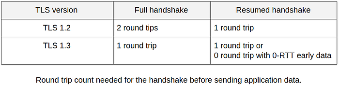
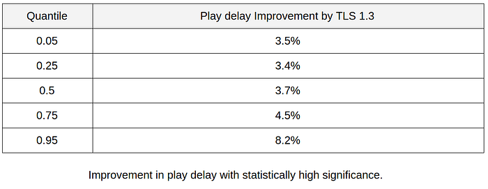
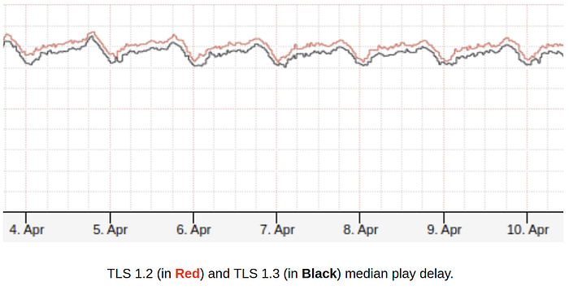
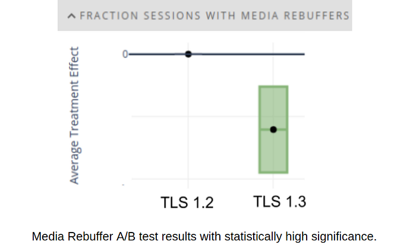

# How Netflix brings safer and faster streaming experiences to the living room on crowded networks using TLS 1.3

By [Sekwon Choi](https://www.linkedin.com/in/sekwonchoi/)

At Netflix, we are obsessed with the best streaming experiences. We want playback to start instantly and to never stop unexpectedly in any network environment. We are also committed to protecting users’ privacy and service security without sacrificing any part of the playback experience.

To achieve that, we are efficiently using ABR (adaptive bitrate streaming) for a better playback experience, DRM (Digital Right Management) to protect our service and TLS (Transport Layer Security) to protect customer privacy and to create a safer streaming experience.

Netflix on consumer electronics devices such as TVs, set-top boxes and streaming sticks was until recently using TLS 1.2 for streaming traffic. Now we support TLS 1.3 for safer and faster experiences.

## What is TLS?

For two parties to communicate securely, a secure channel is necessary. This needs to have the following three properties.

- Authentication: Identity of the communicating party is verified.
- Confidentiality: Data sent over the channel is only visible to the endpoints.
- Integrity: Data sent over the channel cannot be modified by attackers without detection.

The TLS protocol is designed to provide a secure channel between two peers by providing tools and methods to achieve the above properties.

## TLS 1.3

TLS 1.3 is the latest version of the Transport Layer Security protocol. It is simpler, more secure and more efficient than its predecessor.

### Perfect Forward Secrecy

One thing we believe is very important at Netflix is providing PFS (Perfect Forward Secrecy).

**PFS is a feature of the key exchange algorithm that assures that session keys will not be compromised, even if the server’s private key is compromised.** By generating new keys for each session, PFS protects past sessions against the future compromise of secret keys.

TLS 1.2 supports key exchange algorithms with PFS, but it also allows key exchange algorithms that do not support PFS. Even with the previous version of TLS 1.2, Netflix has always selected a key exchange algorithm that provides PFS such as ECDHE (Elliptic Curve Diffie Hellman Ephemeral). TLS 1.3, however, enforces this concept even more by removing all the key exchange algorithms that do not provide PFS, such as static RSA.

### Authenticated Encryption

For encryption, TLS 1.3 removes all weak ciphers and uses only Authenticated Encryption with Associated Data (AEAD). This assures the confidentiality, integrity, and authenticity of the data. We use AES Galois/Counter Mode, as it also provides good performance and high throughput.

### Secure Handshake

While the above changes are important, the most important change in TLS 1.3 is perhaps its redesign of the handshake protocol.

The TLS 1.2 handshake was not designed to protect the integrity of the entire handshake. It protected only the part of the handshake after the cipher suite negotiation and this opened up the possibility of downgrade attacks which may allow the attackers to force the use of insecure cipher suites.

With TLS 1.3, the server signs the entire handshake including the cipher suite negotiation and thus prevents the attacker from downgrading the cipher suite.

Also in TLS 1.2, extensions were sent in the clear in the ServerHello. Now with TLS 1.3, even extensions are encrypted and all handshake messages after ServerHello are now encrypted.

### Reduced Handshake

TLS 1.2 supports numerous key exchange algorithms, cipher suites and digital signatures, including weak and vulnerable ones. Therefore, it requires more messages to perform a handshake and two network round trips.

In contrast, the handshake in TLS 1.3 now requires only one round trip, with a simplified design and with all weak and vulnerable algorithms removed.

In addition, it has a new feature called 0-RTT, or TLS early data, for the resumed handshake. This allows an application to include application data with its initial handshake message, instead of having to wait until the handshake completes.

At Netflix, by the efficient resumption of the TLS session and careful use of 0-RTT for the streaming data, we can reduce the play delay.

## A/B Testing Result

We were pretty confident that TLS 1.3 would bring us better security from the analysis of its protocol composition, but we did not know how it would perform in the context of streaming.

Since TLS 1.3’s performance-related feature is the 0-RTT mode with the resumed handshake, our hypothesis is that TLS 1.3 would reduce play delay, as we are no longer required to wait for the handshake to finish and we can instead issue the HTTP request for media data and receive the HTTP response for media data earlier.

To see the actual performance of TLS 1.3 in the field, we performed an experiment with

- User accounts: half-million user accounts per cell.
- Device type: mid-performance device with Quad ARM core @ 1.7GHz.
- Control cell: TLS 1.2
- Treatment cell: TLS 1.3

### Play Delay

Play Delay is defined by how long it takes for playback to start. Below are the results of the play delay measured in the experiment. The results imply that on slower or congested networks, which can be represented by the quantiles of at least 0.75, TLS 1.3 achieves the largest gains, with improvements across all network conditions.

Below is the time series median play delay graph for this mid-performance device in the field. It also shows that playback starts earlier with TLS 1.3.

### Media Rebuffer

At Netflix, we define a media rebuffer as a non-network originated rebuffer. It typically occurs when media data is not processed quickly enough by the device due to the high load on the CPU. Comparing the control cell with TLS 1.2, the experiment cell with TLS 1.3 showed about a 7.4% improvement in media rebuffers. This result implies that using TLS 1.3 with 0-RTT is more efficient and can reduce the CPU load.

## Conclusion

From the security analysis, we are confident that TLS 1.3 improves communication security over TLS 1.2. From the field test, we are confident that TLS 1.3 provides us a better streaming experience.

At the time of writing this article, the Internet is experiencing higher than usual traffic and congestion. We believe saving even small amounts of data and round trips can be meaningful and even better if it also provides a more secure and efficient streaming experience.

Therefore, we have started deploying TLS 1.3 on newer consumer electronics devices and we are expecting even more devices to be deployed with TLS 1.3 capability in the near future.

---
**Tags:** Streaming · Tls · Security · Playback · Netflix
