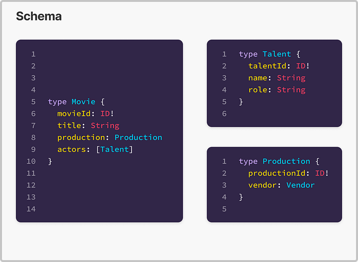
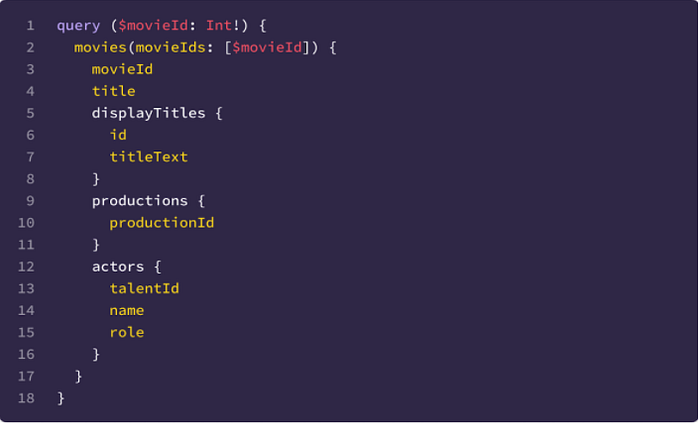
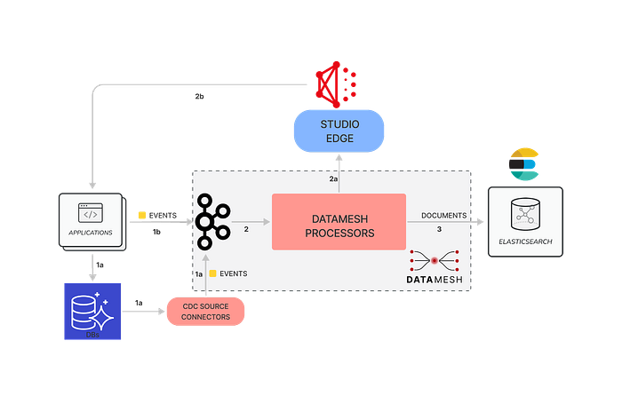
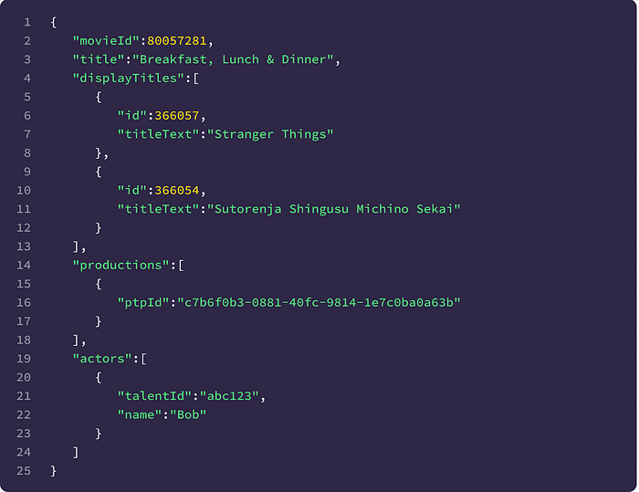
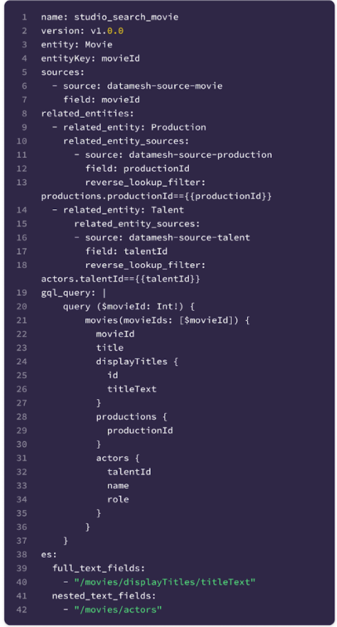

# How Netflix Content Engineering makes a federated graph searchable

By [Alex Hutter](https://www.linkedin.com/in/ahutter/), [Falguni Jhaveri](https://www.linkedin.com/in/falgunijhaveri/) and [Senthil Sayeebaba](https://www.linkedin.com/in/senthilsayeebaba/)

Over the past few years [Content Engineering](./netflix-studio-engineering-overview-ed60afcfa0ce.md) at Netflix has been transitioning many of its services to use a federated GraphQL platform. GraphQL federation enables domain teams to independently build and operate their own [Domain Graph Services](./open-sourcing-the-netflix-domain-graph-service-framework-graphql-for-spring-boot-92b9dcecda18.md) (DGS) and, at the same time, connect their domain with other domains in a unified GraphQL schema exposed by a [federated gateway](./how-netflix-scales-its-api-with-graphql-federation-part-1-ae3557c187e2.md).

As an example, let’s examine three core entities of the graph, each owned by separate engineering teams:

1. **Movie**: At Netflix, we make titles (shows, films, shorts etc.). For simplicity, let’s assume each title is a **Movie** object.
2. **Production**: Each Movie is associated with a Studio Production. A **Production** object tracks everything needed to make a **Movie** including shooting location, vendors, and more.
3. **Talent**: the people working on a **Movie** are the **Talent**, including actors, directors, and so on.

*Sample GraphQL Schema*

Once entities like the above are available in the graph, it’s very common for folks to want to query for a particular entity based on attributes of related entities, e.g. give me all movies that are currently in photography with Ryan Reynolds as an actor.

In a federated graph architecture, how can we answer such a query given that each entity is served by its own service? The **Movie** service would need to provide an endpoint that accepts a query and filters that may **_apply to data the service does not own,_** and use those to identify the appropriate Movie entities to return.

In fact, **_every entity owning service could be required to do this work_.**

This common problem of making a federated graph searchable led to the creation of **Studio Search**.

The Studio Search platform was designed to take a portion of the federated graph, a subgraph rooted at an entity of interest, and make it searchable. The entities of the subgraph can be queried with text input, filtered, ranked, and faceted. In the next section, we’ll discuss how we made this possible.

## Introducing Studio Search

When hearing that we want to enable teams to search **_something_**_,_ your mind likely goes to building an index of some kind. Ours did too! So we need to build an index of a portion of the federated graph.

How do our users tell us which portion and, even more critically, given that the portion of the graph of interest will almost definitely span data exposed by many services, how do we keep the index current with all these various services?

We chose **Elasticsearch** as the underlying technology for our index and determined that there were three main pieces of information required to build out an indexing pipeline:

- **A definition of their subgraph of interest rooted at the entity they primarily will be searching for**
- Events to notify the platform of changes to entities in the subgraph
- Index specific configuration such as whether a field should be used for full text queries or whether a sub-document is nested

In short, our solution was to build an index for the subgraphs of interest. This index needs to be kept up-to-date with the data exposed by the various services in the federated graph in near-real time.

GraphQL gives us a straightforward way to define the subgraph — a single templated GraphQL query that pulls all of the data the user is interested in using in their searches.

Here’s an example GraphQL query template. It’s pulling data for Movies and their related Productions and Talent.

*Sample GraphQL query*

To keep the index up to date, events are used to trigger a reindexing operation for individual entities when they change. ****_Change Data Capture_****** (CDC) events are the preferred events for triggering these operations — most teams produce them using Netflix’s ****[CDC connectors](./dblog-a-generic-change-data-capture-framework-69351fb9099b.md)**** — however, ******_application events_****** are also supported when necessary.**

All data to be indexed is being fetched from the federated graph so all that is needed in the events is an entity id; the id can be substituted into the GraphQL query template to fetch the entity and any related data.

Using the type information present in the GraphQL query template and the user specified index configuration we were able to create an index template with a set of custom Elasticsearch text analyzers that generalized well across domains.

Given these inputs, a [Data Mesh](./data-movement-in-netflix-studio-via-data-mesh-3fddcceb1059.md) pipeline can be created that consists of the user provided CDC event source, a processor to enrich those events using the user provided GraphQL query and a sink to Elasticsearch.

## Architecture

Putting this all together, below you can see a simplified view of the architecture.

*Studio Search Indexing Architecture*

1. Studio applications produce events to schematized **Kafka** streams within Data Mesh.

a. By transacting with a database which is monitored by a CDC connector that creates events, or

b. By directly creating events using a Data Mesh client.

2. The schematized events are consumed by Data Mesh processors implemented in the **Apache_ _Flink** framework. Some entities have multiple events for their changes so we leverage union processors to combine data from multiple Kafka streams.

a. A GraphQL processor executes the user provided GraphQL query to fetch documents from the federated gateway.

b. The federated gateway, in turn, fetches data from the Studio applications.

3. The documents fetched from the federated gateway are put onto another schematized Kafka topic before being processed by an **Elasticsearch** sink in Data Mesh that indexes them into Elasticsearch index configured with an indexing template created specifically for the fields and types present in the document.

## Reverse lookups

You may have noticed something missing in the above explanation. If the index is being populated based on **Movie** id events, how does it stay up to date when a **Production** or **Talent** changes? Our solution to this is a reverse lookup — when a change to a related entity is made, we need to look up all of the primary entities that could be affected and trigger events for those. We do this by consulting the index itself and querying for all primary entities related to the entity that has changed.

For instance if our index has a document that looks like this:

*Sample Elasticsearch document*

And the pipeline observes a change to the **Production** with ptpId “abc”, we can query the index for all documents with production.ptpId == “abc” and extract the movieId. Then, we can pass that movieId down into the rest of the indexing pipeline.

## Scaling the Solution

The solution we came up with worked quite well. Teams were easily able to share the requirements for their subgraph’s index via a GraphQL query template and could use existing tooling to generate the events to enable the index to be kept up to date in near real-time. Reusing the index itself to power reverse lookups enabled us to keep all the logic for handling related entities contained within our systems and shield our users from that complexity. In fact it worked so well that we became inundated with requests to integrate with Studio Search — it began to power a significant portion of the user experience for many applications within Content Engineering.

Early on, we did integrations by hand but as adoption of Studio Search took off this did not scale. We needed to build tools to help us **_automate_** as much of the **_provisioning_** of the pipelines as possible. In order to get there we identified four main problems we needed to solve:

- How to collect all the required configuration for the pipeline from users.
- Data Mesh streams are schematized with Avro. In the previous architecture diagram, in **3)** there is a stream carrying the results of the GraphQL query to the Elasticsearch sink. The response from GraphQL can contain 10s of fields, often nested. Writing an Avro schema for such a document is time consuming and error prone to do by hand. We needed to make this step much easier.
- Similarly the generation of the Elasticsearch template was time consuming and error prone. We needed to determine how to generate one based on the users’ configuration.
- Finally, creating Data Mesh pipelines manually was time consuming and error prone as well due to the volume of configuration required.

## Configuration

For collecting the indexing pipeline configuration from users we defined a single configuration file that enabled users to provide a high level description of their pipeline that we can use to programmatically create the indexing pipeline in Data Mesh. By using this high-level description we were able to greatly simplify the pipeline creation process for users by filling in common yet required configuration for the Data Mesh pipeline.

*Sample .yaml configuration*

## Avro schema & Elasticsearch index template generation

The approach for both schema and index template generation was very similar. Essentially it required taking the user provided GraphQL query template and generating JSON from it. This was done using [graphql-java](https://www.graphql-java.com/). The steps required are enumerated below:

- Introspect the federated graph’s schema and use the response to build a GraphQLSchema object
- Parse and validate the user provided GraphQL query template against the schema
- Visit the nodes of the query using utilities provided by graphql-java and collect the results into a JSON object — this generated object is the schema/template

## Deployment

The previous steps centralized all the configuration in a single file and provided tools to generate additional configuration for the pipeline’s dependencies. Now all that was required was an entry point for users to provide their configuration file for orchestrating the provisioning of the indexing pipeline. Given our user base was other engineers we decided to provide a command line interface (CLI) written in Python. Using Python we were able to get the first version of the CLI to our users quickly. Netflix provides tooling that makes the CLI auto-update which makes the CLI easy to iterate on. The CLI performs the following tasks:

- Validates the provided configuration file
- Calls a service to generate the Avro schema & Elasticsearch index template
- Assembles the logical plan for the Data Mesh pipeline and creates it using Data Mesh APIs

A CLI is just a step towards a better self-service deployment process. We’re currently exploring options for treating these indices and their pipelines as **_declarative infrastructure _**_managed_ within the application that consumes them.

## Current Challenges

Using the federated graph to provide the documents for indexing simplifies much of the indexing process but it also creates its own set of challenges. If the challenges below sound exciting to you, come [join us](https://jobs.netflix.com/)!

## Backfill

Bootstrapping a new index for the addition or removal of attributes or refreshing an established index both add considerable additional and spiky load to the federated gateway and the component DGSes. Depending on the cardinality of the index and the complexity of its query we may need to coordinate with service owners and/or run backfills off peak. We continue to manage tradeoffs between reindexing speed and load.

## Reverse Lookups

Reverse lookups, while convenient, are not particularly user friendly. They introduce a circular dependency in the pipeline — you can’t create the indexing pipeline without reverse lookups and reverse lookups need the index to function — which we’ve mitigated although it still creates some confusion. They also require the definer of the index to have detailed knowledge of the eventing for related entities they want to include and that may cover many different domains depending on the index — we have one index covering eight domains.

## Index consistency

As an index becomes more complex it is likely to depend on more DGSes and the likelihood of errors increases when fetching the required documents from the federated graph. These errors can lead to documents in the index being **_out of date_** or even **_missing_** altogether. The owner of the index is often required to follow up with other domain teams regarding errors in related entities and be in the unenviable position of not being able to do much to resolve the issues independently. When the errors are resolved, the process of replaying the failed events is manual and there can be a lag when the service is again successfully returning data but the index does not match it.

## Stay Tuned

In this post, we described how our indexing infrastructure moves data for any given subgraph of the Netflix Content federated graph to Elasticsearch and keeps that data in sync with the source of truth. In an upcoming post, we’ll describe how this data can be queried without actually needing to know anything about Elasticsearch.

## Credits

Thanks to [Anoop Panicker](https://www.linkedin.com/in/anoop-panicker/), [Bo Lei](https://www.linkedin.com/in/bolei1007/), [Charles Zhao](https://www.linkedin.com/in/czhao/), [Chris Dhanaraj](https://www.linkedin.com/in/chrisdhanaraj/), [Hemamalini Kannan](https://www.linkedin.com/in/hemamalinikannan/),[ Jim Isaacs](https://www.linkedin.com/in/jimpisaacs/), [Johnny Chang](https://www.linkedin.com/in/johnnycc321/), [Kasturi Chatterjee](https://www.linkedin.com/in/kasturi-chatterjee-a900715/), [Kishore Banala](https://www.linkedin.com/in/kishore-banala/), [Kevin Zhu](https://www.linkedin.com/in/kevinzhu/), [Tom Lee](https://www.linkedin.com/in/thomaslee4/), [Tongliang Liu](https://www.linkedin.com/in/tonylxc/), [Utkarsh Shrivastava](https://www.linkedin.com/in/utkarshshrivastava/), [Vince Bello](https://www.linkedin.com/in/vincentbello/), [Vinod Viswanathan](https://www.linkedin.com/in/vinodvish/), [Yucheng Zeng](https://www.linkedin.com/in/yuchengzeng/)

---
**Tags:** Search · GraphQL · Data Mesh · Indexing · Elasticsearch
