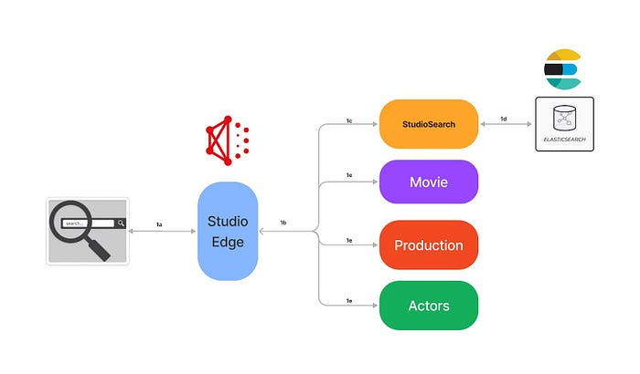
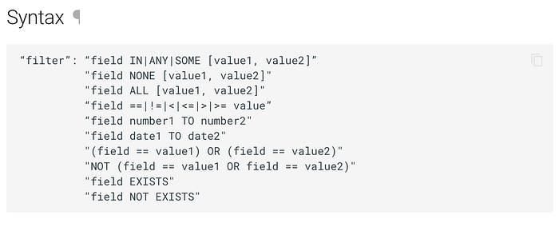
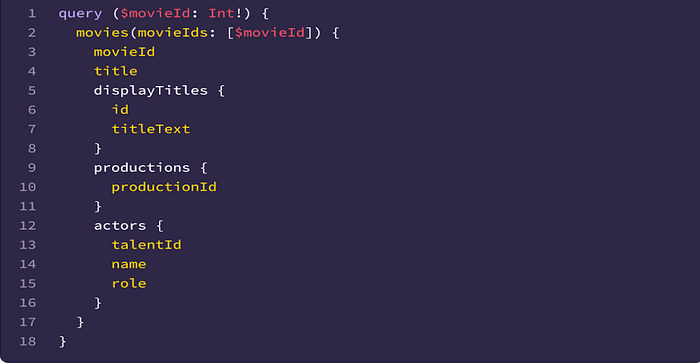
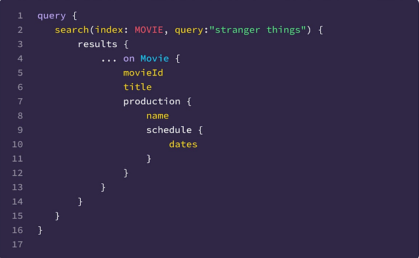
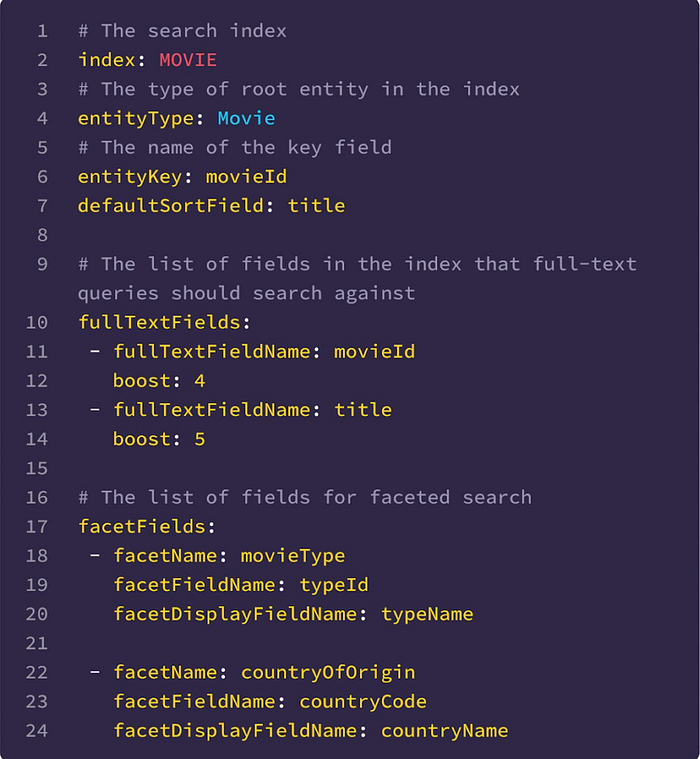
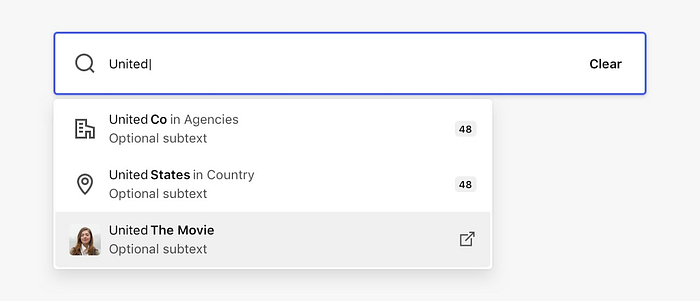
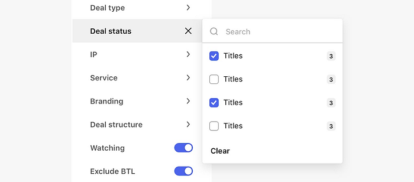

# How Netflix Content Engineering makes a federated graph searchable (Part 2)

By [Alex Hutter](https://www.linkedin.com/in/ahutter/), [Falguni Jhaveri](https://www.linkedin.com/in/falgunijhaveri/), and [Senthil Sayeebaba](https://www.linkedin.com/in/senthilsayeebaba/)

In a [previous post](./how-netflix-content-engineering-makes-a-federated-graph-searchable-5c0c1c7d7eaf.md), we described the indexing architecture of Studio Search and how we scaled the architecture by building a config-driven self-service platform that allowed teams in Content Engineering to spin up search indices easily.

This post will discuss how Studio Search supports querying the data available in these indices.

*Data consumption from Studio Search DGS*

## Introduction

When we say Content Engineering teams are interested in searching against the federated graph, the use-case is mainly focused on known-item search (_a user has an item or items in mind they are trying to view or navigate to but need to use an external information system to locate them_) and data retrieval (_typically the data is structured and there is no ambiguity as to whether a particular record matches the given search criteria except in the case of textual fields where there is limited ambiguity_) within a vertical search experience (f_ocus on enabling search for a specific sub-graph within the big federated graph_)

## Query Language

Given the above scope of the search (_vertical search experience with a focus on known-item search and data retrieval_), one of the first things we had to design was a language that users can use to easily express their search criteria. With a goal of abstracting users away from the complexity of interacting with [Elasticsearch](https://www.elastic.co/elasticsearch/) directly, we landed on a custom Studio Search DSL reminiscent of SQL.

The DSL supports specifying the search criteria as comparison expressions or inclusion/exclusion filters. The filter expressions can be combined together through logical operators (_AND, OR, NOT_) and grouped together through parentheses.

*Sample Syntax*

For example, to find all comedies from France or Spain, the query would be:

_(genre == ‘comedy’) AND (country ANY [‘FR’, ‘SP’])_

We used [ANTLR](https://www.antlr.org/) to build the grammar for the Query DSL. From the grammar, ANTLR generates a parser that can walk the parse tree. By extending the ANTLR generated parse tree visitor, we were able to implement an Elasticsearch Query Builder component with the logic to generate the Elasticsearch query corresponding to the custom search query.

If you are familiar with Elasticsearch, then you might be familiar with how complicated it can be to build up the correct Elasticsearch query for complex queries, especially if the index includes [nested ](https://www.elastic.co/guide/en/elasticsearch/reference/8.1/nested.html)JSON documents which add an additional layer of complexity with respect to building [nested queries](https://www.elastic.co/guide/en/elasticsearch/reference/current/query-dsl-nested-query.html) (Incorrectly constructed nested queries can lead to Elasticsearch quietly returning wrong results). By exposing just a generic query language to the users and isolating the complexity to just our Elasticsearch Query Builder, we have been able to empower users to write search queries without requiring familiarity with Elasticsearch. This also leaves the possibility of swapping Elasticsearch with a different search engine in the future.

One other challenge for the users when writing the search queries is to understand the fields that are available in the index and the associated types. Since we index the data as-is from the federated graph, the indexing query itself acts as self-documentation. For example, given the indexing query -

*Sample GraphQL query*

To find movies based on the actors’ roles, the query filter is simply

_`actors.role == ‘actor’`_

## Text Search

While the search DSL provides a powerful way to help narrow the scope of the search queries, users can also find documents in the index through free form text — either with just the input text or in combination with a filter expression in the search DSL. Behind the scenes during the indexing process, we have configured the Elasticsearch index with the appropriate analyzers to ensure that the most relevant matches for the input text are returned in the results.

## Hydration through Federation

Given the wide adoption of the [federated gateway](./how-netflix-scales-its-api-with-graphql-federation-part-1-ae3557c187e2.md) within Content Engineering, we decided to implement the Studio Search service as a DGS ([Domain Graph Service](./open-sourcing-the-netflix-domain-graph-service-framework-graphql-for-spring-boot-92b9dcecda18.md)) that integrated with the federated gateway. The search APIs (besides search, we have other APIs to support faceted search, typeahead suggestions, etc) are exposed as GraphQL queries within the federated graph.

This integration with the federation gateway allows the search DGS to just return the matching entity keys from the search index instead of the whole matching document(s). Through the power of federation, users are then able to hydrate the search results with any data available in the federated graph. This allows the search indices to be lean by indexing only the fields necessary for the search experience and at the same time provides complete flexibility for the users to fetch any data available in the federated graph instead of being restricted to just the data available in the search index.

Example

*Sample Search query*

In the above example, users are able to fetch the production schedule as part of the search results even though the search index doesn’t hold that data.

## Authorization

With the API to query the data in the search indices in place, the next thing we needed to tackle was figuring out how to secure access to the data in the indices. With several of the indices including sensitive data, and the source teams already having restrictive access policies in place to secure the data they own, the search indices which hosted a secondary copy of the source data needed to be secured as well.

We chose to apply “late binding” (or “query time”) security — on every incoming search query, we make an API call to the centralized access policy server with context including the identity of the caller making the request and the search index they are trying to access. The policy server evaluates the access policies defined by the source teams and returns a set of constraints. Ex. The caller has access to Movies where the type is ‘licensed’ (The caller does not have access to Netflix-produced content, but just the licensed content). The constraints are then translated to a set of filter expressions in the search query DSL format (Ex. _movie.type == ‘licensed’_) and combined with the user-specified search filter with a logical _AND_ operator to form a new search query that then gets executed against the index.

By adding on the access constraints as additional filters before executing the query, we ensure that the user gets back only the data they have access to from the underlying search index. This also allows source teams to evolve their access policies independently knowing that the correct constraints will be applied at query time.

## Customizing Search

With the decision to build Studio Search as a GraphQL service using the[ DGS framework](https://netflix.github.io/dgs/) and relying on federation for hydrating results, onboarding new search indices required updating various portions of the GraphQL schema (the enum of available indices, the union of all federated result types, etc.) manually and registering the updated schema with the federated gateway schema registry before the new index was available for querying through the GraphQL API.

Additionally, there are additional configurations that users can provide while onboarding a new index to customize the search behavior for their applications — including scripts to tune the relevance scoring algorithm, configuring fields for faceted search, and configuration to control the behavior of typeahead suggestions, etc. These configurations were initially stored in our source control repository which meant any changes to the configuration of any index required a deployment for the changes to take effect.

Recently, we automated this process as well by moving all the configurations to a persistence store and leveraging the power of [dynamic schemas](https://netflix.github.io/dgs/advanced/dynamic-schemas/) in the DGS framework. Users can now use an API to create/update search index configuration and we are able to validate the provided configuration, generate the updated DGS schema dynamically and register the updated schema with the federated gateway schema registry immediately. All configuration changes are reflected immediately in subsequent search queries.

Example configuration:

*Sample Search configuration*

## UI Components

While the primary goal of Studio Search was to build an easy-to-use self-service platform to enable searching against the federated graph, another important goal was to help the Content Engineering teams deliver a visually consistent search experience to the users of their tools and workflows. To that end, we partnered with our UI/UX teams to build a robust set of opinionated presentational components. Studio Search’s offering of drop-in UI components based on our [Hawkins design system](./hawkins-diving-into-the-reasoning-behind-our-design-system-964a7357547.md) for typeahead suggestion, faceted search, and extensive filtering ensure visual and behavioral consistency across the suite of applications within Content Engineering. Below are a couple of examples.

Typeahead Search Component

Faceted Search Component

## What’s Next?

As a config-driven, self-serve platform, Studio Search has already been able to empower Content Engineering teams to quickly enable the functionality to search against the Content federated graph within their suite of applications. But, we are not quite done yet! There are several upcoming features that are in various stages of development including

- Leveraging the [percolate query](https://www.elastic.co/guide/en/elasticsearch/reference/current/query-dsl-percolate-query.html) functionality in Elasticsearch to support a notifications feature (users save their search criteria and are notified when documents are updated in the index that matches their search criteria)
- Add support for [metrics aggregation](https://www.elastic.co/guide/en/elasticsearch/reference/current/search-aggregations-metrics.html) in our APIs
- Leverage the [managed delivery](https://spinnaker.io/docs/guides/user/managed-delivery/) functionality in [Spinnaker](https://spinnaker.io/) to move to a declarative model for onboarding the search indices
- And, plenty more

If this sounds interesting to you, connect with us on LinkedIn.

## Credits

Thanks to [Anoop Panicker](https://www.linkedin.com/in/anoop-panicker/), [Bo Lei](https://www.linkedin.com/in/bolei1007/), [Charles Zhao](https://www.linkedin.com/in/czhao/), [Chris Dhanaraj](https://www.linkedin.com/in/chrisdhanaraj/), [Hemamalini Kannan](https://www.linkedin.com/in/hemamalinikannan/),[ Jim Isaacs](https://www.linkedin.com/in/jimpisaacs/), [Johnny Chang](https://www.linkedin.com/in/johnnycc321/), [Kasturi Chatterjee](https://www.linkedin.com/in/kasturi-chatterjee-a900715/), [Kishore Banala](https://www.linkedin.com/in/kishore-banala/), [Kevin Zhu](https://www.linkedin.com/in/kevinzhu/), [Tom Lee](https://www.linkedin.com/in/thomaslee4/), [Tongliang Liu](https://www.linkedin.com/in/tonylxc/), [Utkarsh Shrivastava](https://www.linkedin.com/in/utkarshshrivastava/), [Vince Bello](https://www.linkedin.com/in/vincentbello/), [Vinod Viswanathan](https://www.linkedin.com/in/vinodvish/), [Yucheng Zeng](https://www.linkedin.com/in/yuchengzeng/)

---
**Tags:** GraphQL · Elasticsearch · Antlr · Gateway · Search
