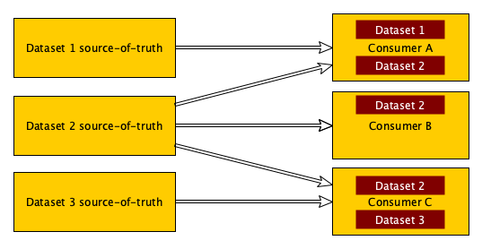
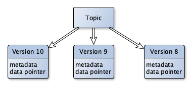
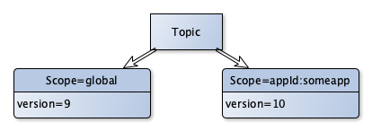
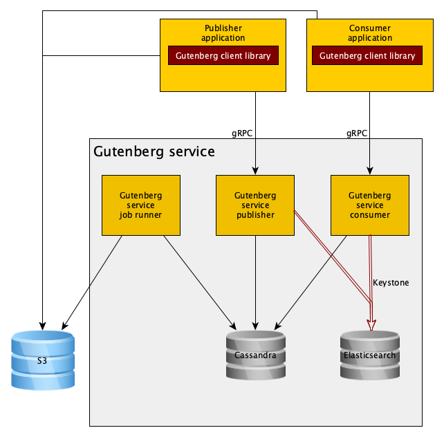

# How Netflix microservices tackle dataset pub-sub

By [Ammar Khaku](https://www.linkedin.com/in/akhaku/)

## Introduction

In a microservice architecture such as Netflix’s, propagating datasets from a single source to multiple downstream destinations can be challenging. These datasets can represent anything from service configuration to the results of a batch job, are often needed in-memory to optimize access and must be updated as they change over time.

One example displaying the need for dataset propagation: at any given time Netflix runs a very large number of A/B tests. These tests span multiple services and teams, and the operators of the tests need to be able to tweak their configuration on the fly. There needs to be the ability to detect nodes that have failed to pick up the latest test configuration, and the ability to revert to older versions of configuration when things go wrong.

Another example of a dataset that needs to be disseminated is the result of a machine-learning model: the results of these models may be used by several teams, but the ML teams behind the model aren’t necessarily interested in maintaining high-availability services in the critical path. Rather than each team interested in consuming the model having to build in fallbacks to degrade gracefully, there is a lot of value in centralizing the work to allow multiple teams to leverage a single team’s effort.

Without infrastructure-level support, every team ends up building their own point solution to varying degrees of success. Datasets themselves are of varying size, from a few bytes to multiple gigabytes. It is important to build in observability and fault detection, and to provide tooling to allow operators to make quick changes without having to develop their own tools.

*Dataset propagation*

At Netflix we use an in-house dataset pub/sub system called Gutenberg. Gutenberg allows for propagating _versioned datasets_ — consumers subscribe to data and are updated to the latest versions when they are published. Each version of the dataset is immutable and represents a complete view of the data — there is no dependency on previous versions of data. Gutenberg allows browsing older versions of data for use cases such as debugging, rapid mitigation of data related incidents, and re-training of machine-learning models. This post is a high level overview of the design and architecture of Gutenberg.

## Data model

*1 topic -> many versions*

The top-level construct in Gutenberg is a “topic”. A publisher publishes to a topic and consumers consume from a topic. Publishing to a topic creates a new monotonically-increasing “version”. Topics have a retention policy that specifies a number of versions or a number of days of versions, depending on the use case. For example, you could configure a topic to retain 10 versions or 10 days of versions.

Each version contains _metadata_ (keys and values) and a _data pointer_. You can think of a data pointer as special metadata that points to where the actual data you published is stored. Today, Gutenberg supports _direct data pointers_ (where the payload is encoded in the data pointer value itself) and _S3 data pointers_ (where the payload is stored in S3). Direct data pointers are generally used when the data is small (under 1MB) while S3 is used as a backing store when the data is large.

*1 topic -> many publish scopes*

Gutenberg provides the ability to scope publishes to a particular set of consumers — for example by region, application, or cluster. This can be used to canary data changes with a single cluster, roll changes out incrementally, or constrain a dataset so that only a subset of applications can subscribe to it. Publishers decide the scope of a particular data version publish, and they can later add scopes to a previously published version. Note that this means that the concept of a _latest version_ depends on the scope — two applications may see different versions of data as the latest depending on the publish scopes created by the publisher. The Gutenberg service matches the consuming application with the published scopes before deciding what to advertise as the latest version.

## Use cases

The most common use case of Gutenberg is to propagate varied sizes of data from a single publisher to multiple consumers. Often the data is held in memory by consumers and used as a “total cache”, where it is accessed at runtime by client code and atomically swapped out under the hood. Many of these use cases can be loosely grouped as “configuration” — for example [Open Connect Appliance](https://medium.com/netflix-techblog/distributing-content-to-open-connect-3e3e391d4dc9) cache configuration, supported device type IDs, supported payment method metadata, and A/B test configuration. Gutenberg provides an abstraction between the publishing and consumption of this data — this allows publishers the freedom to iterate on their application without affecting downstream consumers. In some cases, publishing is done via a Gutenberg-managed UI, and teams do not need to manage their own publishing app at all.

Another use case for Gutenberg is as a versioned data store. This is common for machine-learning applications, where teams build and train models based on historical data, see how it performs over time, then tweak some parameters and run through the process again. More generally, batch-computation jobs commonly use Gutenberg to store and propagate the results of a computation as distinct versions of datasets. “Online” use cases subscribe to topics to serve real-time requests using the latest versions of topics’ data, while “offline” systems may instead use historical data from the same topics — for example to train machine-learned models.

An important point to note is that **Gutenberg is not designed as an eventing system — it is meant purely for data versioning and propagation**. In particular, rapid-fire publishes do not result in subscribed clients stepping through each version; when they ask for an update, they will be provided with the latest version, even if they are currently many versions behind. Traditional pub-sub or eventing systems are suited towards messages that are smaller in size and are consumed in sequence; consumers may build up a view of an entire dataset by consuming an entire (potentially compacted) feed of events. Gutenberg, however, is designed for publishing and consuming an entire immutable view of a dataset.

## Design and architecture

Gutenberg consists of a service with gRPC and REST APIs as well as a Java client library that uses the gRPC API.

*High-level architecture*

### Client

The Gutenberg client library handles tasks such as subscription management, S3 uploads/downloads, [Atlas metrics](https://github.com/Netflix/atlas), and knobs you can tweak using [Archaius properties](https://github.com/Netflix/archaius). It communicates with the Gutenberg service via gRPC, using [Eureka](https://github.com/Netflix/eureka) for service discovery.

**Publishing**

Publishers generally use high-level APIs to publish strings, files, or byte arrays. Depending on the data size, the data may be published as a direct data pointer or it may get uploaded to S3 and then published as an S3 data pointer. The client can upload a payload to S3 on the caller’s behalf or it can publish just the metadata for a payload that already exists in S3.

Direct data pointers are automatically replicated globally. Data that is published to S3 is uploaded to multiple regions by the publisher by default, although that can be configured by the caller.

**Subscription management**

The client library provides subscription management for consumers. This allows users to create subscriptions to particular topics, where the library retrieves data (eg from S3) before handing off to a user-provided listener. Subscriptions operate on a polling model — they ask the service for a new update every 30 seconds, providing the version with which they were last notified. Subscribed clients will never consume an older version of data than the one they are on unless they are pinned (see “Data resiliency” below). Retry logic is baked in and configurable — for instance, users can configure Gutenberg to try older versions of data if it fails to download or process the latest version of data on startup, often to deal with non-backwards-compatible data changes. Gutenberg also provides a pre-built subscription that holds on to the latest data and atomically swaps it out under the hood when a change comes in — this tackles a majority of subscription use cases, where callers only care about the current value at any given time. It allows callers to specify a default value — either for a topic that has never been published to (a good fit when the topic is used for configuration) or if there is an error consuming the topic (to avoid blocking service startup when there is a reasonable default).

**Consumption APIs**

Gutenberg also provides high-level client APIs that wrap the low-level gRPC APIs and provide additional functionality and observability. One example of this is to download data for a given topic and version — this is used extensively by components plugged into Netflix [Hollow](https://github.com/Netflix/hollow). Another example is a method to get the “latest” version of a topic at a particular time — a common use case when debugging and when training ML models.

**Client resiliency and observability**

Gutenberg was designed with a bias towards allowing consuming services to be able to start up successfully versus guaranteeing that they start with the freshest data. With this in mind, the client library was built with fallback logic for when it cannot communicate with the Gutenberg service. After HTTP request retries are exhausted, the client downloads a fallback cache of topic publish metadata from S3 and works based off of that. This cache contains all the information needed to decide whether an update needs to be applied, and from where data needs to be fetched (either from the publish metadata itself or from S3). This allows clients to fetch data (which is potentially stale, depending on how current that fallback cache is) without using the service.

Part of the benefit of providing a client library is the ability to expose metrics that can be used to alert on an infrastructure-wide issue or issues with specific applications. Today these metrics are used by the Gutenberg team to monitor our publish-propagation SLI and to alert in the event of widespread issues. Some clients also use these metrics to alert on app-specific errors, for example individual publish failures or a failure to consume a particular topic.

### Server

The Gutenberg service is a [Governator](https://github.com/Netflix/governator)/Tomcat application that exposes gRPC and REST endpoints. It uses a globally-replicated Cassandra cluster for persistence and to propagate publish metadata to every region. Instances handling consumer requests are scaled separately from those handling publish requests — there are approximately 1000 times more consumer requests than there are publish requests. In addition, this insulates publishing from consumption — a sudden spike in publishing will not affect consumption, and vice versa.

Each instance in the consumer request cluster maintains its own in-memory cache of “latest publishes”, refreshing it from Cassandra every few seconds. This is to handle the large volume of poll requests coming from subscribed clients without passing on the traffic to the Cassandra cluster. In addition, request-pooling low-ttl caches protect against large spikes in requests that could potentially burden Cassandra enough to affect entire region — we’ve had situations where transient errors coinciding with redeployments of large clusters have caused Gutenberg service degradation. Furthermore, we use an [adaptive concurrency limiter](https://github.com/Netflix/concurrency-limits) bucketed by source application to throttle misbehaving applications without affecting others.

For cases where the data was published to S3 buckets in multiple regions, the server makes a decision on what bucket to send back to the client to download from based on where the client is. This also allows the service to provide the client with a bucket in the “closest” region, and to have clients fall back to another region if there is a region outage.

Before returning subscription data to consumers, the Gutenberg service first runs consistency checks on the data. If the checks fail and the polling client already has consumed some data the service returns nothing, which effectively means that there is no update available. If the polling client has not yet consumed any data (this usually means it has just started up), the service queries the history for the topic and returns the latest value that passes consistency checks. This is because we see sporadic replication delays at the Cassandra layer, where by the time a client polls for new data, the metadata associated with the most recently published version has only been partially replicated. This can result in incomplete data being returned to the client, which then manifests itself either as a data fetch failure or an obscure business-logic failure. Running these consistency checks on the server insulates consumers from the eventual-consistency caveats that come with the service’s choice of a data store.

Visibility on topic publishes and nodes that consume a topic’s data is important for auditing and to gather usage info. To collect this data, the service intercepts requests from publishers and consumers (both subscription poll requests and others) and indexes them in Elasticsearch by way of the [Keystone](https://medium.com/netflix-techblog/keystone-real-time-stream-processing-platform-a3ee651812a) data pipeline. This allows us to gain visibility into topic usage and decommission topics that are no longer in use. We expose deep-links into a Kibana dashboard from an internal UI to allow topic owners to get a handle on their consumers in a self-serve manner.

In addition to the clusters serving publisher and consumer requests, the Gutenberg service runs another cluster that runs periodic tasks. Specifically this runs two tasks:

1. Every few minutes, all the latest publishes and metadata are gathered up and sent to S3. This powers the fallback cache used by the client as detailed above.
2. A nightly janitor job purges topic versions which exceed their topic’s retention policy. This deletes the underlying data as well (e.g. S3 objects) and helps enforce a well-defined lifecycle for data.

## Data resiliency

### Pinning

In the world of application development bad deployments happen, and a common mitigation strategy there is to roll back the deployment. A data-driven architecture makes that tricky, since behavior is driven by data that changes over time.

Data propagated by Gutenberg influences — and in many cases drives — system behavior. This means that when things go wrong, we need a way to roll back to a last-known good version of data. To facilitate this, Gutenberg provides the ability to “pin” a topic to a particular version. Pins override the latest version of data and force clients to update to that version — this allows for quick mitigation rather than having an under-pressure operator attempt to figure out how to publish the last known good version. You can even apply a pin to a specific publish scope so that only consumers that match that scope are pinned. Pins also override data that is published while the pin is active, but when the pin is removed clients update to the latest version, which may be the latest version when the pin was applied or a version published while the pin was active.

### Incremental rollout

When deploying new code, it’s often a good idea to canary new builds with a subset of traffic, roll it out incrementally, or otherwise de-risk a deployment by taking it slow. For cases where data drives behavior, a similar principle should be applied.

One feature Gutenberg provides is the ability to incrementally roll out data publishes via [Spinnaker](https://medium.com/netflix-techblog/global-continuous-delivery-with-spinnaker-2a6896c23ba7) pipelines. For a particular topic, users configure what publish scopes they want their publish to go to and what the delay is between each one. Publishing to that topic then kicks off the pipeline, which publishes the same data version to each scope incrementally. Users are able to interact with the pipeline; for example they may choose to pause or cancel pipeline execution if their application starts misbehaving, or they may choose to fast-track a publish to get it out sooner. For example, for some topics we roll out a new dataset version one AWS region at a time.

## Scale

Gutenberg has been at use at Netflix for the past three years. At present, Gutenberg stores low tens-of-thousands of topics in production, about a quarter of which have published at least once in the last six months. Topics are published at a variety of cadences — from tens of times a minute to once every few months — and on average we see around 1–2 publishes per second, with peaks and troughs about 12 hours apart.

In a given 24 hour period, the number of nodes that are subscribed to at least one topic is in the low six figures. The largest number of topics a single one of these nodes is subscribed to is north of 200, while the median is 7. In addition to subscribed applications, there are a large number of applications that request specific versions of specific topics, for example for ML and Hollow use cases. Currently the number of nodes that make a non-subscribe request for a topic is in the low hundreds of thousands, the largest number of topics requested is 60, and the median is 4.

## Future work

Here’s a sample of work we have planned for Gutenberg:

- **Polyglot support:** today Gutenberg only supports a Java client, but we’re seeing an increasing number of requests for Node.js and Python support. Some of these teams have cobbled together their own solutions built on top of the Gutenberg REST API or other systems. Rather than have different teams reinvent the wheel, we plan to provide first-class client libraries for Node.js and Python.
- **Encryption and access control:** for sensitive data, Gutenberg publishers should be able to encrypt data and distribute decryption credentials to consumers out-of-band. Adding this feature opens Gutenberg up to another set of use-cases.
- **Better incremental rollout:** the current implementation is in its pretty early days and needs a lot of work to support customization to fit a variety of use cases. For example, users should be able to customize the rollout pipeline to automatically accept or reject a data version based on their own tests.
- **Alert templates:** the metrics exposed by the Gutenberg client are used by the Gutenberg team and a few teams that are power users. Instead, we plan to provide leverage to users by building and parameterizing templates they can use to set up alerts for themselves.
- **Topic cleanup:** currently topics sit around forever unless they are explicitly deleted, even if no one is publishing to them or consuming from them. We plan on building an automated topic cleanup system based on the consumption trends indexed in Elasticsearch.
- **Data catalog integration:** an ongoing issue at Netflix is the problem of cataloging data characteristics and lineage. There is [an effort](https://medium.com/netflix-techblog/building-and-scaling-data-lineage-at-netflix-to-improve-data-infrastructure-reliability-and-1a52526a7977) underway to centralize metadata around data sources and sinks, and once Gutenberg integrates with this, we can leverage the catalog to automate tools that message the owners of a dataset.

If any of this piques your interest — [we’re hiring](https://jobs.netflix.com/)!

---
**Tags:** Microservices · Netflix · Pub Sub · Software Engineering
