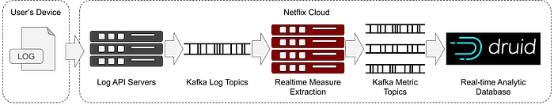
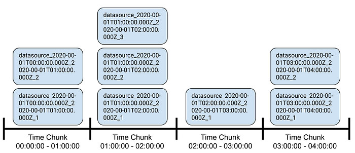
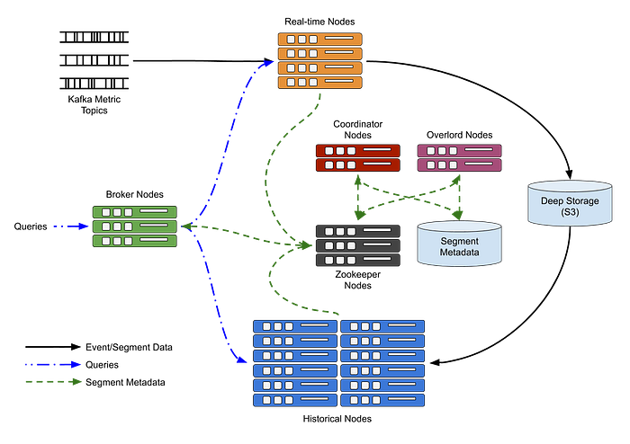

# How Netflix uses Druid for Real-time Insights to Ensure a High-Quality Experience

_By _[_Ben Sykes_](https://www.linkedin.com/in/sykesb/)

Ensuring a consistently great Netflix experience while continuously pushing innovative technology updates is no easy feat. How can we be confident that updates are not harming our users? And that we’re actually making measurable improvements when we intend to?

Using real-time logs from playback devices as a source of events, we derive measurements in order to understand and quantify how seamlessly users’ devices are handling browsing and playback.

*Log to Metric Data Pipeline*

Once we have these measures, we feed them into a database. Every measure is tagged with anonymized details about the kind of device being used, for example, whether the device is a Smart TV, an iPad or an Android Phone. This enables us to classify devices and view the data according to various aspects. This in turn allows us to isolate issues that may only affect a certain group, such as a version of the app, certain types of devices, or particular countries.

This aggregated data is available immediately for querying, either via dashboards or ad-hoc queries. The metrics are also continuously checked for alarm signals, such as if a new version is affecting playback or browsing for some users or devices. These checks are used to alert the responsible team which can address the issue as quickly as possible.

During [software updates](https://www.youtube.com/watch?v=AGEXxB-nWMw&feature=youtu.be&t=2540), we enable the new version for a subset of users and use these real-time metrics to compare how the new version is performing vs the previous version. Any regression in the metrics gives us a signal to abort the update and revert those users getting the new version back to the previous version.

With this data arriving at over 2 million events per second, getting it into a database that can be queried quickly is formidable. We need sufficient dimensionality for the data to be useful in isolating issues and as such we generate over 115 billion rows per day. At Netflix we leverage Apache Druid to help tackle this challenge at our scale.

---

## Druid

> “[Apache Druid](https://druid.apache.org/) is a high performance real-time analytics database. It’s designed for workflows where fast queries and ingest really matter. Druid excels at instant data visibility, ad-hoc queries, operational analytics, and handling high concurrency.” — druid.io

As such, Druid fits really well with our use-case. High ingestion rate of event data, with high cardinality and fast query requirements.

Druid is not a relational database, but some concepts are transferable. Rather than tables, we have datasources. As with relational databases, these are logical groupings of data that are represented as columns. Unlike relational databases, there is no concept of joins. As such we need to ensure that whichever columns we want to filter or group-by are included in each datasource.

**There are primarily three classes of columns in a datasource — time, dimensions and metrics.**

Everything in Druid is keyed by time. Each datasource has a timestamp column that is the primary partition mechanism. Dimensions are values that can be used to filter, query or group-by. Metrics are values that can be aggregated, and are nearly always numeric.

By removing the ability to perform joins, and assuming data is keyed by timestamp, Druid can make some optimizations in how it stores, distributes and queries data such that we’re able to scale the datasource to trillions of rows and still achieve query response times in the 10s of milliseconds.

To achieve this level of scalability, Druid divides the stored data into time chunks. The duration of time chunks is configurable. An appropriate duration can be chosen depending on your data and use-case. For our data and use-case, we use 1 hour time chunks. Data within a time chunk is stored in one or more [segments](https://druid.apache.org/docs/latest/design/segments.html). Each segment holds rows of data all falling within the time chunk as determined by its timestamp key column. The size of the segments can be configured such that there is an upper bound on the number of rows, or the total size of the segment file.

*Example of Segments*

When querying data, Druid sends the query to all nodes in the cluster that are holding segments for the time chunks within the range of the query. Each node processes the query in parallel across the data it is holding, before sending the intermediate results back to the query broker node. The broker will perform the final merge and aggregation before sending the result set back to the client.

*Druid Cluster Overview*

---

## Ingestion

Inserts to this database occur in real-time. Rather than individual records being inserted into a datasource, the events (metrics in our case) are read from Kafka streams. We use 1 topic per datasource. Within Druid we use [Kafka Indexing Tasks](https://druid.apache.org/docs/latest/development/extensions-core/kafka-ingestion.html) which create multiple indexing workers that are distributed among the Realtime Nodes ([Middle Managers](https://druid.apache.org/docs/latest/design/processes.html)).

Each of these indexers subscribes to the topic and reads its share of events from the stream. The indexers extract values from the event messages according to an [Ingestion Spec](https://druid.apache.org/docs/latest/ingestion/index.html#ingestion-specs) and accumulate the created rows in memory. As soon as a row is created, it’s available to be queried. Queries arriving for a time chunk where a segment is still being filled by the indexers, will be served by the indexers themselves. As indexing tasks are essentially performing 2 jobs, ingestion and fielding queries, it’s important to get the data out to the Historical Nodes in a timely manner to offload the query work to them, in a more optimized way.

Druid can roll up data as it is ingested to minimize the amount of raw data that needs to be stored. Rollup is a form of summarization or pre-aggregation. In some circumstances, rolling up data can dramatically reduce the size of data that needs to be stored, potentially reducing row counts by orders of magnitude. However, this storage reduction does come at a cost: we lose the ability to query individual events and can only query at the predefined [Query Granularity](https://druid.apache.org/docs/latest/ingestion/index.html#granularityspec). For our use-case we chose a 1-minute query granularity.

During ingestion, if any rows have identical dimensions and their timestamp is within the same minute (our Query Granularity), the rows are rolled up. This means the rows are combined by adding together all the metric values and incrementing a counter so we know how many events contributed to this row’s values. This form of rollup can significantly reduce the row count in the database and thereby speed up queries as we then have fewer rows to operate on and aggregate.

Once the number of accumulated rows hits a certain threshold, or the segment has been open for too long, the rows are written into a segment file and offloaded to deep storage. The indexer then informs the coordinator that the segment is ready so that the coordinator can tell one or more historical nodes to load it. Once the segment has been successfully loaded into Historical nodes, it is then unloaded from the indexer and any queries targeting that data will now be served by the historical nodes.

---

## Data Management

As you may imagine, as the cardinality of dimensions increases, the likelihood of having identical events within the same minute decreases. Managing cardinality, and therefore roll-up, is a powerful lever to achieving good query performance.

To achieve the rate of ingestion that we need, we run many instances of the indexers. Even with the rollup combining identical rows in the indexing tasks, the chances of getting those identical rows all in the same instance of an indexing task are very low. To combat this and achieve the best possible rollup, we schedule a task to run after all the segments for a given time-chunk have been handed-off to the historical nodes.

This scheduled compaction task fetches all the segments for the time-chunk from deep storage, and runs through a map/reduce job to recreate segments and achieve a perfect rollup. The new segments are then loaded and published by the Historical nodes [replacing and superseding](https://druid.apache.org/docs/latest/design/segments.html#replacing-segments) the original, less-rolled-up segments. In our case we see about a 2x improvement in row count by using this additional compaction task.

Knowing when all the events for a given time-chunk have been received is not trivial. There can be late-arriving data on the Kafka topics, or the indexers could be taking time to hand-off the segments to the Historical nodes. To work around this we enforce some limitations and perform checks before running compaction.

Firstly, we discard any very late arriving data. We consider this too old to be useful in our real-time system. This sets a bound on how late data can be. Secondly, the compaction task is scheduled with a delay, this gives the segments plenty of time to have been offloaded to the Historical nodes in the normal flow. And lastly, when the scheduled compaction task for the given time chunk kicks off, it queries the segment metadata to check if there are any relevant segments still being written to, or handed-off. If there are, it will wait and try again in a few minutes. This ensures that all data is processed by the compaction job.

Without these measures, we found that sometimes we’d lose data. Segments that were still being written to when compaction started would be overwritten with the newly compacted segments that have a higher version and so take precedence. This effectively deleted the data that was contained in those segments that had not yet finished being handed-off.

---

## Querying

Druid supports two query languages: Druid SQL and native queries. Under the hood, Druid SQL queries are converted into native queries. Native queries are submitted as JSON to a REST endpoint and is the primary mechanism we use.

Most queries to our cluster are generated by custom internal tools such as dashboards and alerting systems. These systems were originally designed to work with our internally developed, and open-sourced, time-series database, [Atlas](https://github.com/Netflix/atlas). As such, these tools speak the Atlas Stack query language.

To accelerate adoption of querying Druid, and enable re-use of existing tools, we added a translation layer that takes Atlas queries, rewrites them as Druid queries, issues the query and reformats the results as Atlas results. This abstraction layer enables existing tools to be used as-is and creates no additional learning curve for users to access the data in our Druid datastore.

---

## Tuning for Scale

While adjusting the configuration of the cluster nodes, we ran a series of repeatable and predictable queries at high rate in order to get a benchmark of the response time and query throughput for each given configuration. The queries were designed to isolate parts of the cluster to check for improvements or regressions in query performance.

For example we ran targeted queries for the most recent data so that only Middle Managers were queried. Likewise for longer durations but only older data to ensure we query only the Historical nodes to test the caching configuration. And again with queries that group by very high cardinality dimensions to check how result merging was affected. We continued to tweak and run these benchmarks until we were happy with the query performance.

During these tests we found that tuning the size of buffers, number of threads, query queue lengths and memory allocated to query caches had an effective impact on the query performance. However, the introduction of the compaction job, which takes our poorly-rolled-up segments and re-compacts them with perfect roll-up, has a more significant impact on query performance.

We also found that enabling caches on the Historical nodes was very beneficial, whereas enabling caches on the broker nodes was much less so. So much that we don’t use caches on the brokers. It may be due to our use case, but nearly every query we make misses the cache on the brokers, likely because the queries usually include the most current data, which won’t be in any caches as it’s always arriving.

---

## Summary

After multiple iterations of tuning and tailoring for our use case and data rate, Druid has proven to be as capable as we initially hoped.

We’ve been able to get to a capable and usable system, but there’s still more work to do. Our volume and rate of ingestion is constantly increasing, as are the number and complexity of the queries. As the value of this detailed data is realized by more teams, we frequently add more metrics and dimensions which pushes the system to work harder. We have to continue to monitor and tune to keep the query performance in check.

We’re currently ingesting at over 2 million events per second, and querying over 1.5 trillion rows to get detailed insights into how our users are experiencing the service. All this helps us maintain a high-quality Netflix experience, while enabling constant innovation.

---
**Tags:** Druid · Realtime · Metrics And Analytics · Apache · Kafka
