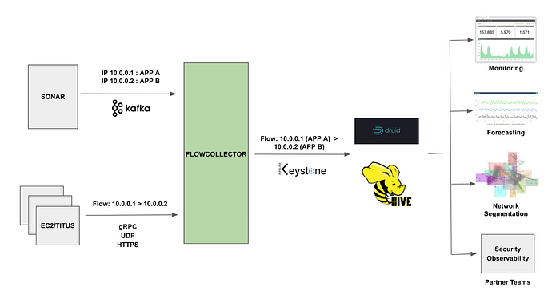

# How Netflix uses eBPF flow logs at scale for network insight

By [Alok Tiagi](https://www.linkedin.com/in/alok-tiagi-99205015/), [Hariharan Ananthakrishnan](https://www.linkedin.com/in/haananth/), [Ivan Porto Carrero](https://www.linkedin.com/in/casualjim/) and [Keerti Lakshminarayan](https://www.linkedin.com/in/joshmachine/)

Netflix has developed a network observability sidecar called **Flow Exporter** that uses eBPF tracepoints to capture TCP flows at near real time. At much less than 1% of CPU and memory on the instance, this highly performant sidecar provides flow data at scale for network insight.

## Challenges

The cloud network infrastructure that Netflix utilizes today consists of AWS services such as VPC, DirectConnect, VPC Peering, Transit Gateways, NAT Gateways, etc and Netflix owned devices. Netflix software infrastructure is a large distributed ecosystem that consists of specialized functional tiers that are operated on the AWS and Netflix owned services. While we strive to keep the ecosystem simple, the inherent nature of leveraging a variety of technologies will lead us to challenges such as:

- **App Dependencies and Data Flow Mappings: **With the number of micro services growing by the day **without understanding and having visibility into an application’s dependencies and data flows,** it is difficult for both service owners and centralized teams to identify systemic issues.
- **Pathway Validation: **Netflix velocity of change within the production streaming and studio environment can result in the inability of services to communicate with other resources.
- **Service Segmentation: **The ease of the cloud deployments has led to the organic growth of multiple AWS accounts, deployment practices, interconnection practices, etc. Without having network visibility, it’s difficult to improve our reliability, security and capacity posture.
- **Network Availability: **The expected continued growth of our ecosystem makes it difficult to understand our network bottlenecks and potential limits we may be reaching.

****Cloud Network Insight ******is a suite of solutions that provides both operational and analytical insight into the cloud network infrastructure to address the identified problems.** By collecting, accessing and analyzing network data from a variety of sources like [VPC Flow Logs](./hyper-scale-vpc-flow-logs-enrichment-to-provide-network-insight-e5f1db02910d.md), ELB Access Logs, eBPF flow logs on the instances, etc, we can provide network insight to users and central teams through multiple data visualization techniques like [Lumen](./lumen-custom-self-service-dashboarding-for-netflix-8c56b541548c.md), [Atlas](https://github.com/Netflix/atlas), etc.

## Flow Exporter

The Flow Exporter is a sidecar that uses [eBPF tracepoints](http://www.brendangregg.com/blog/2018-03-22/tcp-tracepoints.html) to capture TCP flows at near real time on instances that power the Netflix microservices architecture.

### What is BPF?

> _Berkeley Packet Filter (BPF) is an in-kernel execution engine that processes a virtual instruction set, and has been extended as eBPF for providing a safe way to extend kernel functionality. In some ways, eBPF does to the kernel what JavaScript does to websites: it allows all sorts of new applications to be created._

An eBPF flow log record represents one or more network flows that contain TCP/IP statistics that occur within a variable aggregation interval.

The sidecar has been implemented by leveraging the highly performant eBPF along with carefully chosen transport protocols to consume **less than 1% of CPU and memory **on any instance in our fleet. The choice of transport protocols like GRPC, HTTPS & UDP is runtime dependent on characteristics of the instance placement.

The runtime behavior of the Flow Exporter can be dynamically managed by configuration changes via [Fast Properties](https://netflixtechblog.com/announcing-archaius-dynamic-properties-in-the-cloud-bc8c51faf675). The Flow Exporter also publishes various operational metrics to [Atlas](https://github.com/Netflix/atlas). These metrics are visualized using [Lumen](./lumen-custom-self-service-dashboarding-for-netflix-8c56b541548c.md), a self-service dashboarding infrastructure.

## So how do we ingest and enrich these flows at scale ?

Flow Collector is a regional service that ingests and enriches flows. IP addresses within the cloud can move from one EC2 instance or [Titus](https://netflix.github.io/titus/) container to another over time. We use [Sonar](https://www.slideshare.net/AmazonWebServices/a-day-in-the-life-of-a-cloud-network-engineer-at-netflix-net303-reinvent-2017) to attribute an IP address to a specific application at a particular time. Sonar is an IPv6 and IPv4 address identity tracking service.

Flow Collector consumes two data streams, the IP address change events from Sonar via Kafka and eBPF flow log data from the Flow Exporter sidecars. It performs real time attribution of flow data with application metadata from Sonar. The attributed flows are pushed to [Keystone](https://netflixtechblog.com/keystone-real-time-stream-processing-platform-a3ee651812a) that routes them to the Hive and [Druid](./how-netflix-uses-druid-for-real-time-insights-to-ensure-a-high-quality-experience-19e1e8568d06.md) datastores.

The attributed flow data drives various use cases within Netflix like network monitoring and network usage forecasting available via [Lumen](./lumen-custom-self-service-dashboarding-for-netflix-8c56b541548c.md) dashboards and [machine learning](./open-sourcing-metaflow-a-human-centric-framework-for-data-science-fa72e04a5d9.md) based network segmentation. The data is also used by security and other partner teams for insight and incident analysis.

## Summary

Providing network insight into the cloud network infrastructure using eBPF flow logs at scale is made possible with eBPF and a highly scalable and efficient flow collection pipeline. After several iterations of the architecture and some tuning, the solution has proven to be able to scale.

We are currently ingesting and enriching billions of eBPF flow logs per hour and providing visibility into our cloud ecosystem. The enriched data allows us to analyze networks across a variety of dimensions (e.g. availability, performance, and security), to ensure applications can effectively deliver their data payload across a globally dispersed cloud-based ecosystem.

## Special Thanks To

[Brendan Gregg](https://www.linkedin.com/in/brendangregg/)

---
**Tags:** Ebpf · Cloud Networking · Big Data · Druid · Network Analytics
