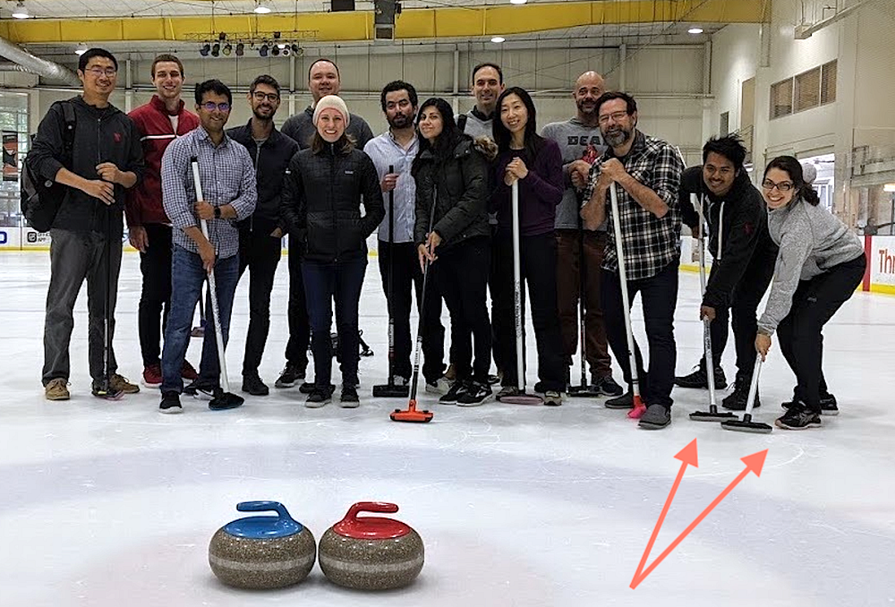

# How Our Paths Brought Us to Data and Netflix

> Part of our series on who works in Analytics at Netflix — and what the role entails

_by _[_Julie Beckley_](http://www.linkedin.com/in/julie-novak1/)_ & _[_Chris Pham_](http://www.linkedin.com/in/phamchristopher/)

This Q&A provides insights into the diverse set of skills, projects, and culture within [Data Science and Engineering](http://jobs.netflix.com/teams/data-science-and-engineering) (DSE) at Netflix through the eyes of two team members: Chris Pham and Julie Beckley.

*Photo from a team curling offsite — There’s us to the right!*

**[Chris]** Julie and I joined the Streaming DSE team at Netflix a few years ago and have been close colleagues and friends since then. At work, we regularly lean on each other for help based on our respective areas of expertise — I bring my breadth of big data tools and technologies while Julie has been building statistical models for the past decade. Outside of work, we share a love of good food and coffee, exchanging tips on making espresso.

## 1. What was your path to working in data?

**[Julie]** I took a traditional path to data science. Since mathematics was my favorite subject in school, I decided to pursue it for my bachelors degree at McGill University (while indulging in French culture in the beautiful city of Montreal). Over the course of the four years it became clear that I enjoyed combining analytical skills with solving real world problems, so a PhD in Statistics was a natural next step. After completing my education, I was still not certain whether I wanted a job in academia or industry. I took a role as a Research Staff Member at IBM Research, which served as a middle ground with a joint focus on real world applications, academic research, and even allowed me to teach a graduate Machine Learning course! I then transitioned to a full industry role at Netflix.

**[Chris]** I initially wanted to build a career in consulting after receiving my graduate degree in Economics because I had a passion for analytical problem solving and statistical modeling. A role in data science eventually seemed like a natural transition, but it wasn’t without its hurdles: With my consulting background, I had to go through a few other roles first while learning how to code on the side. A lot of my learning and training was self-guided until 2016, when a manager at my last company took a chance on me and helped me make the rare transfer from a role in HR to Data Science.

## 2. Tell me about some of the exciting projects you’re a part of.

**[Julie]** Chris and I have the same primary stakeholders (or engineering team that we support): [Encoding Technologies](https://research.netflix.com/research-area/video-encoding-and-quality). They are continuously innovating compression algorithms to efficiently send high quality audio and video files to our customers over the internet. I focus on improving experimentation methodology to test how well the newest files are working: do they need less bits to stream while providing a higher video quality? Do they cause less errors? My work is typically developed in R or Python. I love the cross-functional nature of my work, as it allows me to learn from others and creatively explore new statistical methodologies to improve the Netflix service.

**[Chris]** When I first started working with Encoding Technologies, there was so much data waiting to be translated into actionable insights. It was fun starting from almost nothing and transforming all of that data into self-serve tools and dashboards for the team to understand their contribution to the Netflix streaming experience. These projects have involved using Spark, Python, SQL, Tableau, and Jupyter notebooks. Over the last year, I’ve spent a lot of time analyzing data to inform how we roll out new encoding innovations to the diverse ecosystem of devices that stream Netflix.

## 3. How do your projects impact the business at Netflix?

**[Julie]** Encoding experimentation (and more broadly, streaming experimentation) is critical for ensuring our customers have a good [Quality of Experience](https://netflixtechblog.com/a-b-testing-and-beyond-improving-the-netflix-streaming-experience-with-experimentation-and-data-5b0ae9295bdf) when watching Netflix. In other words, the content you’re about to watch needs to load quickly with high video quality. When we test new encodes, we need effective data science methods to quickly and accurately understand whether customers are having a better experience. With these insights, the engineering teams can quickly understand what’s working well and what needs to be improved. It’s super exciting to see the impact of my work when I hear from friends and family that Netflix is streaming well for them!

**[Chris]** There’s a lot of things to consider when we roll out a new compression algorithm. Which devices get this treatment? What is the benefit to the streaming experience? Is the benefit uniform, or do certain cohorts of members — such as those who stream over a cellular connection — benefit more? How does a decision of this scale affect the efficiency of our globally distributed content delivery network, [Open Connect](https://openconnect.netflix.com/)? It’s one big optimization problem that requires balancing several different factors. Streaming DSE is at the center of it all, bringing together different teams at Netflix and using data to drive decisions that impact our members around the world.

## 4. What does it take to succeed at Netflix in a data role?

**[Julie]** One of the special things about working at Netflix is that a diverse set of skills and backgrounds is truly appreciated, since there are many ways to add value to the company. From my experience, being proactive in pushing forward on your ideas is key. The values in the [Netflix culture document](https://jobs.netflix.com/culture) allow for a framework where everyone is a leader to work well — this is because we expect initiative, direct and candid feedback, and transparency in everything we do. This leads to a great environment where I am constantly challenged, learning, and receiving constructive feedback on how I can do better!

**[Chris]** I think a big part of our jobs is continuously thinking about how data can benefit our stakeholders. Julie and I will never know as much about video and audio compression algorithms as our talented Encoding Technologies team, but we should be the ones most familiar with the data: How to access, analyze, and visualize it; how to transform it into metrics that act as strong and accurate proxies for a member’s experience; and how to guide others to draw the right conclusions from data so they can act on it. Writing memos is a big part of Netflix culture, which I’ve found has been helpful for sharing ideas, soliciting feedback, and documenting project details. So writing well, especially the ability to translate technical concepts for a non-technical audience, is also very useful.

## 5. What piece of advice would you pass along to those just starting out their career in data?

**[Julie]** One piece of advice I would pass along (and wish I could give to my younger self) is not to stress and try to plan every step of your data science career. Your career is long (and unpredictable!), so as long as you work hard and stay motivated, it will move in an exciting direction.

**[Chris] **Everyone wants to build fancy models or tools, but fewer are willing to do the foundational things like cleaning the data and writing the documentation. I’ve found that volunteering and being proactive (no matter the task) has been an effective way of building trust with others, and it opened my career up to many more opportunities early on.

---

_If this post resonates with you and you’d like to explore opportunities with Netflix, check out our _[_analytics site_](http://research.netflix.com/research-area/analytics)_, search _[_open roles_](http://jobs.netflix.com/search?team=Data+Science+and+Engineering)_, and learn about our _[_culture_](http://jobs.netflix.com/culture)_. You can also find more stories like this _[_here_](./analytics-at-netflix-who-we-are-and-what-we-do-7d9c08fe6965.md)_._

---
**Tags:** Netflix · Analytics · Data Science · Data Engineering
