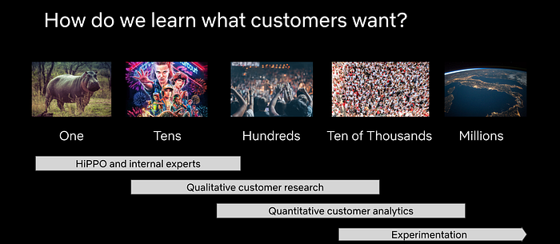

# How Product Teams Can Build Empathy Through Experimentation

> A conversation between Travis Brooks, Netflix Product Manager for Experimentation Platform, and George Khachatryan, OfferFit CEO

**Note:_ _**_I’ve known George for a little while now, and as we’ve talked a lot about the philosophy of experimentation, he kindly invited me to their office (virtually) for their virtual speaker series. We had a fun conversation with his team, and we realized that some parts of it might make a good blog post as well. So we jointly edited a bit for length and clarity, and are posting here as well as on _[_OfferFit’s blog_](https://www.offerfit.ai/blog/how-product-teams-can-build-empathy-through-experimentation)_. Hope you enjoy the result. — Travis B._

**George Khachatryan: **Travis, could you tell us a bit about your background and how you came to your current role?

**Travis Brooks: **I’m the product manager (PM) for the experimentation platform. So my job is to make sure that all the tooling and infrastructure we have at Netflix for experimentation does what it needs to do, and to set the road map for the next year or more for what we’re building.

I started out in physics, but ended up not doing that. Instead, I started leading an information resource for particle physics literature. One of the things we ran up against was we didn’t really have enough users to run experiments. We were all experimental physicists at heart and we wanted to make decisions on some sort of principled basis, but we didn’t actually have enough users to get statistical significance.

At the same time, I had an opportunity to go join Yelp as the first product manager there for search, where there were many more users. And so I did that and spent some time building out search algorithms and recommendation engines at Yelp.

I came to Netflix about three years ago, and first led a team of data scientists responsible for front end experimentation — basically everything you see on the Netflix platform. And then in the last year, I’ve been the PM for all of our experimentation infrastructure and platform.

**George Khachatryan: **So over the last decade, a lot of tech companies have been increasingly embracing user centric design — it’s kind of become the accepted wisdom. And a lot of non-tech companies also are increasingly trying to be customer centric in their thinking. How would you define user centric design and what role do you think experimentation plays in it?

**Travis Brooks: **Let me say first that I’m talking here about my own experiences. I’m not speaking for Netflix.

But what I can say is that broadly, I think user centric design is really about empathy. And as a person who’s been both a user facing PM and a tools PM, having empathy for your user is one of the core traits that defines good product management. So when we say “user centric”, we’re just saying, “Hey, really lean into empathy.”

**When you’re building things, whether you’re a visual designer, or a designer of an API, or a PM, or anybody who’s building something, lean into trying to put yourself in the shoes of the user. And if you can do that, not just at the beginning when you write down the specs, but all the way through the process, you make a better product in the end.**

In the act of building we tend to get really entranced by the technical problem and solving that problem. And in fact, it’s probably necessary to lose sight of what the end user is going to experience in order to build the best technical solution. So to build products that are effective for the user we need that user perspective brought back into focus pretty regularly — “Oh, wait, here’s what the end user is going to experience” Or, “Oh yeah, actually we don’t even need to solve that really challenging, interesting technical problem over there, because the end user is only going to experience this part over here.” To me, that’s what user centric design means.

How do we make sure that in all aspects, whether it’s an API, or the front-end visual design, we’re centering the user? How are they going to experience this product? What are their pain points? Is what we’re doing actually connected to that end user?

**George Khachatryan: **And what role does experimentation play, if any, in building empathy?

**Travis Brooks: **This is really a PM’s role — to ensure that the team that’s building something is maintaining that level of user empathy. But then you have to ask, “How does the PM know what users want?” Right? They’re not magic. A good PM doesn’t spring fully formed from the head of Zeus with all the knowledge of what users want. How do they get that knowledge? I think there are four ways.

1. One way is if you’re PM-ing a product that you yourself use. It’s the cheapest and maybe the lowest fidelity way of building empathy. “Okay, well, I’m a user so I know what users feel because I use the product”. It’s low fidelity because it’s an N of 1, and you’re certainly not a typical user. You’re a PM. You have a way different way of interacting with products than most people.

2. Typically the next thing people do is they start talking to users. And if they’re smart, they start talking to people who are not like them. “Hey, how do you use this product? What do you value? What do you find painful about it? How often do you use it? Why don’t you use it more? When was the last time you used it? What were you trying to do? Did you achieve that?” — all those typical user research questions that PMs ask. Really good user researchers get into this sort of qualitative research, and that’s a great way to build broader empathy, at a higher fidelity level, than just, “I use my product.”

3. Then you get to a scale where you have a lot of users, and talking to them becomes an art of “How do I get a representative sample from this broad population?” And you start to worry that maybe their memory isn’t quite perfect. Users are self-reporting how they use things, but that’s not actually how they use things. We know people have a lot of cognitive biases in that way. So then you start getting into observational data, and you say, “well, okay, people report that they use the product once a week. If I go look at data, I can see people use the product three times a week, so I can tell that what they report isn’t quite what happened.” Adding this observational data layer makes user research much higher fidelity. Of course, it’s higher cost and may take some time and some effort and investment.

4. But even that observational data layer doesn’t really help you understand how people use the product at the level of a deep causal connection. The end game of trying to understand the user is, “if I do X, users respond this way”. And the only way to establish that causal connection — maybe not the only way, but the most reliable way, the highest fidelity way — is to show a random sample of your users X and see how they differ from the rest of your users who didn’t see X. That’s the core of experimentation: a high cost, high fidelity, arguably lower speed, way to build empathy. It’s probably not the first place you’re going to turn to build empathy, but you’re going to get there and you’ll eventually need to have it in your arsenal.

*Different methods of learning work optimally at different scales, having all of them in your arsenal is useful.*

**George Khachatryan: **Yeah. So you talk about the importance of building an experimentation culture. Can you explain what the main elements of such a culture would be, in your view?

**Travis Brooks: **I think having a sense of humility is super important. If you read [our blog posts](./netflix-a-culture-of-learning-394bc7d0f94c.md), or posts from anybody who does massive scale testing such as Microsoft, you see that they test, and most of their treatments fail. And those are treatments from expert designers and PMs and engineers who have the best context, the best user research. Especially as your product matures, it is hard to improve upon. Even a less mature product is hard to improve upon, because it turns out our intuition is pretty good. We understand what users need. It’s just not a very reliable mechanism. So most treatments that we come up with fail, which means you have to have a lot of humility.

You can’t get married to your ideas and say, “I’m going to do an experiment; this is going to blow the world away.” And you end up wasting a lot of time and effort trying to show that your treatment is good, even if it’s not. You miss the bigger picture, which is, “Hey, you tried something. It didn’t work. What can you learn from that experience to inform the next treatment?”

The cultures where people can be really successful in experimentation involve a lot of humility, which encourages that sort of iterative approach. “I’m guessing this is not going to work because I can see from history most of these things don’t work. What I’m going to do is put it out there and I’m going to learn from it. Maybe I’ll get lucky and it’ll work right off the bat, but maybe I won’t. I’ll learn from the next two tests, and I’ll get to someplace where I can actually solve this problem.”

The other thing I think is important is having a culture of open debate, where decisions are made out in the open. The more open your decision-making, the louder a voice data has. When decision-making gets closed, into one person’s office or one person’s head, it’s hard. Often when people debate and they can’t agree, they turn to data, because it’s a lot harder to disagree with that. And so if you want an experimentation culture, if you want data, have open debate. Have open decision making. Then people more clearly see that they need data, that they need to experiment.

So yes, I think that humility and open decision-making are really important.

---
**Tags:** Experimentation · Experimentation Culture · Product Management
