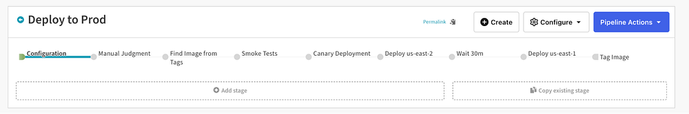
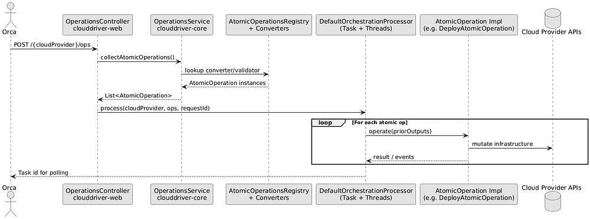
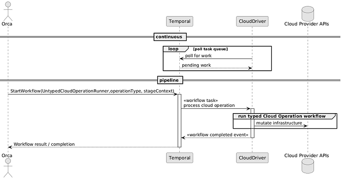
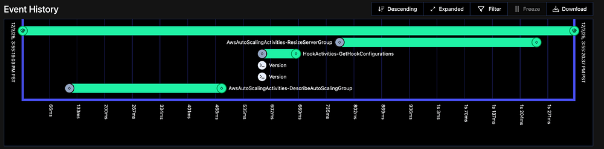

# How Temporal Powers Reliable Cloud Operations at Netflix

By [Jacob Meyers](https://www.linkedin.com/in/jacobmeyers35/) and [Rob Zienert](https://www.linkedin.com/in/robzienert/)

[Temporal](https://temporal.io/) is a [Durable Execution](https://docs.temporal.io/evaluate/understanding-temporal#durable-execution) platform which allows you to write code “as if failures don’t exist”. It’s become increasingly critical to Netflix since its initial adoption in 2021, with users ranging from the operators of our [Open Connect](https://about.netflix.com/en/news/how-netflix-works-with-isps-around-the-globe-to-deliver-a-great-viewing-experience) global CDN to our [Live](https://medium.com/netflix-techblog/behind-the-streams-live-at-netflix-part-1-d23f917c2f40) reliability teams now depending on Temporal to operate their business-critical services. In this post, I’ll give a high-level overview of what Temporal offers users, the problems we were experiencing operating Spinnaker that motivated its initial adoption at Netflix, and how Temporal helped us reduce the number of transient deployment failures at Netflix from **4% to 0.0001%**.

## A Crash Course on (some of) Spinnaker

[Spinnaker](https://netflixtechblog.com/global-continuous-delivery-with-spinnaker-2a6896c23ba7) is a multi-cloud continuous delivery platform that powers the vast majority of Netflix’s software deployments. It’s composed of several (mostly nautical themed) microservices. Let’s double-click on two in particular to understand the problems we were facing that led us to adopting Temporal.

In case you’re completely new to Spinnaker, Spinnaker’s fundamental tool for deployments is the _Pipeline_. A Pipeline is composed of a sequence of steps called _Stages_, which themselves can be decomposed into one or more _Tasks_, or other Stages. An example deployment pipeline for a production service may consist of these stages: Find Image -> Run Smoke Tests -> Run Canary -> Deploy to us-east-2 -> Wait -> Deploy to us-east-1.


*An example Spinnaker Pipeline for a Netflix service*

Pipeline configuration is extremely flexible. You can have Stages run completely serially, one after another, or you can have a mix of concurrent and serial Stages. Stages can also be executed conditionally based on the result of previous stages. This brings us to our first Spinnaker service: _Orca_. Orca is the [orca-stration](https://raw.githubusercontent.com/spinnaker/orca/refs/heads/master/logo.jpg) engine of Spinnaker. It’s responsible for managing the execution of the Stages and Tasks that a Pipeline unrolls into and coordinating with other Spinnaker services to actually execute them.

One of those collaborating services is called _Clouddriver_. In the example Pipeline above, some of the Stages will require interfacing with cloud infrastructure. For example, the canary deployment involves creating ephemeral hosts to run an experiment, and a full deployment of a new version of the service may involve spinning up new servers and then tearing down the old ones. We call these sorts of operations that mutate cloud infrastructure _Cloud Operations_. Clouddriver’s job is to decompose and execute Cloud Operations sent to it by Orca as part of a deployment. Cloud Operations sent from Orca to Clouddriver are relatively high level (for example: `createServerGroup`), so Clouddriver understands how to translate these into lower-level cloud provider API calls.

Pain points in the interaction between Orca and Clouddriver and the implementation details of Cloud Operation execution in Clouddriver are what led us to look for new solutions and ultimately migrate to Temporal, so we’ll next look at the anatomy of a Cloud Operation. Cloud Operations in the OSS version of Spinnaker still work as described below, so motivated readers can follow along in [source code](https://github.com/spinnaker/clouddriver), however our migration to Temporal is entirely closed-source following a fork from OSS in 2020 to allow Netflix to make larger pivots to the product such as this one.

### The Original Cloud Operation Flow

A Cloud Operation’s execution goes something like this:

1. Orca, in orchestrating a Pipeline execution, decides a particular Cloud Operation needs to be performed. It sends a POST request to Clouddriver’s `/ops` endpoint with an untyped bag-of-fields.
2. Clouddriver attempts to resolve the operation Orca sent into a set of `AtomicOperation` s— internal operations that only Clouddriver understands.
3. If the payload was valid and Clouddriver successfully resolved the operation, it will immediately return a Task ID to Orca.
4. Orca will immediately begin polling Clouddriver’s `GET /task/<id>` endpoint to keep track of the status of the Cloud Operation.
5. Asynchronously, Clouddriver begins executing `AtomicOperation`s using _its own_ internal orchestration engine. Ultimately, the `AtomicOperation`s resolve into cloud provider API calls. As the Cloud Operation progresses, Clouddriver updates an internal state store to surface progress to Orca.
6. Eventually, if all went well, Clouddriver will mark the Cloud Operation complete, which eventually surfaces to Orca in its polling. Orca considers the Cloud Operation finished, and the deployment can progress.


*A sequence diagram of a Cloud Operation execution*

This works well enough on the happy path, but veer off the happy path and dragons begin to emerge:

1. Clouddriver has its own internal orchestration system independent of Orca to allow Orca to query the progress of Cloud Operation. This is largely undifferentiated lifting relative to Clouddriver’s goal of actuating cloud infrastructure changes, and ultimately adds complexity and surface area for bugs to the application. Additionally, Orca is tightly coupled to Clouddriver’s orchestration system — it must understand how to poll Clouddriver, interpret the status, and handle errors returned by Clouddriver.
2. Distributed systems are messy — networks and external services are unreliable. While executing a Cloud Operation, Clouddriver could experience transient network issues, or the cloud provider it’s attempting to call into may be having an outage, or any number of issues in between. Despite all of this, Clouddriver must be as reliable as reasonably possible as a core platform service. To deal with this shape of issue, Clouddriver internally evolved complex retry logic, further adding cognitive complexity to the system.
3. Remember how a Cloud Operation gets decomposed by Clouddriver into `AtomicOperation`s? Sometimes, if there’s a failure in the middle of a Cloud Operation, we need to be able to roll back what was done in `AtomicOperation`s prior to the failure. This led to a homegrown Saga framework being implemented inside Clouddriver. While this did result in a big step forward in reliability of Cloud Operations facing transient failures because the Saga framework _also_ allowed replaying partially-failed Cloud Operations, it added yet more undifferentiated lifting inside the service.
4. The task state kept by Clouddriver was _instance-local_. In other words, if the Clouddriver instance carrying out a Cloud Operation crashed, that Cloud Operation state was lost, and Orca would eventually time out polling for the task status. The Saga implementation mentioned above mitigated this for certain operations, but was not widely adopted across all cloud providers supported by Spinnaker.

We introduced a _lot_ of incidental complexity into Clouddriver in an effort to keep Cloud Operation execution reliable, and despite all this deployments still failed around 4% of the time due to transient Cloud Operation failures.

Now, I can already hear you saying: “So what? Can’t people re-try their deployments if they fail?” While true, some pipelines take _days_ to complete for complex deployments, and a failed Cloud Operation mid-way through requires re-running the _whole_ thing. This was detrimental to engineering productivity at Netflix in a non-trivial way. Rather than continue trying to build a faster horse, we began to look elsewhere for our reliable orchestration requirements, which is where Temporal comes in.

## Temporal: Basic Concepts

Temporal is an open source product that offers a durable execution platform for your applications. Durable execution means that the platform will ensure your programs run to completion despite adverse conditions. With Temporal, you organize your business logic into _Workflows_, which are a deterministic series of steps. The steps inside of Workflows are called _Activities_, which is where you encapsulate all your non-deterministic logic that needs to happen in the course of executing your Workflows. As your Workflows execute in processes called _Workers_, the Temporal server durably stores their execution state so that in the event of failures your Workflows can be retried or even migrated to a different Worker. This makes Workflows incredibly resilient to the sorts of transient failures Clouddriver was susceptible to. Here’s a simple example Workflow in Java that runs an Activity to send an email once every 30 days:

```
@WorkflowInterface
public interface SleepForDaysWorkflow {
    @WorkflowMethod
    void run();
}

public class SleepForDaysWorkflowImpl implements SleepForDaysWorkflow {

    private final SendEmailActivities emailActivities =
            Workflow.newActivityStub(
                    SendEmailActivities.class,
                    ActivityOptions.newBuilder()
                            .setStartToCloseTimeout(Duration.ofSeconds(10))
                            .build());

    @Override
    public void run() {
        while (true) {
            // Activities already carry retries/timeouts via options.
            emailActivities.sendEmail();

            // Pause the workflow for 30 days before sending the next email.
            Workflow.sleep(Duration.ofDays(30));
        }
    }
}

@ActivityInterface
public interface SendEmailActivities {
    void sendEmail();
}
```

There’s some interesting things to note about this Workflow:

1. Workflows and Activities are just code, so you can test them using the same techniques and processes as the rest of your codebase.
2. Activities are automatically retried by Temporal with configurable exponential backoff.
3. Temporal manages all the execution state of the Workflow, including timers (like the one used by `Workflow.sleep`). If the Worker executing this workflow were to have its power cable unplugged, Temporal would ensure another Worker continues to execute it (even during the 30 day sleep).
4. Workflow sleeps are not compute-intensive, and they don’t tie up the process.

You might already begin to see how Temporal solves a lot of the problems we had with Clouddriver. Ultimately, we decided to pull the trigger on migrating Cloud Operation execution to Temporal.

## Cloud Operations with Temporal

Today, we execute Cloud Operations as Temporal workflows. Here’s what that looks like.

1. Orca, using a Temporal client, sends a request to Temporal to execute an `UntypedCloudOperationRunner` Workflow. The contract of the Workflow looks something like this:

```
@WorkflowInterface
interface UntypedCloudOperationRunner {
  /**
   * Runs a cloud operation given an untyped payload.
   *
   * WorkflowResult is a thin wrapper around OutputType providing a standard contract for
   * clients to determine if the CloudOperation was successful and fetching any errors.
   */
  @WorkflowMethod
  fun <OutputType : CloudOperationOutput> run(stageContext: Map<String, Any?>, operationType: String): WorkflowResult<OutputType>
}
```

2. The Clouddriver Temporal worker is constantly polling Temporal for work. A worker will eventually see a task for an `UntypedCloudOperationRunner` Workflow and start executing it.

3. Similar to before with resolution into `AtomicOperations`, Clouddriver does some pre-processing of the bag-of-fields in `stageContext` and resolves it to a strongly typed implementation of the `CloudOperation` Workflow interface based on the `operationType` input and the `stageContext`:

```
interface CloudOperation<I : CloudOperationInput, O : CloudOperationOutput> {
  @WorkflowMethod
  fun operate(input: I, credentials: AccountCredentials<out Any>): O
}
```

4. Clouddriver starts a [Child Workflow](https://docs.temporal.io/child-workflows) execution of the `CloudOperation` implementation it resolved. The child workflow will execute Activities which handle the actual cloud provider API calls to mutate infrastructure.

5. Orca uses its Temporal Client to await completion of the `UntypedCloudOperationRunner` Workflow. Once it’s complete, Temporal notifies the client and sends the result and Orca can continue progressing the deployment.


*Sequence diagram of a Cloud Operation execution with Temporal*

## Results and Lessons Learned from the Migration

A shiny new architecture is great, but equally important is the non-glamorous work of refactoring legacy systems to fit the new architecture. How did we integrate Temporal into critical dependencies of all Netflix engineers transparently?

The answer, of course, is a combination of abstraction and dynamic configuration. We built a `CloudOperationRunner` interface in Orca to encapsulate whether the Cloud Operation was being executed via the legacy path or Temporal. At runtime, [Fast Properties](https://netflixtechblog.com/announcing-archaius-dynamic-properties-in-the-cloud-bc8c51faf675) (Netflix’s dynamic configuration system) determined which path a stage that needed to execute a Cloud Operation would take. We could set these properties quite granularly — by Stage type, cloud provider account, Spinnaker application, Cloud Operation type (`createServerGroup`), and cloud provider (either AWS or [Titus](https://netflix.github.io/titus/) in our case). The Spinnaker services themselves were the first to be deployed using Temporal, and within two quarters, all applications at Netflix were onboarded.

### Impact

What did we have to show for it all? With Temporal as the orchestration engine for Cloud Operations, the percentage of deployments that failed due to transient Cloud Operation failures dropped from 4% to 0.0001%. For those keeping track at home, that’s a four and a half order of magnitude reduction. Virtually eliminating this failure mode for deployments was a huge win for developer productivity, especially for teams with long and complex deployment pipelines.

Beyond the improvement in deployment success metrics, we saw a number of other benefits:

1. Orca no longer needs to directly communicate with Clouddriver to start Cloud Operations or poll their status with Temporal as the intermediary. The services are less coupled, which is a win for maintainability.
2. Speaking of maintainability, with Temporal doing the heavy lifting of orchestration and retries inside of Clouddriver, we got to remove a lot of the homegrown logic we’d built up over the years for the same purpose.
3. Since Temporal manages execution state, Clouddriver instances became stateless and Cloud Operation execution can bounce between instances with impunity. We can treat Clouddriver instances more like cattle and enable things like [Chaos Monkey](https://netflixtechblog.com/the-netflix-simian-army-16e57fbab116) for the service which we were previously prevented from doing.
4. Migrating Cloud Operation steps into Activities was a forcing function to re-write the logic to be idempotent. Since Temporal retries activities by default, it’s generally recommended they be idempotent. This alone fixed a number of issues that existed previously when operations were retried in Clouddriver.
5. We set the retry timeout for Activities in Clouddriver to be two hours by default. This gives us a long leash to fix-forward or rollback Clouddriver if we introduce a regression before customer deployments fail — to them, it might just look like a deployment is taking longer than usual.
6. Cloud Operations are much easier to introspect than before. Temporal ships with a great UI to help visualize Workflow and Activity executions, which is a huge boon for debugging live Workflows executing in production. The Temporal SDKs and server also emit a lot of useful metrics.


*Execution of a resizeServerGroup Cloud Operation as seen from the Temporal UI. This operation executes 3 Activities: DescribeAutoScalingGroup, GetHookConfigurations, and ResizeServerGroup*

### Lessons Learned

With the benefit of hindsight, there are also some lessons we can share from this migration:

1. **Avoid unnecessary Child Workflows**: Structuring Cloud Operations as an `UntypedCloudOperationRunner` Workflow that starts Child Workflows to actually execute the Cloud Operation’s logic was unnecessary and the indirection made troubleshooting more difficult. There are [situations](https://community.temporal.io/t/purpose-of-child-workflows/652) where Child Workflows are appropriate, but in this case we were using them as a tool for code organization, which is generally unnecessary. We could’ve achieved the same effect with class composition in the top-level parent Workflow.

2. **Use single argument objects**: At first, we structured Workflow and Activity functions with variable arguments, much as you’d write normal functions. This can be problematic for Temporal because of Temporal’s [determinism constraints](https://community.temporal.io/t/workflow-determinism/4027). Adding or removing an argument from a function signature is **not** a backward-compatible change, and doing so can break long-running workflows — and it’s not immediately obvious in code review your change is problematic. The preferred pattern is to use a single serializable class to host all your arguments for Workflows and Activities — these can be more freely changed without breaking determinism.

3. **Separate business failures from workflow failures**: We like the pattern of the `WorkflowResult` type that `UntypedCloudOperationRunner` returns in the interface above. It allows us to communicate business process failures without failing the Workflow itself and have more overall nuance in error handling. This is a pattern we’ve carried over to other Workflows we’ve implemented since.

## Temporal at Netflix Today

Temporal adoption has skyrocketed at Netflix since its initial introduction for Spinnaker. Today, we have hundreds of use cases, and we’ve seen adoption double in the last year with no signs of slowing down.

One major difference between initial adoption and today is that Netflix migrated from an on-prem Temporal deployment to using [Temporal Cloud](https://temporal.io/cloud), which is Temporal’s SaaS offering of the Temporal server. This has let us scale Temporal adoption while running a lean team. We’ve also built up a robust internal platform around Temporal Cloud to integrate with Netflix’s internal ecosystem and make onboarding for our developers as easy as possible. Stay tuned for a future post digging into more specifics of our Netflix Temporal platform.

## Acknowledgement

We all stand on the shoulders of giants in software. I want to call out that I’m retelling the work of my two stunning colleagues [Chris Smalley](https://www.linkedin.com/in/chris-smalley/) and [Rob Zienert](https://www.linkedin.com/in/robzienert/) in this post, who were the two aforementioned engineers who introduced Temporal and carried out the migration.
