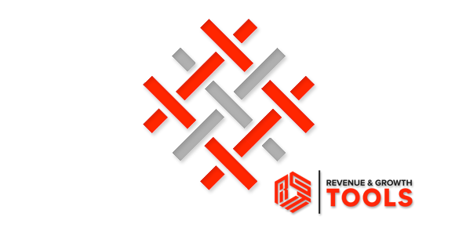
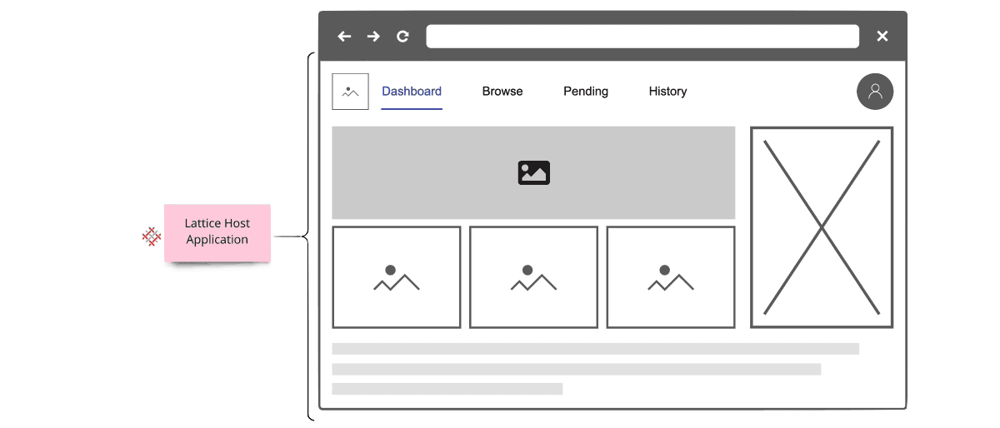
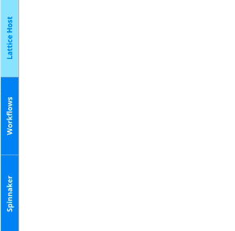
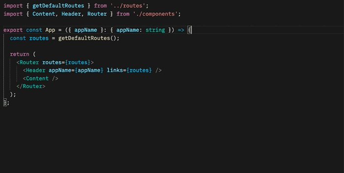
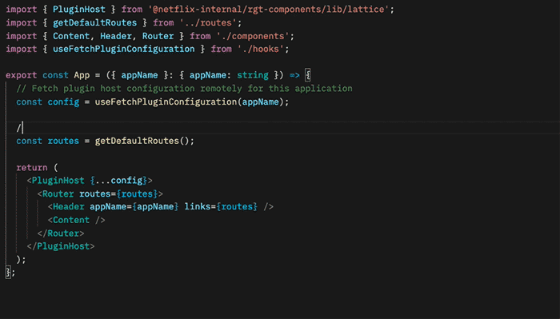
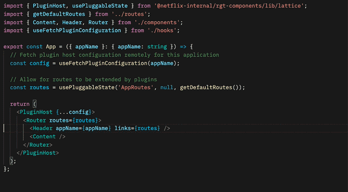
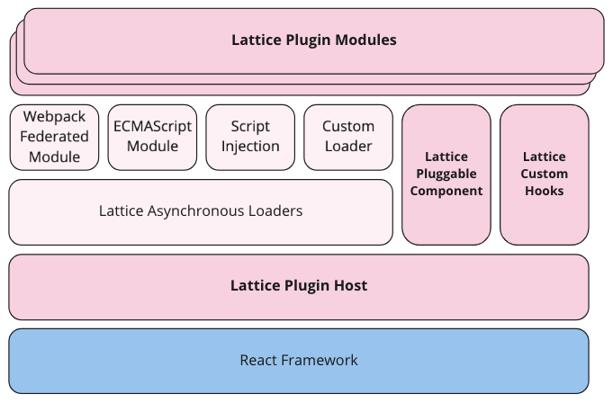
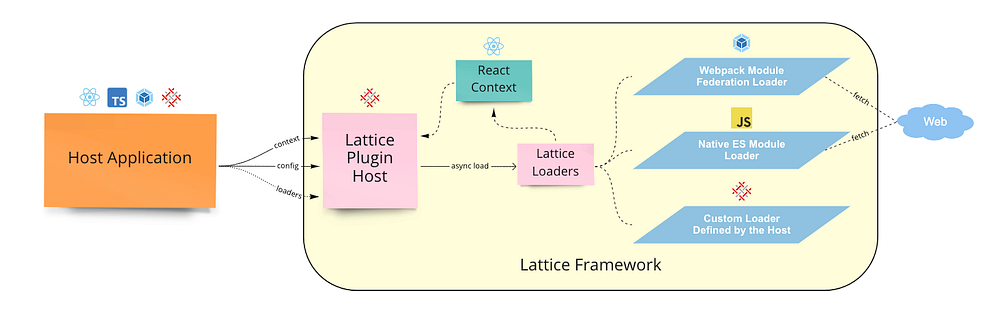
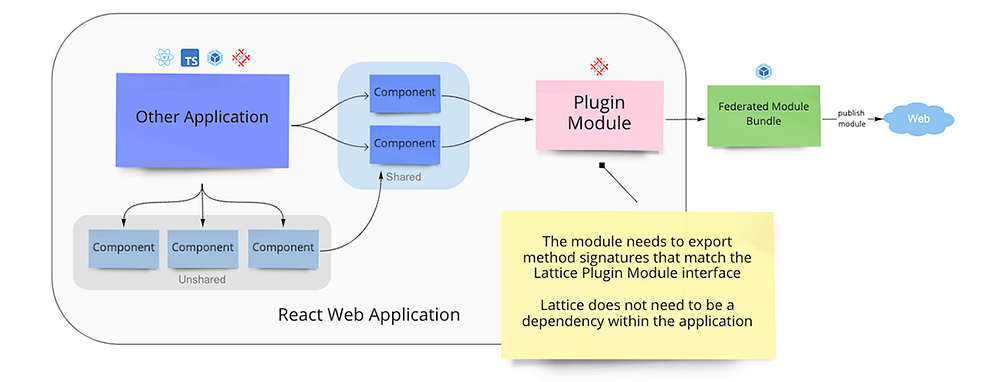

# How We Build Micro Frontends With Lattice

_Written by _[_Michael Possumato_](https://www.linkedin.com/in/michaelpossumato/)_, _[_Nick Tomlin_](https://www.linkedin.com/in/nick-tomlin-b0397636/)_, _[_Jordan Andree_](https://www.linkedin.com/in/jordanandree/)_, _[_Andrew Shim_](https://www.linkedin.com/in/andrewkshim/)_, and _[_Rahul Pilani_](https://www.linkedin.com/in/rahul-pilani/)_._

As we continue to grow here at Netflix, the needs of [Revenue and Growth Engineering](https://sites.google.com/netflix.com/revenue-growth-eng/home) are rapidly evolving; and our tools must also evolve just as rapidly. The [Revenue and Growth Tools (RGT)](./scaling-revenue-growth-tooling-87ff969d4241.md) team decided to set off on a journey to build tools in an abstract manner to have solutions readily available within our organization. We identified common design patterns and architectures scattered across various tools which were all duplicating efforts in some way or another.

We needed to consolidate these tools in a way that scaled with the teams we served. It needed to have the agility of a micro frontend and the extensibility of a framework to empower our stakeholders to extend our tools. We would abstract parts of which _anyone_ can then customize, or extend, to meet their specific business or technical requirements. The end result is **_Lattice: RGT’s pluggable framework for micro frontends_**.

## A Different Approach to Our Tools

A UI composed of other dependencies is nothing new; it’s something all modern web applications do today. The traditional approach of bundling dependencies at build time lacks the flexibility we need to empower our stakeholders. We want external dependencies to be resolved on-demand from any number of sources, from another application to an engineer’s laptop.

This led us to the following high level objectives:

- **Low Friction Adoption**: Encourage reuse of existing front end code and avoid creating new packages that encapsulate UI functionality. Applications can be difficult to manage when functionality must be shared across packages. We would leverage an approach that enabled applications to extend their core functionality using common, and familiar, React paradigms.
- **Weak Dependencies**: Host applications could reference modules over https to a remote bundle hosted internally within Netflix. These bundles could be owned by teams outside of RGT built by already adopted standards such as with [Webpack Module Federation](https://webpack.js.org/concepts/module-federation/) or [native JavaScript Modules](https://developer.mozilla.org/en-US/docs/Web/JavaScript/Guide/Modules).
- ****Highly Aligned, Loosely Coupled******: fully align with the standard frameworks and libraries used within Netflix. Plugins should be focused on delivering their core functionality without unnecessary boilerplate and have the freedom to implement without cumbersome API wrappers.**
- **Metadata Driven**: Plugin modules are defined from a configuration which could be injected at any point in the application lifecycle. The framework must be flexible enough to register, and unregister, plugins such that the extensions only apply when necessary.
- **Rapid Development**: Reduce the development cycle by avoiding unnecessary builds and deployments. Plugins would be developed in a manner in which all of the context is available to them ahead of time via TypeScript declarations. By designing to rigid interfaces defined by a host application, both the plugin and host can be developed in parallel.

## A Theoretical Example

*Example Developer Dashboard Application with Embedded Lattice Plugins*

Let’s take the above example — it renders and controls its own header and content areas to expose specific functionality to users. Upon release, we receive feedback that it would be nice if we could include information presented from other tools within this application. Using our new framework, Lattice, we are able to embed the existing functionality from the other applications.

A Lattice Plugin Host (which we’ll dive into later) allows us to extend the existing application by referencing two external plugins, Workflows and [Spinnaker](https://spinnaker.io/). In our example, we need to define two areas that can be extended — the application content for portal components and configurable routing.

The sequence of events in order to accomplish the above rendering process would be handled by three components — our new framework Lattice and the two plugins:

*Dispatch Cycle within Lattice*

First, Lattice will load both plugins asynchronously.

Next, the framework will dispatch events as they flow through the application.

In our example, Workflows will register its routes and Spinnaker will add its overlays.

## An Implementation with React

In order to accomplish the above scenario, the Host Application needs to include the Lattice library and add a new `PluginHost` with a configuration referencing the external plugins. This host requires information about the specific application and the configuration indicating which plugins to load:

*Enhancing a React Application with a Lattice Plugin Host*

We’ve mocked this implementation in the example above with a `useFetchPluginConfiguration` hook to retrieve the metadata from an external service. Owners can then choose to add or remove plugins dynamically, outside of the application source code.

Allowing plugins access to the routing can be done using hooks defined by the Lattice framework. The `usePluggableState` hook will retrieve the default application routes and pass them through the Lattice framework. If any plugin responds to this `AppRoutes` identifier, they can choose to inject their specific routes:

*Extending Existing Application State with Lattice Hooks*

Plugins can inject any React element into the page with the`<Pluggable />` component as illustrated below. This will allow plugins to render within this `AppContent` area:

*Rendering Custom Children with Lattice Pluggable*

The final example application snippet has been included below:

## Under the Hood

> Lattice is a tiny framework that provides an abstraction layer for React web applications to leverage.

Using Lattice, developers can focus on their core product, and simply wrap areas of their application that are customizable by external plugins. Developers can also extend components to use external state by using Lattice hooks.

**_Lattice Plugin Modules_** are JavaScript functions implemented by remote applications. These functions act as the “glue” between the host application and the remote component(s) being shared. Modules declare which components within their application should be exposed and how they should be rendered based on information the host provides.

A **_Lattice Pluggable Component_** allows a host application to expose a mount point through a standard React component that plugins can manipulate or override with their own content.

**_Lattice Custom Hooks_** are used to manipulate state using a [state reducer pattern](https://reactjs.org/docs/hooks-reference.html#usereducer). These hooks allow host applications to maintain their own initial state, and modify accordingly, while also allowing plugins the opportunity to inject their own data.

## Lattice Plugins

*Lattice Functionality within a Host Application*

The core of Lattice provides the ability to asynchronously load remote modules via [Webpack Module Federation](https://webpack.js.org/concepts/module-federation/), [Native ES Modules](https://developer.mozilla.org/en-US/docs/Web/JavaScript/Guide/Modules), or a custom implementation defined outside of the framework. The host application provides Lattice with basic application context and a configuration which defines the remote plugin modules to load. Once loaded, references to these plugins are stored internally within a React Context instance.

*Exposing Functionality to Lattice as a Federated Module*

Plugin modules can then provide new functionality, or change existing functionality, to the host application. Standard identifiers are used that all Lattice-enabled applications should implement to allow plugins to universally work across different applications. Most extensions will choose to extend existing application functionality, which will not be universal, and requires knowledge of the host’s design.

Lattice requires constant `identifier` values (aka “magic strings”) to understand what is being rendered. The** Lattice Plugin Host** will dispatch this identifier through all of the plugins which have been registered and loaded. Plugin responses are composed together, and the final returned value is what gets rendered in the component tree. Through this model, plugins can decide to extend, change, or simply ignore the event. Think of this process as an approach similar to that of [Redux](https://redux.js.org/usage/structuring-reducers/basic-reducer-structure) or [Express Middleware functions](https://expressjs.com/en/guide/writing-middleware.html).

Lattice can also be used to extend existing application functionality. In order to accomplish this, Plugins must be aware of the host identifiers and data shapes used in the host application lifecycle. While this might sound like an impossible task to maintain, we encourage host applications to publish a TypeScript declarations project which is shared between the host and plugins. Think of us as having a [DefinitelyTyped](https://github.com/DefinitelyTyped/DefinitelyTyped) repository for all of the Netflix internal tools that embrace extending via Lattice.

Using this approach, we are able to provide developers with a highly aligned, loosely coupled development environment shared between host applications and plugins. Plugins can be developed in a silo, simply adhering to the interface which has been declared.

## The Possibilities are Endless

While our original approach was to extend core functionality within an application, we have found that we are able to leverage Lattice in other ways. The concept of writing a simple `if` statement has been replaced; we take a step back, and consider which domain in our organization should be responsible for said logic and consider moving the logic into their respective plugin.

We have also found that we can easily model more fine-grained areas within an application. For example, we can render individual form components using Lattice identifiers and have plugins be responsible for the specific UI elements. This empowers us to build these generic tools backed by metadata models and a default out-of-box experience which others can choose to override.

Most importantly, we are able to easily, and quickly, respond to conflicting requirements by simply implementing different plugins.

## What’s Next?

We are only getting started with Lattice and currently gauging interest internally from other teams. By [dogfooding](https://en.wikipedia.org/wiki/Eating_your_own_dog_food) our approach within RGT, we can work out the kinks, squash some bugs, and build a robust process for building micro frontends with Lattice. The developer experience is crucial for Lattice to be successful. Empowering developers with the ability to understand the lifecycle of Lattice events within an application, verify functionality prior to deployments, versioning, developing end-to-end test suites, and general best practices are some nuggets critical to our success.

---
**Tags:** Micro Frontends · React · Webpack · JavaScript · Typescript
