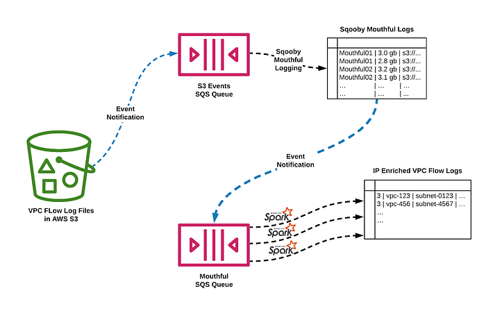

# How Netflix is able to enrich VPC Flow Logs at Hyper Scale to provide Network Insight

By [Hariharan Ananthakrishnan](https://www.linkedin.com/in/haananth/) and [Angela Ho](https://www.linkedin.com/in/hangelaho/)

The Cloud Network Infrastructure that Netflix utilizes today is a large distributed ecosystem that consists of specialized functional tiers and services such as DirectConnect, VPC Peering, Transit Gateways, NAT Gateways, etc. While we strive to keep the ecosystem simple, the inherent nature of leveraging a variety of technologies will lead us to complications and challenges such as:

- **App Dependencies and Data Flow Mappings: **Without understanding and having visibility into an application’s dependencies and data flows, it is difficult for both service owners and centralized teams to identify systemic issues.
- **Pathway Validation: **Netflix velocity of change within the production streaming environment can result in the inability of services to communicate with other resources.
- **Service Segmentation: **The ease of the cloud deployments has led to the organic growth of multiple AWS accounts, deployment practices, interconnection practices, etc. Without having network visibility, it’s not possible to improve our reliability, security and capacity posture.
- **Network Availability: **The expected continued growth of our ecosystem makes it difficult to understand our network bottlenecks and potential limits we may be reaching.

**Cloud Network Insight **is a suite of solutions that provides both operational and analytical insight into the Cloud Network Infrastructure to address the identified problems. By collecting, accessing and analyzing network data from a variety of sources like VPC Flow Logs, ELB Access Logs, Custom Exporter Agents, etc, we can provide Network Insight to users through multiple data visualization techniques like [Lumen](./lumen-custom-self-service-dashboarding-for-netflix-8c56b541548c.md), [Atlas](https://github.com/Netflix/atlas), etc.

## VPC Flow Logs

[VPC Flow Logs](https://docs.aws.amazon.com/vpc/latest/userguide/flow-logs.html) is an AWS feature that captures information about the IP traffic going to and from network interfaces in a VPC. At Netflix we publish the Flow Log data to Amazon S3. Flow Logs are enabled tactically on either a VPC or subnet or network interface. A [flow log record](https://docs.aws.amazon.com/vpc/latest/userguide/flow-logs.html#flow-log-records) represents a network flow in the VPC. By default, each record captures a network internet protocol (IP) traffic flow (characterized by a 5-tuple on a per network interface basis) that occurs within an aggregation interval.

```
version vpc-id subnet-id instance-id interface-id account-id type srcaddr dstaddr srcport dstport pkt-srcaddr pkt-dstaddr protocol bytes packets start end action tcp-flags log-status
3 vpc-12345678 subnet-012345678 i-07890123456 eni-23456789 123456789010 IPv4 52.213.180.42 10.0.0.62 43416 5001 52.213.180.42 10.0.0.62 6 568 8 1566848875 1566848933 ACCEPT 2 OK
```

The IP addresses within the Cloud can move from one EC2 instance or [Titus](https://netflix.github.io/titus/) container to another over time. To understand the attributes of each IP back to an application metadata Netflix uses [Sonar](https://www.slideshare.net/AmazonWebServices/a-day-in-the-life-of-a-cloud-network-engineer-at-netflix-net303-reinvent-2017). Sonar is an IPv4 and IPv6 address identity tracking service. VPC Flow Logs are enriched using IP Metadata from Sonar as it is ingested.

With a large ecosystem at Netflix, we receive hundreds of thousands of VPC Flow Log files in S3 each hour. And in order to gain visibility into these logs, we need to somehow ingest and enrich this data.

## So how do we ingest all these s3 files?

At Netflix, we have the option to use Spark as our distributed computing platform. It is easier to tune a large Spark job for a consistent volume of data. As you may know, [S3 can emit messages](https://docs.aws.amazon.com/AmazonS3/latest/dev/NotificationHowTo.html) when events (such as a file creation events) occur which can be directed into an AWS SQS queue. In addition to the s3 object path, these events also conveniently include file size which allows us to intelligently decide how many messages to grab from the SQS queue and when to stop. What we get is a group of messages representing a set of s3 files which we humorously call “Mouthfuls”. In other words, we are able to ensure that our Spark app does not “eat” more data than it was tuned to handle.

We named this library Sqooby. It works well for other pipelines that have thousands of files landing in s3 per day. But how does it hold up to the likes of Netflix VPC Flow Logs that has volumes which are orders of magnitude greater? It didn’t. The primary limitation was that AWS SQS queues have a limit of 120 thousand in-flight messages. We found ourselves needing to hold more than 120 thousand messages in flight at a time in order to keep up with the volumes of files.

## Requirements

There are multiple ways you can solve this problem and many technologies to choose from. As with any sustainable engineering design, focusing on simplicity is very important. This means using existing infrastructure and established patterns within the Netflix ecosystem as much as possible and minimizing the introduction of new technologies.

Equally important is the resilience, recoverability, and supportability of the solution. A malformed file should not hold up or back up the pipeline (resilience). If unexpected environmental factors cause the pipeline to get backed up, it should be able to recover by itself. And excellent logging is needed for debugging purposes and supportability. These characteristics allow for an on-call response time that is relaxed and more in line with traditional big data analytical pipelines.

## Hyper Scale

At Netflix, our [culture](https://jobs.netflix.com/culture) gives us the freedom to decide how we solve problems as well as the responsibility of maintaining our solutions so that we may choose wisely. So how did we solve this scale problem that meets all of the above requirements? By applying existing established patterns in our ecosystem on top of Sqooby. In this case, it’s a pattern which generates events (directed into another AWS SQS queue) whenever data lands in a table in a datastore. These events represent a specific cut of data from the table.

We applied this pattern to the Sqooby log tables which contained information about s3 files for each Mouthful. What we got were events that represented Mouthfuls. Spark could look up and retrieve the data in the s3 files that the Mouthful represented. This intermediate step of persisting Mouthfuls allowed us to easily “eat” through S3 event SQS messages at great speed, converting them to far fewer Mouthful SQS Messages which would each be consumed by a single Spark app instance. Because we ensured that our ingestion pipeline could concurrently write/append to the final VPC Flow Log table, this meant that we could scale out the number of Spark app instances we spin up.



## Tuning for Hyper Scale

On this journey of ingesting VPC flow logs, we found ourselves tweaking configurations in order to tune throughput of the pipeline. We modified the size of each Mouthful and tuned the number of Spark executors per Spark app while being mindful of cluster capacity. We also adjusted the frequency in which Spark app instances are spun up such that any backlog would burn off during a trough in traffic.

## Summary

Providing Network Insight into the Cloud Network Infrastructure using VPC Flow Logs at hyper scale is made possible with the Sqooby architecture. After several iterations of this architecture and some tuning, Sqooby has proven to be able to scale.

We are currently ingesting and enriching hundreds of thousands of VPC Flow Logs S3 files per hour and providing visibility into our cloud ecosystem. The enriched data allows us to analyze networks across a variety of dimensions (e.g. availability, performance, and security), to ensure applications can effectively deliver their data payload across a globally dispersed cloud-based ecosystem.

## Special Thanks To

[Bryan Keller](https://www.linkedin.com/in/bryankeller2/), [Ryan Blue](https://www.linkedin.com/in/rdblue/)

---
**Tags:** Netflix · Big Data · Cloud Networking · Data Engineering · Cloud Infrastructure
