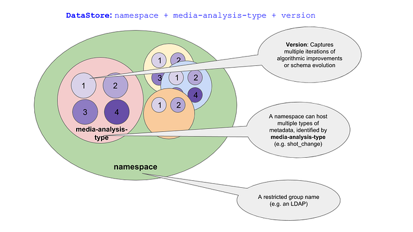
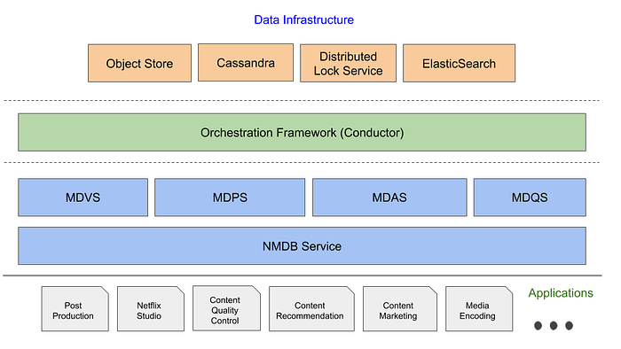
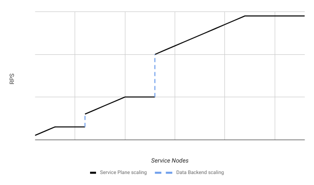
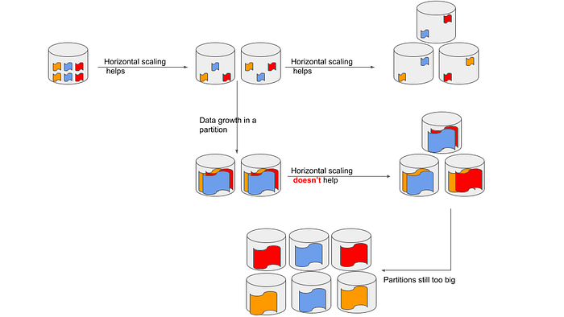
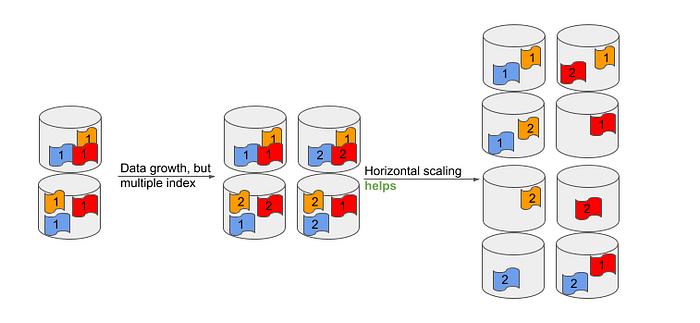
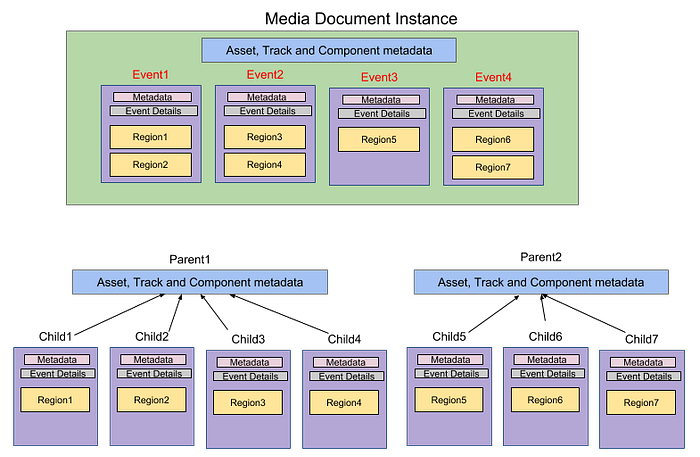

# Implementing the Netflix Media Database

In the previous blog posts in this series, we introduced the [**N**etflix **M**edia **D**ata**B**ase](https://medium.com/netflix-techblog/the-netflix-media-database-nmdb-9bf8e6d0944d) (**_NMDB_**) and its salient [“Media Document”](https://medium.com/netflix-techblog/netflix-mediadatabase-media-timeline-data-model-4e657e6ffe93) data model. In this post we will provide details of the NMDB system architecture beginning with the system requirements — these will serve as the necessary motivation for the architectural choices we made. A fundamental requirement for any lasting data system is that it should scale along with the growth of the business applications it wishes to serve. NMDB is built to be a highly scalable, multi-tenant, media metadata **system** that can serve a high volume of write/read throughput as well as support near real-time queries. At any given time there could be several applications that are trying to persist data about a media asset (e.g., image, video, audio, subtitles) and/or trying to harness that data to solve a business problem.

Some of the essential elements of such a data system are (a) reliability and availability — under varying load conditions as well as a wide variety of access patterns; (b) scalability — persisting and serving large volumes of media metadata and scaling in the face of bursty requests to serve critical backend systems like media encoding, (c) extensibility — supporting a demanding list of features with a growing list of Netflix business use cases, and (d) consistency — data access semantics that guarantee repeatable data read behavior for client applications. The following section enumerates the key traits of NMDB and how the design aims to address them.

## System Requirements

### Support for Structured Data

The growth of [NoSQL](https://en.wikipedia.org/wiki/NoSQL) databases has broadly been accompanied with the trend of data “schemalessness” (e.g., key value stores generally allow storing any data under a key). A schemaless system appears less imposing for application developers that are producing the data, as it (a) spares them from the burden of planning and future-proofing the structure of their data and, (b) enables them to evolve data formats with ease and to their liking. However, schemas are implicit in a schemaless system as the code that reads the data needs to account for the structure and the variations in the data (“schema-on-read”). This places a burden on applications that wish to consume that supposed treasure trove of data and can lead to strong coupling between the system that writes the data and the applications that consume it. For this reason, we have implemented NMDB as a “schema-on-write” system — data is validated against schema at the time of writing to NMDB. This provides several benefits including (a) schema is akin to an API contract, and multiple applications can benefit from a well defined contract, (b) data has a uniform appearance and is amenable to defining queries, as well as Extract, Transform and Load (ETL) jobs, (c) facilitates better data interoperability across myriad applications and, (d) optimizes storage, indexing and query performance thereby improving Quality of Service (QoS). Furthermore, this facilitates high data read throughputs as we do away with complex application logic at the time of reading data.

A critical component of a “schema-on-write” system is the module that ensures sanctity of the input data. Within the NMDB system, **M**edia **D**ata **V**alidation **S**ervice (**_MDVS_**), is the component that makes sure the data being written to NMDB is in compliance with an aforementioned schema. MDVS also serves as the storehouse and the manager for the data schema itself. As was noted in the [previous post](https://medium.com/netflix-techblog/netflix-mediadatabase-media-timeline-data-model-4e657e6ffe93), data schema could itself evolve over time, but all the data, ingested hitherto, has to remain compliant with the latest schema. MDVS ensures this by applying meticulous treatment to schema modification ensuring that any schema updates are fully compatible with the data already in the system.

### Multi-tenancy and Access Control

We envision NMDB as a system that helps foster innovation in different areas of Netflix business. Media data analyses created by an application developed by one team could be used by another application developed by another team without friction. This makes multi-tenancy as well as access control of data important problems to solve. All NMDB APIs are authenticated (AuthN) so that the identity of an accessing application is known up front. Furthermore, NMDB applies authorization (AuthZ) filters that whitelists applications or users for certain actions, e.g., a user or application could be whitelisted for read/write/query or a more restrictive read-only access to a certain media metadata.

In NMDB we think of the media metadata universe in units of “DataStores”. A specific media analysis that has been performed on various media assets (e.g., loudness analysis for all audio files) would be typically stored within the same **D**ata**S**tore (**DS**). while different types of media analyses (e.g., video shot boundary and video face detection) for the same media asset typically would be persisted in different DataStores. A DS helps us achieve two very important purposes (a) serves as a logical namespace for the same media analysis for various media assets in the Netflix catalog, and (b) serves as a unit of access control — an application (or equivalently a team) that defines a DataStore also configures access permissions to the data. Additionally, as was described in the [previous blog article](https://medium.com/netflix-techblog/netflix-mediadatabase-media-timeline-data-model-4e657e6ffe93), every DS is associated with a schema for the data it stores. As such, a DS is characterized by the three-tuple (1) a namespace, (2) a media analysis type (e.g., video shot boundary data), and (3) a version of the media analysis type (different versions of a media analysis correspond to different data schemas). This is depicted in Figure 1.

*Figure 1: NMDB DataStore semantics*

We have chosen the namespace portion of a DS definition to correspond to an [LDAP](https://en.wikipedia.org/wiki/Lightweight_Directory_Access_Protocol) group name. NMDB uses this to bootstrap the self-servicing process, wherein members of the LDAP group are granted “_admin_” privileges and may perform various operations (like creating a DS, deleting a DS) and managing access control policies (like adding/removing “_writers_” and “_readers_”). This allows for a seamless self-service process for creating and managing a DS. The notion of a DS is thus key to the ways we support multi-tenancy and fine grained access control.

### Integration with other Netflix Systems

In the Netflix microservices environment, different business applications serve as the system of record for different media assets. For example, while playable media assets such as video, audio and subtitles for a title could be managed by a “playback service”, promotional assets such as images or video trailers could be managed by a “promotions service”. NMDB introduces the concept of a “**M**edia**ID**” (**_MID_**) to facilitate integration with these disparate asset management systems. We think of MID as a foreign key that points to a Media Document instance in NMDB. Multiple applications can bring their domain specific identifiers/keys to address a Media Document instance in NMDB. We implement MID as a map from _strings_ to _strings_. Just like the media data schema, an NMDB DS is also associated with a single MID schema. However unlike the media data schema, MID schema is immutable. At the time of the DS definition, a client application could define a set of (name, value) pairs against which all of the Media Document instances would be stored in that DS. A MID handle could be used to fetch documents within a DS in NMDB, offering convenient access to the most recent or all documents for a particular media asset.

### SLA Guarantees

NMDB serves different logically tiered business applications some of which are deemed to be more business critical than others. The Netflix media transcoding sub-system is an example of a business critical application. Applications within this sub-system have stringent consistency, durability and availability needs as a large swarm of microservices are at work generating content for our customers. A failure to serve data with low latency would stall multiple pipelines potentially manifesting as a knock-on impact on secondary backend services. These business requirements motivated us to incorporate **_immutability_** and **_read-after-write_** consistency as fundamental precepts while persisting data in NMDB.

We have chosen the high data capacity and high performance Cassandra (C*) database as the backend implementation that serves as the source of truth for all our data. A front-end service, known as **M**edia **D**ata **P**ersistence **S**ervice (**_MDPS_**), manages the C* backend and serves data at blazing speeds (latency in the order of a few tens of milliseconds) to power these business critical applications. MDPS uses local quorum for reads and writes to guarantee read-after-write consistency. Data immutability helps us sidestep any conflict issues that might arise from concurrent updates to C* while allowing us to perform IO operations at a very fast clip. We use a [UUID](https://en.wikipedia.org/wiki/Universally_unique_identifier) as the primary key for C*, thus giving every write operation (a MID + a Media Document instance) a unique key and thereby avoiding write conflicts when multiple documents are persisted against the same MID. This UUID (also called as DocumentID) also serves as the primary key for the Media Document instance in the context of the overall NMDB system. We will touch upon immutability again in later sections to show how we also benefited from it in some other design aspects of NMDB.

### Flexibility of Queries

The pivotal benefit of data modeling and a “schema-on-write” system is query-ability. Technical metadata residing in NMDB is invaluable to develop new business insights in the areas of content recommendations, title promotion, machine assisted content quality control (QC), as well as user experience innovations. One of the primary purposes of NMDB is that it can serve as a data warehouse. This brings the need for indexing the data and making it available for queries, without a priori knowledge of all possible query patterns.

In principle, a graph database can answer arbitrary queries and promises optimal query performance for joins. For that reason, we explored a graph-like data-model so as to address our query use cases. However, we quickly learnt that our primary use case, which is [spatio-temporal queries on the media timeline](https://medium.com/netflix-techblog/netflix-mediadatabase-media-timeline-data-model-4e657e6ffe93), made limited use of database joins. And in those queries, where joins were used, the degree of connectedness was small. In other words the power of graph-like model was underutilized. We concluded that for the limited join query use-cases, application side joins might provide satisfactory performance and could be handled by an application we called **M**edia **D**ata **Q**uery **S**ervice (**_MDQS_**). Further, another pattern of queries emerged — searching unstructured textual data e.g., mining movie scripts data and subtitle search. It became clear to us that a document database with search capabilities would address most of our requirements such as allowing a plurality of metadata, fast paced algorithm development, serving unstructured queries and also structured queries even when the query patterns are not known a priori.

[Elasticsearch](https://www.elastic.co/products/elasticsearch) (ES), a highly performant scalable document database implementation fitted our needs really well. ES supports a wide range of possibilities for queries and in particular shines at unstructured textual search e.g., searching for a culturally sensitive word in a subtitle asset that needs searching based on a stem of the word. At its core ES uses [Lucene](https://lucene.apache.org/) — a powerful and feature rich indexing and searching engine. A front-end service, known as **M**edia **D**ata **A**nalysis **S**ervice (**_MDAS_**), manages the NMDB ES backend for write and query operations. MDAS implements several optimizations for answering queries and indexing data to meet the demands of storing documents that have varying characteristics and sizes. This is described more in-depth later in this article.

## A Data System from Databases

As indicated above, business requirements mandated that NMDB be implemented as a system with multiple microservices that manage a polyglot of DataBases (DBs). The different constituent DBs serve complementary purposes. We are however presented with the challenge of keeping the data consistent across them in the face of the classic distributed systems shortcomings — sometimes the dependency services can fail, sometimes service nodes can go down or even more nodes added to meet a bursty demand. This motivates the need for a robust orchestration service that can (a) maintain and execute a state machine, (b) retry operations in the event of transient failures, and (c) support asynchronous (possibly long running) operations such as queries. We use the [Conductor](https://github.com/Netflix/conductor) orchestration framework to coordinate and execute workflows related to the NMDB Create, Read, Update, Delete (CRUD) operations and for other asynchronous operations such as querying. Conductor helps us achieve a high degree of service availability and data consistency across different storage backends. However, given the collection of systems and services that work in unison it is not possible to provide strong guarantees on data consistency and yet remain highly available for certain use cases, implying data read skews are not entirely avoidable. This is true in particular for query APIs — these rely on successful indexing of Media Document instances which is done as an asynchronous, background operation in ES. Hence queries on NMDB are expected to be eventually consistent.

*Figure 2: Block diagram of NMDB system*

Figure 2 shows the NMDB system block diagram. A front end service that shares its name with the NMDB system serves as the gateway to all CRUD and query operations. Read APIs are performed synchronously while write and long running query APIs are managed asynchronously through Conductor workflows. Circling back to the point of data immutability that was discussed previously — another one of its benefits is that it preserves all writes that could occur e.g., when a client or the Conductor framework retries a write perhaps because of transient connection issues. While this does add to data footprint but the benefits such as (a) allowing for lockless retries, (b) eliminating the need for resolving write conflicts and (c) mitigating data loss, far outweigh the storage costs.

Included in Figure 2 is a component named Object Store that is a part of the NMDB data infrastructure. Object Store is a highly available, web-scale, secure storage service such as [Amazon’s Simple Storage Service (S3)](https://docs.aws.amazon.com/s3/index.html#lang/en_us). This component ensures that all data being persisted is chunked and encrypted for optimal performance. It is used in both write and read paths. This component serves as the primary means for exchanging Media Document instances between the various components of NMDB. Media Document instances can be large in size (several hundreds of MBs — perhaps because a media analysis could model metadata e.g., about every frame in a video file. Further, the per frame data could explode in size due to some modeling of spatial attributes such as bounding boxes). Such a mechanism optimizes bandwidth and latency performance by ensuring that Media Document instances do not have to travel over the wire between the different microservices involved in the read or the write path and can be downloaded only where necessary.

## NMDB in Action

While the previous sections discussed the key architectural traits, in this section we dive deeper into the NMDB implementation.

### Writing data into NMDB

*Figure 3: Writing a Media Document Instance to NMDB*

The animation shown in Figure 3 details the machinery that is set in action when we write into NMDB. The write process begins with a client application that communicates its intent to write a Media Document instance. NMDB accepts the write request by submitting the job to the orchestration framework (Conductor) and returns a unique handle to identify the request. This could be used by the client to query on the status of the request. Following this, the schema validation, document persistence and document indexing steps are performed in that order. Once the document is persisted in C* it becomes available for read with strong consistency guarantees and is ready to be used by read-only applications. Indexing a document into ES can be a high latency operation since it is a relatively more intensive procedure that requires multiple processes coordinating to analyze the document contents, and update several data structures that enable efficient search and queries.

Also, noteworthy is the use of an Object store to optimize IO across service components (as was discussed earlier). NMDB leverages a cloud storage service (e.g., [AWS S3 service](https://aws.amazon.com/s3/)) to which a client first uploads the Media Document instance data. For each write request to NMDB, NMDB generates a Type-IV UUID that is used to compose a key. The key in turn is used to compose a unique URL to which the client uploads the data it wishes to write into NMDB. This URL is then passed around as a reference for the Media Document instance data.

**Scaling Strategies**

From the perspective of writing to NMDB, some of the NMDB components are compute heavy while some others are IO heavy. For example, the bottle neck for MDVS is CPU as well as memory (as it needs to work with large documents for validation). On the other hand MDAS is bound by network IO as well (Media Document instances need to be downloaded from NMDB Object Store to MDAS so that they can be indexed). Different metrics can be used to configure a continuous deployment platform, such as [Spinnaker](https://www.spinnaker.io/) for load balancing and auto-scaling for NMDB. For example, “requests-per-second” (RPS) is commonly used to auto-scale micro services to serve increased reads or queries. While RPS or CPU usage could be useful metrics for scaling synchronous services, asynchronous APIs (like storing a document in NMDB) bring in the requirement of monitoring queue depth to anticipate work build up and scale accordingly.

*Figure 4: Scaling the NMDB service plane*

The strategy discussed above gives us a good way to auto-scale the NMDB micro services layer (identified as “Service Plane” in Figure 4) quasi-linearly. However as seen in Figure 4, the steady state RPS that the system can support eventually plateaus at which point scaling the Service Plane does not help improve SLA. At this point it should be amply clear that the data nodes (identified as “Data Backend”) have reached their peak performance limits and need to be scaled. However, distributed DBs do not scale as quickly as services and horizontal or vertical scaling may take a few hours to days, depending on data footprint size. Moreover, while scaling the Service Plane can be an automated process, adding more data nodes (C* or ES) to scale the Data Backend is typically done manually. However, note that once the Data Backend is scaled up (horizontal and/or vertically), the effects of scaling the Service Plane manifests as an increased steady state RPS as seen in Figure 4.

An important point related to scaling data nodes, which is worth mentioning is the key hashing strategy that each DB implements. C* employs consistent key hashing and hence adding a node distributes the data uniformly across nodes. However, ES deploys a modulus based distributed hashing. Here adding a data node improves distribution of shards across the available nodes, which does help alleviate query/write bottlenecks to an extent. However, as the size of shards grow over time, horizontal scaling might not help improve query/write performance as shown in Figure 5.

*Figure 5: ES scaling strategy*

ES mandates choosing the number of shards for every index at the time of creating an index, which cannot be modified without going through a reindexing step which is expensive and time consuming for large amounts of data. A fixed pre-configured shard size strategy could be used for timed data such as logs, where new shards could be created while older shards are discarded. However, this strategy cannot be employed by NMDB since multiple business critical applications could be using the data, in other words data in NMDB needs to be durable and may not ever be discarded. However, as discussed above large shard sizes affect query performance adversely. This calls for some application level management for relocating shards into multiple indices as shown in Figure 6.

*Figure 6: Creating new ES indices over time*

Accordingly, once an index grows beyond a threshold, MDAS creates a different index for the same NMDB DS, thereby allowing indices to grow over time and yet keeping the shard size within a bound for optimal write/query performance. ES has a feature called index aliasing that is particularly helpful for alleviating performance degradation that is caused due to large shard sizes which is suitable for the scenario we explained. An index alias could point to multiple indices and serve queries by aggregating search results across all the indices within the alias.

### Indexing Data in NMDB at Scale

A single Media Document instance could be large ranging from hundreds of MBs to several GBs. Many document databases (including ES) have a limit on the size of a document after which DB performance degrades significantly. Indexing large documents can present other challenges on a data system such as requiring high network I/O connections, increased computation and memory costs, high indexing latencies as well as other adverse effects.

In principle, we could apply the ES [parent-child relationship](https://www.elastic.co/guide/en/elasticsearch/guide/master/parent-child.html) at the various levels of the Media Document [hierarchy](https://medium.com/netflix-techblog/netflix-mediadatabase-media-timeline-data-model-4e657e6ffe93) and split up a Media Document instance into several smaller ES documents. However, the ES parent-child relationship is a two-level relationship and query performance suffers when multiple such relationships are chained together to represent a deeply nested model (the NMDB Media Document model exhibits upto five levels of nesting). Alternately, we could consider modeling it as a two-level relationship with the high cardinality entities (“Event” and “Region”) on the “child” side of the relationship. However, Media Document could contain a huge number of “Event” and “Region” entities (hundreds of thousands of Events and tens of Regions per Event are typical for an hour of content) which would result in a very large number of child documents. This could also adversely impact query performance.

To address these opposing limitations, we came up with the idea of using “[data denormalization](https://en.wikipedia.org/wiki/Denormalization)_”_. Adopting this needs more thought since data denormalization can potentially lead to data explosion. Through a process referred to as “chunking”, we split up large document payloads into multiple smaller documents prior to indexing them in ES. The smaller chunked documents could be indexed by using multiple threads of computation (on a single service node) or multiple service nodes — this results in better workload distribution, efficient memory usage, avoids hot spots and improves indexing latencies (because we are processing smaller chunks of data concurrently). We utilized this approach simultaneously with some careful decisions around what data we denormalize in order to provide optimal indexing and querying performance. More details of our implementation are presented as follows.

**Chunking Media Document Instances**

The hierarchical nature of the Media Document model (as explained in the previous [blog post](https://medium.com/netflix-techblog/netflix-mediadatabase-media-timeline-data-model-4e657e6ffe93)) requires careful consideration while chunking as it contains relationships between its entities. Figure 7 depicts the pre-processing we perform on a Media Document instance prior to indexing it in ES.

*Figure 7: An efficient strategy for indexing Media Document Instances in ES*

- Each Media Document instance is evenly split into multiple chunks with smaller size (of the order of a few MBs).
- Asset, Track and Component level information is denormalized across all the chunks and a parent document per chunk with this information is indexed in ES. This denormalization of parent document across different chunks also helps us to overcome a major limitation with ES [parent-child relationship](https://www.elastic.co/guide/en/elasticsearch/guide/master/parent-child.html), that is the parent document and all the children documents must belong to same shard.
- At the level of an event, data is denormalized across all the regions and a child document per region is indexed in ES.

This architecture allows distribution of Media Document instances across multiple nodes and speeds up indexing as well as query performance. At query time, MDAS uses a combination of different strategies depending on the query patterns for serving queries efficiently

- ES parent-child join queries are used to speed up query performance where needed.
- In another query pattern, the parent documents are queried followed by children documents and application side joins are performed in MDAS to create search results.

### Serving Queries & Analytics

As noted earlier, NMDB has a treasure trove of indexed media metadata and lots of interesting insight could be developed by analyzing it. The MDAS backend with ES forms the backbone of analytical capabilities of NMDB. In a typical analytics usage, NMDB users are interested in two types of queries:

1. A DS level query to retrieve all documents that match the specified query. This is similar to filtering of records using SQL ‘**_WHERE_**’ clause. Filtering can be done on any of the entities in a Media Document instance using various condition operators ‘=’ , ‘>’ or ‘<’ etc. Conditions can also be grouped using logic operators like OR, AND or NOT etc.
2. A more targeted query on a Media Document instance using a Document ID handle to retrieve specific portions of the document. In this query type, users can apply conditional filtering on each of the entities of a Media Document instance and retrieve matching entities.

The two query types target different use cases. Queries of the first type span an entire NMDB DS and can provide insights into which documents in a DS match the specified query. Considering the huge payload of data corresponding to Media Document instances that match a query of the first type, NMDB only returns the coordinates (DocumentID and MID) of the matching documents. The second query type can be used to target a specific Media Document instance using DocumentID and retrieve portions of the document with conditional filtering applied. For example, only a set of events that satisfy a specified query could be retrieved, along with Track and Component level metadata. While it is typical to use the two types of queries in succession, in the event where a document handle is already known one could glean more insights into the data by directly executing the second query type on a specific Media Document instance.

As explained earlier, chunking Media Document instances at the time of indexing comes very handy in optimizing queries. Since relationships between the different entities of a Media Document instance are preserved, cross-entity queries can be handled at the ES layer. For example, a Track can be filtered out based on the number of Events it contains or if it contains Events matching the specified query. The indexing strategy as explained earlier can be contrasted with the nested document approach of ES. Indexing Event and Region level information as children documents helps us output the search results more efficiently.

## What’s next

As explained in the previous blog post, the Media Document model has a [hierarchical structure](https://medium.com/netflix-techblog/netflix-mediadatabase-media-timeline-data-model-4e657e6ffe93#5e24) and offers a logical way of modeling media timeline data. However, such a hierarchical structure is not optimal for parallel processing. In particular validation (MDVS) and indexing (MDAS) services could benefit immensely by processing a large Media Document instance in parallel thereby reducing write latencies. A compositional structure for Media Document instances would be more amenable to parallel processing and therefore go a long way in alleviating the challenges posed by large Media Document instances. Briefly, such a structure implies a single media timeline is composed of multiple “smaller” media timelines, where each media timeline is represented by a corresponding “smaller” Media Document instance. Such a model would also enable targeted reads that do not require reading the entire Media Document instance.

On the query side, we anticipate a growing need for performing joins across different NMDB DataStore instances — this could be computationally intensive in some scenarios. This along with the high storage costs associated with ES is motivating us to look for other “big-data” storage solutions. As NMDB continues to be the media metadata platform of choice for applications across Netflix, we will continue to carefully consider new use cases that might need to be supported and evaluate technologies that we will need to onboard to address them. Some interesting areas of future work could involve exploring Map-Reduce frameworks such as Apache Hadoop, for distributed compute, query processing, relational databases for their transactional support, and other Big Data technologies. Opportunities abound in the area of media-oriented data systems at Netflix especially with the anticipated growth in business applications and associated data.

_— by Shinjan Tiwary, Sreeram Chakrovorthy, Subbu Venkatrav, Arsen Kostenko, Yi Guo and Rohit Puri_

---
**Tags:** Nmdb · Apache Cassandra · Elasticsearch · Media Timeline · Media Document Model
