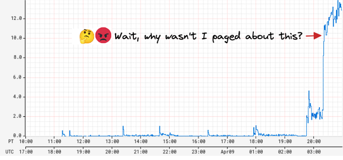
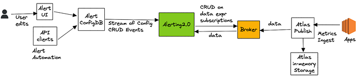
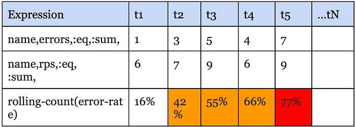
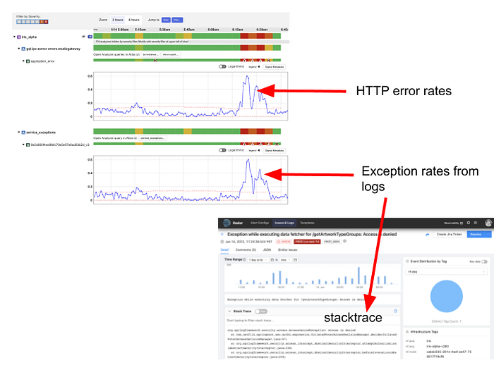

# Improved Alerting with Atlas Streaming Eval

[Ruchir Jha](https://www.linkedin.com/in/ruchir-jha-9a861616/), [Brian Harrington](https://www.linkedin.com/in/brharrington/), [Yingwu Zhao](https://www.linkedin.com/in/yingwu-zhao-62037418/)

TL;DR

- Streaming alert evaluation scales much better than the traditional approach of polling time-series databases.
- It allows us to overcome high dimensionality/cardinality limitations of the time-series database.
- It opens doors to support more exciting use-cases.



Engineers want their alerting system to be realtime, reliable, and actionable. While actionability is subjective and may vary by use-case, reliability is non-negotiable. In other words, false positives are bad but false negatives are the absolute worst!

A few years ago, we were paged by our SRE team due to our Metrics Alerting System falling behind — critical application health alerts reached engineers 45 minutes late! As we investigated the alerting delay, we found that the number of configured alerts had recently increased dramatically, by 5 times! The alerting system queried [Atlas](https://github.com/Netflix/atlas), our time series database on a cron for each configured alert query, and was seeing an elevated throttle rate and excessive retries with backoffs. This, in turn, increased the time between two consecutive checks for an alert, causing a global slowdown for all alerts. On further investigation, we discovered that one user had programmatically created tens of thousands of new alerts. This user represented a platform team at Netflix, and their goal was to build alerting automation for their users.

While we were able to put out the immediate fire by disabling the newly created alerts, this incident raised some critical concerns around the scalability of our alerting system. We also heard from other platform teams at Netflix who wanted to build similar automation for their users who, given our state at the time, wouldn’t have been able to do so without impacting Mean Time To Detect (MTTD) for all others. Rather, we were looking at an order of magnitude increase in the number of alert queries just over the next 6 months!

Since querying Atlas was the bottleneck, our first instinct was to scale it up to meet the increased alert query demand; however, we soon realized that would increase Atlas cost prohibitively. **Atlas is an in-memory time-series database that ingests multiple billions of time-series per day and retains the last two weeks of data.** It is already one of the largest services at Netflix both in size and cost. While Atlas [is architected](https://netflix.github.io/atlas-docs/overview/) around compute & storage separation, and we could theoretically just scale the query layer to meet the increased query demand, every query, regardless of its type, has a data component that needs to be pushed down to the storage layer. To serve the increasing number of push down queries, the in-memory storage layer would need to scale up as well, and it became clear that this would push the already expensive storage costs far higher. Moreover, common database optimizations like caching recently queried data don’t really work for alerting queries because, generally speaking, the last received datapoint is required for correctness. Take for example, this alert query that checks if errors as a % of total RPS exceeds a threshold of 50% for 4 out of the last 5 minutes:

```
name,errors,:eq,:sum,
name,rps,:eq,:sum,
:div,
100,:mul,
50,:gt,
5,:rolling-count,4,:gt,
```

Say if the datapoint received for the last time interval leads to a positive evaluation for this query, relying on stale/cached data would either increase MTTD or result in the perception of a false negative, at least until the missing data is fetched and evaluated. It became clear to us that we needed to solve the scalability problem with a fundamentally different approach. Hence, we started down the path of alert evaluation via real-time [streaming metrics](https://github.com/Netflix/atlas/tree/main/atlas-eval).

**High Level Architecture**

The idea, at a high level, was to avoid the need to query the Atlas database almost entirely and transition most alert queries to streaming evaluation.



Alert queries are submitted either via our Alerting UI or by API clients, which are then saved to a custom config database that supports streaming config updates (full snapshot + update notifications). The Alerting Service receives these config updates and hashes every new or updated alert query for evaluation to one of its nodes by leveraging [Edda Slots](https://netflix.github.io/edda/rest-api/#apiv2group). The node responsible for evaluating a query, starts by breaking it down into a set of “data expressions” and with them subscribes to an upstream “broker” service. Data expressions define what data needs to be sourced in order to evaluate a query. For the example query listed above, the data expressions are name,errors,:eq,:sum and name,rps,:eq,:sum. The broker service acts as a subscription manager that maps a data expression to a set of subscriptions. In addition, it also maintains a Query Index of all active data expressions which is consulted to discern if an incoming datapoint is of interest to an active subscriber. The internals here are outside the scope of this blog post.

Next, the Alerting service (via the [atlas-eval](https://github.com/Netflix/atlas/tree/main/atlas-eval) library) maps the received data points for a data expression to the alert query that needs them. For alert queries that resolve to more than one data expression, we align the incoming data points for each one of those data expressions on the same time boundary before emitting the accumulated values to the final eval step. For the example above, the final eval step would be responsible for computing the ratio and maintaining the [rolling-count](https://netflix.github.io/atlas-docs/asl/ref/rolling-count/), which is keeping track of the number of intervals in which the ratio crossed the threshold as shown below:



The atlas-eval library supports streaming evaluation for most if not all [Query](https://github.com/Netflix/atlas/wiki/Reference-query), [Data](https://github.com/Netflix/atlas/wiki/Reference-data), [Math](https://github.com/Netflix/atlas/wiki/Reference-math) and [Stateful](https://github.com/Netflix/atlas/wiki/Reference-stateful) operators supported by Atlas today. Certain operators such as [offset](https://netflix.github.io/atlas-docs/asl/ref/offset/), [integral](https://netflix.github.io/atlas-docs/asl/ref/integral/), [des](https://netflix.github.io/atlas-docs/asl/ref/des/) are not supported on the streaming path.

**OK, Results?**

First and foremost, we have successfully alleviated our initial scalability problem with the polling based architecture. Today, we run 20X the number of queries we used to run a few years ago, with ease and at a fraction of what it would have cost to scale up the Atlas storage layer to serve the same volume. Multiple platform teams at Netflix programmatically generate and maintain alerts on behalf of their users without having to worry about impacting other users of the system. We are able to maintain strong SLAs around Mean Time To Detect (MTTD) regardless of the number of alerts being evaluated by the system.

Additionally, streaming evaluation allowed us to relax restrictions around high cardinality that our users were previously running into — alert queries that were rejected by Atlas Backend before due to cardinality constraints are now getting checked correctly on the streaming path. In addition, we are able to use Atlas Streaming to monitor and alert on some very high cardinality use-cases, such as metrics derived from free-form log data.

Finally, we switched [Telltale](./telltale-netflix-application-monitoring-simplified-5c08bfa780ba.md), our holistic application health monitoring system, from polling a metrics cache to using realtime Atlas Streaming. The fundamental idea behind Telltale is to detect anomalies on SLI metrics (for example, latency, error rates, etc). When such anomalies are detected, Telltale is able to compute correlations with similar metrics emitted from either upstream or downstream services. In addition, it also computes correlations between SLI metrics and custom metrics like the log derived metrics mentioned above. This has proven to be valuable towards reducing Mean Time to Recover (MTTR). For example, we are able to now correlate increased error rates with increased rate of specific exceptions occurring in logs and even point to an exemplar stacktrace, as shown below:



Our logs pipeline fingerprints every log message and attaches a (very high cardinality) fingerprint tag to a log events counter that is then emitted to Atlas Streaming. Telltale consumes this metric in a streaming fashion to identify fingerprints that correlate with anomalies seen in SLI metrics. Once an anomaly is found, we query the logs backend with the fingerprint hash to obtain the exemplar stacktrace. What’s more is we are now able to identify correlated anomalies (and exceptions) occurring in services that may be N hops away from the affected service. A system like Telltale becomes more effective as more services are onboarded (and for that matter the full service graph), because otherwise it becomes difficult to root cause the problem, especially in a microservices-based architecture. A few years ago, as noted in this [blog](./telltale-netflix-application-monitoring-simplified-5c08bfa780ba.md), only about a hundred services were using Telltale; thanks to Atlas Streaming we have now managed to onboard thousands of other services at Netflix.

Finally, we realized that once you remove limits on the number of monitored queries, and start supporting much higher metric dimensionality/cardinality without impacting the cost/performance profile of the system, it opens doors to many exciting new possibilities. For example, to make alerts more actionable, we may now be able to compute correlations between SLI anomalies and custom metrics with high cardinality dimensions, for example an alert on elevated HTTP error rates may be able to point to impacted customer cohorts, by linking to precisely correlated exemplars. This would help developers with reproducibility.

Transitioning to the streaming path has been a long journey for us. One of the challenges was difficulty in debugging scenarios where the streaming path didn’t agree with what is returned by querying the Atlas database. This is especially true when either the data is not available in Atlas or the query is not supported because of (say) cardinality constraints. This is one of the reasons it has taken us years to get here. That said, early signs indicate that the streaming paradigm may help with tackling a cardinal problem in observability — effective correlation between the metrics & events verticals (logs, and potentially traces in the future), and we are excited to explore the opportunities that this presents for Observability in general.

---
**Tags:** Observability · Monitoring · Alerting · Netflix · Streaming
