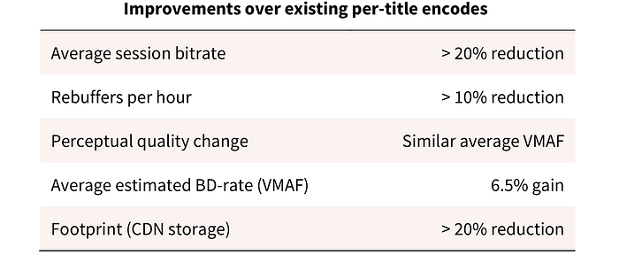

# Improving our video encodes for legacy devices

by [Mariana Afonso](https://www.linkedin.com/in/marianafafonso/), [Anush Moorthy](https://www.linkedin.com/in/anush-moorthy-b8451142/), [Liwei Guo](https://www.linkedin.com/in/liwei-guo-a5aa6311/), [Lishan Zhu](https://www.linkedin.com/in/lishan-z-51302abb/), [Anne Aaron](https://www.linkedin.com/in/anne-aaron/)

Netflix has been one of the pioneers of streaming video-on-demand content — we announced our intention to stream video over 13 years ago, in January 2007 — and have only increased both our device and content reach since then. Given the global nature of the service and Netflix’s commitment to creating a service that members enjoy, it is not surprising that we support a wide variety of streaming devices, from set-top-boxes and mobile devices to smart TVs. Hence, as the encoding team, we continuously maintain a variety of encode families, stretching back to H.263. In addition, with 193M members and counting, there is a huge diversity in the networks that stream our content as well as in our members’ bandwidth. It is, thus, imperative that we are sensible in the use of the network and of the bandwidth we require.

Together with our partner teams, our endeavor has always been to produce the best bang for the bit, and to that end, we have aggressively moved towards adopting newer codecs — [AV1](./netflix-now-streaming-av1-on-android-d5264a515202.md)** **being a recent example. These efforts allow our members to have the best viewing experience whenever they watch their favorite show or movie. However, not all members have access to the latest and greatest decoders. In fact, many stream Netflix through devices which cannot be upgraded to use the latest decoders owing to memory limitations, device upgrade cycles, etc., and thus fall back to less efficient encode families. One such encode family that has wide decoder support amongst legacy devices is our H.264/AVC Main profile family.

A few years ago, we improved on the H.264/AVC Main profile streams by employing [per-title optimizations](https://netflixtechblog.com/per-title-encode-optimization-7e99442b62a2). Since then, we have applied innovations such as [shot-based encoding](https://netflixtechblog.com/optimized-shot-based-encodes-now-streaming-4b9464204830) and newer codecs to deploy more efficient encode families. Yet, given its wide support, our H.264/AVC Main profile family still represents a substantial portion of the members viewing hours and an even larger portion of the traffic. Continuing to innovate on this family has tremendous advantages across the whole delivery infrastructure: reducing footprint at our Content Delivery Network (CDN), [Open Connect (OC)](https://media.netflix.com/en/company-blog/how-netflix-works-with-isps-around-the-globe-to-deliver-a-great-viewing-experience), the load on our partner ISPs’ networks and the bandwidth usage for our members. In this blog post, we introduce recently implemented changes to our per-title encodes that are expected to lower the bitrate streamed by over 20%, on average, while maintaining a similar level of perceived quality. These changes will be reflected in our product within the next couple of months.

## What we have improved on

Keeping in mind our goal to maintain ubiquitous device support, we leveraged what we learned from innovations implemented during the development of newer encode families and have made a number of improvements to our H.264/AVC Main profile per-title encodes. These are summarized below:

- Instead of relying on other objective metrics, such as PSNR†, [VMAF](https://netflixtechblog.com/toward-a-practical-perceptual-video-quality-metric-653f208b9652) is employed to guide optimization decisions. Given that VMAF is highly correlated with visual quality, this leads to decisions that favor encodes with higher perceived quality.
- Allowing per-chunk bitrate variations instead of using a fixed per-title bitrate, as in our [original complexity-based encoding scheme](https://netflixtechblog.com/per-title-encode-optimization-7e99442b62a2). This [multi-pass strategy](http://ieeexplore.ieee.org/document/7532605/), previously employed for our [mobile encodes](https://netflixtechblog.com/more-efficient-mobile-encodes-for-netflix-downloads-625d7b082909), allows us to avoid over-allocating bits to less complex content, as compared to using a complexity-defined, albeit fixed, bitrate for the entire title. This encoding approach improves the overall bit allocation while keeping a similar average visual quality and requires little added computational complexity.
- Improving the bitrate ladder that is generated after complexity analysis to choose points with greater intelligence than before.
- Further tuning of pre-defined encoding parameters.

† which we originally used as a quality measure, before we developed VMAF.

## Performance results

In this section, we present an overview of the performance of our new encodes compared to our existing H.264 AVC Main per-title encodes in terms of bitrate reduction, average compression efficiency improvement using [Bjontegaard-delta rate](https://www.itu.int/wftp3/av-arch/video-site/0104_Aus/VCEG-M33.doc) (BD-rate) and other relevant metrics. These figures were estimated on 200 full-length titles from our catalog and have been validated through extensive [A/B testing](https://netflixtechblog.com/a-b-testing-and-beyond-improving-the-netflix-streaming-experience-with-experimentation-and-data-5b0ae9295bdf). They are representative of the savings we expect our CDN, ISP partners, and members to see once the encodes are live.

It is important to highlight that the expected >20% reduction in average session bitrate for these encodes corresponds to a significant reduction in the overall Netflix traffic as well. These changes also lead to an improvement in [Quality-of-Experience (QoE)](https://netflixtechblog.com/a-b-testing-and-beyond-improving-the-netflix-streaming-experience-with-experimentation-and-data-5b0ae9295bdf) metrics that affect the end user experience, such as play delays (i.e. how long it takes for the video to start playing), rebuffer rates, etc., as a result of the reduction in average bitrates. In addition, footprint savings will allow more content to be stored in edge caches, thus contributing to an improved experience for our members.

## Summary

At Netflix, we strive to continuously improve the quality and reliability of our service. Our team is always looking to innovate and to find ways to improve our members’ experiences through more efficient encodes. In this tech blog, we summarized how we made improvements towards optimizing our video encodes for legacy devices with limited decoder support. These changes will result in a number of benefits for our members while maintaining perceived quality. If your preferred device is streaming one of these profiles, you’ll experience the new encodes soon — so, sit back, grab the remote, and stream away, we’ve got your back!

If you are passionate about research and would like to contribute to this field, we have an [open position](https://jobs.netflix.com/jobs/867864) in our team!

---
**Tags:** Encoding · Video Encoding · Video Quality · Netflix
