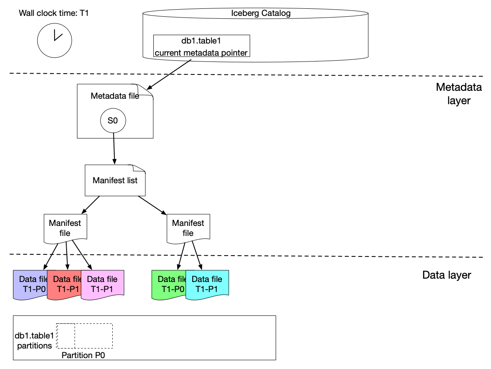
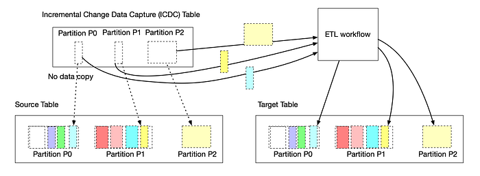
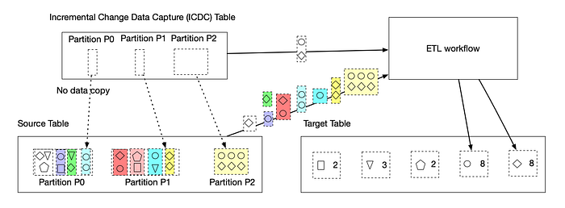
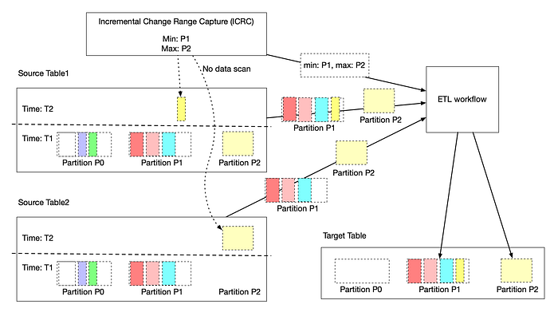
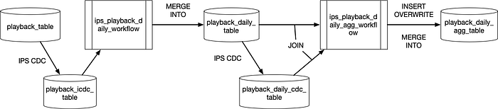
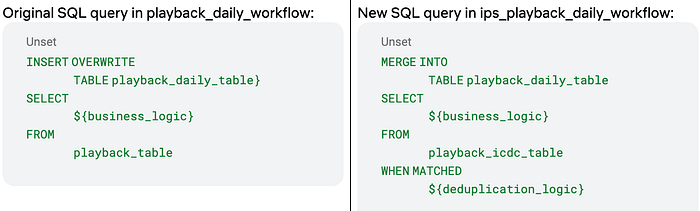
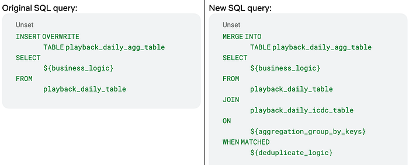

# Incremental Processing using Netflix Maestro and Apache Iceberg

by [Jun He](https://www.linkedin.com/in/jheua/), [Yingyi Zhang](https://www.linkedin.com/in/yingyi-zhang-a0a164111/), and [Pawan Dixit](https://www.linkedin.com/in/pawan-dixit-b4307b2/)

Incremental processing is an approach to process new or changed data in workflows. The key advantage is that it only incrementally processes data that are newly added or updated to a dataset, instead of re-processing the complete dataset. This not only reduces the cost of compute resources but also reduces the execution time in a significant manner. When workflow execution has a shorter duration, chances of failure and manual intervention reduce. It also improves the engineering productivity by simplifying the existing pipelines and unlocking the new patterns.

In this blog post, we talk about the landscape and the challenges in workflows at Netflix. We will show how we are building a clean and efficient incremental processing solution (IPS) by using Netflix Maestro and Apache Iceberg. IPS provides the incremental processing support with data accuracy, data freshness, and backfill for users and addresses many of the challenges in workflows. IPS enables users to continue to use the data processing patterns with minimal changes.

## Introduction

Netflix relies on data to power its business in all phases. Whether in analyzing A/B tests, optimizing studio production, training algorithms, investing in content acquisition, detecting security breaches, or optimizing payments, well structured and accurate data is foundational. As our business scales globally, the demand for data is growing and the needs for scalable low latency incremental processing begin to emerge. There are three common issues that the dataset owners usually face.

- **Data Freshness: **Large datasets from Iceberg tables needed to be processed quickly and accurately to generate insights to enable faster product decisions. The hourly processing semantics along with valid–through-timestamp watermark or data signals provided by the Data Platform toolset today satisfies many use cases, but is not the best for low-latency batch processing. Before IPS, the Data Platform did not have a solution for tracking the state and progression of data sets as a single easy to use offering. This has led to a few internal solutions such as [Psyberg](./2-diving-deeper-into-psyberg-stateless-vs-stateful-data-processing-1d273b3aaefb.md). These internal libraries process data by capturing the changed partitions, which works only on specific use cases. Additionally, the libraries have tight coupling to the user business logic, which often incurs higher migration costs, maintenance costs, and requires heavy coordination with the Data Platform team.
- **Data Accuracy:** Late arriving data causes datasets processed in the past to become incomplete and as a result inaccurate. To compensate for that, ETL workflows often use a lookback window, based on which they reprocess the data in that certain time window. For example, a job would reprocess aggregates for the past 3 days because it assumes that there would be late arriving data, but data prior to 3 days isn’t worth the cost of reprocessing.
- **Backfill:** Backfilling datasets is a common operation in big data processing. This requires repopulating data for a historical time period which is before the scheduled processing. The need for backfilling could be due to a variety of factors, e.g. (1) upstream data sets got repopulated due to changes in business logic of its data pipeline, (2) business logic was changed in a data pipeline, (3) anew metric was created that needs to be populated for historical time ranges, (4) historical data was found missing, etc.

These challenges are currently addressed in suboptimal and less cost efficient ways by individual local teams to fulfill the needs, such as

- **Lookback: **This is a generic and simple approach that data engineers use to solve the data accuracy problem. Users configure the workflow to read the data in a window (e.g. past 3 hours or 10 days). The window is set based on users’ domain knowledge so that users have a high confidence that the late arriving data will be included or will not matter (i.e. data arrives too late to be useful). It ensures the correctness with a high cost in terms of time and compute resources.
- **Foreach pattern: **Users build backfill workflows using [Maestro foreach support](./orchestrating-data-ml-workflows-at-scale-with-netflix-maestro-aaa2b41b800c.md). It works well to backfill data produced by a single workflow. If the pipeline has multiple stages or many downstream workflows, users have to manually create backfill workflows for each of them and that requires significant manual work.

The incremental processing solution (IPS) described here has been designed to address the above problems. The design goal is to provide a clean and easy to adopt solution for the Incremental processing to ensure data freshness, data accuracy, and to provide easy backfill support.

- **Data Freshness:** provide the support for scheduling workflows in a **micro batch **fashion (e.g. 15 min interval) with state tracking functionality
- **Data Accuracy:** provide the support to process all late arriving data to achieve data accuracy needed by the business with significantly improved performance in terms of multifold **time and cost efficiency**
- **Backfill: **provide managed backfill support to build, monitor, and validate the backfill, including automatically propagating changes from upstream to downstream workflows, to greatly improve **engineering productivity** (i.e. a few days or weeks of engineering work to build backfill workflows vs one click for managed backfill)

## Approach Overview

### General Concept

**Incremental processing** is an approach to process data in batch — but only on new or changed data. To support incremental processing, we need an approach for not only capturing incremental data changes but also tracking their states (i.e. whether a change is processed by a workflow or not). It must be aware of the change and can capture the changes from the source table(s) and then keep tracking those changes. Here, changes mean more than just new data itself. For example, a row in an aggregation target table needs all the rows from the source table associated with the aggregation row. Also, if there are multiple source tables, usually the union of the changed data ranges from all input tables gives the full change data set. Thus, change information captured must include all related data including those unchanged rows in the source table as well. Due to previously mentioned complexities, change tracking cannot be simply achieved by using a single watermark. IPS has to track those captured changes in finer granularity.

**The changes from the source tables might affect the transformed result in the target table in various ways.**

- If one row in the target table is derived from one row in the source table, newly captured data change will be the complete input dataset for the workflow pipeline.
- If one row in the target table is derived from multiple rows in the source table, capturing new data will only tell us the rows have to be re-processed. But the dataset needed for ETL is beyond the change data itself. For example, an aggregation based on account id requires all rows from the source table about an account id. The change dataset will tell us which account ids are changed and then the user business logic needs to load all data associated with those account ids found in the change data.
- If one row in the target table is derived based on the data beyond the changed data set, e.g. joining source table with other tables, newly captured data is still useful and can indicate a range of data to be affected. Then the workflow will re-process the data based on the range. For example, assuming we have a table that keeps the accumulated view time for a given account partitioned by the day. If the view time 3-days ago is updated right now due to late arriving data, then the view time for the following two days has to be re-calculated for this account. In this case, the captured late arriving data will tell us the start of the re-calculation, which is much more accurate than recomputing everything for the past X days by guesstimate, where X is a cutoff lookback window decided by business domain knowledge.

Once the change information (data or range) is captured, a workflow has to write the data to the target table in a slightly more complicated way because the simple **INSERT OVERWRITE** mechanism won’t work well. There are two alternatives:

- **Merge pattern:** In some compute frameworks, e.g. Spark 3, it supports MERGE INTO to allow new data to be merged into the existing data set. That solves the write problem for incremental processing. Note that the workflow/step can be safely restarted without worrying about duplicate data being inserted when using MERGE INTO.
- **Append pattern:** Users can also use append only write (e.g. INSERT INTO) to add the new data to the existing data set. Once the processing is completed, the append data is committed to the table. If users want to re-run or re-build the data set, they will run a backfill workflow to completely overwrite the target data set (e.g. INSERT OVERWRITE).

Additionally, the IPS will naturally support the backfill in many cases. Downstream workflows (if there is no business logic change) will be triggered by the data change due to backfill. This enables auto propagation of backfill data in multi-stage pipelines. Note that the backfill support is skipped in this blog. We will talk about IPS backfill support in another following blog post.

### Netflix Maestro

[Maestro](./orchestrating-data-ml-workflows-at-scale-with-netflix-maestro-aaa2b41b800c.md) is the Netflix data workflow orchestration platform built to meet the current and future needs of Netflix. It is a general-purpose workflow orchestrator that provides a fully managed workflow-as-a-service (WAAS) to the data platform users at Netflix. It serves thousands of users, including data scientists, data engineers, machine learning engineers, software engineers, content producers, and business analysts, in various use cases. Maestro is highly scalable and extensible to support existing and new use cases and offers enhanced usability to end users.

Since the last blog on [Maestro](./orchestrating-data-ml-workflows-at-scale-with-netflix-maestro-aaa2b41b800c.md), we have migrated all the workflows to it on behalf of users with minimal interruption. Maestro has been fully deployed in production with 100% workload running on it.

IPS is built upon Maestro as an extension by adding two building blocks, i.e. a new trigger mechanism and step job type, to enable incremental processing for all workflows. It is seamlessly integrated into the whole Maestro ecosystem with minimal onboarding cost.

### Apache Iceberg

[Iceberg](https://iceberg.apache.org/) is a high-performance format for huge analytic tables. Iceberg brings the reliability and simplicity of SQL tables to big data, while making it possible for engines like Spark, Trino, Flink, Presto, Hive and Impala to safely work with the same tables, at the same time. It supports expressive SQL, full schema evolution, hidden partitioning, data compaction, and time travel & rollback. In the IPS, we leverage the rich features provided by Apache Iceberg to develop a lightweight approach to capture the table changes.

### Incremental Change Capture Design

Using Netflix Maestro and Apache Iceberg, we created a novel solution for incremental processing, which provides the incremental change (data and range) capture in a super lightweight way without copying any data. During our exploration, we see a huge opportunity to improve cost efficiency and engineering productivity using incremental processing.

Here is our solution to achieve incremental change capture built upon Apache Iceberg features. As we know, an iceberg table contains a list of snapshots with a set of metadata data. Snapshots include references to the actual immutable data files. A snapshot can contain data files from different partitions.

The graph above shows that s0 contains data for Partition P0 and P1 at T1. Then at T2, a new snapshot s1 is committed to the table with a list of new data files, which includes late arriving data for partition P0 and P1 and data for P2.

We implemented a lightweight approach to create an iceberg table (called ICDC table), which has its own snapshot but only includes the new data file references from the original table without copying the data files. It is highly efficient with a low cost. Then workflow pipelines can just load the ICDC table to process only the change data from partition P0, P1, P2 without reprocessing the unchanged data in P0 and P1. Meanwhile, the change range is also captured for the specified data field as the Iceberg table metadata contains the upper and lower bound information of each data field for each data file. Moreover, IPS will track the changes in data file granularity for each workflow.

This lightweight approach is seamlessly integrated with Maestro to allow all (thousands) scheduler users to use this new building block (i.e. incremental processing) in their tens of thousands of workflows. Each workflow using IPS will be injected with a table parameter, which is the table name of the lightweight ICDC table. The ICDC table contains only the change data. Additionally, if the workflow needs the change range, a list of parameters will be injected to the user workflow to include the change range information. The incremental processing can be enabled by a new step job type (ICDC) and/or a new incremental trigger mechanism. Users can use them together with all existing Maestro features, e.g. foreach patterns, step dependencies based on valid–through-timestamp watermark, write-audit-publish templatized pattern, etc.

### Main Advantages

With this design, user workflows can adopt incremental processing with very low efforts. The user business logic is also decoupled from the IPS implementation. Multi-stage pipelines can also mix the incremental processing workflows with existing normal workflows. We also found that user workflows can be simplified after using IPS by removing additional steps to handle the complexity of the lookback window or calling some internal libraries.

Adding incremental processing features into Netflix Maestro as new features/building blocks for users will enable users to build their workflows in a much more efficient way and bridge the gaps to solve many challenging problems (e.g. dealing with late arriving data) in a much simpler way.

## Emerging Incremental Processing Patterns

While onboarding user pipelines to IPS, we have discovered a few incremental processing patterns:

### Incrementally process the captured incremental change data and directly append them to the target table

This is the straightforward incremental processing use case, where the change data carries all the information needed for the data processing. Upstream changes (usually from a single source table) are propagated to the downstream (usually another target table) and the workflow pipeline only needs to process the change data (might join with other dimension tables) and then merge into (usually append) to the target table. This pattern will replace lookback window patterns to take care of late arriving data. Instead of overwriting past X days of data completely by using a lookback window pattern, user workflows just need to MERGE the change data (including late arriving data) into the target table by processing the ICDC table.

### Use captured incremental change data as the row level filter list to remove unnecessary transformation

ETL jobs usually need to aggregate data based on certain group-by keys. Change data will disclose all the group-by keys that require a re-aggregation due to the new landing data from the source table(s). Then ETL jobs can join the original source table with the ICDC table on those group-by keys by using ICDC as a filter to speed up the processing to enable calculations of a much smaller set of data. There is no change to business transform logic and no re-design of ETL workflow. ETL pipelines keep all the benefits of batch workflows.

### Use the captured range parameters in the business logic

This pattern is usually used in complicated use cases, such as joining multiple tables and doing complex processings. In this case, the change data do not give the full picture of the input needed by the ETL workflow. Instead, the change data indicates a range of changed data sets for a specific set of fields (might be partition keys) in a given input table or usually multiple input tables. Then, the union of the change ranges from all input tables gives the full change data set needed by the workflow. Additionally, the whole range of data usually has to be overwritten because the transformation is not stateless and depends on the outcome result from the previous ranges. Another example is that the aggregated record in the target table or window function in the query has to be updated based on the whole data set in the partition (e.g. calculating a medium across the whole partition). Basically, the range derived from the change data indicates the dataset to be re-processed.

## Use cases

Data workflows at Netflix usually have to deal with late arriving data which is commonly solved by using lookback window pattern due to its simplicity and ease of implementation. In the lookback pattern, the ETL pipeline will always consume the past X number of partition data from the source table and then overwrite the target table in every run. Here, X is a number decided by the pipeline owners based on their domain expertise. The drawback is the cost of computation and execution time. It usually costs almost X times more than the pipeline without considering late arriving data. Given the fact that the late arriving data is sparse, the majority of the processing is done on the data that have been already processed, which is unnecessary. Also, note that this approach is based on domain knowledge and sometimes is subject to changes of the business environment or the domain expertise of data engineers. In certain cases, it is challenging to come up with a good constant number.

Below, we will use a two-stage data pipeline to illustrate how to rebuild it using IPS to improve the cost efficiency. We will observe a significant cost reduction (> 80%) with little changes in the business logic. In this use case, we will set the lookback window size X to be 14 days, which varies in different real pipelines.

### Original Data Pipeline with Lookback Window

- **playback_table**: an iceberg table holding playback events from user devices ingested by streaming pipelines with late arriving data, which is sparse, only about few percents of the data is late arriving.
- **playback_daily_workflow**: a daily scheduled workflow to process the past X days playback_table data and write the transformed data to the target table for the past X days
- **playback_daily_table**: the target table of the playback_daily_workflow and get overwritten every day for the past X days
- **playback_daily_agg_workflow**: a daily scheduled workflow to process the past X days’ playback_daily_table data and write the aggregated data to the target table for the past X days
- **playback_daily_agg_table**: the target table of the playback_daily_agg_workflow and get overwritten every day for the past 14 days.

We ran this pipeline in a sample dataset using the real business logic and here is the average execution result of sample runs

- The first stage workflow takes about 7 hours to process playback_table data
- The second stage workflow takes about 3.5 hours to process playback_daily_table data

### New Data Pipeline with Incremental Processing

Using IPS, we rewrite the pipeline to avoid re-processing data as much as possible. The new pipeline is shown below.

**Stage 1:**

- **ips_playback_daily_workflow**: it is the updated version of playback_daily_workflow.
- The workflow spark sql job then reads an incremental change data capture (ICDC) iceberg table (i.e. **playback_icdc_table**), which only includes the new data added into the playback_table. It includes the late arriving data but does not include any unchanged data from playback_table.
- The business logic will replace **INSERT OVERWRITE** by **MERGE INTO** SQL query and then the new data will be merged into the playback_daily_table.

**Stage 2:**

- IPS captures the changed data of playback_daily_table and also keeps the change data in an ICDC source table (**playback_daily_icdc_table**). So we don’t need to hard code the lookback window in the business logic. If there are only Y days having changed data in playback_daily_table, then it only needs to load data for Y days.
- In **ips_playback_daily_agg_workflow**, the business logic will be the same for the current day’s partition. We then need to update business logic to take care of late arriving data by
- JOIN the playback_daily table with playback_daily_icdc_table on the aggregation group-by keys for the past 2 to X days, excluding the current day (i.e. day 1)
- Because late arriving data is sparse, JOIN will narrow down the playback_daily_table data set so as to only process a very small portion of it.
- The business logic will use **MERGE INTO** SQL query then the change will be propagated to the downstream target table
- For the current day, the business logic will be the same and consume the data from playback_daily_table and then write the outcome to the target table playback_daily_agg_table using **INSERT OVERWRITE** because there is no need to join with the ICDC table.

With these small changes, the data pipeline efficiency is greatly improved. In our sample run,

- The first stage workflow takes just about 30 minutes to process X day change data from playback_table.
- The second stage workflow takes about 15 minutes to process change data between day 2 to day X from playback_daily_table by joining with playback_daily_cdc_table data and takes another 15 minutes to process the current day (i.e. day 1) playback_daily_table change data.

Here the spark job settings are the same in original and new pipelines. So in total, the new IPS based pipeline overall needs around **10%** of resources (measured by the execution time) to finish.

## Looking Forward

We will improve IPS to support more complicated cases beyond append-only cases. IPS will be able to keep track of the progress of the table changes and support multiple Iceberg table change types (e.g. append, overwrite, etc.). We will also add managed backfill support into IPS to help users to build, monitor, and validate the backfill.

We are taking Big Data Orchestration to the next level and constantly solving new problems and challenges, please stay tuned. If you are motivated to solve large scale orchestration problems, please [join us](https://jobs.netflix.com/search?team=Data+Platform).

## Acknowledgements

Thanks to our Product Manager [Ashim Pokharel](https://www.linkedin.com/in/ashpokh/) for driving the strategy and requirements. We’d also like to thank Andy Chu, Kyoko Shimada, Abhinaya Shetty, Bharath Mummadisetty, John Zhuge, Rakesh Veeramacheneni, and other stunning colleagues at Netflix for their suggestions and feedback while developing IPS. We’d also like to thank Prashanth Ramdas, Eva Tse, Charles Smith, and other leaders of Netflix engineering organizations for their constructive feedback and suggestions on the IPS architecture and design.

---
**Tags:** Data Pipeline · Apache Iceberg · Data · Workflow · Data Accuracy
