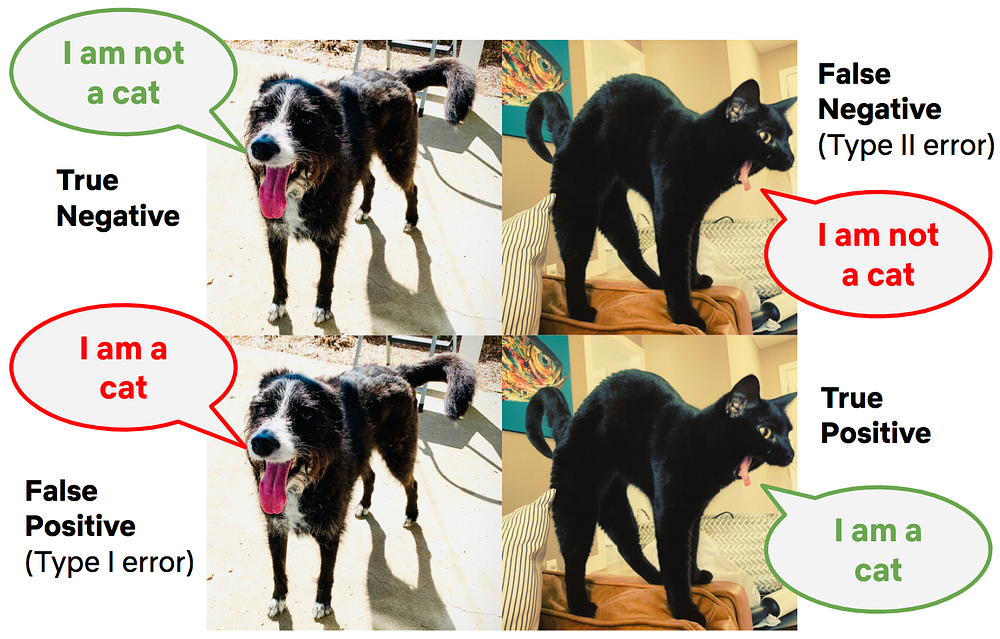
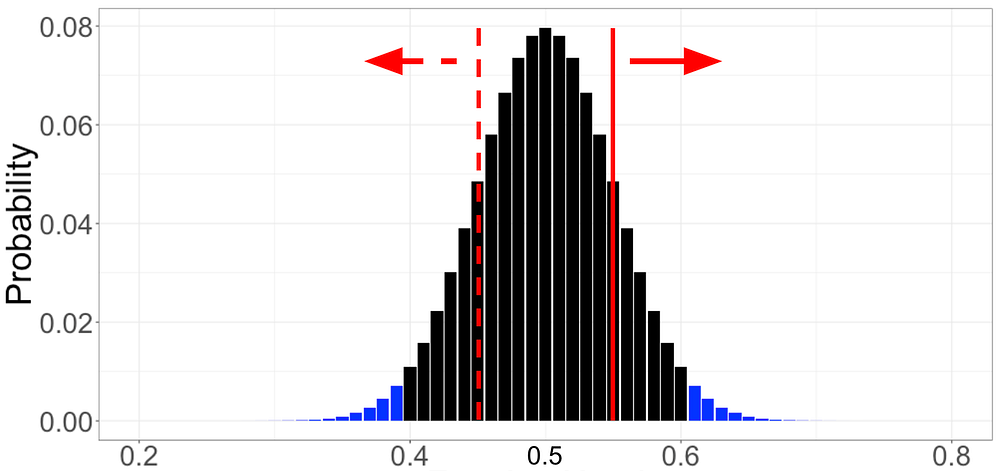
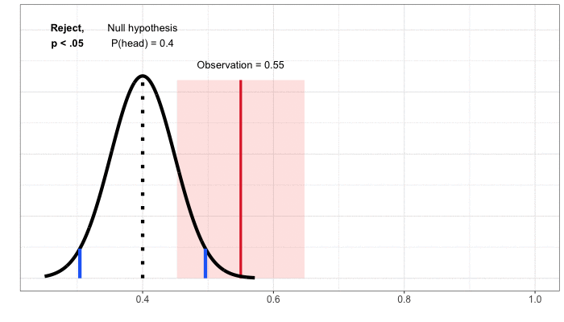

# Interpreting A/B test results: false positives and statistical significance

[_Martin Tingley_](https://www.linkedin.com/in/martintingley/)_ with _[_Wenjing Zheng_](https://www.linkedin.com/in/wenjing-zheng/)_, _[_Simon Ejdemyr_](https://www.linkedin.com/in/simon-ejdemyr-22b920123/)_, _[_Stephanie Lane_](https://www.linkedin.com/in/stephanielane1/)_, and _[_Colin McFarland_](https://www.linkedin.com/in/mcfrl/)

_This is the third post in a multi-part series on how Netflix uses A/B tests to inform decisions and continuously innovate on our products. Need to catch up? Have a look at _[_Part 1_](./decision-making-at-netflix-33065fa06481.md)_ (Decision Making at Netflix) and _[_Part 2_](./what-is-an-a-b-test-b08cc1b57962.md)_ (What is an A/B Test?). Subsequent posts will go into more details on experimentation across Netflix, how Netflix has invested in infrastructure to support and scale experimentation, and the importance of the culture of experimentation within Netflix._

In [_Part 2: What is an A/B Test_](./what-is-an-a-b-test-b08cc1b57962.md) we talked about testing the Top 10 lists on Netflix, and how the primary decision metric for this test was a measure of member satisfaction with Netflix. If a test like this shows a statistically significant improvement in the primary decision metric, the feature is a strong candidate for a roll out to all of our members. But how do we know if we’ve made the right decision, given the results of the test? It’s important to acknowledge that no approach to decision making can entirely eliminate uncertainty and the possibility of making mistakes. Using a framework based on hypothesis generation, A/B testing, and statistical analysis allows us to carefully quantify uncertainties, and understand the probabilities of making different types of mistakes.

There are two types of mistakes we can make in acting on test results. A **false positive** (also called a Type I error) occurs when the data from the test indicates a meaningful difference between the control and treatment experiences, but in truth there is no difference. This scenario is like having a medical test come back as positive for a disease when you are healthy. The other error we can make in deciding on a test is a **false negative **(also called a Type II error), which occurs when the data do not indicate a meaningful difference between treatment and control, but in truth there is a difference. This scenario is like having a medical test come back negative — when you do indeed have the disease you are being tested for.

As another way to build intuition, consider the real reason that the internet and machine learning exist: to label if images show cats. For a given image, there are two possible decisions (apply the label “cat” or “not cat”), and likewise there are two possible truths (the image either features a cat or it does not). This leads to a total of four possible outcomes, shown in Figure 1. The same is true with A/B tests: we make one of two decisions based on the data (“sufficient evidence to conclude that the Top 10 list affects member satisfaction” or “insufficient evidence”), and there are two possible truths, that we never get to know with complete uncertainty (“Top 10 list truly affects member satisfaction” or “it does not”).

*Figure 1: The four possible outcomes when labeling an image as either showing a cat or not.*

The uncomfortable truth about false positives and false negatives is that we can’t make them both go away. In fact, they trade off with one another. Designing experiments so that the rate of false positives is minuscule necessarily increases the false negative rate, and vice versa. In practice, we aim to quantify, understand, and control these two sources of error.

In the remainder of this post, we’ll use simple examples to build up intuition around false positives and related statistical concepts; in the next post in this series, we’ll do the same for false negatives.

### False positives and statistical significance

With a great hypothesis and a clear understanding of the primary decision metric, it’s time to turn to the statistical aspects of designing an A/B test. This process generally starts by fixing the acceptable false positive rate. **By convention, this false positive rate is usually set to 5%: for tests where there is not a meaningful difference between treatment and control, we’ll falsely conclude that there is a “statistically significant” difference 5% of the time. Tests that are conducted with this 5% false positive rate are said to be run at the 5% significance level.**

Using the 5% significance level convention can feel uncomfortable. By following this convention, we are accepting that, in instances when the treatment and control experience are not meaningfully different for our members, we’ll make a mistake 5% of the time. We’ll label 5% of the non-cat photos as displaying cats.

The false positive rate is closely associated with the “statistical significance” of the observed difference in metric values between the treatment and control groups, which we measure using the [p-value](https://www.tandfonline.com/doi/pdf/10.1080/00031305.2016.1154108?needAccess=true). The p-value is the probability of seeing an outcome at least as extreme as our A/B test result, had there truly been no difference between the treatment and control experiences. An intuitive way to understand statistical significance and p-values, which have been confusing students of statistics for over a century (your authors included!), is in terms of simple games of chance where we can calculate and visualize all the relevant probabilities.

*Figure 2: Thinking about simple games of chance, such as flipping coins like this one displaying Julius Caesar, is a great way to build up intuition about statistics.*

Say we want to know if a coin is unfair, in the sense that the probability of heads is not 0.5 (or 50%). It may sound like a simple scenario, but it is directly relevant to many businesses, Netflix included, where the goal is to understand if a new product experience results in a different rate for some binary user activity, from clicking on a UI feature to retaining the Netflix service for another month. So any intuition we can build through simple games with coins maps directly to interpreting A/B tests.

To decide if the coin is unfair, let’s run the following experiment: we’ll flip the coin 100 times and calculate the fraction of outcomes that are heads. Because of randomness, or “noise,” even if the coin were perfectly fair we wouldn’t expect exactly 50 heads and 50 tails — but how much of a deviation from 50 is “too much”? When do we have sufficient evidence to reject the baseline assertion that the coin is in fact fair? Would you be willing to conclude that the coin is unfair if 60 out of 100 flips were heads? 70? We need a way to align on a decision framework and understand the associated false positive rate.

To build intuition, let’s run through a thought exercise. First, we’ll assume the coin is fair — this is our “null hypothesis,” which is always a statement of status quo or equality. We then seek compelling evidence against this null hypothesis from the data. To make a decision on what constitutes compelling evidence, we calculate the probability of every possible outcome, _assuming that the null hypothesis is true_. For the coin flipping example, that’s the probability of 100 flips yielding zero heads, one head, two heads, and so forth up to 100 heads — _assuming that the coin is fair_. Skipping over the math, each of these possible outcomes and their associated probabilities are shown with the black and blue bars in Figure 3 (ignore the colors for now).

We can then compare this probability distribution of outcomes, _calculated under the assumption that the coin is fair_, to the data we’ve collected. Say we observe that 55% of 100 flips are heads (the solid red line in Figure 3). To quantify if this observation is compelling evidence that the coin is not fair, we count up the probabilities associated with **_every outcome that is less likely than our observation_**. Here, because we’ve made no assumptions about heads or tails being more likely, we sum up the probabilities of 55% or more of the flips coming up heads (the bars to the right of the solid red line) and the probabilities of 55% or more of the flips coming up tails (the bars to the left of the dashed red line).

This is the mythical p-value: the probability of seeing a result as extreme as our observation, if the null hypothesis were true. In our case, the null hypothesis is that the coin is fair, the observation is 55% heads in 100 flips, and the p-value is about 0.32. The interpretation is as follows: were we to repeat, many times, the experiment of flipping a coin 100 times and calculating the fraction of heads, **_with a fair coin _**(the null hypothesis is true), in 32% of those experiments the outcome would feature at least 55% heads or at least 55% tails (results at least as unlikely as our actual observation).

*Figure 3: Flipping a fair coin 100 times, the probability of each outcome expressed as the fraction of heads.*

How do we use the p-value to decide if there is statistically significant evidence that the coin is unfair — or that our new product experience is an improvement on the status quo? It comes back to that 5% false positive rate that we agreed to accept at the beginning: we conclude that there is a statistically significant effect if the p-value is less than 0.05. This formalizes the intuition that we should reject the null hypothesis that the coin is fair if our result is sufficiently unlikely to occur under the assumption of a fair coin. In the example of observing 55 heads in 100 coin flips, we calculated a p-value of 0.32. Because the p-value is larger than the 0.05 significance level, we conclude that there is not statistically significant evidence that the coin is unfair.

There are two conclusions that we can make from an experiment or A/B test: we either conclude there is an effect (“the coin is unfair”, “the Top 10 feature increases member satisfaction”) _or_ we conclude that there is insufficient evidence to conclude there is an effect (“cannot conclude the coin is unfair,” “cannot conclude that the Top 10 row increases member satisfaction”). It’s a lot like a jury trial, where the two possible outcomes are “guilty” or “not guilty” — and “not guilty” is very different from “innocent.” Likewise, this ([frequentist](https://en.wikipedia.org/wiki/Frequentist_inference)) approach to A/B testing does not allow us to make the conclusion that there is no effect — we never conclude the coin is fair, or that the new product feature has no impact on our members. We just conclude we’ve not collected enough evidence to reject the null assumption that there is no difference. In the coin example above, we observed 55% heads in 100 flips, and concluded we had insufficient evidence to label the coin as unfair. **Critically, we did not conclude that the coin was fair — after all, if we gathered more evidence, say by flipping that same coin 1000 times, we might find sufficiently compelling evidence to reject the null hypothesis of fairness.**

### ​​Rejection Regions and Confidence Intervals

There are two other concepts in A/B testing that are closely related to p-values: the **rejection region** for a test, and the **confidence interval** for an observation. We cover them both in this section, building on the coin example from above.

**Rejection Regions. **Another way to build a decision rule for a test is in terms of what’s called a “rejection region” — the set of values for which we’d conclude that the coin is unfair. To calculate the rejection region, we once more assume the null hypothesis is true (the coin is fair), and then define the rejection region as the set of least likely outcomes with probabilities that sum to no more than 0.05. The rejection region consists of the outcomes that are the most extreme, provided the null hypothesis is correct — the outcomes where the evidence against the null hypothesis is strongest. If an observation falls in the rejection region, we conclude that there is statistically significant evidence that the coin is not fair, and “reject” the null. In the case of the simple coin experiment, the rejection region corresponds to observing fewer than 40% or more than 60% heads (shown with blue shaded bars in Figure 3). We call the boundaries of the rejection region, here 40% and 60% heads, the critical values of the test.

There is an equivalence between the rejection region and the p-value, and both lead to the same decision: the p-value is less than 0.05 if and only if the observation lies in the rejection region.

**Confidence Intervals**. So far, we’ve approached building a decision rule by first starting with the null hypothesis, which is always a statement of no change or equivalence (“the coin is fair” or “the product innovation does not impact member satisfaction”). We then define possible outcomes under this null hypothesis and compare our observation to that distribution. To understand confidence intervals, it helps to flip the problem around to focus on the observation. We then go through a thought exercise: given the observation, what values of the null hypothesis would lead to a decision not to reject, assuming we specify a 5% false positive rate? For our coin flipping example, the observation is 55% heads in 100 flips and we do not reject the null of a fair coin. Nor would we reject the null hypothesis that the probability of heads was 47.5%, 50%, or 60%. There’s a whole range of values for which we would not reject the null, from about 45% to 65% probability of heads (Figure 4).

This range of values is a confidence interval: the set of values under the null hypothesis that would not result in a rejection, given the data from the test. Because we’ve mapped out the interval using tests at the 5% significance level, we’ve created a 95% confidence interval. The interpretation is that, under repeated experiments, the confidence intervals will cover the true value (here, the actual probability of heads) 95% of the time.

There is an equivalence between the confidence interval and the p-value, and both lead to the same decision: the 95% confidence interval does not cover the null value if and only if the p-value is less than 0.05, and in both cases we reject the null hypothesis of no effect.

*Figure 4: Building the confidence interval by mapping out the set of values that, when used to define a null hypothesis, would not result in rejection for a given observation.*

### Summary

Using a series of thought exercises based on flipping coins, we’ve built up intuition about false positives, statistical significance and p-values, rejection regions, confidence intervals, and the two decisions we can make based on test data. These core concepts and intuition map directly to comparing treatment and control experiences in an A/B test. We define a “null hypothesis” of no difference: the “B” experience does not alter affect member satisfaction. We then play the same thought experiment: what are the possible outcomes and their associated probabilities for the difference in metric values between the treatment and control groups, _assuming there is no difference in member satisfaction_? We can then compare the observation from the experiment to this distribution, just like with the coin example, calculate a p-value and make a conclusion about the test. And just like with the coin example, we can define rejection regions and calculate confidence intervals.

But false positives are only of the two mistakes we can make when acting on test results. In the next post in this series, we’ll cover the other type of mistake, false negatives, and the closely related concept of statistical power. Follow the[ Netflix Tech Blog](http://netflixtechblog.com/) to stay up to date. [Part 4](./interpreting-a-b-test-results-false-negatives-and-power-6943995cf3a8.md) is now available.

---
**Tags:** Ab Testing · Experimentation · Causal Inference · Decision Making
