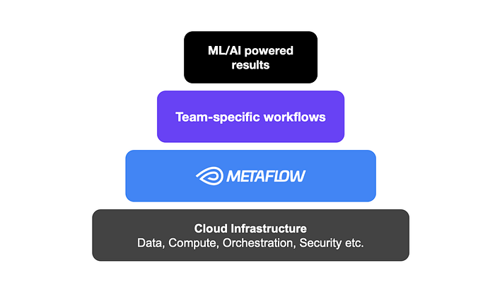
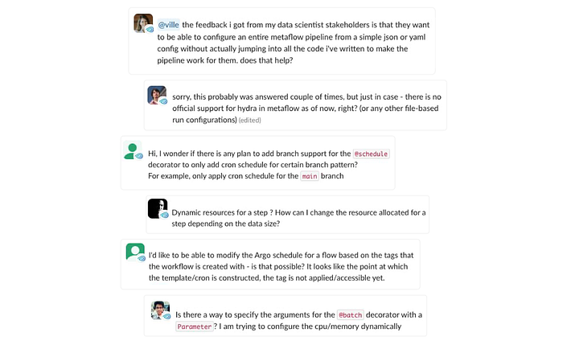
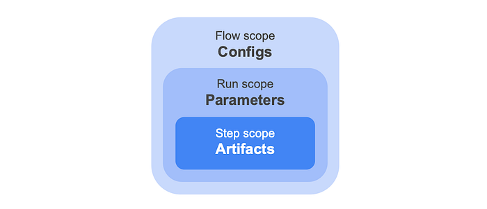

# Introducing Configurable Metaflow

[_David J. Berg_](https://www.linkedin.com/in/david-j-berg/)*_, _[_David Casler_](https://www.linkedin.com/in/david-casler-05a5278/)^, [_Romain Cledat_](https://www.linkedin.com/in/romain-cledat-4a211a5/)*_, _[_Qian Huang_](https://www.linkedin.com/in/qian-huang-emma/)*_, _[_Rui Lin_](https://www.linkedin.com/in/rui-lin-483a83111/)*_, _[_Nissan Pow_](https://www.linkedin.com/in/nissanpow/)*_, _[_Nurcan Sonmez_](https://www.linkedin.com/in/nurcansonmez/)*_, _[_Shashank Srikanth_](https://www.linkedin.com/in/shashanksrikanth/)*_, _[_Chaoying Wang_](https://www.linkedin.com/in/chaoying-wang/)*_, _[_Regina Wang_](https://www.linkedin.com/in/reginalw/)*_, _[_Darin Yu_](https://www.linkedin.com/in/zitingyu/)*  
*: Model Development Team, Machine Learning Platform  
^: Content Demand Modeling Team

A month ago at QConSF, we showcased how [Netflix utilizes Metaflow to power a diverse set of ML and AI use cases](https://qconsf.com/presentation/nov2024/supporting-diverse-ml-systems-netflix), managing thousands of unique Metaflow flows. This followed a previous [blog](./supporting-diverse-ml-systems-at-netflix-2d2e6b6d205d.md) on the same topic. Many of these projects are under constant development by dedicated teams with their own business goals and development best practices, such as the system that [supports our content decision makers](./supporting-content-decision-makers-with-machine-learning-995b7b76006f.md), or the system that ranks which language subtitles are most valuable for a specific piece of content.

As a central ML and AI platform team, our role is to empower our partner teams with tools that maximize their productivity and effectiveness, while adapting to their specific needs (not the other way around). This has been a guiding design principle with [Metaflow since its inception](./open-sourcing-metaflow-a-human-centric-framework-for-data-science-fa72e04a5d9.md).


*Metaflow infrastructure stack*

Standing on the shoulders of our extensive cloud infrastructure, Metaflow facilitates easy access to data, compute, and [production-grade workflow orchestration](./maestro-netflixs-workflow-orchestrator-ee13a06f9c78.md), as well as built-in best practices for common concerns such as [collaboration](https://docs.metaflow.org/scaling/tagging), [versioning](https://docs.metaflow.org/metaflow/basics#artifacts), [dependency management](https://docs.metaflow.org/scaling/dependencies), and [observability](https://outerbounds.com/blog/metaflow-dynamic-cards), which teams use to setup ML/AI experiments and systems that work for them. As a result, Metaflow users at Netflix have been able to run millions of experiments over the past few years without wasting time on low-level concerns.

## A long standing FAQ: configurable flows

While Metaflow aims to be un-opinionated about some of the upper levels of the stack, some teams within Netflix have developed their own opinionated tooling. As part of Metaflow’s adaptation to their specific needs, we constantly try to understand what has been developed and, more importantly, what gaps these solutions are filling.

In some cases, we determine that the gap being addressed is very team specific, or too opinionated at too high a level in the stack, and we therefore decide to not develop it within Metaflow. In other cases, however, we realize that we can develop an underlying construct that aids in filling that gap. Note that even in that case, we do not always aim to completely fill the gap and instead focus on extracting a more general lower level concept that can be leveraged by that particular user but also by others. One such recurring pattern we noticed at Netflix is the need to deploy sets of closely related flows, often as part of a larger pipeline involving table creations, ETLs, and deployment jobs. Frequently, practitioners want to [experiment with variants](https://docs.metaflow.org/production/coordinating-larger-metaflow-projects) of these flows, testing new data, new parameterizations, or new algorithms, while keeping the overall structure of the flow or flows intact.

A natural solution is to make flows configurable using configuration files, so variants can be defined without changing the code. Thus far, there hasn’t been a built-in solution for configuring flows, so teams have built their bespoke solutions leveraging Metaflow’s [JSON-typed Parameters](https://docs.metaflow.org/metaflow/basics#advanced-parameters), [IncludeFile](https://docs.metaflow.org/scaling/data#data-in-local-files), and [deploy-time Parameters](https://docs.metaflow.org/production/scheduling-metaflow-flows/scheduling-with-aws-step-functions#deploy-time-parameters) or deploying their own home-grown solution (often with great pain). However, none of these solutions make it easy to configure all aspects of the flow’s behavior, decorators in particular.


*Requests for a feature like Metaflow Config*

Outside Netflix, we have seen similar frequently asked questions on the [Metaflow community Slack](http://chat.metaflow.org/) as shown in the user quotes above:

- how can I adjust [the @resource requirements](https://docs.metaflow.org/scaling/remote-tasks/requesting-resources), such as CPU or memory, without having to hardcode the values in my flows?
- how to adjust [the triggering @schedule](https://docs.metaflow.org/production/scheduling-metaflow-flows/scheduling-with-argo-workflows#time-based-triggering) programmatically, so our production and staging deployments can run at different cadences?

## New in Metaflow: Configs!

Today, to answer the FAQ, we introduce a new — small but mighty — feature in Metaflow: [a Config object](https://docs.metaflow.org/metaflow/configuring-flows/introduction). Configs complement the existing Metaflow constructs of artifacts and Parameters, by allowing you to configure all aspects of the flow, decorators in particular, prior to any run starting. At the end of the day, artifacts, Parameters and Configs are all stored as artifacts by Metaflow but they differ in when they are persisted as shown in the diagram below:


*Different data artifacts in Metaflow*

Said another way:

- **An****** artifact****** is resolved and persisted to the datastore at the end of each task.**
- A** parameter** is resolved and persisted at the start of a run; it can therefore be modified up to that point. One common use case is to use [triggers](https://docs.metaflow.org/production/event-triggering) to pass values to a run right before executing. Parameters can only be used within your step code.
- A** config** is resolved and persisted when the flow is deployed. When using a scheduler such as [Argo Workflows](https://docs.metaflow.org/production/scheduling-metaflow-flows/scheduling-with-argo-workflows), deployment happens when create’ing the flow. In the case of a local run, “deployment” happens just prior to the execution of the run — think of “deployment” as gathering all that is needed to run the flow. Unlike parameters, configs can be used more widely in your flow code, particularly, they can be used in step or flow level decorators as well as to set defaults for parameters. Configs can of course also be used within your flow.

As an example, you can specify a Config that reads a pleasantly human-readable configuration file, formatted as [TOML](https://toml.io/en/). The Config specifies a triggering ‘@schedule’ and ‘@resource’ requirements, as well as application-specific parameters for this specific deployment:

```
[schedule]
cron = "0 * * * *"

[model]
optimizer = "adam"
learning_rate = 0.5

[resources]
cpu = 1
```

Using the newly released Metaflow 2.13, you can configure a flow with a Config like above, as demonstrated by this flow:

```
import pprint
from metaflow import FlowSpec, step, Config, resources, config_expr, schedule

@schedule(cron=config_expr("config.schedule.cron"))
class ConfigurableFlow(FlowSpec):
    config = Config("config", default="myconfig.toml", parser="tomllib.loads")

    @resources(cpu=config.resources.cpu)
    @step
    def start(self):
        print("Config loaded:")
        pprint.pp(self.config)
        self.next(self.end)

    @step
    def end(self):
        pass

if __name__ == "__main__":
    ConfigurableFlow()
```

There is a lot going on in the code above, a few highlights:

- you can refer to configs _before_ they have been defined using ‘config_expr’.
- you can define arbitrary [parsers](https://docs.metaflow.org/metaflow/configuring-flows/parsing-configs) — using a string means the parser doesn’t even have to be present remotely!

From the developer’s point of view, Configs behave like dictionary-like artifacts. For convenience, they support the dot-syntax (when possible) for accessing keys, making it easy to access values in a nested configuration. You can also unpack the whole Config (or a subtree of it) with Python’s standard dictionary unpacking syntax, ‘**config’. The standard dictionary subscript notation is also available.

Since Configs turn into dictionary artifacts, they get versioned and persisted automatically as artifacts. You can [access Configs of any past runs easily through the Client API](https://docs.metaflow.org/metaflow/client). As a result, your data, models, code, Parameters, Configs, and [execution environments](https://docs.metaflow.org/scaling/dependencies) are all stored as a consistent bundle — neatly organized in [Metaflow namespaces](https://docs.metaflow.org/scaling/tagging) — paving the way for easily reproducible, consistent, low-boilerplate, and now easily configurable experiments and robust production deployments.

## More than a humble config file

While you can get far by accompanying your flow with a simple config file (stored in your favorite format, thanks to [user-definable parsers](https://docs.metaflow.org/metaflow/configuring-flows/parsing-configs)), Configs unlock a number of advanced use cases. Consider these examples from the updated documentation:

- You can [**choose the right level of runtime configurability**](https://docs.metaflow.org/metaflow/configuring-flows/basic-configuration#mixing-configs-and-parameters) versus fixed deployments by mixing Parameters and Configs. For instance, you can use a Config to define a default value for a parameter which can be [overridden by a real-time event](https://docs.metaflow.org/production/event-triggering/external-events#passing-parameters-in-events) as a run is triggered.
- You can define a custom parser to [**validate the configuration**](https://docs.metaflow.org/metaflow/configuring-flows/parsing-configs#validating-configs-with-pydantic), e.g. using the popular [Pydantic](https://docs.pydantic.dev/latest/) library.
- You are not limited to using a single file: you can leverage a configuration manager like [OmegaConf](https://omegaconf.readthedocs.io/en/2.3_branch/) or [Hydra](https://hydra.cc/) to [**manage a hierarchy of cascading configuration files**](https://docs.metaflow.org/metaflow/configuring-flows/parsing-configs#advanced-configurations-with-omegaconf). You can also use a domain-specific tool for generating Configs, such as Netflix’s _Metaboost_ which we cover below.
- You can also [**generate configurations on the fly**](https://docs.metaflow.org/metaflow/configuring-flows/custom-parsers#generating-configs-programmatically), e.g. fetch Configs from an external service, or inspect the execution environment, such as the current GIT branch, and include it as an extra piece of context in runs.

A major benefit of Config over previous more hacky solutions for configuring flows is that they work seamlessly with other features of Metaflow: you can run steps remotely and deploy flows to production, even when relying on custom parsers, without having to worry about packaging Configs or parsers manually or keeping Configs consistent across tasks. Configs also work with the [Runner](https://docs.metaflow.org/metaflow/managing-flows/runner) and [Deployer](https://docs.metaflow.org/metaflow/managing-flows/deployer).

## The Hollywood principle: don’t call us, we’ll call you

When used in conjunction with a configuration manager like [Hydra](https://hydra.cc/), Configs enable a pattern that is highly relevant for ML and AI use cases: orchestrating experiments over multiple configurations or sweeping over parameter spaces. While Metaflow has always supported [sweeping over parameter grids](https://docs.outerbounds.com/grid-search-with-metaflow/) easily using foreaches, it hasn’t been easily possible to alter the flow itself, e.g. to change [@resources](https://docs.metaflow.org/api/step-decorators/resources) or [@pypi/@conda](https://docs.metaflow.org/api/step-decorators/conda) dependencies for every experiment.

In a typical case, you trigger a Metaflow flow that consumes a configuration file, changing _how_ a run behaves. With Hydra, you can [invert the control](https://en.wikipedia.org/wiki/Inversion_of_control): it is Hydra that decides _what_ gets run based on a configuration file. Thanks to Metaflow’s new [Runner](https://docs.metaflow.org/metaflow/managing-flows/runner) and [Deployer](https://docs.metaflow.org/metaflow/managing-flows/deployer) APIs, you can create a Hydra app that operates Metaflow programmatically — for instance, to deploy and execute hundreds of variants of a flow in a large-scale experiment.

[Take a look at two interesting examples of this pattern](https://docs.metaflow.org/metaflow/configuring-flows/config-driven-experimentation) in the documentation. As a teaser, this video shows Hydra orchestrating deployment of tens of Metaflow flows, each of which benchmarks PyTorch using a varying number of CPU cores and tensor sizes, updating a visualization of the results in real-time as the experiment progresses:

## Metaboosting Metaflow — based on a true story

To give a motivating example of what configurations look like at Netflix in practice, let’s consider _Metaboost_, an internal Netflix CLI tool that helps ML practitioners manage, develop and execute their cross-platform projects, somewhat similar to the open-source Hydra discussed above but with specific integrations to the Netflix ecosystem. Metaboost is an example of an opinionated framework developed by a team already using Metaflow. In fact, a part of the inspiration for introducing Configs in Metaflow came from this very use case.

Metaboost serves as a single interface to three different internal platforms at Netflix that manage ETL/Workflows ([_Maestro_](./maestro-netflixs-workflow-orchestrator-ee13a06f9c78.md)), Machine Learning Pipelines ([_Metaflow_](https://docs.metaflow.org/)) and Data Warehouse Tables (_Kragle_). In this context, having a single configuration system to manage a ML project holistically gives users increased project coherence and decreased project risk.

### Configuration in Metaboost

Ease of configuration and templatizing are core values of Metaboost. Templatizing in Metaboost is achieved through the concept of _bindings_, wherein we can _bind_ a Metaflow pipeline to an arbitrary label, and then create a corresponding bespoke configuration for that label. The binding-connected configuration is then merged into a global set of configurations containing such information as GIT repository, branch, etc. Binding a Metaflow, will also signal to Metaboost that it should instantiate the Metaflow flow once per binding into our orchestration cluster.

Imagine a ML practitioner on the Netflix Content ML team, sourcing features from hundreds of columns in our data warehouse, and creating a multitude of models against a _growing_ suite of metrics. When a brand new content metric comes along, with Metaboost, the first version of the metric’s predictive model can easily be created by simply swapping the target column against which the model is trained.

Subsequent versions of the model will result from experimenting with hyper parameters, tweaking feature engineering, or conducting feature diets. Metaboost’s bindings, and their integration with Metaflow Configs, can be leveraged to scale the number of experiments as fast as a scientist can create experiment based configurations.

### Scaling experiments with Metaboost bindings — backed by Metaflow Config

Consider a Metaboost ML project named `demo` that creates and loads data to custom tables (ETL managed by Maestro), and then trains a simple model on this data (ML Pipeline managed by Metaflow). The project structure of this repository might look like the following:

```
├── metaflows
│   ├── custom                               -> custom python code, used by
|   |   |                                       Metaflow
│   │   ├── data.py
│   │   └── model.py
│   └── training.py                          -> defines our Metaflow pipeline
├── schemas
│   ├── demo_features_f.tbl.yaml             -> table DDL, stores our ETL
|   |                                           output, Metaflow input
│   └── demo_predictions_f.tbl.yaml          -> table DDL,
|                                               stores our Metaflow output
├── settings
│   ├── settings.configuration.EXP_01.yaml   -> defines the additive
|   |                                           config for Experiment 1
│   ├── settings.configuration.EXP_02.yaml   -> defines the additive
|   |                                           config for Experiment 2
│   ├── settings.configuration.yaml          -> defines our global
|   |                                           configuration
│   └── settings.environment.yaml            -> defines parameters based on
|                                               git branch (e.g. READ_DB)
├── tests
├── workflows
│   ├── sql
│   ├── demo.demo_features_f.sch.yaml        -> Maestro workflow, defines ETL
│   └── demo.main.sch.yaml                   -> Maestro workflow, orchestrates
|                                               ETLs and Metaflow
└── metaboost.yaml                           -> defines our project for
                                                Metaboost
```

The configuration files in the settings directory above contain the following YAML files:

```
# settings.configuration.yaml (global configuration)
model:
  fit_intercept: True
conda:
  numpy: '1.22.4'
  "scikit-learn": '1.4.0'
```

```
# settings.configuration.EXP_01.yaml
target_column: metricA
features:
  - runtime
  - content_type
  - top_billed_talent
```

```
# settings.configuration.EXP_02.yaml
target_column: metricA
features:
  - runtime
  - director
  - box_office
```

Metaboost will merge each experiment configuration (_*.EXP*.yaml_) into the global configuration (settings.configuration.yaml) _individually_ at Metaboost command initialization. Let’s take a look at how Metaboost combines these configurations with a Metaboost command:

```
(venv-demo) ~/projects/metaboost-demo [branch=demoX] 
$ metaboost metaflow settings show --yaml-path=configuration

binding=EXP_01:
model:                     -> defined in setting.configuration.yaml (global)
  fit_intercept: true
conda:                     -> defined in setting.configuration.yaml (global)
  numpy: 1.22.4
  "scikit-learn": 1.4.0
target_column: metricA     -> defined in setting.configuration.EXP_01.yaml
features:                  -> defined in setting.configuration.EXP_01.yaml
- runtime
- content_type
- top_billed_talent

binding=EXP_02:
model:                     -> defined in setting.configuration.yaml (global)
  fit_intercept: true
conda:                     -> defined in setting.configuration.yaml (global)
  numpy: 1.22.4
  "scikit-learn": 1.4.0
target_column: metricA     -> defined in setting.configuration.EXP_02.yaml
features:                  -> defined in setting.configuration.EXP_02.yaml
- runtime
- director
- box_office
```

Metaboost understands it should deploy/run two independent instances of training.py — one for the EXP_01 binding and one for the EXP_02 binding. You can also see that Metaboost is aware that the tables and ETL workflows are _not bound_, and should only be deployed once. These details of which artifacts to bind and which to leave unbound are encoded in the project’s top-level metaboost.yaml file.

```
(venv-demo) ~/projects/metaboost-demo [branch=demoX] 
$ metaboost project list

Tables (metaboost table list):
schemas/demo_predictions_f.tbl.yaml (binding=default):
    table_path=prodhive/demo_db/demo_predictions_f
schemas/demo_features_f.tbl.yaml (binding=default):
    table_path=prodhive/demo_db/demo_features_f

Workflows (metaboost workflow list):
workflows/demo.demo_features_f.sch.yaml (binding=default):
    cluster=sandbox, workflow.id=demo.branch_demox.demo_features_f
workflows/demo.main.sch.yaml (binding=default):
    cluster=sandbox, workflow.id=demo.branch_demox.main

Metaflows (metaboost metaflow list):
metaflows/training.py (binding=EXP_01): -> EXP_01 instance of training.py
    cluster=sandbox, workflow.id=demo.branch_demox.EXP_01.training   
metaflows/training.py (binding=EXP_02): -> EXP_02 instance of training.py
    cluster=sandbox, workflow.id=demo.branch_demox.EXP_02.training
```

Below is a simple Metaflow pipeline that fetches data, executes feature engineering, and trains a LinearRegression model. The work to integrate Metaboost Settings into a user’s Metaflow pipeline (implemented using Metaflow Configs) is as easy as adding a single mix-in to the FlowSpec definition:

```
from metaflow import FlowSpec, Parameter, conda_base, step
from custom.data import feature_engineer, get_data
from metaflow.metaboost import MetaboostSettings

@conda_base(
    libraries=MetaboostSettings.get_deploy_time_settings("configuration.conda")
)
class DemoTraining(FlowSpec, MetaboostSettings):
    prediction_date = Parameter("prediction_date", type=int, default=-1)

    @step
    def start(self):
        # get show_settings() for free with the mixin
        # and get convenient debugging info
        self.show_settings(exclude_patterns=["artifact*", "system*"])

        self.next(self.get_features)

    @step
    def get_features(self):
        # feature engineers on our extracted data
        self.fe_df = feature_engineer(
            # loads data from our ETL pipeline
            data=get_data(prediction_date=self.prediction_date),
            features=self.settings.configuration.features +
                [self.settings.configuration.target_column]
        )

        self.next(self.train)

    @step
    def train(self):
        from sklearn.linear_model import LinearRegression

        # trains our model
        self.model = LinearRegression(
            fit_intercept=self.settings.configuration.model.fit_intercept
        ).fit(
            X=self.fe_df[self.settings.configuration.features],
            y=self.fe_df[self.settings.configuration.target_column]
        )
        print(f"Fit slope: {self.model.coef_[0]}")
        print(f"Fit intercept: {self.model.intercept_}")

        self.next(self.end)

    @step
    def end(self):
        pass


if __name__ == "__main__":
    DemoTraining()
```

The Metaflow Config is added to the FlowSpec by mixing in the MetaboostSettings class. Referencing a configuration value is as easy as using the dot syntax to drill into whichever parameter you’d like.

Finally let’s take a look at the output from our sample Metaflow above. We execute experiment EXP_01 with

```
metaboost metaflow run --binding=EXP_01
```

which upon execution will merge the configurations into a single _settings_ file (shown previously) and serialize it as a yaml file to the _.metaboost/settings/compiled/_ directory.

You can see the actual command and args that were sub-processed in the _Metaboost Execution_ section below. Please note the **–config** argument pointing to the serialized yaml file, and then subsequently accessible via **self.settings**. Also note the convenient printing of configuration values to stdout during the start step using a mixed in function named **show_settings()**.

```
(venv-demo) ~/projects/metaboost-demo [branch=demoX] 
$ metaboost metaflow run --binding=EXP_01

Metaboost Execution: 
 - python3.10 /root/repos/cdm-metaboost-irl/metaflows/training.py
   --no-pylint --package-suffixes=.py --environment=conda
   --config settings
   .metaboost/settings/compiled/settings.branch_demox.EXP_01.training.mP4eIStG.yaml
   run --prediction_date20241006

Metaflow 2.12.39+nflxfastdata(2.13.5);nflx(2.13.5);metaboost(0.0.27)
  executing DemoTraining for user:dcasler
Validating your flow...
    The graph looks good!
Bootstrapping Conda environment... (this could take a few minutes)
All packages already cached in s3.
All environments already cached in s3.

Workflow starting (run-id 50), see it in the UI at
https://metaflowui.prod.netflix.net/DemoTraining/50

[50/start/251640833] Task is starting.
[50/start/251640833] Configuration Values:
[50/start/251640833]   settings.configuration.conda.numpy            = 1.22.4
[50/start/251640833]   settings.configuration.features.0             = runtime
[50/start/251640833]   settings.configuration.features.1             = content_type
[50/start/251640833]   settings.configuration.features.2             = top_billed_talent
[50/start/251640833]   settings.configuration.model.fit_intercept    = True
[50/start/251640833]   settings.configuration.target_column          = metricA
[50/start/251640833]   settings.environment.READ_DATABASE            = data_warehouse_prod
[50/start/251640833]   settings.environment.TARGET_DATABASE          = demo_dev
[50/start/251640833] Task finished successfully.

[50/get_features/251640840] Task is starting.
[50/get_features/251640840] Task finished successfully.

[50/train/251640854] Task is starting.
[50/train/251640854] Fit slope: 0.4702672504331096
[50/train/251640854] Fit intercept: -6.247919678070083
[50/train/251640854] Task finished successfully.

[50/end/251640868] Task is starting.
[50/end/251640868] Task finished successfully.

Done! See the run in the UI at
https://metaflowui.prod.netflix.net/DemoTraining/50
```

### Takeaways

Metaboost is an integration tool that aims to ease the project development, management and execution burden of ML projects at Netflix. It employs a configuration system that combines git based parameters, global configurations and arbitrarily _bound_ configuration files for use during execution against internal Netflix platforms.

Integrating this configuration system with the new Config in Metaflow is incredibly simple (by design), only requiring users to add a mix-in class to their FlowSpec — [similar to this example in Metaflow documentation](https://docs.metaflow.org/metaflow/configuring-flows/custom-parsers#including-default-configs-in-flows) — and then reference the configuration values in steps or decorators. The example above templatizes a training Metaflow for the sake of experimentation, but users could just as easily use bindings/configs to templatize their flows across target metrics, business initiatives or any other arbitrary lines of work.

## Try it at home

It couldn’t be easier to get started with Configs! Just

```
pip install -U metaflow
```

to get the latest version and [head to the updated documentation](https://docs.metaflow.org/metaflow/configuring-flows/introduction) for examples. If you are impatient, you can find and execute [all config-related examples in this repository](https://github.com/outerbounds/config-examples) as well.

If you have any questions or feedback about Config (or other Metaflow features), you can reach out to us at the [Metaflow community Slack](http://chat.metaflow.org/).

## Acknowledgments

We would like to thank [Outerbounds](https://outerbounds.co/) for their collaboration on this feature; for rigorously testing it and developing a repository of examples to showcase some of the possibilities offered by this feature.

---
**Tags:** Metaflow · Machine Learning · Mlops
