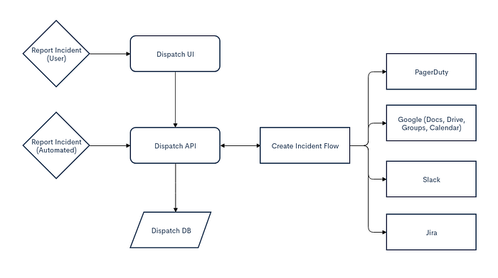
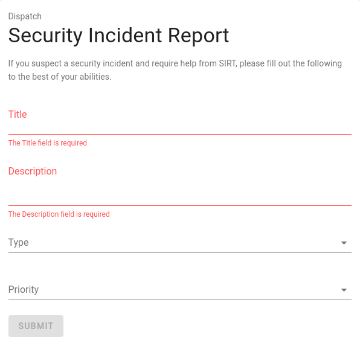
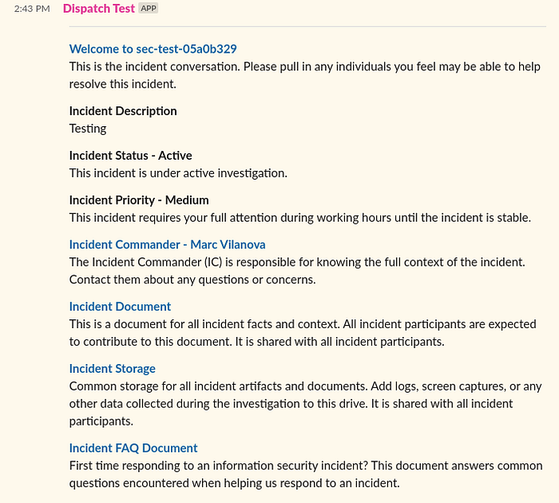
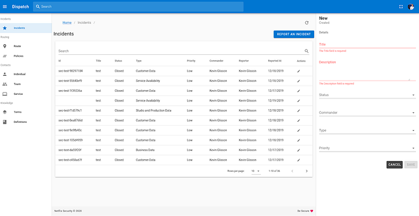

# Introducing Dispatch

By Kevin Glisson, Marc Vilanova, Forest Monsen

## Netflix is pleased to announce the open-source release of our crisis management orchestration framework: Dispatch!

Okay, but what is Dispatch? Put simply, Dispatch is:

**_All of the ad-hoc things you’re doing to manage incidents today, done for you, and a bunch of other things you should’ve been doing, but have not had the time!_**

Dispatch helps us effectively manage **security incidents** by deeply integrating with existing tools used throughout an organization (Slack, GSuite, Jira, etc.,) Dispatch leverages the existing familiarity of these tools to provide orchestration instead of introducing another tool.

This means you can let Dispatch focus on creating resources, assembling participants, sending out notifications, tracking tasks, and assisting with post-incident reviews; allowing you to focus on actually fixing the issue! Sounds interesting? Continue reading!

## The Challenge of Crisis Management

Managing incidents is a stressful job. You are dealing with many questions all at once: What’s the scope? Who can help me? Who do I need to engage? How do I manage all of this?

In general, every incident is unique and extraordinary, if the same incidents are happening over and over you’re firefighting.

There are four main components to Crisis Management that we are attempting to address:

1. **Resource Management** — The management of not only data collected about the incident itself but all of the metadata about the response.
2. **Individual Engagement** — Understanding the best way to engage individuals and teams, and doing so based on incident context.
3. **Life Cycle Management** — Providing the Incident Commander (IC) tools to easily manage the life cycle of the incident.
4. **Incident Learning** — Building on past incidents to speed up the resolution of future incidents.

We will use the following terminology throughout the rest of the discussion:

- **Incident Commanders** are individuals that are responsible for driving the incident to resolution.
- **Incident Participants** are individuals that are Subject Matter Experts (SMEs) that have been engaged to help resolve the incident.
- **Resources** are documents, screenshots, logs or any other piece of digital information that is used during an incident.

## The Checklist

For an average incident, there are quite a few steps to managing an incident and much of it is typically handled on an ad-hoc basis by a human. Let’s enumerate them:

1. **Declare an Incident **— There are many different entry points to a potential incident: automated alerts, an internal notification, or an external notification.
2. **Determine Incident Commander **— Determining the sole individual responsible for driving a particular incident to resolution based on the incident source, type, and priority.
3. **Create Communication Channels **— Communication during incidents is key. Establishing dedicated and standardized channels for communication prevents the creation of communication silos.
4. **Create Incident Document **— The central document responsible for containing up-to-date incident information, including a description of the incident, links to resources, rough notes from in-person meetings, open questions, action items, and timeline information.
5. **Engage Individual Resources **— An incident commander will not be able to resolve an incident by themselves, they must identify and engage additional resources within the organization to help them.
6. **Orient Individual Resources **— Engaging additional resources is not enough, the Incident Commander needs to orient these resources to the situation at hand.
7. **Notify Key Stakeholders **— For any given incident, key stakeholders not directly involved in resolving the incident need to be made aware of the incident.
8. **Drive Incident to Resolution **— The actual resolution of the incident, creating tasks, asking questions, and tracking answers. Making note of key learnings to be addressed after resolution.
9. **Perform Post Incident Review (PIR) **— Review how the incident process was performed, tracking actions to be performed after the incident, and driving learning through structuring informal knowledge.

Each of these steps has the incident commander and incident participants moving through various systems and interfaces. Each context switch adds to the cognitive load on the responder and distracting them from resolving the incident itself.

## Toward Better Crisis Management

Crisis management is not a new challenge, tools like Jira, PagerDuty, VictorOps are all helping organizations manage and respond to incidents. When setting out to automate our incident management process we had two main goals:

1. Re-use existing tools users were already familiar with; reducing the learning curve to contributing to incidents.
2. Catalog, store and analyze our incident data to speed up resolution.

Meet Dispatch!

## Dispatch

Dispatch is a crisis management orchestration framework that manages incident metadata and resources. It uses tools already in use throughout an organization, providing incident participants a comprehensive crisis management toolset, allowing them to focus on resolving the incident.

Unlike many of our tools Dispatch is not tightly bound to AWS, Dispatch does not use any AWS APIs at all! While Dispatch doesn’t use AWS APIs, it leverages multiple APIs that are deeply embedded into the organization (e.g. Slack, GSuite, PagerDuty, etc.,). In addition to all of the built-in integrations, Dispatch provides multiple integration points that allow it to fit into just about any existing environment.

Although developed as a tool to help Netflix manage security incidents, nothing about Dispatch is specific to a security use-case. At its core, Dispatch aims to manage the entire lifecycle of an incident, focusing on engaging individuals and providing them the context they need to drive the incident to resolution.

## Workflow

Let’s take a look at what an incident commander’s new workflow would look like using Dispatch:

Some key benefits of the new workflow are:

- The incident commander no longer needs to manage access to resources or multiple data streams.
- Communications are standardized (both in style and interval) across incidents.
- Incident participants are automatically engaged based on the type, priority, and description of the incident.
- Incident tasks are tracked and owners are reminded if they’re not completed on time.
- All incident data is centrally tracked.
- A common API is provided for internal users and tools.

We want to make reporting incidents as frictionless as possible, giving users a straightforward path to engage the resources they need in a time of crisis.

Jumping between different tools, ensuring data is correct and in sync is a low-value exercise for an incident commander. Instead, we centralized on two common tools to manage the entire lifecycle. Slack for managing incident metadata (e.g. status, title, description, priority, etc,.) and Google Doc and Google Drive for managing data itself.

When teams need to look across many incidents, Dispatch provides an Admin UI. This interface is also where incident knowledge is managed. From common terms and their definitions, individuals, teams, and services. The Admin UI is how we manage incident knowledge for use in future incidents.

## Architecture

Dispatch makes use of the following components:

- Python 3.8 with FastAPI (including helper packages)
- VueJS UI
- Postgres

We’re shipping Dispatch with built-in plugins that allow you to create and manage resources with GSuite (Docs, Drive, Sheets, Calendar, Groups), Jira, PagerDuty, and Slack. But the plugin architecture allows for integrations with whatever tools your organization is already using.

## Getting Started

Dispatch is available now on the[ Netflix Open Source site](https://github.com/Netflix/dispatch). You can try out Dispatch using [Docker](https://github.com/Netflix/dispatch-docker). Detailed instructions on setup and configuration are available in our [docs](https://hawkins.gitbook.io/dispatch/).

## Interested in Contributing?

Feel free to reach out or submit pull requests if you have any suggestions. We’re looking forward to seeing what new plugins you create to make Dispatch work for you! We hope you’ll find Dispatch as useful as we do!

Oh, and we’re hiring — if you’d like to help us solve these sorts of problems, take a look at [https://jobs.netflix.com/teams/security](https://jobs.netflix.com/teams/security), and reach out!

---
**Tags:** Crisis Management · Automation · Incident Response · Netflix
