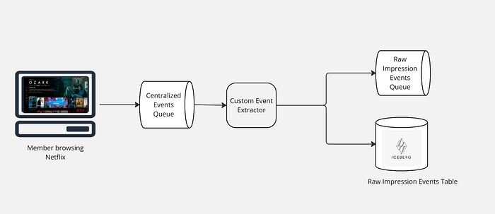
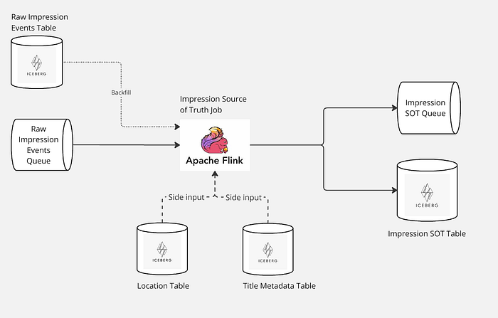
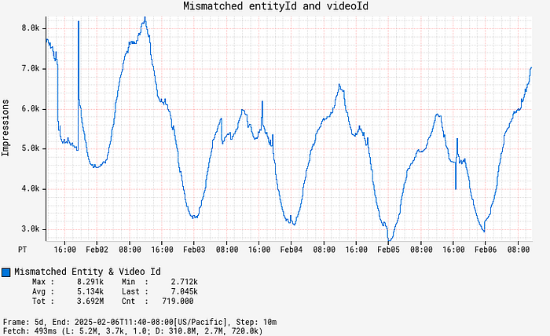
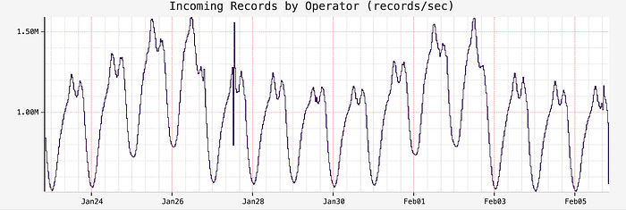

# Introducing Impressions at Netflix

> Part 1: Creating the Source of Truth for Impressions

**By:** [Tulika Bhatt](https://www.linkedin.com/in/tulikabhatt/)

Imagine scrolling through Netflix, where each movie poster or promotional banner competes for your attention. Every image you hover over isn’t just a visual placeholder; it’s a critical data point that fuels our sophisticated personalization engine. At Netflix, we call these images ‘impressions,’ and they play a pivotal role in transforming your interaction from simple browsing into an immersive binge-watching experience, all tailored to your unique tastes.

Capturing these moments and turning them into a personalized journey is no simple feat. It requires a state-of-the-art system that can track and process these impressions while maintaining a detailed history of each profile’s exposure. This nuanced integration of data and technology empowers us to offer bespoke content recommendations.

In this multi-part blog series, we take you behind the scenes of our system that processes billions of impressions daily. We will explore the challenges we encounter and unveil how we are building a resilient solution that transforms these client-side impressions into a personalized content discovery experience for every Netflix viewer.

*Impressions on homepage*

## Why do we need impression history?

### Enhanced Personalization

To tailor recommendations more effectively, it’s crucial to track what content a user has already encountered. Having impression history helps us achieve this by allowing us to identify content that has been displayed on the homepage but not engaged with, helping us deliver fresh, engaging recommendations.

### Frequency Capping

By maintaining a history of impressions, we can implement frequency capping to prevent over-exposure to the same content. This ensures users aren’t repeatedly shown identical options, keeping the viewing experience vibrant and reducing the risk of frustration or disengagement.

### Highlighting New Releases

For new content, impression history helps us monitor initial user interactions and adjust our merchandising efforts accordingly. We can experiment with different content placements or promotional strategies to boost visibility and engagement.

### Analytical Insights

Additionally, impression history offers insightful information for addressing a number of platform-related analytics queries. Analyzing impression history, for example, might help determine how well a specific row on the home page is functioning or assess the effectiveness of a merchandising strategy.

## Architecture Overview

The first pivotal step in managing impressions begins with the creation of a Source-of-Truth (SOT) dataset. This foundational dataset is essential, as it supports various downstream workflows and enables a multitude of use cases.

### Collecting Raw Impression Events

As Netflix members explore our platform, their interactions with the user interface spark a vast array of raw events. These events are promptly relayed from the client side to our servers, entering a centralized event processing queue. This queue ensures we are consistently capturing raw events from our global user base.

After raw events are collected into a centralized queue, a custom event extractor processes this data to identify and extract all impression events. These extracted events are then routed to an Apache Kafka topic for immediate processing needs and simultaneously stored in an Apache Iceberg table for long-term retention and historical analysis. This dual-path approach leverages Kafka’s capability for low-latency streaming and Iceberg’s efficient management of large-scale, immutable datasets, ensuring both real-time responsiveness and comprehensive historical data availability.

*Collecting raw impression events*

### Filtering & Enriching Raw Impressions

Once the raw impression events are queued, a stateless Apache Flink job takes charge, meticulously processing this data. It filters out any invalid entries and enriches the valid ones with additional metadata, such as show or movie title details, and the specific page and row location where each impression was presented to users. This refined output is then structured using an Avro schema, establishing a definitive source of truth for Netflix’s impression data. The enriched data is seamlessly accessible for both real-time applications via Kafka and historical analysis through storage in an Apache Iceberg table. This dual availability ensures immediate processing capabilities alongside comprehensive long-term data retention.

*Impression Source-of-Truth architecture*

### Ensuring High Quality Impressions

**Maintaining the highest quality of impressions is a top priority. We accomplish this by gathering detailed column-level metrics that offer insights into the state and quality of each impression.** These metrics include everything from validating identifiers to checking that essential columns are properly filled. The data collected feeds into a comprehensive quality dashboard and supports a tiered threshold-based alerting system. These alerts promptly notify us of any potential issues, enabling us to swiftly address regressions. Additionally, while enriching the data, we ensure that all columns are in agreement with each other, offering in-place corrections wherever possible to deliver accurate data.

*Dashboard showing mismatch count between two columns- entityId and videoId*

## Configuration

We handle a staggering volume of 1 to 1.5 million impression events globally every second, with each event approximately 1.2KB in size. To efficiently process this massive influx in real-time, we employ Apache Flink for its low-latency stream processing capabilities, which seamlessly integrates both batch and stream processing to facilitate efficient backfilling of historical data and ensure consistency across real-time and historical analyses. Our Flink configuration includes 8 task managers per region, each equipped with 8 CPU cores and 32GB of memory, operating at a parallelism of 48, allowing us to handle the necessary scale and speed for seamless performance delivery. The Flink job’s sink is equipped with a data mesh connector, as detailed in our [Data Mesh platform](./data-mesh-a-data-movement-and-processing-platform-netflix-1288bcab2873.md) which has two outputs: Kafka and Iceberg. This setup allows for efficient streaming of real-time data through Kafka and the preservation of historical data in Iceberg, providing a comprehensive and flexible data processing and storage solution.

*Raw impressions records per second*

We utilize the ‘island model’ for deploying our Flink jobs, where all dependencies for a given application reside within a single region. This approach ensures high availability by isolating regions, so if one becomes degraded, others remain unaffected, allowing traffic to be shifted between regions to maintain service continuity. Thus, all data in one region is processed by the Flink job deployed within that region.

## Future Work

### Addressing the Challenge of Unschematized Events

Allowing raw events to land on our centralized processing queue unschematized offers significant flexibility, but it also introduces challenges. Without a defined schema, it can be difficult to determine whether missing data was intentional or due to a logging error. We are investigating solutions to introduce schema management that maintains flexibility while providing clarity.

### Automating Performance Tuning with Autoscalers

Tuning the performance of our Apache Flink jobs is currently a manual process. The next step is to integrate with autoscalers, which can dynamically adjust resources based on workload demands. This integration will not only optimize performance but also ensure more efficient resource utilization.

### Improving Data Quality Alerts

Right now, there’s a lot of business rules dictating when a data quality alert needs to be fired. This leads to a lot of false positives that require manual judgement. A lot of times it is difficult to track changes leading to regression due to inadequate data lineage information. We are investing in building a comprehensive data quality platform that more intelligently identifies anomalies in our impression stream, keeps track of data lineage and data governance, and also, generates alerts notifying producers of any regressions. This approach will enhance efficiency, reduce manual oversight, and ensure a higher standard of data integrity.

## Conclusion

Creating a reliable source of truth for impressions is a complex but essential task that enhances personalization and discovery experience. Stay tuned for the next part of this series, where we’ll delve into how we use this SOT dataset to create a microservice that provides impression histories. We invite you to share your thoughts in the comments and continue with us on this journey of discovering impressions.

## Acknowledgments

We are genuinely grateful to our amazing colleagues whose contributions were essential to the success of Impressions: Julian Jaffe, Bryan Keller, Yun Wang, Brandon Bremen, Kyle Alford, Ron Brown and Shriya Arora.

---
**Tags:** Data · Data Engineering · Distributed Systems
